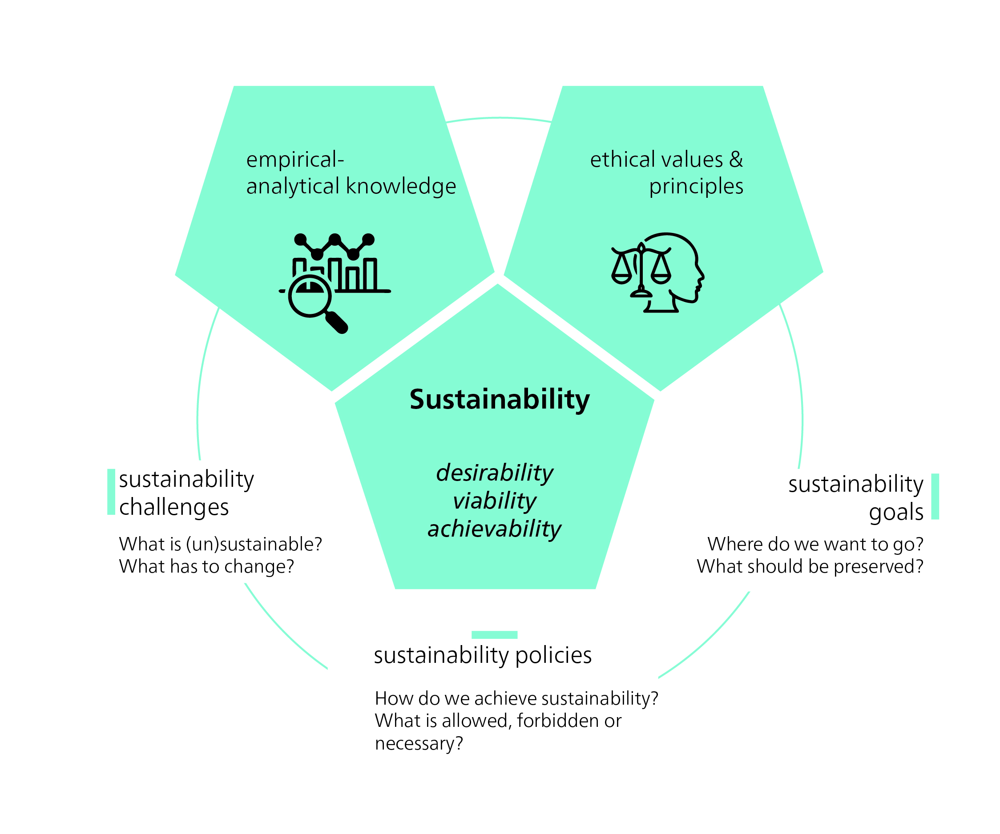
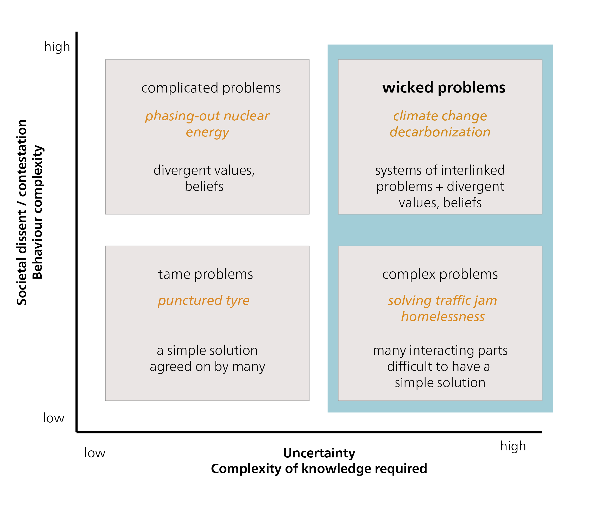
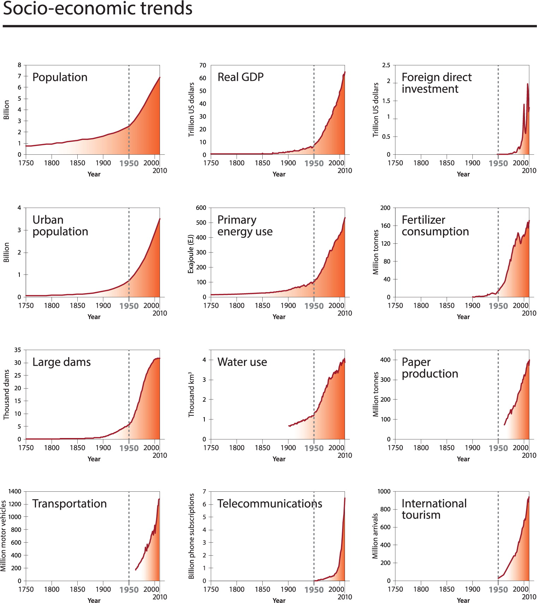
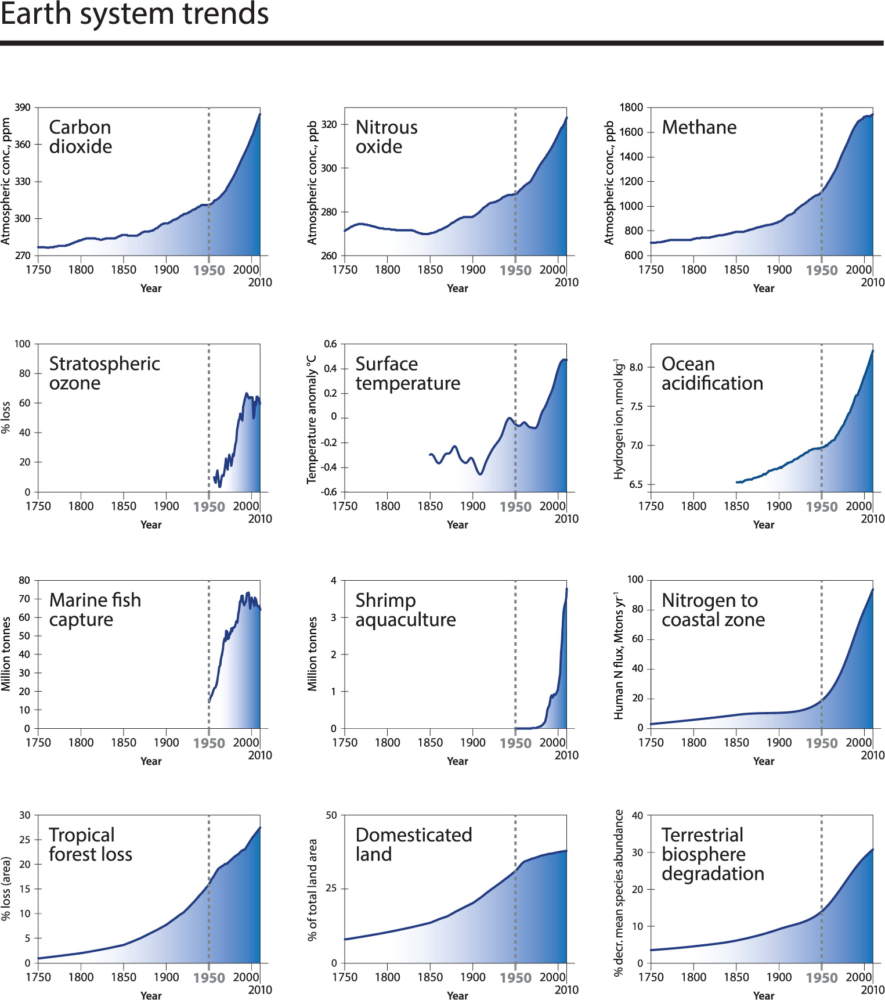
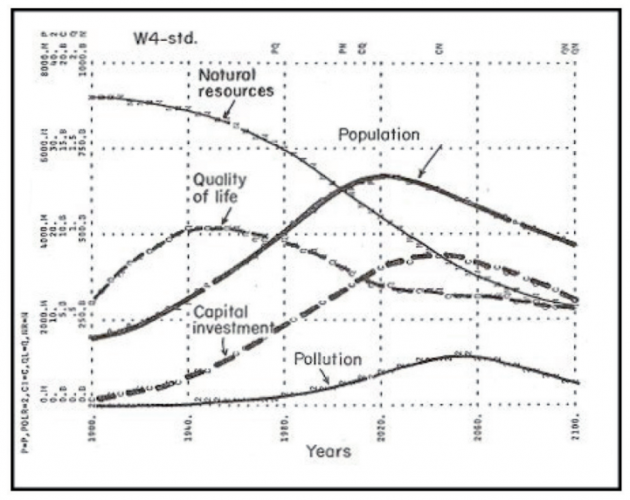
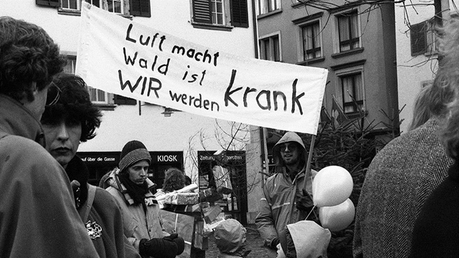

## Ein normatives Konzept

{#fig-sd-normative}

Um Nachhaltigkeit zu erreichen, brauchen wir **Nachhaltige Entwicklung**: einen strategischen Prozess, der Veränderungen in unseren sozial-ökologischen Systemen und Institutionen erfordert. „Entwicklung" impliziert eine gezielte Verbesserung, und die ethische Frage, was genau „besser" bedeutet, ist dabei zentral. Die Verwendung des Begriffs „Entwicklung" wird von einigen kritisiert [z. B. @langDevelopmentAlternativeVisions2013; @kothariPluriversePostdevelopmentDictionary2019], da er häufig mit ungebremstem Wachstum gleichgesetzt wird. Ungebremstes Wachstum des „ökologischen Fussabdrucks" – des Anteils der Biosphäre, der für menschliche Produktion, Konsum und Abfall genutzt wird – ist langfristig nicht tragfähig. Dennoch gibt es unterschiedliche Interpretationen von „Entwicklung", die von Wirtschaftswachstum bis hin zur Verbesserung der Lebensqualität reichen. Nachhaltige Entwicklung bleibt daher ein anregendes und umstrittenes Konzept. Nachhaltigkeit und Nachhaltige Entwicklung spielen im heutigen politischen Diskurs eine zentrale Rolle. Der Begriff „Nicht-Nachhaltigkeit" verweist auf Zustände oder Entwicklungen, die als negativ bewertet werden, während „Nachhaltigkeit" einen positiven Zustand beschreibt.

Das Konzept der Nachhaltigen Entwicklung verpflichtet uns auf bestimmte Werte und Normen, die ethische Ziele und Verhaltensregeln festlegen. Diese Werte und Normen prägen unsere Vorstellungen davon, was wir als wünschenswerte oder „positive" Veränderung betrachten. Ein neutraler Standpunkt ist nicht möglich, da unsere Wahrnehmungen von einer Vielzahl von Einflüssen geprägt sind. Unsere persönlichen Erfahrungen, unsere Erziehung, unser soziales Umfeld und unser kultureller Hintergrund beeinflussen allesamt, wie wir die Welt sehen und interpretieren – einschliesslich unserer Vorstellungen davon, was „sein sollte" und welche Massnahmen „ergriffen werden sollten". Ethik spielt eine zentrale Rolle dabei, wie die aktuelle Situation verbessert werden kann, um Nachhaltigkeit zu erreichen: Sie definiert normative Ziele und Grenzen. Nachhaltige Entwicklung ist daher ein konzeptioneller Rahmen, der stark von ethischen Überlegungen geleitet wird.

Nachhaltigkeitsherausforderungen wie Armutsbekämpfung und Klimawandel sind deshalb auch ethische Herausforderungen. Die Identifikation von Situationen als Nachhaltigkeitsprobleme (und damit als „negativ") und die Wahl von Lösungen beruhen auf ethischen Werten. Nachhaltigkeitsziele basieren ebenfalls auf ethischen Werten sowie auf Kenntnissen über Ursache-Wirkungs-Zusammenhänge. Nachhaltigkeitsfragen werden häufig als „Wicked Problems" bezeichnet, da sie komplex und pluralistisch sind. Der Klimawandel insbesondere wurde als „Super Wicked Problem" beschrieben, weil Lösungen dringend erforderlich sind, politische Institutionen häufig unzureichend sind und Entscheidungsprozesse an Kurzsichtigkeit leiden.

## Globale Herausforderungen als Wicked Problems

Mike Hulme, Autor von *Why We Disagree About Climate Change* [-@hulmeWhyWeDisagree2009], schlägt vor, den Klimawandel als „Wicked Problem" von enormem Ausmass und wahrscheinlich langer Dauer zu betrachten. Dieser Ansatz hilft uns, den Klimawandel nicht als ein zu lösendes Problem zu sehen, sondern als einen Zustand, in den wir direkt eingebunden sind. Die Kategorisierung von Problemen als „wicked" – also solche, die sich keiner eindeutigen Lösung erschliessen – geht auf die Planungstheoretiker Horst Rittel und Melvin Webber [-@rittelDilemmasGeneralTheory1973] zurück. Sie argumentierten, dass Planende mit unvorhersehbarem menschlichem Verhalten konfrontiert sind und dass manche Probleme zu komplex sind, um vollständig gelöst zu werden. Einige „Wicked Problems" werden möglicherweise nie vollständig gelöst, aber wir können lernen, mit ihnen umzugehen und uns nicht von ihnen dominieren zu lassen.

{#fig-WickedProblems}

::: {.callout-note collapse="true" appearance="minimal"}
#### Wicked Problems

Gemäss @banninkIntelligentModesImperfect2019 entstehen Wicked Problems an der Schnittstelle von sachlicher Ungewissheit und einer Heterogenität von Präferenzen und Interessen. Wicked Problems sind gekennzeichnet durch [@alfordWickedLessWicked2017; @rittelDilemmasGeneralTheory1973; @sediriTransformabilityWickedProblem2020]:

-   **Komplexität**: Wicked Problems sind durch viele miteinander verbundene Faktoren und Wechselwirkungen gekennzeichnet. Es gibt keine klaren Ursache-Wirkungs-Zusammenhänge, und Veränderungen in einem Bereich können unvorhergesehene Auswirkungen in anderen Bereichen haben.

-   **Normative Konflikte**: Wicked Problems werden von verschiedenen Akteur*innen und Interessengruppen unterschiedlich wahrgenommen und interpretiert. Es gibt keine klare Definition oder keinen Konsens darüber, was genau das Problem ist oder wie es gelöst werden sollte.

-   **Interdisziplinarität**: Wicked Problems erfordern einen interdisziplinären Ansatz, da sie verschiedene Themen, Perspektiven und Akteur*innen umfassen. Die Findung einer Lösung erfordert häufig die Zusammenarbeit und Koordination verschiedener Disziplinen und Expert*innen. Unsicherheit: Fehlerhafte, fehlende oder unzugängliche Informationen über die Problemsituation und über die Kontinuität der Werte der beteiligten Variablen.

-   **Keine eindeutige Lösung**: Wicked Problems lassen sich nicht eindeutig lösen. Sie sind dynamisch, verändern sich im Laufe der Zeit und erfordern kontinuierliche Anpassung und Iterationen.

Beispiele für Wicked Problems sind der Klimawandel, die Armutsbekämpfung, die globale Gesundheit und die Nachhaltigkeit. Die Komplexität und das Zusammenspiel verschiedener Faktoren in diesen Bereichen erschweren es, einfache und eindeutige Lösungen zu finden. Der Umgang mit Wicked Problems erfordert ein hohes Mass an Reflexion, Zusammenarbeit und die Anwendung systemischer Denkansätze.
:::

Wie haben wir uns in die heutige Situation manövriert, in der Wicked Problems eine solche Herausforderung für die Nachhaltige Entwicklung darstellen? In diesem Lehrbuch analysieren und verstehen wir drei zentrale globale Herausforderungen:

-   das Entstehen des menschengemachten Klimawandels;

-   die Persistenz globaler Armut und wachsender Ungleichheiten;

-   und die Bedrohung durch das Artensterben und die Übernutzung natürlicher Ressourcen.

Die Debatte über den menschlichen Einfluss auf die globale Erwärmung und den Klimawandel hat sich seit den Veröffentlichungen des Intergovernmental Panel on Climate Change (IPCC) intensiviert. Die treibende Kraft hinter der globalen Erwärmung ist unsere Abhängigkeit von Öl und anderen fossilen Brennstoffen für Transport, Stromerzeugung, Landwirtschaft und viele Alltagsprodukte. Ein weiteres Wicked Problem ist die globale Armut. Obwohl es seit Jahrzehnten globale Bemühungen zur Armutsbekämpfung gibt, führt die globalisierte Marktwirtschaft in bestimmten Regionen oft zu zunehmender Armut, und die Kluft zwischen Arm und Reich scheint sich insgesamt zu vergrössern [@chancelWorldInequalityReport2021]. Hocheinkommensländer haben ihren Wohlstand und ihren Lebensstandard auf Kosten anderer aufrechterhalten. Dies sind „externalisierte Kosten", zu denen auch Umweltschäden gehören. So sind der Reichtum und der Lebensstandard der Hocheinkommensländer massgeblich verantwortlich für die Bedrohung des Artensterbens und die Übernutzung natürlicher Ressourcen [@lessenichNebenUnsSintflut2018]. Neben den oben genannten „grossen Drei" – Klimawandel, Armut und Biodiversitätsverlust – gibt es viele weitere globale Nachhaltigkeitsherausforderungen, wie Entwaldung, Desertifikation, sinkende Bodenfruchtbarkeit, schwindende Fischbestände, Umweltverschmutzung, Kriege, Konflikte und zunehmende Migration.

Bei der Analyse dieser umfassenden Herausforderungen müssen wir auch die zeitliche Dimension berücksichtigen. Im Jahr 2004 wurden erstmals Grafiken veröffentlicht, die sozioökonomische und Erdsystem-Trends von 1750 bis 2000 abbildeten und einen dramatischen Anstieg zeigten, der treffend als „Grosse Beschleunigung" bezeichnet wurde [@steffenGlobalChangeEarth2004].

::: {#fig-acceleration-trends layout-ncol="2"}

12 sozioökonomische und 12 Erdsystem-Trends von 1750 bis heute sind ein starker Hinweis darauf, dass das Erdsystem einen neuen Zustand erreicht hat. Quelle: <https://futureearth.org/2015/01/16/the-great-acceleration/>.
:::

Die Grosse Beschleunigung beschrieb die exponentiellen Wachstumsdynamiken, die infolge der Industriellen Revolution entstanden und zu einem Produktivitätsschub und einem deutlichen Anstieg des materiellen Wohlstands führten. Gleichzeitig, aber in deutlich geringerem Ausmass, kam es zu einem massiven Anstieg des Ressourcenverbrauchs und der Emissionen. Das sozioökonomische Wachstum ging Hand in Hand mit der Beschleunigung biophysikalischer Trends. @fig-acceleration-trends zeigt einige Beispiele wichtiger biophysikalischer und sozioökonomischer Indikatoren, die alle mit der Industriellen Revolution zu steigen beginnen. Ab der Mitte des 20. Jahrhunderts wird der Trend zum exponentiellen Wachstum deutlich.

::: {.callout-tip collapse="true"}
#### Das Weizenkorn- und Schachbrettproblem: eine Illustration des exponentiellen Wachstums

Das Weizenkorn- und Schachbrettproblem ist ein mathematisches Problem, das häufig zur Veranschaulichung des exponentiellen Wachstums verwendet wird. In der Geschichte bittet ein Diener den König, jedes Feld eines Schachbretts mit Weizenkörnern zu füllen, wobei die Anzahl auf jedem Feld verdoppelt wird. Das Wachstum beginnt langsam, aber mit jeder Verdopplung steigt die Anzahl der Körner exponentiell an. Beim 50. Feld wäre die Anzahl der Reiskörner gross genug, um den 365 Meter hohen Fernsehturm auf dem Berliner Alexanderplatz zu bedecken. Diese Geschichte veranschaulicht die immense Kraft des exponentiellen Wachstums und seine beeindruckenden Ergebnisse. Das Konzept des exponentiellen Wachstums zu verstehen ist entscheidend für die Analyse von Phänomenen wie Bevölkerungswachstum, technologischem Fortschritt, Umweltveränderungen und der Ausbreitung von Krankheiten. Es zeigt, wie selbst kleine Veränderungen oder Entwicklungen in einem System erhebliche Auswirkungen haben können. Die Geschichte erinnert uns daran, dass wir sorgfältig darüber nachdenken müssen, wie wir mit einem solchen Wachstum umgehen und welche langfristigen Folgen es haben kann.
:::

Die Ressourcengewinnung hat in den letzten Jahrzehnten erheblich zugenommen, von 22 Milliarden Tonnen im Jahr 1970 auf 70 Milliarden Tonnen im Jahr 2010 [@unepGlobalMaterialFlows2016]. Die globale Erwärmung ist ein weiteres drängendes Problem. Der jüngste IPCC-Bericht [-@ipccClimateChange20232023] prognostiziert je nach Szenario und künftigen Emissionen einen Anstieg der globalen Durchschnittstemperatur zwischen 1,5 und 5,8 Grad Celsius. Ein weiteres alarmierendes Phänomen ist die Entwaldung. Alle zwei Sekunden wird eine Waldfläche in der Grösse eines Fussballfeldes abgeholzt – täglich eine Fläche von der Grösse New York Citys. Hinzu kommt der Rückgang der Biodiversität durch das Aussterben von Tier- und Pflanzenarten, der die ökologische Vielfalt unseres Planeten bedroht.

Die Grosse Beschleunigung (@fig-acceleration-trends) beschreibt die beobachtbaren und messbaren (negativen) Entwicklungen wichtiger sozioökonomischer und biophysikalischer Indikatoren seit 1950. Die Ursachen dieser negativen Entwicklungen können weit entfernt von dem Ort liegen, an dem die Probleme entstehen oder am deutlichsten werden. So können beispielsweise Arbeitsplatzverluste in einem Land durch die Entscheidung eines multinationalen Unternehmens verursacht werden, Teile seiner Aktivitäten in ein anderes Land zu verlagern, um die Gewinne zu maximieren. Solche Probleme lassen sich nicht beheben, wenn man nicht versteht, wie das System – in diesem Fall die globalisierte Wirtschaft – funktioniert. Ähnlich müssen wir die globalen Klimasysteme der Erde verstehen, um uns vorstellen zu können, welche Folgen die globale Erwärmung in einem bestimmten Gebiet oder einer bestimmten Region haben könnte.

Deshalb erfordern viele Methoden und Konzepte der Nachhaltigkeitswissenschaft systemisches Denken. Ein systemischer Denkansatz beginnt häufig mit einem Brainstorming, um ein „Rich Picture" aller Faktoren zu erstellen, die berücksichtigt werden müssen, um das aktuelle Verhalten des betreffenden Systems zu verstehen. Im Falle eines multinationalen Unternehmens, das eine bestimmte Geschäftseinheit schliesst, wären dies beispielsweise die Faktoren, die die Entscheidung beeinflussen könnten, bestimmte Geschäftseinheiten weiterzuführen, auszubauen oder zu schliessen. Obwohl eine erste Kartierung übermässig komplex oder sogar unübersichtlich wirken kann, kann die Erstellung eines linearen Flussdiagramms helfen, die Eingangs- und Einflussströme zu klären. Diese Art der Kartierung kann bereits Möglichkeiten aufzeigen, die relevanten Einflüsse neu zu bewerten und das System neu zu gestalten, um unerwünschte Ergebnisse zu vermeiden. Möglicherweise sind jedoch weitere Arbeiten erforderlich, um „konzeptionelle Modelle" des Systems zu entwickeln, die unvorhergesehene Verbesserungsmöglichkeiten aufzeigen.

Die Einbeziehung des systemischen Denkens in die Methoden und Konzepte der Nachhaltigkeitswissenschaft ermöglicht es uns, die Komplexität von Problemen zu bewältigen und fundierte Strategien für eine Nachhaltige Entwicklung zu entwickeln. Systemisches Denken bietet damit eine wichtige Grundlage für das Verstehen und Gestalten der verschiedenen Verständnisse und Konzepte Nachhaltiger Entwicklung, wie das nächste Kapitel eingehender erläutert.

## Nachhaltigkeit: Wann haben wir begonnen, darüber zu sprechen?

Im Jahr 1713 zeigte Hans Carl von Carlowitz, der sächsische Oberberghauptmann, in einem Buch mit dem Titel *Sylvicultura oeconomica, oder hauswirthliche Nachricht und Naturmässige Anweisung zur wilden Baum-Zucht* die Notwendigkeit und Möglichkeit einer „nachhaltigen Forstwirtschaft" auf. Eine weitere Nachhaltigkeitspioniera war Herzogin Anna Amalia, die Mutter von Herzog Carl August. In den späten 1700er Jahren initiierte sie die erste Forstrechtsreform der Welt, die auf eine kontinuierliche und stetige Holzversorgung abzielte. Zu jener Zeit hatte Europa einen unstillbaren Hunger nach Materia prima – den Rohstoffen, die für den Schiffsbau, den Hausbau sowie zum Kochen und Heizen benötigt wurden. Diese Nachfrage drohte die Ressourcen zu erschöpfen und ihr langfristiges Überleben zu gefährden.

Im 18. Jahrhundert befassten sich Gelehrte in Deutschland wie auch in anderen Teilen Europas mit der Endlichkeit natürlicher Ressourcen. Anders als von Carlowitz sprach jedoch niemand über Nachhaltigkeit. Ein wichtiger Aspekt war die Nahrungsversorgung einer wachsenden Bevölkerung. Vor der Industrialisierung wurde das Wirtschaftswachstum weitgehend durch die Natur als Produktionsfaktor bestimmt, etwa durch die Anzahl der gebauten Minen oder Schiffe oder die zur Verfügung stehende landwirtschaftliche Fläche. Der britische Ökonom Thomas Robert Malthus warnte jedoch, dass die Nahrungsmittelproduktion nicht mit dem rasanten Bevölkerungswachstum infolge der Industriellen Revolution Schritt halten könnte. Malthus glaubte, dass die Bevölkerung exponentiell wachsen würde, während die Nahrungsmittelproduktion nur linear zunehmen würde. Obwohl die Malthus'sche These nicht in der von ihm vorhergesagten dramatischen Weise eingetroffen ist, gilt sein Werk oft als erste systematische Abhandlung über die Grenzen des Wachstums in einer endlichen Welt.

Eine Zeit lang gerieten Malthus' Ideen in Vergessenheit, da die Industrielle Revolution und der Aufstieg des Kapitalismus ein unbegrenztes Wachstum möglich erscheinen liessen. Von natürlichen Grenzen war erst wieder Mitte des 20. Jahrhunderts die Rede, als eine „neo-malthusianische" Perspektive im Kontext des Club of Rome (gegründet 1968), der Debatten über planetare Grenzen und der Wachstumskritik wieder auflebte. Während sich der traditionelle Malthusianismus auf externe, physische Wachstumsgrenzen konzentriert, schlägt der Ökologe und Wirtschaftswissenschaftler Giorgos Kallis einen anderen Ansatz vor. @kallisLimitsWhyMalthus2019 plädiert für persönliche Mässigung und freiwillige Zurückhaltung, eine Lebenseinstellung, die tiefe Wurzeln in der Romantik und der antiken griechischen Philosophie hat. Er argumentiert für eine innere Grenze unserer Wünsche, um uns von der wirtschaftlichen Annahme der Knappheit und der damit verbundenen Wachstumsversessenheit zu befreien. Kallis erkennt zwar die Realität äusserer Grenzen an, ist aber der Ansicht, dass diese nicht das Umweltargument gegen grenzenloses Wachstum dominieren sollten. Kallis fragt daher, ob es sinnvoll ist, den Klimawandel primär als ein Problem äusserer Grenzen, der Knappheit oder einer endlichen Atmosphäre zu rahmen, die nicht mehr unsere Emissionen aufnehmen kann.

In der malthusianischen Logik müssten wir unsere Produktion ständig steigern, um die Bedürfnisse einer Welt mit Grenzen zu decken. Solange diese Denkweise anhält, liegt der Fokus darauf, wie wir diese Grenzen überwinden und die Kapazität des Klimas ausweiten können, eine wachsende Bevölkerung und ihre Anforderungen aufzunehmen.

### Das Aufeinanderprallen von Wirtschaft und Ökologie

Ursprünglich war Nachhaltigkeit ein Prinzip der Ressourcenwirtschaft, das das wirtschaftliche Ziel der langfristigen Maximierung der Waldnutzung mit ökologischen Bedingungen für das Nachwachsen verband. Im 19. Jahrhundert entstand das Konzept des „ewigen Waldes" mit dem Ziel, die Übernutzung zu beenden und eine langfristige Versorgung mit Holz als wichtigem Rohstoff sicherzustellen. Forstwissenschaftler wie Heinrich Cotta entwickelten mathematische Methoden zur Berechnung von Holzvorräten und -wachstum. Im Laufe der Zeit verlagerte sich der Fokus jedoch auf die reine Ertragstheorie, die kurze Umtriebszeiten, ertragsreiche Monokulturen und die Maximierung finanzieller Vorteile in den Vordergrund stellte. Plötzlich ging es um den höchstmöglichen direkten Geldertrag statt um einen gleichbleibend hohen Holzertrag. Natürliche Kreisläufe wurden durch kapitalistische Dynamiken ersetzt; der Tauschwert verdrängte den Gebrauchswert. Dies entwertete das Leitbild der Nachhaltigkeit, und es dauerte über hundert Jahre – bis in die 1960er und 1970er Jahre –, bis die wissenschaftlichen Disziplinen Ökologie und Nachhaltigkeit wieder an Bedeutung gewannen.

### Club of Rome und Die Grenzen des Wachstums

> „Wenn die gegenwärtigen Wachstumstrends in der Weltbevölkerung, Industrialisierung, Umweltverschmutzung, Nahrungsmittelproduktion und Ressourcenverbrauch unverändert anhalten, werden die Grenzen des Wachstums auf diesem Planeten irgendwann innerhalb der nächsten hundert Jahre erreicht sein." [@meadowsLimitsGrowthReport1972a, pp. 23]

{#fig-basic-model}

Im Jahr 1972 veröffentlichte der Club of Rome einen Bericht mit dem Titel *Die Grenzen des Wachstums*, der ein weitaus umfassenderes Verständnis von „Nachhaltigkeit" einführte. Wissenschaftler*innen begannen, einen globalen Gleichgewichtszustand, eine Homöostase, zu fordern, der nur durch koordiniertes internationales Handeln möglich wäre. Sie integrieren wirtschaftliche, ökologische und soziale Aspekte der Nachhaltigkeit und nutzen das Modell der Dynamik komplexer Systeme („Systemdynamik"), um die Welt zu verstehen. Sie berücksichtigen die Wechselwirkungen zwischen Bevölkerungsdichte, Nahrungsressourcen, Energie, Materialien, Kapital, Umweltzerstörung und Landnutzung. Computersimulationen verschiedener Szenarien zeigen ähnliche Ergebnisse: einen katastrophalen Rückgang der Weltbevölkerung und des Lebensstandards innerhalb von 50 bis 100 Jahren, wenn die aktuellen Trends anhalten. Das Problem ressourcen- und emissionsintensiver Industriegesellschaften liegt darin, dass Wachstum nicht linear, sondern exponentiell verläuft. Langfristig führt diese Art von Wachstum zum Kollaps. Und einen ökologischen Kollaps könne nur eine Kurskorrektur verhindern, so der Bericht.

Der *Meadows-Bericht*, wie er auch bekannt ist, wurde wegen seiner Vorhersagen und Methoden scharf kritisiert. Einige Kritiker*innen argumentierten, das systemdynamische Modell sei zu vereinfacht und berücksichtige wichtige Faktoren wie Technologie und Innovation nicht ausreichend. Andere sagten, die Anpassungsfähigkeit des Menschen und die Möglichkeit politischer Lösungen und Veränderungen seien zu wenig beachtet worden. Wiederum andere kritisierten die als malthusianisch bezeichnete Weltsicht und eine pessimistische Zukunftssicht. Trotz dieser Kritik löste der Bericht eine wichtige Debatte über Nachhaltigkeit und die Notwendigkeit des Umweltschutzes aus.

Ein Jahr später veröffentlichte E.F. Schumacher *Small is Beautiful: Economics as if People Mattered* [-@schumacherSmallBeautifulEconomics1973]. Schumacher hinterfragte die vorherrschende Vorstellung von grenzenlosem Wirtschaftswachstum und technologischem Fortschritt. Stattdessen plädierte er für eine nachhaltige, menschenzentrierte Wirtschaft, die lokale Gemeinschaften und die Umwelt respektiert. Schumacher argumentierte, dass eine dezentralisierte Wirtschaft, die auf menschlichen Werten und nicht nur auf Profit basiert, eine bessere Zukunft für alle schaffen würde. Er betonte auch die Bedeutung von Bildung und kultureller Entwicklung für die Schaffung einer nachhaltigen Gesellschaft.

## Von der Entwicklungsdebatte zur Nachhaltigkeitsdebatte

Die zunehmende Luft- und Wasserverschmutzung trug dazu bei, dass Umweltthemen in der Politik und den Medien an Bedeutung gewannen. Greenpeace wurde 1971 gegründet. In den 1960er und 1970er Jahren erforschten Paul Crutzen und sein Forschungsteam die Auswirkungen von Stickoxiden auf die Ozonschicht und sagten voraus, dass diese Schicht durch menschengemachte FCKW stark geschädigt werden würde. Der Einsatz von FCKW in Kühlschränken und Klimaanlagen wurde daraufhin verboten. Als Reaktion auf die wachsende Bedeutung von Umweltfragen organisierte die UNO 1972 in Stockholm die erste grosse Umweltkonferenz überhaupt. Die als UNO-Konferenz über die menschliche Umwelt bekannte Veranstaltung führte zur Gründung des Umweltprogramms der Vereinten Nationen (UNEP) und unabhängiger Umweltministerien in vielen Ländern.

{#fig-demo-air-poll}

Das Aufkommen von Umweltproblemen in den 1970er und 1980er Jahren fiel mit den ersten „Entwicklungskrisen" nach dem Zweiten Weltkrieg zusammen. In jenen Tagen sprach man noch von „unterentwickelten Ländern". Nach dem Erfolg des Marshallplans beim Wiederaufbau Europas nach dem Zweiten Weltkrieg wurde angenommen, dass ähnliche Programme, wie ein Marshallplan für Afrika, zu einem raschen Aufholprozess in der sozioökonomischen Entwicklung der armen Länder des Globalen Südens führen würden. Doch die 1970er und 1980er Jahre zeigten das Gegenteil. Selbst Vorzeigeländer wie Mexiko und Brasilien erlagen Schuldenkrisen und demonstrierten, dass die Erreichung sozioökonomischer Entwicklung und die Überwindung von Armut weitaus komplexere Herausforderungen waren.

Von da an war klar, dass Entwicklungs- und Umweltfragen auf zwischenstaatlicher Ebene gemeinsam betrachtet werden mussten. Im Jahr 1983 setzte die UNO eine Weltkommission für Umwelt und Entwicklung ein, die von der norwegischen Premierministerin Gro Harlem Brundtland geleitet wurde.

### Brundtland-Kommission

Gro Harlem Brundtland ernannte 22 Kommissionsmitglieder, von denen drei Viertel aus dem Globalen Süden stammten. In dieser Zeit begann die Sowjetunion, die mit wirtschaftlicher Stagnation zu kämpfen hatte, ihren politischen Kurs zu ändern. Da das Wettrüsten mit den USA zu einem erheblichen Haushaltsdefizit beigetragen hatte, leitete Michail Gorbatschow, der neu ernannte Generalsekretär der Kommunistischen Partei der Sowjetunion, umfassende Reformen ein. Gleichzeitig begann sich ein neues Weltbild und ein globales Bewusstsein herausuzubilden. Vor diesem Hintergrund wurde die Brundtland-Kommission mit der Aufgabe betraut, einen Bericht über die Perspektiven einer globalen, nachhaltigen und umweltverträglichen Entwicklung bis zum Jahr 2000 und darüber hinaus zu erarbeiten. Der 1987 vorgelegte Bericht trug den Titel *Our Common Future* – häufig auch als *Brundtland-Bericht* bezeichnet.

Der Brundtland-Bericht stellte fest, dass die globalen Umweltprobleme hauptsächlich auf nicht nachhaltigen Konsum- und Produktionsmustern im Norden und auf schwerer Armut im Süden beruhen. Die Übernutzung der Natur und die Erschöpfung natürlicher Ressourcen verschärften Ungleichheiten (bei Einkommen und Vermögen), steigerten die absolute Armut und stellten eine Bedrohung für Frieden und Sicherheit dar. Der Bericht bemühte sich um eine faire und gerechte Definition von Nachhaltigkeit:

> „Nachhaltige Entwicklung ist eine Entwicklung, die die Bedürfnisse der Gegenwart befriedigt, ohne die Möglichkeiten zukünftiger Generationen zu gefährden, ihre eigenen Bedürfnisse zu befriedigen." [@wcedOurCommonFuture1987a]

Diese Definition brachte eine ethische Perspektive in die Nachhaltigkeitsdebatte ein und stellte das Prinzip der Verantwortung gegenüber den heutigen und zukünftigen Generationen in den Mittelpunkt. Durch die Fokussierung auf menschliche Bedürfnisse nahm die Brundtland-Kommission eine anthropozentrische Position ein. Sie identifizierte drei Schlüsselprinzipien für die Analyse von Problemen und die Ausrichtung von Handlungen: eine globale Perspektive, die Verflechtung von Umwelt und Entwicklung sowie das Streben nach Gerechtigkeit und Chancengleichheit. Das Konzept der Gerechtigkeit/Chancengleichheit wurde in zwei verschiedene Perspektiven unterteilt:

1.  Die intergenerationelle Perspektive: Verantwortung gegenüber künftigen Generationen.
2.  Die intragenerationelle Perspektive: Verantwortung gegenüber den heute lebenden Menschen, insbesondere in Entwicklungsländern, und die Sicherstellung von Chancengleichheit innerhalb der Länder.

::: {.callout-note collapse="true"}
#### Nachhaltigkeit und Nachhaltige Entwicklung

Die Konzepte „Nachhaltigkeit" und „Nachhaltige Entwicklung" unterscheiden sich in ihrem Fokus. Nachhaltigkeit ist statisch; sie betont einen beständigen Zustand, während Nachhaltige Entwicklung der dynamische Prozess ist, diesen Zustand zu erreichen – sie impliziert Bewegung und verweist auf etwas Werdendes.
:::

## Von Rio 1992 bis heute

Nach dem Aufruf des Brundtland-Berichts zum internationalen Handeln richtete sich der Fokus darauf, Forderungen und Vorschläge in verbindliche Verträge und Konventionen umzusetzen. Die UNO wählte eine Konferenz als Instrument dafür, genau 20 Jahre nach der Stockholmer Konferenz von 1972, der ersten globalen Umweltkonferenz. Die im Juni 1992 in Rio de Janeiro, Brasilien, abgehaltene UNO-Konferenz für Umwelt und Entwicklung – auch als Erdgipfel bekannt – war bis dahin die grösste internationale Konferenz mit Delegierten aus über 170 Nationen.

Der Rio-Erdgipfel verabschiedete folgende fünf Dokumente:

-   Eine Walderklärung, die auf die ökologische Bewirtschaftung und den Schutz der Wälder der Welt abzielt;
-   Eine Klimaschutzkonvention, die die Staaten verpflichtet, die Treibhausgasemissionen weltweit auf das Niveau von 1990 zu reduzieren;
-   Eine Biodiversitätskonvention zur Bekämpfung des Rückgangs der Biodiversität durch völkerrechtlich verbindliche Massnahmen;
-   Die Rio-Erklärung zu Umwelt und Entwicklung; sowie Agenda 21, das bekannteste der fünf Abkommen, wonach die nationalen Regierungen für die Umsetzung des Nachhaltigkeitsmodells in ihren Ländern verantwortlich sind.

Die Rio-Erklärung zu Umwelt und Entwicklung betont, dass ein langfristiger wirtschaftlicher Fortschritt nur mit einem Ökosystemansatz möglich ist. Dies wiederum erfordert eine neue und gerechte globale Partnerschaft zwischen Regierungen, Bevölkerung und wichtigen gesellschaftlichen Gruppen. Um dies zu erreichen, sind internationale Abkommen zum Schutz der Umwelt und des Entwicklungssystems notwendig. Die Rio-Erklärung legte wichtige Prinzipien der Nachhaltigen Entwicklung fest, darunter das Vorsorgeprinzip und das Verursacherprinzip. Prinzip 15 beispielsweise besagt: „Zum Schutz der Umwelt werden die Staaten entsprechend ihren Möglichkeiten den Vorsorgeansatz weitgehend anwenden. Wenn ernste oder irreversible Schäden drohen, darf der Mangel an vollständiger wissenschaftlicher Gewissheit nicht als Grund für die Aufschiebung kosteneffizienter Massnahmen zur Verhinderung von Umweltschäden herangezogen werden." [@unRioDeclarationEnvironment1992]

Im Dezember 1992 wurde die Kommission für Nachhaltige Entwicklung (CSD) gegründet, um eine wirksame Nachbereitung des Gipfels zu gewährleisten.

### Agenda 21: Global denken – lokal handeln

Die Agenda 21, die 40 Kapitel umfasst, behandelt alle kritischen Politikbereiche und Massnahmen für eine Nachhaltige Entwicklung. Laut Präambel „wird die Integration von Umwelt- und Entwicklungsanliegen und ihre stärkere Berücksichtigung zur Erfüllung grundlegender Bedürfnisse, zu einem verbesserten Lebensstandard für alle, zu besser geschützten und bewirtschafteten Ökosystemen und zu einer sichereren, wohlhabenderen Zukunft führen. Keine Nation kann dies allein erreichen; aber gemeinsam können wir es – in einer globalen Partnerschaft für eine Nachhaltige Entwicklung." [@uncsdAgenda211992]

### Die Millenniums-Entwicklungsziele (MDGs)

Die Grundprinzipien der Agenda 21 – Stärkung der Rolle der Frauen, Umweltschutz und Förderung einer gerechten und inklusiven Gesellschaft – legten den Grundstein für die Millenniums-Entwicklungsziele (MDGs). Die von der UNO im Jahr 2000 verabschiedeten MDGs umfassten acht spezifische Ziele, die bis 2015 erreicht werden sollten. Obwohl nicht alle diese Ziele erreicht wurden, machten die MDGs das Bewusstsein für die Notwendigkeit einer Nachhaltigen Entwicklung erheblich stärker. Die MDGs wurden von den Zielen für Nachhaltige Entwicklung (SDGs) abgelöst, die die UNO im Jahr 2015 verabschiedete.

### Rio+20

Die UNO-Konferenz für Nachhaltige Entwicklung, oder Rio+20, fand 2012 in Rio de Janeiro statt, 20 Jahre nach dem historischen Erdgipfel von 1992, auf dem die Agenda 21 verabschiedet worden war. Das Hauptziel von Rio+20 war die Bekräftigung des globalen politischen Engagements für Nachhaltige Entwicklung. Die Teilnehmenden, darunter Regierungsvertreter*innen sowie Repräsentant*innen aus Zivilgesellschaft und Privatwirtschaft, diskutierten ein breites Themenspektrum, darunter Armutsbekämpfung, Umweltschutz, nachhaltige Energie, Ernährungssicherheit und Ressourcenmanagement. Das wichtigste Ergebnis des Gipfels war die Annahme einer Erklärung mit dem Titel „The Future We Want". Diese Erklärung erneuerte das Bekenntnis der internationalen Gemeinschaft zur Nachhaltigen Entwicklung und zu den Rio-Prinzipien und früheren Aktionsplänen und legte weitere Massnahmen zur Erreichung dieser Ziele fest. Darüber hinaus ebnete Rio+20 den Weg für einen universellen Entwicklungsrahmen zur Festlegung globaler Nachhaltigkeitsziele und -prioritäten über 2015 hinaus.

### Die Agenda 2030 und die Ziele für Nachhaltige Entwicklung (SDGs)

> „Wir sind die erste Generation, die der Armut ein Ende setzen kann, und wir sind die letzte Generation, die den Klimawandel stoppen kann, also \[müssen wir\] den Klimawandel angehen." Ban-Ki Moon, UNO-Generalsekretär 2007–2016, zur Agenda 2030

Rio+20 legte den Grundstein für die Agenda 2030, die die UNO im Jahr 2015 verabschiedete. Die Agenda 2030 baut auf den Ergebnissen von Rio+20 auf und legt einen umfassenden Rahmen für Nachhaltige Entwicklung fest. Die Agenda 2030 basiert auf fünf Schlüsselprinzipien oder -säulen (den 5 Ps) und führt die 17 Ziele für Nachhaltige Entwicklung (SDGs) ein, die darauf abzielen, bis 2030 eine nachhaltige und gerechte Welt zu schaffen.

::: {.callout-note collapse="true"}
#### Die 5 Ps der SDGs

Die 5 Ps stehen für fünf Schlüsselprinzipien der Nachhaltigkeit: People (Menschen), Planet, Prosperity (Wohlstand), Peace (Frieden) und Partnership (Partnerschaft).

**People (Menschen)**: Dieses P steht für das Ziel, soziale Gerechtigkeit, Chancengleichheit, gute Gesundheit und Bildung für alle Menschen zu fördern. Es soll auch Armut beenden, Gleichstellung der Geschlechter fördern und das Wohlbefinden der Menschen verbessern.

**Planet**: Das Ziel dieses P ist der Schutz natürlicher Ressourcen und ihre nachhaltige Nutzung, die Erhaltung der Biodiversität, der Schutz des Klimas und die Reduzierung der Umweltverschmutzung. Insgesamt soll damit unser Planet erhalten und nachhaltige Umweltpraktiken gefördert werden.

**Prosperity (Wohlstand)**: Dies bezieht sich auf Wirtschaftswachstum, nachhaltige Produktions- und Konsummuster sowie die Schaffung von Arbeitsplätzen und wirtschaftlichem Wohlstand für alle. Dieses P zielt darauf ab, eine starke und nachhaltige Wirtschaft zu fördern, die allen Menschen zugute kommt.

**Peace (Frieden)**: Es geht darum, Frieden, Gerechtigkeit, gute Regierungsführung und starke Institutionen zu fördern. Es geht auch darum, Konflikte zu verhindern, Gewalt zu reduzieren und integrative Gesellschaften aufzubauen.

**Partnership (Partnerschaft)**: Dies bezieht sich auf die Bedeutung globaler Zusammenarbeit, Partnerschaften und Solidarität zwischen allen Akteur*innen. Es geht darum, gemeinsam an der Umsetzung der Agenda 2030 zu arbeiten und Ressourcen, Erfahrungen und Wissen zu teilen.
:::

### Pariser Klimaabkommen 2015

Das Pariser Klimaabkommen von 2015 ist ein wegweisendes internationales Abkommen, das auf der 21. Konferenz der Vertragsparteien (COP 21) des UNO-Rahmenübereinkommens über Klimaänderungen (UNFCCC) in Paris angenommen wurde. Das Abkommen zielt darauf ab, den globalen Temperaturanstieg auf deutlich unter 2 Grad Celsius gegenüber dem vorindustriellen Niveau zu begrenzen und Anstrengungen zu unternehmen, ihn auf 1,5 Grad Celsius zu begrenzen. Das Pariser Abkommen beruht auf dem Prinzip gemeinsamer, aber unterschiedlicher Verantwortlichkeiten und der Berücksichtigung nationaler Gegebenheiten. Es ermutigt alle Länder, Massnahmen zur Reduktion ihrer Treibhausgasemissionen zu ergreifen und sich freiwillige Klimaziele zu setzen, die sogenannten Nationally Determined Contributions (NDCs).

Das Pariser Klimaabkommen von 2015 gilt für alle Länder, die es ratifiziert haben, darunter die Schweiz. Als Vertragspartei hat sich die Schweiz verpflichtet, zur globalen Reduktion der Treibhausgasemissionen beizutragen und die Ziele des Abkommens umzusetzen.

### Fazit – es gibt Fortschritte, aber sie sind zu langsam

Obwohl es einige Fortschritte bei der Institutionalisierung und Verbreitung von Nachhaltigkeitsansätzen in der Wirtschaft, der Politik und anderen Bereichen gegeben hat, zeigt eine grosse Anzahl von Studien, dass die Welt insgesamt auf einem nicht nachhaltigen Kurs ist (vgl. den [Freiwilligen Nationalen Review der Schweiz 2022](https://www.sdgital2030.ch/countryreport){target="_blank"}). Ein ähnliches Bild zeichnen verschiedene Studien zur globalen Umweltsituation, wie das 2012 veröffentlichte Global Environment Outlook 5 (GEO-5) des UNEP, der Millenniumsentwicklungsziele-Bericht 2010 (MDGs Report 2010) sowie Berichte zur Agenda 2030 und zum Klimawandel [@ipccClimateChange20222022]. Wie diese Studien zeigen, ist die internationale Gemeinschaft weit entfernt von einer nachhaltigen, intergenerationell gerechten ökologischen, sozialen und wirtschaftlichen Entwicklung.

So haben internationale Klimapolitiken den Anstieg der CO~2~-Emissionen, der Hauptursache des menschengemachten Klimawandels, nicht gestoppt; diese sind seit 1990 um rund 50 Prozent gestiegen. Der Artenverlust beschleunigt sich an vielen Orten weiter. Der globale Kampf gegen die Armut bleibt hinter den angestrebten Zielen zurück, und die wirtschaftliche Globalisierung der vergangenen drei Jahrzehnte hat die sozioökonomische Ungleichheit in vielen Ländern verschärft, was häufig mit soziopolitischen und soziokulturellen Disparitäten verbunden ist.
