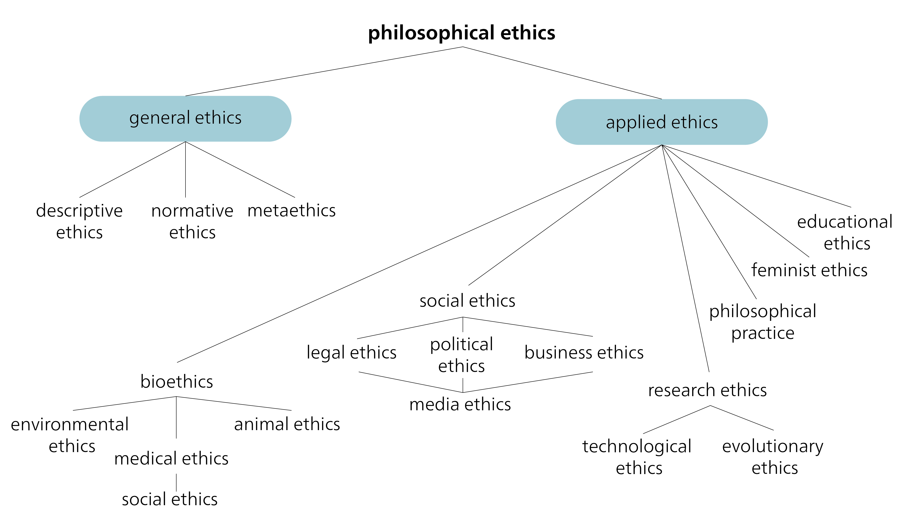
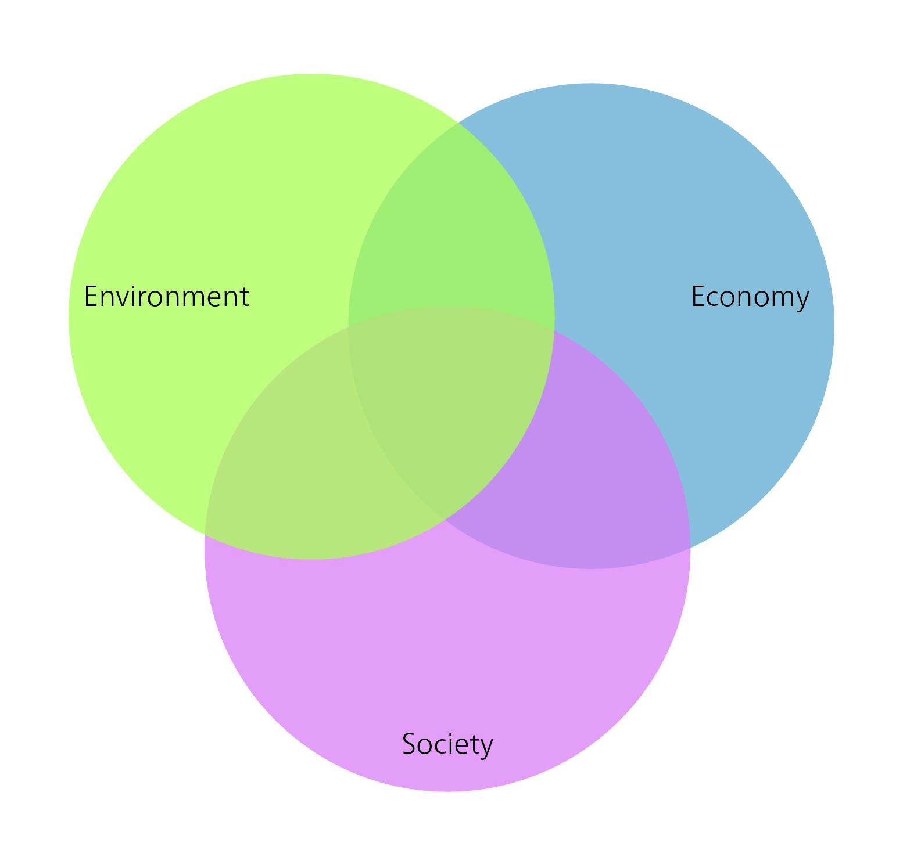
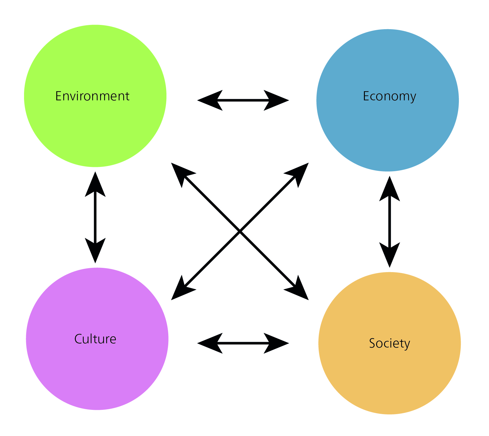
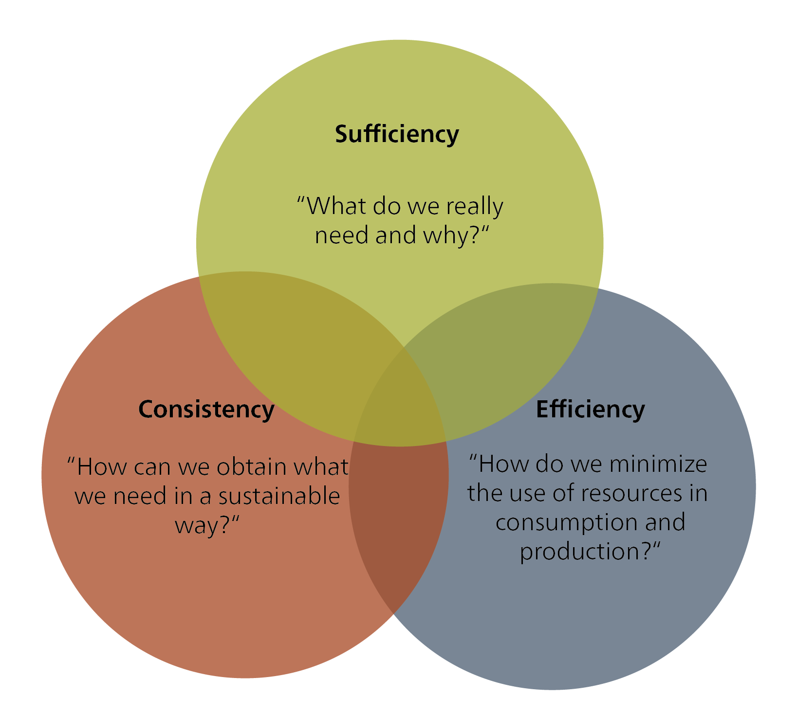
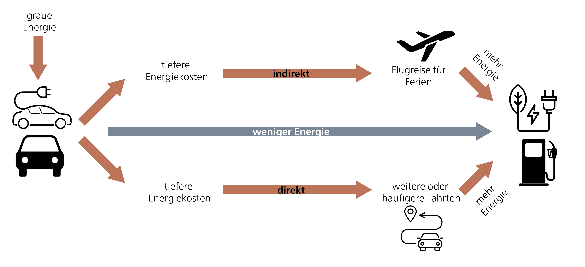

## Das Leitbild der Nachhaltigen Entwicklung als normatives Konzept

Das Konzept der Nachhaltigkeit in Handeln umzusetzen und Umsetzungsstrategien zu entwickeln, ist eine grosse Herausforderung für unsere Gesellschaft. Es gibt unterschiedliche Verständnisse und Konzepte von Nachhaltigkeit und Nachhaltiger Entwicklung, und es besteht kein Konsens darüber, wie Nachhaltigkeit erreicht werden kann und welche Massnahmen Vorrang haben sollten. Einige dieser Verständnisse werden im Folgenden vorgestellt. Die Vielfalt der Ansätze spiegelt die unterschiedlichen Perspektiven und Interessen verschiedener Akteur*innen wider. Um diese Komplexität zu bewältigen, müssen wir wirtschaftliche, soziale und ökologische Gesichtspunkte in Einklang bringen. Dies erfordert einen integrativen Ansatz. Die Herausforderung besteht darin, gemeinsame Ziele zu definieren und Strategien zu entwickeln, um Nachhaltigkeit auf allen Ebenen – global, national, regional und lokal – zu erreichen. Wir brauchen eine breite gesellschaftliche Beteiligung sowie Dialog und Zusammenarbeit zwischen Regierungen, Wirtschaft, Zivilgesellschaft und Forschungseinrichtungen, um Lösungen zu finden und den notwendigen Wandel voranzutreiben.

> „Wenn mächtige Metaphern zu modischen Schlagworten werden, riskieren wir, dass Vielfalt von Vagheit begleitet wird, d. h. das Phänomen eines Begriffs, der mehrere Bedeutungen hat, die ‚so viel gemeinsam haben, dass es schwierig ist, sie zu trennen'" [@strunzConceptualVaguenessAsset2012, pp. 113; zitiert in @feolaSocietalTransformationResponse2015, pp. 377]

Das Konzept der Nachhaltigkeit hat in der Regel eine positive Konnotation, kann aber aus verschiedenen Perspektiven betrachtet werden. Um als Leitbild (im ökologischen, sozialen und wirtschaftlichen Sinne) zu funktionieren, bedarf es klarer Kriterien. Auf welcher Grundlage können wir diese Kriterien jedoch definieren?

Gemäss @hirschhadornEthischeProblemeNachhaltiger2007 sollte „Nachhaltige Entwicklung":

-   *Bedürfnisse* befriedigen…
-   …auf *gerechte* Weise,
-   …im Hinblick auf heute und in Zukunft lebende Menschen, und
-   unter Berücksichtigung der Wertepluralität und der Grenzen der Naturnutzung.

Das Leitbild der Nachhaltigen Entwicklung ist daher nicht nur das Ergebnis wissenschaftlicher Forschung, sondern in erster Linie ein normatives, ethisch fundiertes Konzept. Es verbindet „ethische und analytische Ideen" und formuliert „Normen, die ausdrücken, was wünschenswert ist und was geschehen soll" [@rennLeitbildNachhaltigkeitNormativfunktionale2007, pp. 39]. Nachhaltige Entwicklung ist daher ein gesellschaftlicher Aushandlungs- und Entscheidungsprozess – ein Suchen, Lernen und Erfahrungsammeln – der von ethischen Überlegungen geleitet wird. Dementsprechend muss die Nachhaltigkeitsforschung stets ihre Einbindung in gesellschaftliche Wahrnehmungs- und Bewertungsprozesse im Blick behalten.

### An welchen Werten und Normen sollen wir uns orientieren, und warum?

Beim Übergang vom Konzept der Nachhaltigen Entwicklung zu seiner Umsetzung kommt die Ethik ins Spiel. Ethik liefert Bewertungskriterien, methodische Verfahren oder Prinzipien zur „Begründung und Kritik von Handlungsregeln oder normativen Aussagen darüber, wie wir handeln sollen" [@fennerEthikWieSoll2008a, pp. 5]. Ethik hilft auch dabei, komplexe Entscheidungen zu strukturieren und zu begründen, die in Dilemmasituationen entstehen. Im Gegensatz zu Problemen mit einer einzigen Lösung ist ein Dilemma komplexer und beinhaltet Zielkonflikte sowie das Abwägen verschiedener Handlungsoptionen. Ethik bietet Orientierungs- und Entscheidungsstrukturen, die einen Rahmen für das Finden einer geeigneten Vorgehensweise in solchen Situationen bieten. Die Kernfunktion der Ethik besteht daher nicht darin, monokausale Probleme zu lösen, sondern komplexe Dilemmata zu strukturieren und einzuordnen.

Vereinfacht gesagt bezieht sich „Moral" auf persönliche oder soziale Überzeugungen über Richtig und Falsch, während „Ethik" das philosophische Studium dieser Überzeugungen ist. Die Ethik untersucht die Regeln und Prinzipien, die das menschliche Verhalten „leiten sollten". Ethik lässt sich in allgemeine und angewandte Ethik unterteilen (@fig-branches-ethics).

{#fig-branches-ethics}

Die allgemeine Ethik stellt uns Methoden und Konzepte zur Verfügung, um grundlegende moralische Probleme zu diskutieren. Sie besteht aus drei Zweigen: normative Ethik, deskriptive Ethik und Metaethik. Die normative Ethik konzentriert sich auf die Bestimmung dessen, was moralisch richtig oder falsch ist. Fragen nach dem, was ein gutes Leben ausmacht, können beispielsweise je nach den individuellen Wertvorstellungen der Menschen unterschiedliche Antworten haben.

Aus diesem Grund wird die normative Ethik weiter in teleologische und deontologische Ansätze unterteilt. Die teleologische Ethik (verwurzelt in *telos*, dem griechischen Wort für „Ende", „Zweck" oder „Ziel") bewertet Handlungen anhand des Guten, das sie hervorbringen. Der Utilitarismus beispielsweise ist eine teleologische Theorie, die Handlungen nach dem daraus resultierenden Nutzen oder Glück bewertet. Eine der ersten systematischen Ausarbeitungen des Utilitarismus ist Jeremy Benthams (1748–1832) *An Introduction to the Principles of Morals and Legislation* (1780). Die deontologische Ethik hingegen bewertet Handlungen anhand ihrer Eigenschaften und nicht anhand ihrer Konsequenzen. Ihr Ursprung liegt in *deon*, dem griechischen Wort für „Pflicht". Ein Beispiel für eine deontologische Ethiktheorie ist die Kantische Ethik, die vom deutschen Philosophen Immanuel Kant entwickelt wurde.

Die Unterscheidung zwischen teleologischen und deontologischen Ansätzen wird häufig anhand des „Trolley-Problems" diskutiert [vgl. @sandelJusticeWhatsRight2009; @sandelGerechtigkeitWieWir2013 für weiterführende Lektüre].

::: {.callout-caution collapse="true"}
#### Weiterführende Literatur

- *Justice: What's The Right Thing To Do? Episode 01 "THE MORAL SIDE OF MURDER."* 2009. Mit Michael Sandel. The Moral Side of Murder. <https://www.youtube.com/watch?v=kBdfcR-8hEY>.

- Sandel, Michael. 2013. *Gerechtigkeit.* Ullstein.
:::

### Das Prinzip Verantwortung – Hans Jonas

Hans Jonas' „Prinzip Verantwortung" (1979) leistet einen wichtigen Beitrag zur Nachhaltigkeitsdebatte, indem es unsere ethische Verantwortung gegenüber zukünftigen Generationen und der Natur betont. Jonas' Ansatz, der als eine Art „Ethik der Zukunft" beschrieben wurde, zielt darauf ab, die neuen Herausforderungen zu bewältigen, die insbesondere durch eine technologische Zivilisation entstehen. Die Verbindung zur Nachhaltigkeitsethik liegt in seinem Verständnis des Begriffs der ethischen Verantwortung gegenüber zukünftigen Generationen, die er als asymmetrische, nicht-reziproke Beziehung betrachtet [@jonasPrinzipVerantwortungVersuch1987, pp. 177]. Die Asymmetrie ergibt sich aus der Macht eines „moralischen Subjekts" über jemanden oder etwas, das der Fürsorge bedarf; Jonas beschreibt die Verletzlichkeit des Lebens (ontologische Verletzlichkeit) und die Verantwortung als unsere Sorgfaltspflicht, andere Wesen vor Schaden zu schützen [@jonasPrinzipVerantwortungVersuch1987, pp. 391].

Jonas' Ansatz unterscheidet sich von anderen Ethiktheorien dadurch, dass er die Existenz der Menschheit nicht als selbstverständlich voraussetzt und stattdessen Pflichten gegenüber zukünftigen Generationen sowie gegenüber der Natur einschliesst. Jonas argumentiert, dass die erste Pflicht der Zukunftsethik darin besteht, die Fernwirkungen menschlichen Handelns anzuerkennen [@jonasPrinzipVerantwortungVersuch1987, pp. 64]. Angesichts der Unsicherheit über die langfristigen Folgen menschlichen Handelns schlägt er ein Entscheidungsprinzip vor, das auf dem lateinischen Begriff *in dubio pro malo* basiert, den er wie folgt interpretiert: „[...] gib im Zweifel der schlimmeren Prognose vor der besseren den Vorrang, da die Einsätze zu hoch geworden sind für das Spiel" [@jonasPrinzipVerantwortungVersuch1987, pp. 67]. Jonas entwickelt damit einen neuen kategorischen Imperativ, der die Notwendigkeit betont, sowohl die Natur als auch die Menschheit zu erhalten. Er basiert auf der Idee, dass die Natur einen immanenten Wert und Zweck hat: „Handle so, dass die Wirkungen deiner Handlung verträglich sind mit der Permanenz echten menschlichen Lebens auf Erden", oder „Handle so, dass die Wirkungen deiner Handlung nicht zerstörerisch sind für die künftige Möglichkeit solchen Lebens" [@jonasPrinzipVerantwortungVersuch1987, pp. 36].

Bereits in den späten 1970er Jahren artikulierte Hans Jonas damit eine grundlegende Unsicherheit über die Risiken und Schäden, die durch die damals genutzten Technologien wie die Kernenergie für zukünftige Generationen entstehen könnten. Entscheidungsfindung zu Themen wie neue Technologien erfordert eine kontinuierliche Bewertung von Risiken und Chancen, oft unter unvollständigen Informationen und unsicheren Zukunftsprognosen. Diese Entscheidungen wirken sich nicht nur auf die Umwelt aus, sondern werfen auch ethische Fragen über unsere Verpflichtung auf, Nachhaltigkeit für zukünftige Generationen zu sichern. Jonas' Verantwortungsimperativ betont die Verknüpfung von Verantwortung und Pflicht als Schlüsselkonzepte in der Nachhaltigkeitsdebatte. Laut Jonas tragen die gegenwärtigen Generationen eine vorausschauende Verantwortung gegenüber zukünftigen Generationen. Offen lässt er jedoch das Ausmass dieser Pflicht und die Frage, ob zukünftige Generationen Anspruch auf absolute oder vergleichende Standards haben.

Jonas' Verantwortungsimperativ kann im Zusammenhang mit verschiedenen Verantwortungsbereichen betrachtet werden, die unterschiedliche ethische Ansätze repräsentieren: Anthropozentrismus, Pathozentrismus, Biozentrismus und Physiozentrismus.

![Verschiedene ethische Ansätze. Quelle: Eigene Darstellung basierend auf @carnauNachhaltigkeitsethikNormativerGestaltungsansatz2011 [p. 143].](images/Anthropocentrism.jpg){#fig-anthropocentrism}

Der Anthropozentrismus betrachtet den Menschen als das zentrale Wesen und betont die Verantwortung gegenüber der menschlichen Gesellschaft und ihrem Wohlergehen. Dies schliesst die Berücksichtigung der Bedürfnisse und Interessen sowohl der gegenwärtigen als auch der zukünftigen Generationen ein. Der Pathozentrismus hingegen betont die Verantwortung gegenüber empfindungsfähigen Wesen und ihrem Wohlbefinden. Er erkennt an, dass nicht nur Menschen, sondern auch Tiere und andere Lebewesen das Recht haben, frei von Leid und Schaden zu sein. Der Biozentrismus wiederum erkennt den immanenten Wert aller Lebewesen an und konzentriert sich auf den Schutz und die Erhaltung der Biodiversität. Er betont die Bedeutung der Achtung der natürlichen Umwelt und die Förderung nachhaltiger Praktiken. Schliesslich konzentriert sich der Physiozentrismus auf die Verantwortung gegenüber der gesamten physischen Umwelt, einschliesslich der unbelebten Natur und der Ökosysteme. Er erkennt den immanenten Wert der Natur an und betont die komplexen Wechselwirkungen zwischen allen Komponenten des Ökosystems.

Hans Jonas' Verantwortungsimperativ verbindet alle diese verschiedenen Verantwortungsbereiche miteinander. Er fordert uns auf, Verantwortung für Menschen sowie für andere Lebewesen, die Natur und die Umwelt zu übernehmen. Dabei ist es wichtig, eine ausgewogene und umfassende Perspektive einzunehmen, die langfristige Auswirkungen und das Wohlbefinden aller Aspekte des Lebens und der Natur berücksichtigt.

Durch die Integration dieser verschiedenen Verantwortungsbereiche können wir eine ganzheitliche und nachhaltige Ethik kultivieren, die den Bedürfnissen und Interessen aller Aspekte des Lebens und der Natur angemessen Rechnung trägt.

## Nachhaltige Entwicklung im Kontext von Entwicklungsdebatten

Ist „Nachhaltige Entwicklung" eine Entwicklungstheorie? Jein. Nein, weil Nachhaltige Entwicklung ein breiteres gesellschaftliches Modell ist und als übergreifender Rahmen fungiert, der verschiedene Entwicklungstheorien umfasst. Ja, weil Nachhaltige Entwicklung eine normative Theorie ist, die de facto in der wissenschaftlichen und gesellschaftlichen Praxis mit anderen Theorien der sozialen und insbesondere sozioökonomischen Entwicklung konkurriert.

Entwicklungstheorien analysieren die gesellschaftliche Entwicklung, entweder retrospektiv oder prospektiv, und entweder als Ganzes oder anhand spezifischer Aspekte (z. B. wirtschaftliche Entwicklung). Die retrospektive Untersuchung der gesellschaftlichen Entwicklung zielt darauf ab, vergangene oder aktuelle gesellschaftliche Entwicklungen zu erklären und Lehren für die künftige Planung und Entwicklungspolitik zu ziehen. Die prospektive Untersuchung der gesellschaftlichen Entwicklung soll das Management und die Politik der gesellschaftlichen Entwicklung informieren. Entwicklungstheorien können in verschiedene Typen eingeteilt werden: normative, strategische und erklärende Theorien. Jeder Typ konzentriert sich auf unterschiedliche Aspekte und Ziele der Entwicklungsforschung.

Normative Theorien konzentrieren sich auf die Frage, wie Entwicklung aussehen sollte und welche normativen Ziele sie erreichen sollte. Sie untersuchen Werte und Ziele, die mit Entwicklung verbunden sind, und beziehen sich häufig auf Konzepte wie soziale Gerechtigkeit, Nachhaltigkeit oder Armutsbekämpfung. Normative Theorien betonen die Definition von Kriterien für gute Entwicklung und liefern einen normativen Rahmen für politische Entscheidungen und Massnahmen. Beispiele sind die Theorie der Nachhaltigen Entwicklung, John Rawls' Theorie der sozialen Gerechtigkeit oder Amartya Sens Capability-Ansatz.

Strategische Theorien untersuchen, welche Strategien und Massnahmen erforderlich sind, um gewünschte Entwicklungsergebnisse zu erzielen. Sie konzentrieren sich auf Fragen der Politikgestaltung, der Ressourcenallokation und der Umsetzung von Massnahmen und analysieren, wie bestimmte Ansätze – etwa die neoklassische Wachstumstheorie – die Entwicklung fördern können.

Erklärende Theorien zielen darauf ab, die Ursachen und Mechanismen von Entwicklung zu erklären. Sie analysieren Faktoren, die Entwicklungsprozesse in Gesellschaften antreiben, und untersuchen die Zusammenhänge zwischen den verschiedenen Variablen. Dies umfasst die Untersuchung wirtschaftlicher, sozialer, politischer oder kultureller Faktoren, um Muster und Zusammenhänge zu identifizieren. Beispiele sind die Modernisierungstheorie und die Dependenztheorie.

Hinweis: Alle Theorien beruhen auf normativen Grundlagen – d. h. auf zugrunde liegenden Werten und Überzeugungen – und implizieren daher, auch unbeabsichtigt, bestimmte Vorstellungen davon, wie sich die Gesellschaft entwickeln sollte.

```{r}
#| label: tbl-development-theories
#| tbl-cap: "Überblick über Entwicklungsdebatten. Quelle: Erweiterte Tabelle basierend auf @bieriGlobaleUngleichheitUnd2022 [S. 378]."

library(kableExtra)
is_pdf <- knitr::is_latex_output()

df <- data.frame(
  Kategorie = c("Narrativ", "Grundidee", "Theorien", "Ziele", "Folgen"),
  `1950er/60er Jahre` = c(
    "Wirtschaftswachstum, Modernisierung und Integration in die Weltwirtschaft",
    "Aufholentwicklung durch Industrialisierung und Grossprojekte", "Modernisierungstheorien (Stufentheorien)","Geopolitische Einordnung der „Dritten Welt“; Eindämmung des Kommunismus, Modernisierung der Landwirtschaft, rasche Industrialisierung und technologischer Fortschritt, Erschliessung neuer Märkte", "Wirtschaftliche Abhängigkeit und Verschuldung nehmen zu, Einkommensgefälle wächst, Armut steigt, ökologische Schäden durch Übernutzung und unangepasste Technologien, undemokratische Regime werden aus geopolitischen Gründen unterstützt"),
  `1970er Jahre` = c(
    "Bekämpfung extremer Armut und Ungleichheit",
    "Befriedigung der Grundbedürfnisse, Wachstum und effektive Verteilung", "Dependenztheorien versus Modernisierungstheorien","Hilfe zur Selbsthilfe, angepasste Technologien, ländliche Entwicklung, Frauenförderung", "Selektive Fortschritte in Bildung und Gesundheit, Probleme mit Verschuldung und Umweltschäden"),
  `1980er Jahre` = c(
    "Verlorenes Jahrzehnt: Zusammenbruch der Rohstoffpreise; Zunahme der Verschuldung",
    "Überwindung der Schuldenkrise durch Strukturanpassungsmassnahmen, Abbau staatlicher Leistungen","Marktliberalismus und Neoliberalismus","Steigerung der Exporte, ausgeglichene Staatshaushalte", "Lebensstandard der ärmsten Bevölkerungsgruppen verschlechtert sich stark, Umweltausbeutung, Schuldenspirale, zunehmende Abhängigkeit des Globalen Südens vom Globalen Norden"),
  `1990er Jahre` = c(
    "Nachhaltige Entwicklung; Jahrzehnt der Hoffnung",
    "Globale und nachhaltige Umweltpolitik, Wirtschaftswachstum, Friedenssicherung, Fortführung der Grundbedürfnisstrategie, Partizipation", "Theorien der Nachhaltigen Entwicklung, Neoklassische Wachstumstheorie, Postkoloniale Theorien, Capability-Ansatz, Postentwicklungstheorien","Paradigmenwechsel in der Entwicklungshilfe hin zur Entwicklungszusammenarbeit, ökologische und soziale Verträglichkeit von Entwicklung, Sicherstellung des Zugangs zu Ressourcen und Infrastruktur für alle", "Der Fokus verlagert sich von rein wirtschaftlicher Entwicklung auf menschliche Entwicklung; Industrieländer sind zur Umsetzung Nachhaltiger Entwicklung verpflichtet; Entstehung einer globalen Entwicklungspartnerschaft"),
  `Seit 2008` = c(
    "Polykrise",
    "Zusammenführen verschiedener Krisenphänomene (Finanzkrise, Klimawandel, Biodiversitätskrise usw.) und Untersuchung ihrer komplexen Wechselwirkungen; Suche nach integrierten Lösungen","Zusätzlich Resilienztheorien, Postwachstumstheorien", "", ""),
  check.names = FALSE
)

df |>
  kbl(booktabs = TRUE, longtable = is_pdf) |>
  kable_styling(
    bootstrap_options = c("striped", "hover", "condensed"),
    latex_options = if (is_pdf) c("hold_position", "repeat_header") else NULL,
    full_width = !is_pdf,
    font_size = if (is_pdf) 8 else NULL
  ) |>
  row_spec(0, bold = TRUE) |>
  column_spec(1, width = if (is_pdf) "1.6cm" else NA, bold = TRUE) |>
  column_spec(2:6, width = if (is_pdf) "2.3cm" else NA)
```

::: {.callout-note collapse="true"}
#### Entwicklungstheorien

**Modernisierungstheorie** (1950er–1980er Jahre) betont den Übergang von traditionellen zu modernen, industrialisierten Gesellschaften als Grundlage für Entwicklung. Für Befürworter*innen der Modernisierungstheorie entwickeln sich die Länder des Globalen Südens in dieselbe Richtung wie die Industrieländer, allerdings in einem viel langsameren Tempo. Die Modernisierungstheorie bewertet Wirtschaftswachstum, technologischen Fortschritt und institutionelle Anpassungen. Sie wird häufig mit Stufentheorien assoziiert, die in den 1950er und 1960er Jahren entstanden. Stufentheorien betrachten Entwicklung als einen schrittweisen Prozess, der durch klar definierte Stufen oder Phasen der Entwicklung gekennzeichnet ist, mit Betonung von Wirtschaftswachstum und Modernisierung. Zu den prominenten Vertreter*innen gehört Walt Rostow, der in seinem Werk *The Stages of Economic Growth: A Non-Communist Manifesto* fünf Entwicklungsstufen identifizierte (d. h. traditionelle Gesellschaft, Voraussetzungen für den Abflug, Abflug, Reife, Massenkonsum).

**Dependenztheorie** (1970er und 1980er Jahre) betont die strukturelle Abhängigkeit und Ungleichheit zwischen entwickelten und sich entwickelnden Ländern. Sie argumentiert, dass Entwicklungsländer in einem ungerechten globalen Wirtschaftssystem gefangen und von den entwickelten Ländern abhängig bleiben.

**Neoklassische Wachstumstheorie** (ab den 1990er Jahren) konzentriert sich auf den Zusammenhang zwischen Kapitalakkumulation, technologischem Fortschritt und Wirtschaftswachstum. Sie betont freie Märkte, Handel und Investitionen als Triebkräfte der Entwicklung.

**Postkoloniale Theorien** (ab den 1990er Jahren) betonen die historische und strukturelle Ungleichheit zwischen ehemaligen Kolonialmächten und Kolonien. Sie argumentieren, dass Entwicklung nur durch eine kritische Auseinandersetzung mit dem Erbe des Kolonialismus erreicht werden kann.

**Sens Capability-Ansatz** (ab den 1990er Jahren) betont die Bedeutung von Freiheit, sozialer Gerechtigkeit und menschlicher Entwicklung. Er unterstreicht die Notwendigkeit, die Möglichkeiten und Fähigkeiten der Menschen zu verbessern, um Entwicklung zu erreichen.

**Postentwicklungstheorien** (ab den 1990er Jahren) kritisieren lineare Entwicklungsmodelle, die westliche Fortschrittsvorstellungen aufzwingen, und betonen stattdessen lokale Praktiken und Werte. Zu den prominenten Denker*innen in diesem Bereich gehört Arturo Escobar, der die Idee der Entwicklung in seinem Werk *Encountering Development: The Making and Unmaking of the Third World* kritisch reflektiert, sowie Vandana Shiva, deren *Decolonizing the North* eine nachhaltige und gerechtere Entwicklungspolitik im Globalen Süden fordert, die den Einfluss des Globalen Nordens reduziert.
:::

## Nachhaltigkeitsmodelle

### Drei Dimensionen der Nachhaltigkeit

Das etablierte Drei-Säulen-Modell der Nachhaltigkeit, das im Brundtland-Bericht von 1987 eingeführt wurde, strebt nach einem Gleichgewicht zwischen ökologischen, wirtschaftlichen und sozialen Belangen. Dieses Modell, das später auch als „Triple Bottom Line"-Modell bekannt wurde, betonte, dass wirtschaftliche Entwicklung profitabel sein sollte und gleichzeitig sicherstellt, dass die ökologischen und sozialen Auswirkungen neutral bleiben. Bei näherer Betrachtung weist das Modell – anfangs als Gebäude mit drei Säulen dargestellt – jedoch eine wesentliche Schwäche auf. Während es suggerieren sollte, dass das System insgesamt nicht nachhaltig wäre, wenn eine Säule schwach ist, könnte man argumentieren, dass das Entfernen einer der Säulen – oder sogar der beiden äusseren Säulen – das Gebäude nicht zum Einsturz bringen würde, wenn die verbleibende(n) Säule(n) stark genug wären. Trotz seiner weiten Verbreitung und seines allgemeinen Erfolgs kämpft das Modell mit Transparenz- und Gerechtigkeitsproblemen. Zur Messung des wirtschaftlichen Erfolgs sind beispielsweise quantitative Indikatoren erforderlich, während es schwer ist, ähnliche Metriken für das soziale Wohlbefinden, insbesondere emotionale Aspekte, zu finden. Einige Kritiker*innen argumentieren, dass das Modell konventionelles wirtschaftliches Denken priorisiert und wichtige soziale Aspekte vernachlässigt. Eine übermässige Betonung menschlicher Wirtschaftssysteme kann uns auch daran hindern, unsere Abhängigkeit von nicht-menschlichen ökologischen Systemen zu erkennen.

### Nachhaltigkeit als Schnittmenge

{#fig-sustainability-intersection}

Ein Modell, das die drei Sektoren als Venn-Diagramm (überlappende Ringe oder Kreise, manchmal auch als Schnittmengen- oder Triadenmodell bezeichnet) darstellt, bietet eine Alternative zu den separaten Säulen und betont die Verflechtung der drei Dimensionen. Dieses Modell veranschaulicht, dass zwischen zwei Bereichen eine engere Verbindung bestehen kann und dass die Grenzen fliessend sind.

### Verschachtelte Nachhaltige Entwicklung

@giddingsEnvironmentEconomySociety2002 stellen die Idee separater Sphären für Wirtschaft, Gesellschaft und Umwelt in Frage. Sie schlagen ein „verschachteltes" Modell vor, bei dem die Wirtschaft als Teil der Gesellschaft betrachtet wird, die wiederum in die Umwelt eingebettet ist. Dieses Modell, so ihre Argumentation, stellt sicher, dass wirtschaftliche Entscheidungen stets durch soziale und ökologische Faktoren begrenzt werden. Globale Ökosysteme bilden die Grundlage für soziale Systeme (d. h. die Gesellschaft). Darin eingebettet ist die Wirtschaft, die den Bedürfnissen der Gesellschaft dient. Ein potenzieller Nachteil dieses Modells besteht jedoch darin, dass die Wirtschaft, wenn sie der Ausgangspunkt aller Nachhaltigkeitsüberlegungen ist, Gefahr läuft, gegenüber sozialen und ökologischen Überlegungen priorisiert zu werden.

![Das verschachtelte Modell der Nachhaltigkeit. Quelle: Eigene Darstellung basierend auf @giddingsEnvironmentEconomySociety2002 [pp. 192]).](images/sustainability-nested.jpg){#fig-sustainability-nested}

### Ein vierdimensionales Nachhaltigkeitsmodell

Ein Problem des Drei-Säulen-Modells der Nachhaltigkeit besteht darin, dass unklar ist, was unter den weit gefassten „sozialen" Bereich fällt. Es wurde daher vorgeschlagen, eine vierte Dimension hinzuzufügen, um bestimmte Aspekte zu betonen, die sonst im sozialen Sektor verborgen bleiben könnten. Der australische Kulturkommentator Jon Hawkes hat beispielsweise vorgeschlagen, „kulturelle Vitalität" als vierte Säule der Nachhaltigkeit hinzuzufügen, zusätzlich zu ökologischen, wirtschaftlichen und sozialen Belangen.

{#fig-sustainability-4-dimensions}

Kulturelle Nachhaltigkeit wird oft als Teil der sozialen Nachhaltigkeit betrachtet. Manchmal wird auch der Begriff „soziokulturelle Nachhaltigkeit" verwendet. In diesem Zusammenhang bezieht sich „Kultur" auf Aspekte wie Chancengleichheit, Partizipationsmöglichkeiten, Nachhaltigkeitsbewusstsein und allgemeine Betriebs- und Verhaltensmodelle [@murphySocialPillarSustainable2012]. Es ist offensichtlich, dass die sozialen und kulturellen Dimensionen eng miteinander verknüpft sind. Kulturelle Prozesse beeinflussen unser soziales Leben und unsere Sichtweise auf soziale Nachhaltigkeit, wie zum Beispiel den Wert, den wir Gleichheit als soziales Ziel beimessen. Umgekehrt beeinflussen soziale Strukturen und Institutionen kulturelle Praktiken und Urteile. Trotz dieser engen Verbindung können kulturelle und soziale Nachhaltigkeit auch als separate Dimensionen oder Perspektiven der Nachhaltigkeit betrachtet werden.

Kultur hat kein eigenes Ziel für Nachhaltige Entwicklung (SDG). In der Agenda 2030 wird Kultur im Zusammenhang mit „Zivilisation", „Diversität", „Interkulturalität", „kulturellem Erbe" und „Tourismus" im Rahmen der folgenden vier SDGs erwähnt: Hochwertige Bildung (SDG 4), Menschenwürdige Arbeit und Wirtschaftswachstum (SDG 8), Nachhaltige Städte und Gemeinden (SDG 11) und Verantwortungsvoller Konsum und Produktion (SDG 12) [@duxburyCulturalPoliciesSustainable2017].

Das Konzept der kulturellen Nachhaltigkeit kann auf verschiedene Arten interpretiert werden: als vierte Dimension der Nachhaltigkeit, als Kultur für Nachhaltigkeit und als Kultur als Nachhaltigkeit. Die Interpretation „Kultur als Nachhaltigkeit" erfordert eine neue Denkweise und ein neues Paradigma in Bezug auf Nachhaltigkeit. In dieser Sichtweise wird Kultur selbst in Richtung Nachhaltigkeit transformiert. Kulturelle Nachhaltigkeit bedeutet hier, darüber nachzudenken, was erhalten werden muss, was sich verändern muss und wie wir diese Veränderungen umsetzen können. Diese Interpretation – Kultur als Nachhaltige Entwicklung zu betrachten – definiert Kultur im weitesten Sinne als eine umfassende Lebensweise und einen sich kontinuierlich verändernden Prozess. Unsere Gesellschaftsordnung (wie Kapitalismus und Demokratie), unsere Werte und unsere Arbeitsweisen sind allesamt kulturelle Produkte. Kultur umfasst damit alle anderen Dimensionen der Nachhaltigkeit, und ihre Transformation wird zu einem zentralen Anliegen oder Paradigma für die Nachhaltigkeit.

Die Definition der kulturellen Nachhaltigkeit enthält mehrere wichtige Aspekte: Erstens betont sie die Bedeutung von intellektuellem Wachstum und Verantwortung. Dies bedeutet, Wissen zu erwerben, ein besseres Verständnis wichtiger Themen zu entwickeln und an Bildungsaktivitäten und -veranstaltungen teilzunehmen. Es bedeutet auch, nicht nur als Einzelperson zu handeln, sondern auch als Mitglied verschiedener Gemeinschaften. Alle problematischen und nicht nachhaltigen Strukturen und Betriebsmodelle wurden von Menschen geschaffen und entwickelt. Wir Menschen haben daher auch die Möglichkeit, sie zu verändern.

Kulturelle Nachhaltigkeit ist beispielsweise für eine „Grosse Transformation" erforderlich, wie sie Uwe Schneidewind [-@schneidewindGrosseTransformationEinfuhrung2018] befürwortet. In seinem Werk betont Schneidewind die Notwendigkeit eines umfassenden Wandels in allen Dimensionen der Gesellschaft, einschliesslich der Kultur, um Nachhaltige Entwicklung zu erreichen. Die Anerkennung kultureller Nachhaltigkeit als zentrales Paradigma der Nachhaltigkeit unterstützt die Vision einer umfassenden Transformation, die über technologische und wirtschaftliche Lösungen hinausgeht und einen grundlegenden gesellschaftlichen Kurswechsel anstrebt.

## Schwache und starke Nachhaltigkeit

Die wissenschaftliche Debatte zur Nachhaltigkeit unterscheidet zwischen schwacher und starker Nachhaltigkeit [vgl. z. B. @ottNachhaltigkeit2020]. Keines der Konzepte lässt sich leicht verwerfen, da beide auf Annahmen beruhen, die schwer zu widerlegen sind. In der Praxis werden beide Konzepte als teilweise zutreffend betrachtet, mit Belegen sowohl dafür als auch dagegen. Der wesentliche Unterschied zwischen schwacher und starker Nachhaltigkeit liegt in der Frage, was wir erhalten sollten, und in dem Ausmass, in dem verschiedene Kapitalformen substituierbar sind. Dies betrifft insbesondere die folgenden drei Kapitalformen: Naturkapital, Sachkapital und Humankapital.

Naturkapital: die natürlichen Ressourcen und Ökosysteme, die für das menschliche Wohlbefinden und eine Nachhaltige Entwicklung entscheidend sind. Dazu gehören Land, Wasser, Luft, Biodiversität und erneuerbare Energie. Naturkapital bildet die Grundlage für viele wirtschaftliche Aktivitäten und liefert wesentliche Ökosystemdienstleistungen wie Nahrung, die Reinigung von Wasser und Luft sowie kulturelle und ästhetische Leistungen.

Sachkapital: die materiellen Ressourcen und Infrastrukturen, die in Produktion und Wirtschaftstätigkeit eingesetzt werden. Dazu gehören Gebäude, Maschinen, technische Ausrüstungen, Transportmittel und physische Infrastruktur. Sachkapital ist eng mit Wirtschaftswachstum und Produktivität verknüpft und spielt eine wichtige Rolle in der wirtschaftlichen Entwicklung.

Humankapital: das Wissen, die Fähigkeiten, der Bildungsstand, die Gesundheit und die kreativen Fähigkeiten der Menschen in einer Gesellschaft. Es umfasst individuelles und kollektives Wissen sowie die Fähigkeiten, die für wirtschaftliche Produktivität und sozialen Fortschritt benötigt werden. Humankapital ist wichtig für Innovation, Arbeitsproduktivität, gesellschaftliche Partizipation und die Fähigkeit einer Gesellschaft, Herausforderungen zu bewältigen und sich anzupassen.

### Schwache Nachhaltigkeit

Schwache Nachhaltigkeit kann als die „weiche" oder flexible Option betrachtet werden. Befürworter*innen der schwachen Nachhaltigkeit sind der Ansicht, dass eine Massnahme dann nachhaltig ist, wenn sie dem Gesamtsystem einen Vorteil bietet oder zumindest dessen Qualität nicht vermindert. Schwache Nachhaltigkeit kann daher als eine grundlegende Anforderung an die Nachhaltigkeit betrachtet werden, da sie darauf abzielt, ein bestimmtes Mass an Wohlbefinden/Lebensqualität aufrechtzuerhalten oder Chancengleichheit zu gewährleisten. Das Konzept der schwachen Nachhaltigkeit „setzt die weitreichende und zumindest prinzipiell unbegrenzte [...] Substituierbarkeit aller Kapitalarten voraus" [@ottTheorieUndPraxis2004, pp. 41] und basiert damit auf der Prämisse der neoklassischen Ökonomie. Befürworter*innen der schwachen Nachhaltigkeit glauben, dass Naturkapital durch andere Kapitalformen ersetzt werden kann. Sie betonen das Konzept des „Gesamtkapitals" und argumentieren, dass die spezifische Zusammensetzung des von zukünftigen Generationen geerbten Kapitals irrelevant sei, solange der Gesamtnutzen und das Wohlbefinden aufrechterhalten werden. Dies entspricht der neoklassischen Nutzwerttheorie, wonach es irrelevant ist, wie Nutzen erzeugt wird.

Befürworter*innen der schwachen Nachhaltigkeit sind daher der Ansicht, dass Massnahmen auch dann als nachhaltig gelten können, wenn sie auf Kosten des Naturkapitals durchgeführt werden – solange dieser Verlust durch eine Steigerung des Human- oder Sachkapitals kompensiert wird. Dies könnte den Abbau von Rohstoffen wie Kohle oder übermässigem Rohöl rechtfertigen. Und Carlowitz' Wald aus der *Sylvicultura oeconomica* könnte im Prinzip auch ersetzbar oder abbaubar sein, sofern seine natürlichen und kulturellen Funktionen von zukünftigen Generationen auf andere Weise erfüllt werden können. Dieses Verständnis von Nachhaltigkeit betont die Bedeutung des technologischen Fortschritts für eine Nachhaltige Entwicklung.

Die Bewertung von Massnahmen auf der Grundlage schwacher Nachhaltigkeit ist aufgrund der immanenten Komplexität und der zahlreichen damit verbundenen Annahmen schwierig. Dies geht über grundlegende Nachhaltigkeitsfragen hinaus, wie etwa „Was ist ein gutes Leben?" oder „Wie messen wir das Mass an Wohlbefinden?". Eine zentrale Herausforderung liegt in der monetären Bewertung verschiedener Kapitalformen, insbesondere solcher ohne klaren Marktpreis. Was soll dabei berücksichtigt werden? Welchen Wert hat natürliche Schönheit? Welchen Wert hat ein seltener Vogel oder ein Wal? Bullers *The Value of a Whale* [-@bullerValueWhaleIllusions2022] zeigt eindrücklich die Probleme auf, mit denen wir konfrontiert sind, wenn wir versuchen, Elementen der Natur einen Preis zu geben.

Kritiker*innen des Konzepts der schwachen Nachhaltigkeit weisen auf mehrere Einschränkungen hin. Erstens hinterfragen sie die Annahme, dass natürliche Ressourcen endlos durch reproduzierbares Kapital ersetzt werden können. Zweitens zweifeln sie daran, ob eine Zunahme von Gütern den Verlust an Umweltqualität tatsächlich kompensieren kann. Schliesslich bestehen Bedenken hinsichtlich unserer Fähigkeit, neue Ressourcen zu erschliessen, und der Möglichkeit, kritische Schwellenwerte zu überschreiten. Diese Kritik hat den Weg für das Konzept der „starken Nachhaltigkeit" geebnet.

### Starke Nachhaltigkeit

Im Gegensatz zur schwachen Nachhaltigkeit betont die starke Nachhaltigkeit die Erhaltung des Naturkapitals. Befürworter*innen dieser ökozentrischen Theorie sind weniger optimistisch bezüglich unserer Fähigkeit, natürliche Ressourcen durch hergestellte zu ersetzen, da sie diese Ressourcentypen als begrenzt austauschbar betrachten [@dalyOperationalPrinciplesSustainable1990; @ottTheorieStarkerNachhaltigkeit2001; @ottTheorieUndPraxis2004]. Sie argumentieren, dass die einzelnen Elemente des Naturkapitals so konstant wie möglich gehalten werden sollten, um beispielsweise das Artensterben zu verhindern.

```{r}
#| label: tbl-weak-strong-sustainability
#| tbl-cap: "Schwache und starke Nachhaltigkeit. Quelle: Abgeleitet von @eblinghausNachhaltigkeitUndMacht1998; @michelsenStudienbriefGrundlagenNachhaltigen2012; und @daviesAppraisingWeakStrong2013."

library(kableExtra)
is_pdf <- knitr::is_latex_output()

df <- data.frame(
  Kategorie = c("Was soll erhalten werden?", "Warum?", "Wie? (Massnahmen)", "Substituierbarkeit", "Ethik"),
  `Sehr schwache Nachhaltigkeit` = c(
    "Gesamtkapital",
    "Maximierung des wirtschaftlichen Gewinns und des individuellen Wohlbefindens (BIP)",
    "Wachstumsorientierung durch Förderung von Technologie und Innovation",
    "Im Prinzip unbegrenzt, natürliche Ressourcen können durch Technologie und Handel ersetzt werden",
    "Anthropozentrisch, kurzfristige Vorteile haben Vorrang"),
  `Schwache Nachhaltigkeit` = c(
    "Wesentliches Naturkapital",
    "+ Begrenzung von Umweltschäden und Ressourcenknappheit",
    "Umweltvorschriften, Ressourceneffizienz, erneuerbare Energien",
    "Teilweise möglich, aber begrenzte Substituierbarkeit von Ökosystemdienstleistungen",
    "Anthropozentrisch mit stärkerer Berücksichtigung von Umweltinteressen"),
  `Starke Nachhaltigkeit` = c(
    "Nicht erneuerbares Naturkapital",
    "Sicherung langfristiger Lebensbedingungen für Menschen und Natur",
    "+ Schutzmassnahmen, ökologische Wiederherstellung, nachhaltige Landwirtschaft",
    "Begrenzt, kritische Schwelle für Umweltveränderungen",
    "Pathozentrismus, Anerkennung des immanenten Werts der Natur"),
  `Sehr starke Nachhaltigkeit` = c(
    "Die Natur hat einen eigenen Wert",
    "+ Achtung aller Lebensformen und Pflichten gegenüber der Natur",
    "–",
    "Gering, Anerkennung einzigartiger Werte und Beziehungen",
    "Biozentrismus, ökologische Integrität, ethische Verantwortung gegenüber der Natur"),
  check.names = FALSE
)

df |>
  kbl(booktabs = TRUE, longtable = is_pdf) |>
  kable_styling(
    bootstrap_options = c("striped", "hover", "condensed"),
    latex_options = if (is_pdf) c("hold_position", "repeat_header") else NULL,
    full_width = !is_pdf,
    font_size = if (is_pdf) 8 else NULL
  ) |>
  row_spec(0, bold = TRUE) |>
  column_spec(1, width = if (is_pdf) "1.6cm" else NA, bold = TRUE) |>
  column_spec(2:5, width = if (is_pdf) "2.3cm" else NA)

```

Während neoklassische Ökonom*innen der Substitution zuversichtlich gegenüberstehen, betonen Vertreter*innen der starken Nachhaltigkeit die Bedeutung von Prävention und Antizipation statt Nachsorge und Reaktion. Auf das Ozonloch beispielsweise mit Sonnencreme, Schutzkleidung oder medizinischer Nachsorge zu reagieren, geht nicht an die Wurzel des Problems. Ähnlich werden technologische Ansätze wie Geo-Engineering dafür kritisiert, Probleme nur oberflächlich zu behandeln. Geo-Engineering bezeichnet technische Eingriffe in geochemische oder biogeochemische Kreisläufe, um beispielsweise den Klimawandel oder die Ozeanversauerung zu verlangsamen.

Bisher konzentrierte sich die Verringerung von Umweltverschmutzung hauptsächlich auf End-of-Pipe-Technologien, wie Rauchgasreinigungsanlagen an Fabrikschornsteinen oder Katalysatoren in Autos. Damit wurde aber auch die Bewältigung langfristiger Umweltprobleme wie dem Klimawandel oder dem Biodiversitätsverlust aufgeschoben, solange ihre Auswirkungen nicht unmittelbar spürbar waren. Dieses Phänomen ist mit dem Konzept der Externalisierung verbunden, bei dem Umwelt- und Sozialkosten nach aussen verlagert werden, wie es @lessenichNebenUnsSintflut2018 beschreibt. Dies bedeutet, dass bei der Preisgestaltung nur die wirtschaftlichen Kosten berücksichtigt werden, teilweise weil sie leichter zu quantifizieren sind, während die sozialen und ökologischen Kosten der Bereitstellung von Gütern und Dienstleistungen weggelassen oder externalisiert werden, was zu Verzerrungen der Marktpreise führt.

## Nachhaltigkeitsstrategien als Prinzipien Nachhaltiger Entwicklung

{#fig-sustainability-strategies}

### Effizienzstrategie

Die Effizienzstrategie konzentriert sich auf die Minimierung des Ressourceneinsatzes (d. h. Rohstoffe und Energie) bei der Herstellung oder Erbringung von Dienstleistungen. Dies bedeutet die Reduzierung des Materialverbrauchs (Materialintensität), des Energieverbrauchs (Energieintensität) und der Emissionen von Schadstoffen wie CO~2~. Diese auch als „Ökoeffizienz" bekannte Strategie ist für Wirtschaft und Gesellschaft attraktiv, da sie Kosten, Ressourcenverbrauch und Umweltbelastung senken kann. Die Umsetzung der Effizienzstrategie beginnt mit der Verbesserung von Produktionsprozessen, in erster Linie durch technologische Fortschritte. Befürworter*innen glauben, dass es möglich ist, den Wohlstand zu verdoppeln und gleichzeitig den Naturressourcenverbrauch zu halbieren [@vonweizsackerFaktorVierDoppelter1995]. Kritiker*innen der Effizienzstrategie sind jedoch weniger optimistisch und warnen davor, ihre Wirkung auf eine nachhaltige Wirtschaftstätigkeit zu überschätzen. Sie verweisen auf „Rebound-Effekte", die die Gewinne aus Effizienzsteigerungen verringern oder sogar zunichte machen können [@paechBefreiungVomUberfluss2012; @santariusReboundEffektBlinderFleck2014].

::: {.callout-tip collapse="true"}
#### Effizienzstrategien in der Praxis: Beispiele

**Energieeffiziente Beleuchtung**: Der Ersatz herkömmlicher Glühbirnen durch energieeffiziente LED-Leuchtmittel senkt den Stromverbrauch und hilft, den Energiebedarf zu reduzieren.

**Kraftstoffeffiziente Fahrzeuge**: Die Entwicklung von kraftstoffeffizienteren Hybrid- oder Elektrofahrzeugen kann zu einem geringeren Kraftstoffverbrauch und niedrigeren Emissionen im Strassenverkehr führen.

**Effiziente Gebäudetechnik**: Die Installation intelligenter HLK-Systeme (Heizung, Lüftung und Klimatisierung) in Gebäuden hilft, den Energieverbrauch für Heizung und Kühlung zu reduzieren.

**Effizienter Wasserverbrauch**: Der Einsatz wassersparender Armaturen und Systeme in Haushalten und Industrieunternehmen reduziert den Wasserverbrauch und minimiert Abfälle.
:::

### Konsistenzstrategie

Während die Effizienzstrategie sich auf die Quantität konzentriert (Reduzierung des Ressourceneinsatzes bei gleichzeitig grösserem Output), strebt die Konsistenzstrategie (vom Lateinischen *con* = zusammen + *sistere* = anhalten) danach, Natur und Technik zu versöhnen, indem Ressourcen wiederholt statt nur einmal genutzt werden. Anstelle fossiler Ressourcen, Produkte und Technologien sollen Materialien eingesetzt werden, die mit natürlichen Stoffkreisläufen und -prozessen kompatibel sind. Dieses auch als „Ökoeffektivität" bezeichnete Konzept folgt dem Prinzip „von der Wiege zur Wiege" (*cradle to cradle*) statt „von der Wiege zur Bahre" (*cradle to grave*) und basiert auf der Idee, dass intelligente Systeme nur Produkte, keinen Abfall erzeugen. Dies kann auf zwei Wegen erreicht werden: Materialien können entweder biologisch abbaubar sein (z. B. ein Shampoo aus natürlichen Inhaltsstoffen) oder sie können mit „technischen Nährstoffen" gestaltet werden, die im technischen Kreislauf verbleiben. Das bedeutet, dass ein ausgedienter Gegenstand nicht im Abfall landet, sondern in den nächsten Nutzungskreislauf eintritt, beispielsweise durch Upcycling (z. B. Wiederverwendung eines Computergehäuses oder Umbau zu einem Regalsystem). Wie die Effizienzstrategie beginnt auch die Konsistenzstrategie damit, zu prüfen, wie Produktionsprozesse optimiert werden können. Viele sind der Ansicht, dass die Konsistenzstrategie ein grösseres Potenzial als die Effizienzstrategie hat, wenn es um die Problemlösung und das Erreichen weitreichender Veränderungen geht.

Kritiker*innen halten die Theorie jedoch für begrenzt anwendbar. Gerolf Hanke und Benjamin Best [-@hankeEnergiewendeAusWachstumskritischer2013] argumentieren beispielsweise, dass sie nicht gleichermaassen auf jeden Gütertyp angewendet werden kann und dass die Umsetzung entsprechender Technologien erhebliche Investitionen in Produktionsanlagen und Logistik erfordern würde. Sie weisen auch darauf hin, dass Recyclingprozesse selbst mit einem erhöhten Energieverbrauch verbunden sind, gemäss dem Entropiegesetz:

> „Jeder materielle Wirtschaftsprozess führt zu einer Zunahme der Entropie, d. h. vereinfacht ausgedrückt, dass die Elemente auf materieller Ebene immer gleichmässiger verteilt werden, was letztlich nur bedeutet, dass Dinge und Körper sich abnutzen und eine neue Konzentration immer mehr Energie erfordert." [Übersetzt aus @hankeEnergiewendeAusWachstumskritischer2013, pp. 11]

Eine Besonderheit des Ökosystems Erde ist die Sonnenenergie, die von aussen eine konstante Energiezufuhr liefert und der Zunahme der Entropie auf der Erde entgegenwirkt. Wir benötigen jedoch weiterhin sogenannte „graue Energie", um Energieerzeugungssysteme herzustellen, z. B. Biokraftstoffsysteme, Solarzellen, Elektroautobatterien und Windturbinen. Konsistenzstrategien können die Industrie anreizen, eine Reduzierung des Ressourcenverbrauchs und der Emissionen anzustreben.

::: {.callout-tip collapse="true"}
#### Konsistenzstrategien in der Praxis: Beispiele

**Erneuerbare Energiesysteme**: Der Übergang von fossilen Brennstoffen zu erneuerbaren Energiequellen wie Solar-, Wind- und Wasserkraft ist ein Bestreben, die Energieerzeugung mit den natürlichen Rhythmen und Kreisläufen der Umwelt in Einklang zu bringen.

**Recycelbare Elektronik**: Elektronische Geräte so zu gestalten, dass sie leicht repariert, aufgerüstet und recycelt werden können, um den Ressourcenverbrauch und die Umweltbelastung zu minimieren.

**Nachhaltiges Bauen**: Errichtung von Gebäuden aus nachhaltigen Materialien, die eine geringe Umweltbelastung aufweisen und am Ende ihrer Nutzungsdauer wiederverwendet oder recycelt werden können.
:::

### Suffizienzstrategie

Das Konzept der Suffizienz, das im lateinischen Wort *sufficere* (genügen) verwurzelt ist, stellt unsere Annahmen darüber in Frage, wie viel wir für ein gutes Leben brauchen. Es fördert eine Reduzierung des Ressourcen- und Energieverbrauchs durch die Fokussierung auf die Senkung der Nachfrage nach ressourcenintensiven Gütern und Dienstleistungen. Suffizienz – die man auch als Genügsamkeit oder Angemessenheit beschreiben könnte – kritisiert die ständige Schaffung neuer Bedürfnisse durch Technologie und Werbung angesichts eines begrenzten Angebots an natürlichen Ressourcen. Suffizienz mahnt uns, nicht jedem neu geschaffenen Bedürfnis nachzujagen und unsere Bedürfnisse ohne Konsum zu erfüllen. Während sich Effizienz- und Konsistenzstrategien auf die Produktion konzentrieren, richtet sich die Suffizienzstrategie auf den Konsum – wenn auch nicht ausschliesslich: Suffizienz kann in unterschiedlichem Ausmass und auf verschiedenen Ebenen praktiziert werden, von kleinen Verhaltensänderungen (Teilen statt Kaufen) bis hin zu erheblichen Änderungen des Lebensstils (Verzicht auf Flugreisen). Obwohl sie auf individueller Ebene beginnt, kann Suffizienz auf verschiedenen Ebenen angewendet werden, etwa von Unternehmen (suffizienzorientiertes Produktdesign) und Regierungen (Suffizienzpolitik). Suffizienz strebt daher die richtige Balance an: Wie viel brauchen wir für ein gutes Leben? Und was brauchen wir nicht?

Kritiker*innen sind der Ansicht, dass die Suffizienzstrategie nur begrenzte Potenziale hat und keine breite soziokulturelle Akzeptanz finden wird. Befürworter*innen hingegen sehen sie als entscheidend für die Nachhaltigkeitspolitik, insbesondere dort, wo Effizienz- und Konsistenzstrategien nicht ausreichen. Das Konzept einer Postwachstumswirtschaft stützt sich auf die Prinzipien der Suffizienzstrategie.

::: {.callout-tip collapse="true"}
#### Suffizienzstrategien in der Praxis: Beispiele

**Teilen und gemeinschaftliche Nutzung**: Plattformen und Initiativen zum Teilen von Gegenständen, Werkzeugen oder Fahrzeugen ermöglichen eine effizientere Ressourcennutzung und reduzieren die Anzahl der hergestellten Produkte.

**Pflanzenbasierte Ernährung**: Die Umstellung auf eine überwiegend pflanzliche Ernährung reduziert den Ressourcenverbrauch, z. B. von Wasser und Land, im Vergleich zur Fleischproduktion.

**Arbeitszeitverkürzung**: Eine Reduzierung der Arbeitszeit kann zu einem geringeren Ressourcenverbrauch führen, da weniger Energie und Materialien für die Produktion von Gütern und Dienstleistungen benötigt werden.

**Lokaler Konsum**: Die Unterstützung lokaler Produzent*innen und Märkte hilft, Transportwege und Emissionen zu reduzieren.
:::

### Rebound-Effekte: Die Kehrseite der Effizienz

::: {#rebound-effect layout-ncol="2"}
{target="_blank"} auf LinkedIn.](images/rebound-effect-fietsprofessor.jpg){#fig-rebound-effect-fietsprofessor}

> „Jeder intelligente Narr kann Dinge grösser, komplexer und gewaltsamer machen. Es braucht einen Hauch von Genie – und viel Mut, um in die entgegengesetzte Richtung zu gehen." [@schumacherSmallBeautifulEconomics1973]
:::

Kritiker*innen des Effizienzprinzips warnen vor dem Rebound-Effekt, auch bekannt als Jevons-Paradoxon (Jevons 1865/1965). Dieses Phänomen tritt auf, wenn Effizienzverbesserungen zu niedrigeren Preisen für Güter und Dienstleistungen führen, dadurch die Nachfrage steigern und so die anfänglichen Vorteile eines geringeren Ressourcenverbrauchs zunichtemachen.

Nehmen wir dieses einfache Beispiel: Wenn Personenwagen durch Effizienzverbesserungen günstiger werden, wählen Menschen beim nächsten Kauf möglicherweise ein grösseres Modell. Ausserdem ist ein kraftstoffeffizientes Auto günstiger im Betrieb, da es weniger Kraftstoff pro Kilometer benötigt. Dies incentiviert die Menschen normalerweise dazu, mehr zu fahren (entweder durch häufigere Fahrten oder längere Strecken) und öffentliche Verkehrsmittel oder das Fahrrad seltener zu nutzen. Infolgedessen werden technisch mögliche Effizienzgewinne in der Praxis oft nicht realisiert, da das betreffende Produkt häufiger oder intensiver genutzt wird. Abgesehen von der direkten Änderung der Nutzung des Produkts (direkter Rebound) kann es zu weiteren Änderungen im Konsumverhalten geben, die sich auf die Umwelt auswirken. In diesem Beispiel könnte das bedeuten, dass das beim Kauf oder Betrieb des Autos eingesparte Geld stattdessen für Flugreisen ausgegeben wird (indirekter Rebound), was wiederum einen Teil der Umweltvorteile zunichtemacht.

{#fig-rebound-effect}

Zum Verständnis des Rebound-Effekts konzentriert sich die Literatur auf die folgenden drei Bereiche: 1) finanzielle Faktoren, 2) sozialpsychologische Einflüsse und 3) regulatorische Effekte, die wir im Folgenden eingehender analysieren.

1.  Finanzielle Faktoren sind eine wesentliche Ursache des Rebound-Effekts. Wenn Effizienz zu Kosteneinsparungen führt, werden finanzielle Mittel freigesetzt. Dies kann dazu führen, dass Menschen entweder mehr von demselben Produkt konsumieren (direkter Rebound-Effekt) oder in alternative Güter investieren (indirekter Rebound-Effekt). Der finanzielle Rebound-Effekt kann auf mehreren Faktoren beruhen, darunter:
    -   Der Einkommenseffekt: Wenn Effizienz zu realen Einkommenszuwächsen für Verbraucher*innen führt, kann dies einen direkten oder indirekten Rebound-Effekt bewirken.

    -   Der Reinvestitionseffekt: Wenn Unternehmen Kosteneinsparungen nutzen, um ihre Produktion auszuweiten oder in andere Produkte zu investieren.

    -   Der Marktpreiseffekt: Der makroökonomische Effekt, bei dem die Nachfrage in einem Sektor die Nachfrage in anderen Sektoren anregt. Wenn Autos beispielsweise effizienter werden, kann die Nachfrage nach Kraftstoff sinken, was Kraftstoff billiger macht und die Nachfrage in anderen energieverbrauchenden Sektoren beeinflusst.

Das Ausmass und die Intensität des finanziellen Rebound-Effekts hängen von Faktoren wie Preiselastizität und Konsumverhalten ab. Während dies auf individueller Ebene geschieht, kann es sich zu einem makroökonomischen Marktpreiseffekt mit weitreichenden Konsequenzen kumulieren.

2.  Sozialpsychologische Einflüsse umfassen das „mentale Buchhalten" der einzelnen Verbraucher*innen. Verbraucher*innen, die ein effizientes Produkt gekauft haben, „gestatten sich" beispielsweise möglicherweise, mehr zu konsumieren. Deshalb können Effizienzsteigerungen bei Produkten, die zuvor als umweltschädlich galten, paradoxerweise zu einem Anstieg des Konsums führen. Dieser direkte Rebound-Effekt wird in der Sozialpsychologie oft als „Moral-Hazard-Effekt" bezeichnet. Wenn die Entscheidung, den Konsum zu steigern, nicht rational getroffen wird, spricht man vom „Moral-Leaking-Effekt". Zum Beispiel, wenn man nach dem Kauf eines ressourceneffizienten Autos mehr fährt, weil allein der Kauf als umweltbewusst wahrgenommen wird. Auch der indirekte Rebound-Effekt kann auf sozialpsychologische Faktoren zurückgeführt werden. Der „Moral-Licensing-Effekt" besagt, dass der Kauf ressourceneffizienter Produkte zu einem Anstieg des Konsums anderer Produkte führen kann, die möglicherweise umweltschädlich sind. Zum Beispiel, wenn der Kauf eines kraftstoffsparenden Autos häufigere Flugreisen rechtfertigt.

3.  Manchmal können staatliche Regulierungen oder Anreize zur Förderung effizienter Technologien unbeabsichtigte Konsequenzen haben – das bezeichnen wir als „regulatorischen Effekt". Wenn Menschen beispielsweise durch staatliche Anreize für energieeffiziente Modelle zum Kauf grosser Elektrogeräte animiert werden. Solche Anreize können zu häufigeren Käufen von Geräten führen, was – selbst wenn das neuere Modell effizienter ist als das alte – den Energieeinspareffekt teilweise aufhebt. Darüber hinaus führt die Einführung von Effizienztechnologien zu neuen Kapazitäten und Infrastrukturen, was zur Entstehung neuer Märkte führen kann. Windkraftanlagen beispielsweise fördern die Entwicklung neuer Infrastrukturen und Arbeitsplätze, benötigen aber gleichzeitig erhebliche Ressourcen. Ausserdem müssen Verbraucher*innen, die ein effizienteres Produkt kaufen, ihr altes Produkt nicht unbedingt entsorgen. Einige nutzen am Ende beide Produkte, was zu einem insgesamt höheren Gesamtkonsum führen kann [@santariusReboundEffektBlinderFleck2014].

::: {.callout-note collapse="true"}
#### Rebound-Effekte

Der **direkte Rebound-Effekt** tritt auf, wenn verbesserte Energieeffizienz den Konsum einer Ressource günstiger macht, was dazu führt, dass Menschen mehr davon konsumieren. Beispielsweise wäre ein kraftstoffeffizienteres Auto günstiger im Betrieb. Dies könnte Menschen dazu veranlassen, mehr zu fahren, und so die Energieeinsparungen durch die Effizienzsteigerung teilweise oder vollständig zunichtemachen.

Der **indirekte Rebound-Effekt** tritt auf, wenn Energieeinsparungen oder Ressourceneffizienzgewinne in einem Bereich zur Nutzung der freigesetzten Ressource in einem anderen Bereich führen. Dies reduziert die insgesamt erzielten Einsparungen. Wenn beispielsweise das durch energieeffizienteres Wohnen eingesparte Geld stattdessen für häufigere Flugreisen verwendet wird.
:::

### Wie gross ist der Rebound-Effekt?

Es ist schwierig, genau zu bestimmen, wie gross der Rebound-Effekt ist: Empirische Schätzungen variieren stark, je nach den verwendeten Methoden und den berücksichtigten Effekten. Es ist besonders schwierig, Rebound-Effekte klar von Wachstums- oder Strukturveränderungen abzugrenzen. Die Art der angebotenen Produkte und Dienstleistungen beeinflusst ebenfalls das Ausmass des Rebound-Effekts. Zum Beispiel: Wenn ein sparsameres Transportmittel für den täglichen Arbeitsweg genutzt wird, wie ein effizienteres Auto, sinken die Kosten, aber die verfügbare Zeit bleibt begrenzt. Man kann daher nicht beliebig oft oder lange pendeln, da ein Tag nur 24 Stunden hat. Der Rebound-Effekt ist in diesem Fall also relativ gering. Anders verhält es sich bei Freizeitaktivitäten wie dem Fliegen. Wenn die Kosten durch effizientere Flugzeuge oder günstigere Preise sinken, gibt es einen grösseren Anreiz, häufiger zu fliegen – beispielsweise statt einer auch mal zwei Wochenendreisen pro Jahr zu unternehmen. Da Zeit hier keine so knappe Ressource ist, kann der Zusatzkonsum erheblich steigen – und damit auch der Rebound-Effekt. Eine weitere wichtige Komponente ist der Sättigungsgrad mit Gütern und Dienstleistungen. Beobachtungen zeigen, dass Rebound-Effekte in Hocheinkommensländern tendenziell geringer sind als in Entwicklungsländern, wo noch erheblicher Bedarf an zusätzlichem Konsum besteht.

Die direkten Rebound-Effekte im Zusammenhang mit Effizienzverbesserungen bei der Raumheizung könnten beispielsweise dazu führen, dass 10–30 Prozent weniger Energie eingespart wird als technisch möglich [vgl. @hedigerTurnItOpen2018]. Die Rebound-Effekte im Verkehr variieren noch stärker. Gemäss @anderssonEstimatingCarUse2019 könnte der Rebound-Effekt im Zusammenhang mit privater Mobilität die potenziellen Einsparungen um 7,5 Prozent in Dänemark, 30 Prozent in Schweden und 60 Prozent in Deutschland reduzieren. Im Gegensatz dazu wurden bei der Beleuchtung in Privathaushalten sehr geringe Rebound-Effekte von weniger als 10 Prozent festgestellt [@sorrellReboundEffektAssessment2007]. Das bedeutet, dass die tatsächlichen Energieeinsparungen für diese Dienstleistungen im Durchschnitt bis zu 25 Prozent geringer sein können als technisch möglich und prognostiziert. Das genaue Ausmass des Rebounds hängt jedoch vom jeweiligen Kontext ab und kann durch die Wahl geeigneter Massnahmen verringert werden.

Manchmal, wenn auch selten, können die Einsparungen überkompensiert werden. Dies wird als „Backfire"-Effekt bezeichnet. Dies ist jedoch eine Ausnahme, und der „Backfire"-Effekt ist kein reiner Rebound-Effekt, da er mit den Auswirkungen von Wachstum und Strukturwandel verbunden ist. Ein gutes Beispiel ist die Digitalisierung, die zu kurz- und mittelfristigen Backfire-Effekten führen kann [@pengEnergyReboundEffect2023].
