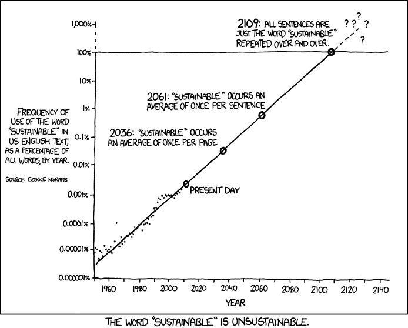

#  {.unnumbered}

*Christoph Bader*

Woher stammen das Konzept, das Leitbild und die Leitprinzipien der Nachhaltigen Entwicklung? Wie ist das Konzept entstanden, wie hat es sich entwickelt – und warum? Die folgenden Ausführungen geben einen Überblick über die Geschichte der Nachhaltigkeit, den politischen Hintergrund sowie zentrale Konferenzen und Dokumente. Kurz gesagt: was hat Nachhaltigkeit zu dem gemacht, was sie heute ist. Es geht darum, das grosse Ganze zu erkennen. Denn nur wer die Vergangenheit kennt, kann die Zukunft einschätzen.

Nachhaltigkeit war in den letzten Jahren das Schlagwort schlechthin – von der Wissenschaft über die Politik und Wirtschaft bis hin zu den Medien. Der Begriff hatte zunächst eine positive Konnotation, da er mit dem Langfristigen, dem Beständigen assoziiert wird, und heute gilt vieles als „nachhaltig“: Kaffee, Unternehmensphilosophien, sogar Thunfischpizzen. Das sind die Ansprüche einer Konsumgesellschaft mit einem beträchtlichen – aber rücksichtslosen – Appetit auf Überfluss. Gleich morgens entfernt das Shampoo „nachhaltig“ unsere Schuppen. Dann fahren wir zur Arbeit in ein Unternehmen, das sich seiner „nachhaltigen Unternehmensphilosophie“ rühmt, und beim Mittagessen diskutieren wir über nachhaltige Investitionen. Zuhause schieben wir eine Thunfischpizza in den Ofen – natürlich nachhaltig gefischt und produziert, wie es auf der Packung steht.

Heute ist der Begriff Nachhaltigkeit allgegenwärtig: Er wird im Zusammenhang mit Energie, Mobilität, Gebäudesanierung, Ernährung, Bevölkerungsentwicklung, betrieblichem Umweltmanagement und Klimaschutz verwendet. Auch in Kunst, Kultur, Design und Werbung findet er Verwendung.

{#fig-word-sustainable}

Ist der Begriff „Nachhaltigkeit“ inzwischen so überstrapaziert, dass er langsam bedeutungslos wird? Selbst wenn dem so wäre, sollten wir zentrale Begriffe wie diesen nicht leichtfertig aufgeben. So ist es beispielsweise nach wie vor wichtig, dass Unternehmen eine Nachhaltigkeitsstrategie haben – auch wenn viele solcher Strategien unzureichend sind oder auf Greenwashing hinauslaufen. Wir müssen die Bedeutung von „Nachhaltigkeit“ klären und diejenigen, die den Begriff verwenden, zur Rechenschaft ziehen. Unsere Interpretation sollte sich dabei auf wissenschaftliche Erkenntnisse und historische Entwicklungen stützen.

Die historischen Vorläufer des in diesem Lehrbuch erläuterten Nachhaltigkeitsleitbildes sind: Beginn der Diskussion über Nachhaltigkeit:

-   Beginn der Diskussion um Nachhaltigkeit: Carlowitz\` Waldbewirtschaftungsprinzip 1713

-   Zusammenprall von Ökonomie und Ökologie

-   Erste und zweite UN-Dekade für Entwicklung

-   Grenzen des Wachstums 1972

-   Brundtland-Bericht 1987

-   Rio Gipfel 1992

-   Agenda 21

-   Milleniumsziele der UN (MDG)

-   Agenda 2030 mit den Nachhaltigkeitszielen (SDG)








