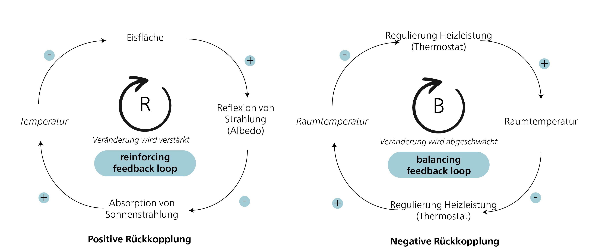
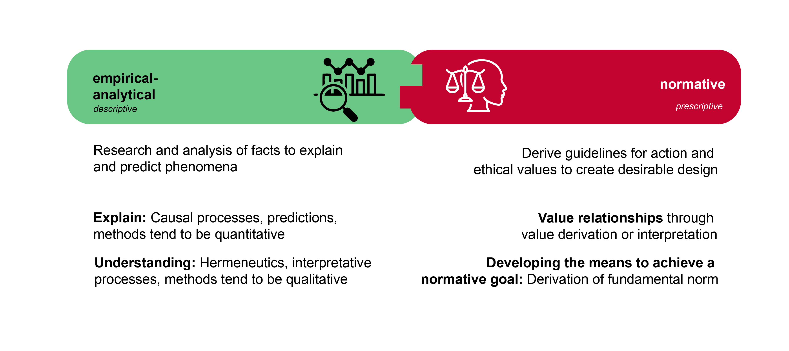
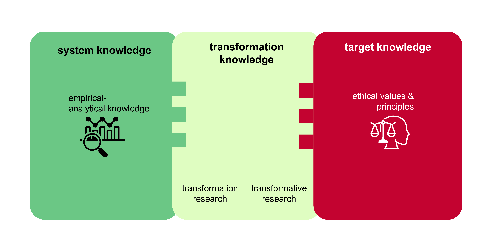

## Nachhaltigkeit als wissenschaftliche Disziplin

Was bedeutet „nachhaltig"? Man könnte argumentieren, dass Nachhaltigkeit das möglichst lange Bestehen und Funktionieren von Strukturen unterschiedlicher Komplexität bedeutet. In der Welt gibt es tatsächlich viele Strukturen, die über vergleichsweise lange Zeiträume existieren, wie etwa Atome, bestimmte Ökosysteme, das Leben auf der Erde als Ganzes oder Planetensysteme und Galaxien. Aber warum sind manche Strukturen relativ stabil und können „nachhaltig" existieren, obwohl sie regelmässigen Störungen ausgesetzt sind, die ihre Existenz oder Funktion gefährden? Gibt es Prinzipien oder Mechanismen, die das fortdauernde Bestehen dieser vielfältigen Systeme erklären können? Und falls ja – könnten menschliche Gesellschaften von diesen Prinzipien lernen?

Bereits Mitte des 20. Jahrhunderts begannen Wissenschaftler*innen zu erkennen, dass grundlegende Prinzipien alle Aspekte des Seins miteinander verbinden und die Ordnung und Dynamik des Universums prägen. Eine Schlüsselfigur in diesem Bereich war Karl Ludwig von Bertalanffy (1901–1972). Seine Forschungen begannen mit Überlegungen zur „Formbildung" in der Natur (1928), die er in Publikationen zur Struktur des Lebens (1937), zu Molekülen und Organismen (1940) und zur Biologie (1949) weiterentwickelte. Im Jahr 1950 stellte er eine Theorie offener Systeme in Physik und Biologie vor, ein Konzept, das die Entwicklung der Biophysik, des Fliessgleichgewichts und moderner Entwicklungstheorien entscheidend beeinflusste. Sein wegweisendes Werk „General System Theory" erschien 1968.

Die Systemtheorie legte das Fundament für eine revolutionäre Weltsicht, die nicht nur Erklärungsansätze für die Entwicklung und Funktion sogenannter Systeme lieferte, sondern auch isoliertes Wissen aus unterschiedlichen Disziplinen zusammenführte. Im Jahr 1975 unterschied Ervin Laszlo in einem bedeutenden Beitrag zur Systemtheorie sieben verschiedene Systemtypen (physikalisch-chemische und biologische Systeme, Organsysteme, sozioökologische und soziokulturelle Systeme sowie organisatorische und technische Systeme). Heute bildet die Systemtheorie die Grundlage für Modelle zur Entwicklung komplexer Systeme und für die Kybernetik, die sich mit der Steuerung von Systemen befasst. Der Bericht des Club of Rome nutzte die Systemtheorie, um das Wachstum von Prozessen im Kontext positiver Rückkopplungen zu analysieren.

### Systemische Effekte: Eskalation und Rückkopplungen

In der Systemtheorie werden die Mechanismen positiver und negativer Rückkopplung genutzt, um die Dynamik und Stabilität von Systemen zu erklären. Positive Rückkopplungen verstärken Veränderungen in einem System, während negative Rückkopplungen dazu neigen, Veränderungen auszugleichen und das System in einen stabilen Zustand zurückzuführen.

{#fig-feedback}

Ein Beispiel für **positive Rückkopplung** im Zusammenhang mit dem beschleunigten Schmelzen des arktischen Meereises ist die sogenannte Albedo-Verstärkung. Das arktische Eis reflektiert einen grossen Teil der Sonnenstrahlung zurück ins Weltall, wodurch weniger Wärme vom Ozean aufgenommen wird. Wenn das Eis jedoch schmilzt, wird weniger Sonnenlicht reflektiert, da das dunklere Meerwasser mehr Wärme absorbiert. Dies erwärmt das Meerwasser weiter und das verbleibende Eis schmilzt noch schneller. Dieser Prozess verstärkt sich selbst: Weniger Eis führt zu einer geringeren Albedo, was wiederum zu einer stärkeren Absorption von Sonnenlicht und weiterem Schmelzen führt. Diese positive Rückkopplung hat gravierende Auswirkungen auf das Klimasystem, da das schwindende arktische Meereis zu einem schnelleren Anstieg des Meeresspiegels und zu Veränderungen in ozeanischen und atmosphärischen Zirkulationsmustern führen kann. Das Ausmass und die Geschwindigkeit dieser Entwicklung überraschten die Wissenschaft [@stroeveArcticSeaIce2007].

Ein Beispiel für **negative Rückkopplung** ist ein Thermostat, der die Temperatur in einem Raum reguliert. Steigt die Raumtemperatur über den eingestellten Maximalwert, erkennt der Thermostat dies und aktiviert die Klimaanlage, um die Temperatur zu senken. Sobald die Temperatur den eingestellten Wert erreicht, schaltet der Thermostat die Klimaanlage ab. Dieser Regelkreis sorgt dafür, dass die Raumtemperatur auf einem konstanten Niveau gehalten wird.

Positive und negative Rückkopplungen wirken oft gemeinsam und können komplexes Verhalten in Systemen hervorrufen. Das Verständnis dieser Rückkopplungsmechanismen ermöglicht es, die Interaktionen und das Verhalten von Systemen besser zu analysieren und vorherzusagen.

## Nachhaltigkeitswissenschaft: Entstehung und Verständnis

Ein aufkommendes Problembewusstsein – nicht zuletzt beeinflusst durch die Veröffentlichung *The Limits to Growth* [@meadowsLimitsGrowthReport1972a] – führte zu verstärkter Forschung über globale Umweltprobleme. Drei grosse internationale Forschungsprogramme sind hierbei besonders bemerkenswert: 1) das *International Geosphere-Biosphere Programme* (IGBP) von 1987 bis 2015, 2) das *World Climate Research Programme* (WCRP), gegründet 1980, und 3) das International Research Programme on Biodiversity (DIVERSITAS), gegründet 1991 und 2014 in *Future Earth* umbenannt. Diese Programme haben nicht nur wichtige Grundlagenforschung initiiert – sie gaben auch wesentliche Impulse für eine stärkere Berücksichtigung der Ergebnisse in der Politik, wie sie sich etwa im Brundtland-Bericht der Vereinten Nationen und in der Agenda 21 widerspiegeln. Besonders hervorzuheben ist, dass diese Forschungsprogramme erstmals systematisch zuvor getrennte Disziplinen der Naturwissenschaften zusammenführten, auch wenn die Wechselwirkungen zwischen Gesellschaft und Umwelt weitgehend unberücksichtigt blieben. Als das Bewusstsein für die Verflechtung dieser Themen zunahm, wurden insbesondere in den USA mehrere Forschungsprojekte initiiert, die diese Integration vorantrieben.

> „Ein neues Feld der Nachhaltigkeitswissenschaft entsteht, das versucht, den grundlegenden Charakter der Wechselwirkungen zwischen Natur und Gesellschaft zu verstehen. Ein solches Verständnis muss das Zusammenwirken globaler Prozesse mit den ökologischen und sozialen Besonderheiten bestimmter Orte und Sektoren umfassen." [@katesSustainabilityScience2001, pp. 641]

Das Konzept der Nachhaltigkeitswissenschaft wurde 2001 auf dem Kongress „Challenges of a Changing Earth" in Amsterdam offiziell eingeführt – durch den International Council for Science (ICSU), das oben genannte IGBP, das International Human Dimensions Programme on Global Environmental Change (IHDP) und das oben genannte WCRP. Der deutschsprachige Begriff „Nachhaltigkeitswissenschaft" geht auf eine Übersetzung aus dem Englischen zurück.

### Verständnis der Nachhaltigkeitswissenschaft

Ein häufig verwendetes Motto – „Die Gesellschaft hat Probleme – die Universitäten haben Disziplinen" – verdeutlicht die konventionelle Struktur der Wissenschaft in verschiedene Fachrichtungen. Disziplinäre Wissenschaft scheint jedoch unzureichend gerüstet zu sein, um die Herausforderungen Nachhaltiger Entwicklung zu bewältigen. Zwei Hauptansätze zum Verständnis der Nachhaltigkeitswissenschaft haben sich herausgebildet: Einerseits wird sie als eigenständige Disziplin mit eigenen Theorien und Methoden betrachtet, andererseits als ein Zusammenschluss verschiedener Disziplinen, die sich auf ein gemeinsames Thema konzentrieren [@clarkSustainabilityScienceEmerging2003]. Während der erste Ansatz noch nicht als zutreffend gilt, besteht weitgehend Einigkeit darüber, dass die Nachhaltigkeitswissenschaft als Plattform verstanden werden sollte, auf der Wissenschaft, Praxis und Visionen zusammenkommen – und die Beiträge aus dem gesamten Spektrum der Natur-, Wirtschafts- und Sozialwissenschaften integriert [@martensSustainabilityScienceFiction2006, pp. 38].

Die Nachhaltigkeitswissenschaft unterscheidet sich in zwei zentralen Punkten: Erstens ist sie – im Gegensatz zur traditionellen („Mode 1") Forschung – nicht durch ein originäres wissenschaftliches Programm getrieben. Stattdessen wird sie durch das normative Konzept der Nachhaltigkeit geleitet und nutzt dieses als Rahmen für wissenschaftliche Analysen. Zweitens unterscheidet sie sich als eigenständiger Typ problemorientierter Forschung sowohl von Grundlagen- als auch von angewandter Forschung. @clarkSustainabilityScienceRoom2007 prägte hierfür den Begriff der „anwendungsorientierten Grundlagenforschung", die darauf abzielt, neues Wissen zu generieren und gleichzeitig dessen potenzielle Anwendungen zu berücksichtigen.

| **Mode-1-Wissenschaft** | **Mode-2-Wissenschaft**              |
|:------------------------|:-------------------------------------|
| Akademisch              | Akademisch und gesellschaftlich      |
| Monodisziplinär         | Trans- und interdisziplinär          |
| Technokratisch          | Partizipativ                         |
| Gewiss                  | Unsicher                             |
| Prädiktiv               | Explorativ                           |

: Mode-1- und Mode-2-Wissenschaft. Quelle: Basierend auf @gibbonsNewProductionKnowledge2010 und @martensSustainabilityScienceFiction2006. {#tbl-modes-science}

### Empirisch-analytisch versus normativ

Da Nachhaltige Entwicklung ein normatives Leitbild ist, ist es wichtig, zwischen deskriptiver (empirisch-analytischer) und präskriptiver (normativer) Forschung zu unterscheiden. Deskriptive Aussagen beschreiben den aktuellen Zustand („Sein"), während normative Aussagen den idealen Zustand („Sollen") darstellen. Im Alltag wird diese Unterscheidung zwischen „Sein" und „Sollen" oft nicht wahrgenommen, doch für die Wissenschaft ist sie von entscheidender Bedeutung.

{#fig-emprical-analytical_normative}

Es ist wichtig zu beachten, dass „Sein"- und „Sollen"-Aussagen unterschiedliche Qualitäten und Gegenstandsbereiche haben und nicht ohne weitere Erklärung miteinander verknüpft werden können. Dieses Verständnis bildet die Grundlage von Humes Gesetz, das besagt, dass normative Aussagen darüber, „was sein soll", nicht aus deskriptiven Aussagen darüber, „was ist", abgeleitet werden können. Ein drastisches Beispiel: Die Tatsache, dass täglich rund 24.000 Menschen verhungern, erlaubt keinerlei Schluss darüber, ob dies gut oder schlecht ist. Ohne eine Bewertung kann keine normative Aussage darüber getroffen werden, ob dies verhindert werden sollte. Hume wies darauf hin, dass viele Wissenschaftler*innen seiner Zeit diese entscheidende Unterscheidung häufig vernachlässigten – und dies gilt bis heute:

> „In every system of morality, which I have hitherto met with, I have always remark'd, that the author proceeds for some time in the ordinary ways of reasoning, and establishes the being of a God, or makes observations concerning human affairs; when of a sudden I am surpriz'd to find, that instead of the usual copulations of propositions, is, and is not, I meet with no proposition that is not connected with an ought, or an ought not. This change is imperceptible; but is however, of the last consequence. For as this ought, or ought not, expresses some new relation or affirmation, 'tis necessary that it shou'd be observ'd and explain'd; and at the same time that a reason should be given; for what seems altogether inconceivable, how this new relation can be a deduction from others, which are entirely different from it... \[I\] am persuaded, that a small attention wou'd subvert all the vulgar systems of morality, and let us see, that the distinction of vice and virtue is not founded merely on the relations of objects, nor is perceiv'd by reason." [@humeTreatiseHumanNature1739, Book 3, Part 1, Section 1]

Die Erkenntnis, dass sich Sein- und Soll-Aussagen unterscheiden, bedeutet nicht, dass Wissenschaftler*innen keine Soll-Aussagen machen dürfen. Vielmehr bedeutet sie, dass aufgrund der epistemologischen Unterschiede zwischen den beiden Kategorien bestimmte Regeln gelten müssen, wenn sie miteinander verknüpft werden. Hume versuchte, die Beziehung zwischen diesen beiden Aussagearten durch sogenannte „Brückenprinzipien" herzustellen. Max Weber formalisierte diese Überlegungen weiter, indem er die Brückenprinzipien durch das Konzept der „Wertbeziehungen" ersetzte. Webers Forderung nach Wertfreiheit (bzw. Wertneutralität) in der empirischen Wissenschaft ergibt sich aus seiner Beobachtung, dass es eine klare Unterscheidung zwischen Tatsachenfragen („Sein") und Wertfragen („Sollen") gibt (Weber 1999, S. 245 f., 509 f.). Er argumentierte, dass es nicht Aufgabe der empirischen Wissenschaften sei, Werturteile zu fällen. Wenn Wissenschaftler*innen die analytische Trennung zwischen ihren persönlichen Werten und ihren Forschungszielen nicht vollziehen, könne dies die Fähigkeit der Wissenschaft gefährden, überprüfbare und sinnvolle Ergebnisse zu erzeugen (Weber 1999, S. 150 f.; Strauss 1953). Dies könnte wiederum zu einer Verwischung der Grenzen zwischen wissenschaftlichem Wissen und Wissen aus Politik, Religion oder Alltagsdiskussionen führen.

Webers Forderung nach Wertfreiheit in der empirischen Wissenschaft wurde häufig missverstanden (Jonas 1980, S. 189 f.; Weber 1999, S. 499 f.). Sie bedeutet nicht, dass Forschung ohne Werte auskommen sollte. (Ausserwissenschaftliche) Werte haben in der empirischen Forschung – insbesondere im Kontext Nachhaltiger Entwicklung – auf verschiedene Weise ihren Platz:

-   **Werte können Forschungsgegenstand sein:** Werte spielen beispielsweise im Bereich der Umwelt- und Nachhaltigkeitspsychologie eine zentrale Rolle. In Diskussionen über Lebensstile und subjektives Wohlbefinden untersuchen Forschende die persönlichen Werte und Überzeugungen von Individuen.

-   **Werte beeinflussen die Wahl des Forschungsthemas:** Werte wirken sich auf die Auswahl von Forschungsgegenständen und Fragestellungen (Erkenntnisinteresse) und damit auf die Ausrichtung der Forschung aus. Dies ist besonders relevant in anwendungsorientierter und transdisziplinärer Forschung, in der die Bedürfnisse und Informationen relevanter gesellschaftlicher Akteur*innen in den Forschungsprozess integriert werden, beispielsweise durch *joint problem framing* oder *participatory vision development* [@schneiderHowCanScience2019].

-   **Wertinterpretationen sollten klar benannt werden:** Forschende können Wertbeziehungen herstellen oder Wertinterpretationen vornehmen (vgl. Weber 1999, S. 522). Eine Wertinterpretation, angelehnt an die hermeneutische Methode, konkretisiert die Bedeutung übergeordneter Wertvorstellungen und leitet daraus logische Werte und Normen ab. Beispielsweise können Forschende die SDGs analysieren, indem sie die den Zielen Nachhaltiger Entwicklung zugrunde liegenden Werte untersuchen. Weitere Beispiele sind Normen, die aus dem Gerechtigkeitsbegriff abgeleitet werden – wie etwa die Norm der menschlichen Verantwortung gegenüber der Umwelt, der sozialen Mitwelt und uns selbst [vgl. @michelsenNachhaltigeEntwicklungHintergruende2014, pp. 25; @schneiderHowCanScience2019]. Wichtig ist, den ursprünglichen Wert explizit zu machen.

-   **Zweck-Mittel-Schlüsse:** Die Forschung zur Nachhaltigen Entwicklung stützt sich häufig auf Werturteile, um evidenzbasierte Lösungen zu entwickeln. Dies ist vergleichbar mit der Politikwissenschaft, in der normative Theorien darauf abzielen, eine optimale – d. h. gerechte – Staatsform zu entwerfen, basierend auf der positiven Bewertung dessen, was eine gerechte Gesellschaft ausmacht. Die Wissenschaft kann den Wert von Gerechtigkeit nicht beweisen, aber sie kann Strategien und Mittel entwickeln, um dieses gewünschte Ziel zu erreichen. Diese Beziehung zwischen Zweck und Mitteln stellt eine logische Verbindung zwischen Werten und normativen Aussagen dar. Der übergeordnete Zweck wird durch ausserwissenschaftliche Werte bestimmt. Forschende müssen diese Beziehung klar benennen und ihre Mittel entsprechend formulieren. Ein solcher Zweck-Mittel-Zusammenhang könnte etwa so aussehen: „Um Ziel X zu erreichen, ist Y unter den Bedingungen b1, b2 und b3 das erfolgreichste Mittel." Nachhaltige Entwicklung kann als eine ausserwissenschaftlich gegebene Fundamentalnorm betrachtet werden. Wenn die Forschung beispielsweise Aussagen darüber treffen will, wie Nachhaltige Entwicklung durch Solarenergie erreicht werden kann, könnte sie folgendermassen vorgehen: „Die Umstellung auf eine solare Produktionsweise könnte ein vielversprechender Weg sein, Nachhaltige Entwicklung zu erreichen. Dies würde Produktion und Verteilung entsprechend den Bedürfnissen vieler Menschen organisieren, soziale Ungleichheiten minimieren und Bedingungen für individuelles Wohlbefinden schaffen."

## Wissensarten für die Nachhaltige Entwicklung

Die Nachhaltigkeitsforschung befasst sich mit Herausforderungen, die die langfristige Sicherung der gesellschaftlichen Entwicklungsbedingungen bedrohen. Im Kontext der Nachhaltigen Entwicklung als gesamtgesellschaftlicher Aufgabe beschreibt das Forum für Klima und Globalen Wandel der Akademie der Naturwissenschaften Schweiz drei verschiedene Wissensarten [@proclimResearchSustainabilityGlobal1997]: System-, Ziel- und Transformationswissen. Diese drei Wissensarten lassen sich drei grundlegenden Ebenen zuordnen: 1) der analytischen Ebene, die auf die Generierung von Systemwissen abzielt, 2) der normativen Ebene, die Ziel- und Orientierungswissen entwickelt, und 3) der operativen Ebene, die auf die Erzeugung von Gestaltungs- bzw. Transformationswissen ausgerichtet ist. @fig-Three-Knowledge-Types zeigt die drei Wissensarten in Relation zu empirisch-analytischer und normativer Forschung.

{#fig-Three-Knowledge-Types}

**Systemwissen** bezieht sich auf das Verständnis des aktuellen Zustands. Im Kontext Nachhaltiger Entwicklung untersucht die Forschung relevante Strukturen und Prozesse, beschreibt und erklärt deren Komplexität und Dynamik. Dabei kommen verschiedene Methoden zum Einsatz, darunter qualitative und quantitative Ansätze, Mixed-Methods-Verfahren, Experimente und systemdynamische Ansätze. Ebenso werden Prognosen, Rückblicke und Szenarioanalysen genutzt. Die meisten Studien, die Systemwissen erzeugen, fallen in den Bereich der empirischen Forschung.

**Transformationswissen** ist das Wissen darüber, wie wir vom aktuellen Zustand („Sein") zum gewünschten Zustand („Sollen") gelangen können. Dies erfordert eine Integration von System- und Zielwissen. Mit anderen Worten: Die Forschung sucht nach nachweislich wirksamen Lösungen für die im Kontext Nachhaltiger Entwicklung identifizierten Probleme. Es gibt viele Methoden, um Transformationswissen zu generieren.

Forschung über Transformationen, also über Veränderungen in der gesellschaftlichen Organisation auf verschiedenen Ebenen, kann sowohl empirisch als auch normativ sein. Forschung, die sich mit vergangenen und gegenwärtigen Transformationen befasst, ist empirisch, während Forschung, die auf konkrete Ziele abzielt, normativ ist. Entsprechend unterscheidet der Wissenschaftliche Beirat der Bundesregierung Globale Umweltveränderungen (WBGU) zwischen „Transformationsforschung" und „transformativer Forschung".

Ein weiteres im Kontext von Transformationen betontes Konzept ist die „transformative Bildung", die darauf abzielt, Fähigkeiten für ein umfassendes und vielschichtiges Verständnis von Veränderungsprozessen zu fördern [@schneidewindTransformativeLiteracyGesellschaftliche2013]. Ziel transformativer Bildung ist es, die Reflexionsfähigkeit der Gesellschaft zu stärken – sowohl in Bezug auf die Beobachtung als auch auf die aktive Mitgestaltung von Transformationsprozessen.

**Zielwissen** bezieht sich auf das Wissen darüber, was erreicht und was vermieden werden sollte. Normative Forschung ist in diesem Zusammenhang von besonderer Bedeutung. Es geht darum, die Werte Nachhaltiger Entwicklung zu interpretieren und zu konkretisieren sowie weitere Normen daraus abzuleiten. Ebenso relevant ist die Forschung zur Festlegung von Schwellenwerten wie auch die Entwicklung von Methoden für Bewertungen und Visionierungsprozesse [vgl. @swartProblemFutureSustainability2004; @wiekQualityCriteriaVisions2014a]. Zielwissen gibt uns die Antwort auf die Frage, was wir transformieren sollten. Die Studienprogramme des CDE orientieren sich dabei vor allem an folgenden Konzeptionen von Zielwissen für ein nachhaltiges Wirtschafts- und Gesellschaftssystem:

-   Die Prinzipien Nachhaltiger Entwicklung
-   Die Agenda 2030 und die SDGs (2015)
-   Das WBGU-Hauptgutachten *Welt im Wandel: Gesellschaftsvertrag für eine Grosse Transformation* (2011)
-   Der Global Sustainable Development Report GSDR (2019)
