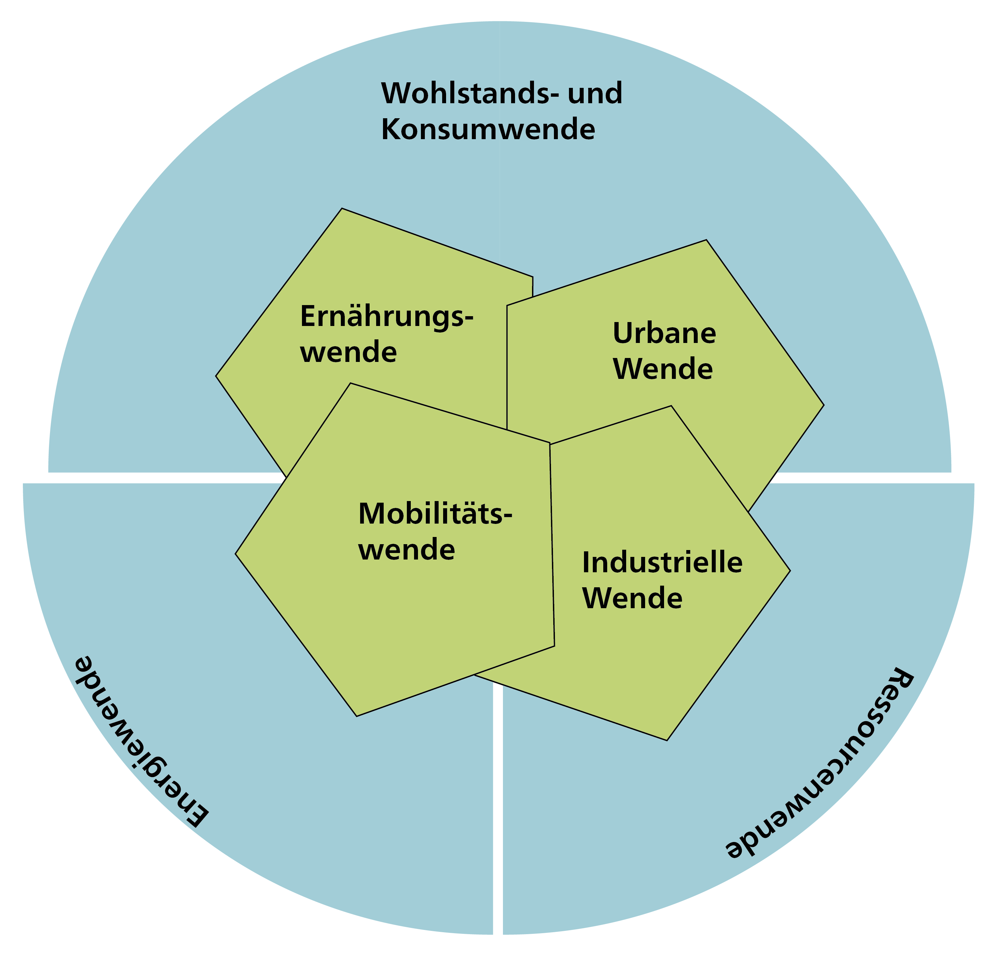
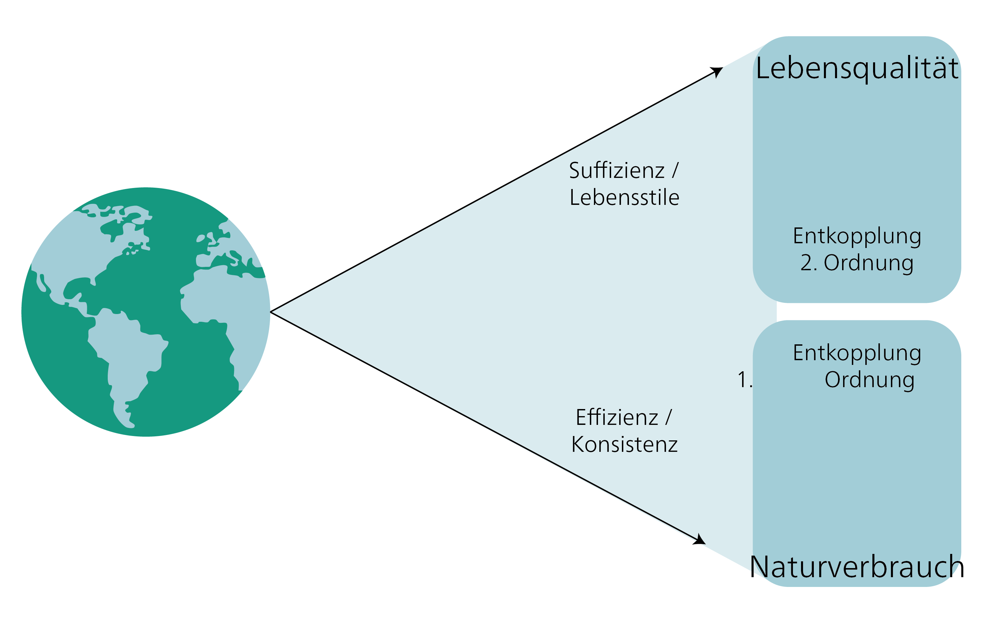

## Die Debatte über die Grosse Transformation

Konzepte der „Grossen Transformation" beziehen sich auf grundlegende Veränderungen in sozialen, wirtschaftlichen, politischen und ökologischen Systemen, die notwendig sind, um eine nachhaltige und gerechte Gesellschaft zu schaffen.

„Grosse Transformation" war ein Begriff, den Karl Polanyi in seiner Analyse von 1944 verwendete, wonach der Übergang zu einem freien Markt im 19. Jahrhundert tiefgreifende soziale, wirtschaftliche und politische Veränderungen mit sich brachte, die das Leben der Menschen und ihre Beziehung zur Natur grundlegend veränderten. Polanyi argumentierte, dass ungezügelte Marktdynamiken soziale und ökologische Probleme verursachten und dass die Gesellschaft Mechanismen entwickeln müsse, um diese Probleme zu regulieren und auszugleichen. Ähnlich betonen heutige Konzepte der Grossen Transformation die Bedeutung von Regulierung, Umverteilung und der Entwicklung alternativer Wirtschaftsmodelle zur Schaffung einer nachhaltigen und gerechten Gesellschaft. Während Polanyi die Notwendigkeit sozialer Schutzmassnahmen und die Bedeutung der Integration von Märkten in gesellschaftliche Strukturen betonte, zielen aktuelle Konzepte der Grossen Transformation zusätzlich darauf ab, Produktions- und Konsummuster grundlegend zu verändern, um die Umweltbelastung zu reduzieren.

### WBGU-Hauptgutachten: *Welt im Wandel*

Das Hauptgutachten des Wissenschaftlichen Beirats der Bundesregierung Globale Umweltveränderungen [@wbguWorldTransitionSocial2011], *Welt im Wandel*, ist eine wichtige Publikation, die sich mit den Herausforderungen und Chancen einer nachhaltigen Transformation der Gesellschaft befasst. Es wurde erstmals 1994 veröffentlicht und seitdem mehrfach aktualisiert. Das Gutachten analysiert globale Umweltveränderungen, darunter Klimawandel, Biodiversitätsverlust und Ressourcenverbrauch, und schlägt konkrete Politiken und gesellschaftliche Veränderungen zur Förderung einer Nachhaltigen Entwicklung vor.

*Welt im Wandel* ist für die Debatten über die Grosse Transformation bedeutsam, da es für eine weitreichende Transformation von Wirtschaft, Politik und Gesellschaft plädiert. Diese Vision geht über blosse Anpassung hinaus und fordert grundlegende Veränderungen in den Strukturen und Mustern wirtschaftlicher Aktivität und des Alltagslebens. Das Gutachten unterstreicht die Dringlichkeit, den Übergang zu einer klimafreundlichen und umweltverträglichen Wirtschaft und Lebensweise voranzutreiben. Es betont die entscheidende Rolle einer umfassenden Nachhaltigkeitspolitik. Schliesslich identifiziert es Innovation, Technologie, Bildung, institutionelle Reformen und internationale Zusammenarbeit als zentrale Hebel zur Erreichung Nachhaltiger Entwicklung.

![Neuer Gesellschaftsvertrag. Quelle: @wbguWorldTransitionSocial2011 [pp. 275].](images/WBGU-social-contract.png){#fig-new-social-contract}

In Kapitel 8 unterscheidet *Welt im Wandel* zwischen zwei Konzepten: „Transformationsforschung und -bildung" sowie „transformative Forschung und Bildung". Diese Konzepte sind entscheidend für die Förderung eines grundlegenden Wandels hin zur Nachhaltigkeit.

*Transformationsforschung* analysiert Veränderungsprozesse, insbesondere im Kontext Nachhaltiger Entwicklung. Sie versucht, die Dynamik und Komplexität von Transformationen zu verstehen und mögliche Handlungspfade für eine nachhaltige Zukunft zu identifizieren. Transformationsforschung bietet eine inter- und transdisziplinäre Perspektive und bindet verschiedene Akteur\*innen und Interessengruppen in den Forschungsprozess ein.

*Transformationsbildung* ist eine Bildung, die darauf abzielt, das Wissen, die Fähigkeiten und die Werte zu vermitteln, die für eine nachhaltige Transformation der Gesellschaft erforderlich sind. Sie umfasst formale und informelle Bildungsmassnahmen, die es Menschen ermöglichen, aktiv an Transformationsprozessen teilzuhaben und nachhaltiges Denken und Handeln zu fördern.

*Transformative Forschung* generiert nicht nur Wissen, sondern geht einen Schritt weiter und strebt aktiv einen Wandel hin zur Nachhaltigkeit an. Sie zielt damit darauf ab, die gesellschaftliche Praxis zu beeinflussen und Lösungen und Innovationen für eine Nachhaltige Entwicklung zu entwickeln. Transformative Forschung arbeitet eng mit Partner\*innen aus der Praxis zusammen und bemüht sich darum, Wissen in Handeln zu übersetzen.

*Transformative Bildung* fördert eine Verschiebung von Denkweisen, Werten und Verhaltensweisen hin zur Nachhaltigkeit. Sie geht über die blosse Wissensvermittlung hinaus, indem sie auch kritisches Bewusstsein, Empathie und Handeln für nachhaltige Veränderungen in der Gesellschaft fördert.

Der WBGU ist der Ansicht, dass der Staat Aufgaben übernehmen sollte, die von Einzelpersonen oder dem Privatsektor nicht ausreichend erfüllt werden. Er erkennt an, dass der Staat eine entscheidende Rolle bei der Schaffung von Rahmenbedingungen und der Gestaltung politischer Massnahmen zur Förderung Nachhaltiger Entwicklung spielt. Der Staat kann innovative Lösungen vorantreiben, Investitionen lenken, Regelungen etablieren und Politiken umsetzen, die eine nachhaltige Transformation ermöglichen.

> „Das Wichtige für die Regierung ist nicht, Dinge zu tun, die Einzelpersonen bereits tun, und diese ein bisschen besser oder ein bisschen schlechter zu tun; **sondern die Dinge zu tun, die derzeit überhaupt nicht getan werden**." John M. Keynes, The End of Laissez-Faire, 1926

Der WBGU betont jedoch auch, dass ein wirksames staatliches Handeln in Zusammenarbeit mit anderen Akteur\*innen und Interessengruppen erfolgen sollte, darunter Zivilgesellschaft, Privatwirtschaft und Wissenschaft. Die gemeinsame Gestaltung einer nachhaltigen Zukunft bedeutet, Partnerschaften zu schaffen und unterschiedliche Expertise einzubeziehen.

### Schneidewinds „Kunst der Zukunft"

Der deutsche Ökonom und Politiker Uwe Schneidewind erörtert das Konzept der Grossen Transformation in seinem 2018 erschienenen Buch *Die grosse Transformation: Eine Einführung in die Kunst des gesellschaftlichen Wandels*. @schneidewindGrosseTransformationEinfuhrung2018 stellt fest, dass eine Grosse Transformation nicht durch unaufhaltsame Entwicklungsdynamiken moderner Gesellschaften oder durch einen technokratischen Entwurf für eine ökologisch gerechte Gesellschaft vorgegeben ist. Stattdessen sieht er sie als einen Prozess, der von vielen Akteur\*innen aktiv gestaltet werden sollte. Deshalb ist es wichtig, einen klar definierten normativen Kompass zu haben und die Fähigkeit zu entwickeln, komplexe soziale, kulturelle, wirtschaftliche und technologische Prozesse zu navigieren. Er beschreibt diese Fähigkeit als die „Kunst der Zukunft" – die Fertigkeit, wünschenswerte Zukünfte möglich zu machen – und schlägt damit eine Brücke zu Harald Welzers FUTURZWEI. Welzer, ein Psychologe und Soziologe, betont die Bedeutung von Vorstellungskraft, Kreativität und Engagement bei der Herbeiführung transformativer Veränderungen und der Entwicklung alternativer Zukunftsvisionen.

{#fig-turningpoints}

Für @schneidewindGrosseTransformationEinfuhrung2018 hat die Grosse Transformation sieben transformative Wendepunkte. Die vier Dimensionen der „Kunst der Zukunft" (technologisch, wirtschaftlich, kulturell, institutionell) finden sich in allen sieben Wendepunkten wieder. Ressourcen- und Energietransformationen sind grundlegend. Gemäss dem Konzept der „doppelten Entkopplung" sind sie jedoch ohne eine umfassende Transformation der Vorstellungen von Wohlstand und Konsum nicht denkbar. Die gewünschte Transformation ist in spezifischeren Sektoren leichter vorstellbar, wie Mobilität, Ernährung, Städte und wichtige energie- und ressourcenintensive Industrien.

{#fig-double-decoupling}

„Entkopplung" bezeichnet die Trennung wirtschaftlicher Aktivität von Umweltauswirkungen. Als zentrales Konzept in der Nachhaltigkeitsdebatte besagt die **doppelte Entkopplung**, dass Nachhaltige Entwicklung nur durch Steigerungen der technologischen Effizienz in Kombination mit neuen Wohlstands- und Konsummodellen erreicht werden kann. Sie zielt darauf ab, ein umfassenderes und systemisches Verständnis von Innovation zu fördern, das sowohl technologische als auch soziale Innovationen einschliesst.

Die doppelte Entkopplung bezieht sich auf die folgenden zwei Arten der Entkopplung:

-   Entkopplung erster Ordnung: Diese konzentriert sich auf die Steigerung der Ressourceneffizienz und -konsistenz innerhalb des traditionellen Wirtschaftswachstumsmodells, hauptsächlich durch technologische Fortschritte, und

-   Entkopplung zweiter Ordnung: Diese konzentriert sich auf „Suffizienz" und entkoppelt die Lebensqualität und ein „gutes Leben" vom traditionellen, am BIP gemessenen Wirtschaftswachstumsmodell.

### Global Sustainable Development Report

Im September 2019 wurde der erste Global Sustainable Development Report (GSDR) von einer Gruppe von 15 unabhängigen Wissenschaftler\*innen veröffentlicht, die vom UNO-Generalsekretär ernannt wurden. Der GSDR, der alle vier Jahre erscheinen soll, hat zum Ziel, bestehendes Wissen zu synthetisieren und Wege zur Erreichung der Ziele für Nachhaltige Entwicklung (SDGs) aufzuzeigen. Der jüngste Bericht [-@independentgroupofscientistsappointedbythesecretary-generalGlobalSustainableDevelopment2023] hebt die erhebliche Lücke zwischen dem aktuellen Fortschritt und der Erreichung der SDGs hervor. Aufbauend auf dem Bericht von 2019 führt er den Kapazitätsaufbau als neuen Hebel zur Beschleunigung des Fortschritts ein.

{#fig-GSDR}

Der GSDR schlägt sechs Schlüsselbereiche oder „Einstiegspunkte" mit dem grössten Potenzial vor, die notwendigen umfangreichen und raschen Transformationen voranzutreiben. Um diese Transformationen einzuleiten, ist eine aktive und vielseitige Zusammenarbeit zwischen Akteur\*innen aus verschiedenen Bereichen entscheidend: Governance, Wirtschaft und Finanzen, individuelles und kollektives Handeln sowie Wissenschaft und Technologie.

### Fazit

Konzepte der „Grossen Transformation"

-   halten es für notwendig und möglich, die gesellschaftliche Entwicklung in Richtung Nachhaltigkeit zu steuern.

-   sind ganzheitliche Konzepte zur Steuerung der gesellschaftlichen Entwicklung. Sie schlagen Einstiegspunkte in verschiedenen Bereichen der Gesellschaft und auf mehreren Handlungsebenen vor.

-   schlagen Schlüsselbereiche mit grosser Hebelwirkung vor (z. B. schlägt der WBGU eine Energietransformation, eine Stadttransformation, eine Landnutzungstransformation und transformative Bildung und Forschung vor).

::: {.callout-caution collapse="true"}
#### Weiterführende Literatur

- Polanyi, Karl. 1944. *The Great Transformation: The Political and Economic Origins of Our Time*. Beacon Press.
:::
