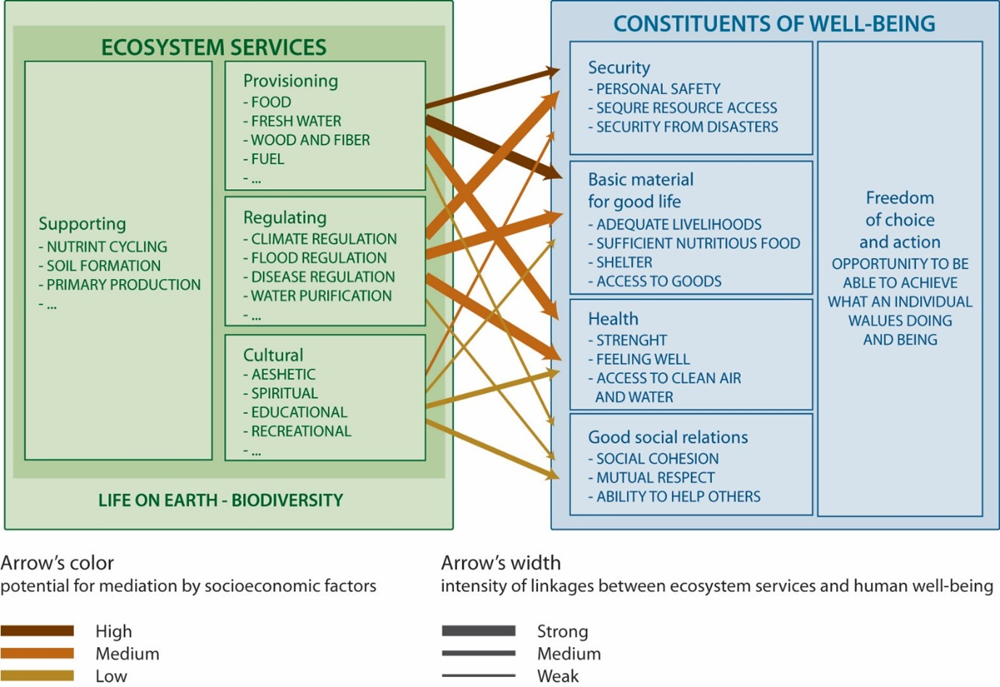
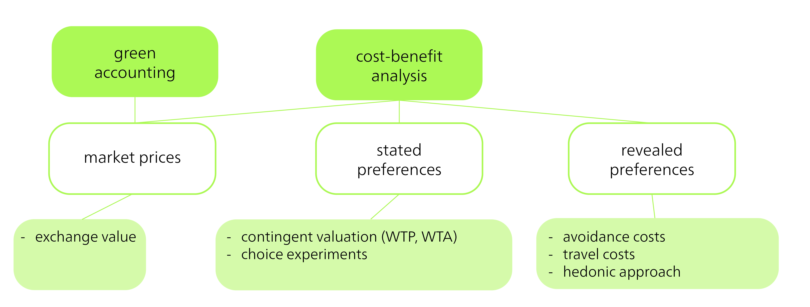

## Ökosysteme, Ökosystemmanagement und Ökosystemdienstleistungen

Ein Ökosystem ist eine Gruppe von Lebewesen und ihrer physischen Umgebung, die miteinander interagieren. Ökosysteme können klein sein, wie ein Blumentopf, oder gross, wie ein Ozean. Wenn ähnliche Ökosysteme in einer grösseren Region mit demselben Klima vorkommen, werden sie als Biome bezeichnet. Energie- und Materialflüsse sind wichtig für das Funktionieren eines Ökosystems. Einige dieser Flüsse, wie der Kohlenstoffkreislauf, finden auf globaler Ebene statt, während andere stärker lokalisiert sind. Die meisten Ökosysteme beziehen ihre Energie von der Sonne und können das Erdklima durch ihre Wechselwirkungen beeinflussen [@britannicaEcosystem2025].

Ökosystemdienstleistungen sind die Vorteile, die Menschen aus Ökosystemen wie Mangrovenwäldern, Ozeanen oder Feuchtgebieten ziehen. Zu den von Ökosystemen erbrachten Dienstleistungen gehören die Bereitstellung von sauberem Wasser, die Verhinderung von Überschwemmungen, die Förderung des Pflanzenwachstums und die Bereitstellung von Erholungsräumen. Das Millennium Ecosystem Assessment, das 2005 veröffentlicht wurde, unterteilt Ökosystemdienstleistungen in vier Kategorien (vgl. grüner Kasten in @fig-ecosystem): *Versorgungsdienstleistungen*, *Regulierungsdienstleistungen*, *kulturelle Dienstleistungen* und *Unterstützungsdienstleistungen* [@milleniumecosystemassessmentEcosystemsHumanWellBeing2005]. Die Unterstützungsdienstleistungen, bei denen es sich in erster Linie um grundlegende biophysikalische Prozesse handelt, ermöglichen und gewährleisten die anderen Dienstleistungen.

{#fig-ecosystem}

Laut @milleniumecosystemassessmentEcosystemsHumanWellBeing2005 können diese Ökosystemdienstleistungen unsere Lebensqualität und unsere Wirtschaft verbessern (vgl. blauer Kasten in @fig-ecosystem). Diese Betrachtungsweise von Ökosystemen sieht den Menschen zwar als von der Umwelt getrennt, betont aber die Relevanz von Ökosystemdienstleistungen für das menschliche Wohlergehen. Das Konzept der Ökosystemdienstleistungen zielt letztlich darauf ab, den Wert der Natur stärker in politische und wirtschaftliche Entscheidungen einzubeziehen. Das Konzept spielt jedoch auch in der Landschafts- und Raumplanung eine Rolle. Es wird beispielsweise genutzt, um zu analysieren, wie sich räumlich wirksame (rechtliche) Regelungen auf Ökosystemdienstleistungen und damit auf das menschliche Wohlergehen auswirken [vgl. @albertApplyingEcosystemServices2016].

::: {.callout-tip collapse="true"}
#### Fallstudie: Ökosystemdienstleistungen in Madagaskar

Diese Landschaft an der Ostküste Madagaskars bietet eine Fallstudie für Ökosystemdienstleistungen. Zu den Ökosystemdienstleistungen in diesem Gebiet gehören Brennholz, das von der lokalen Bevölkerung zum Kochen verwendet wird, und Reis, der ein Grundnahrungsmittel ist. Die Bezeichnung landwirtschaftlicher Produkte wie dieser als Ökosystemdienstleistungen verdeutlicht, dass sie erst durch menschliche Nachfrage zu „Dienstleistungen" werden. Ökosystemdienstleistungen sind in der Natur nicht per se gegeben: Sie stellen vielmehr eine Perspektive dar, durch die Menschen die Umwelt betrachten und beschreiben. Weitere Ökosystemdienstleistungen in dieser Landschaft umfassen den Wasserkreislauf, der für die lokale Bevölkerung lebenswichtig ist, da sie auf Flüsse als Trinkwasserquelle angewiesen ist. Wasser wird auch für die landwirtschaftliche Bewässerung und andere Zwecke genutzt. Die Klimaregulierung ist eine weitere bedeutende Dienstleistung, die sowohl lokal als auch global wichtig ist.

Diese Landschaft veranschaulicht klar, dass die Nachfrage nach Ökosystemdienstleistungen und deren Bedeutung je nach Person oder Gruppe variieren. Solche unterschiedlichen Ansprüche auf Ökosystemdienstleistungen aus demselben Land können zu **Interessenkonflikten** führen. Die Nachfrage nach landwirtschaftlichen Produkten oder Brennholz kann beispielsweise mit klimaregulierenden und biodiversitätsfördernden (internationalen) Ansprüchen an den Regenwald in Konflikt geraten.
:::

Menschen haben viele Ökosystemdienstleistungen sowohl direkt als auch indirekt beeinflusst. Während diese Auswirkungen oft negativ waren, waren einige auch positiv. So hat beispielsweise die Ablösung natürlicher Ökosysteme durch kultivierte Agrarökosysteme den Wert der Ökosystemdienstleistungen für den Menschen erhöht. Nehmen wir als Beispiel Trockenwiesen und Weiden in der Schweiz. Erst durch jahrhundertelange Waldrodung und extensive landwirtschaftliche Nutzung in alpinen Lagen konnten die von diesen Gebieten erbrachten Ökosystemdienstleistungen (in diesem Fall die Futterproduktion) genutzt und gesteigert werden. Gleichzeitig beherbergten diese anthropogen beeinflussten Standorte seltene Wiesenpflanzen und Bestäuber und förderten so ein hohes Mass an Biodiversität. Diese Gebiete sind auch für den Tourismus von Bedeutung, da sie die alpine Landschaft massgeblich prägen. Folglich bieten diese extensiv genutzten Flächen im Allgemeinen eine grössere Multifunktionalität der Ökosystemdienstleistungen als intensiv bewirtschaftetes Grünland [@richterEffectsManagementPractices2024].

Viele der negativen Auswirkungen auf Ökosysteme und ihre Dienstleistungen sind direkte Folgen menschlicher Landnutzung und Überfischung. Darüber hinaus beeinträchtigen indirekte Faktoren wie der Klimawandel und invasive gebietsfremde Arten die Stabilität und Funktionsfähigkeit von Ökosystemen erheblich. Zwei Forschungsprojekte mit massgeblicher CDE-Beteiligung – Woody Weeds und Woody Weeds+ – haben gezeigt, dass invasive Gehölze wie *Prosopis juliflora* in Ostafrika grosse Auswirkungen auf die Biodiversität und die lokalen Lebensgrundlagen haben. Ursprünglich zur Bekämpfung von Wüstenbildung und Holzeinschlag eingeführt, verdrängt diese Art die einheimische Vegetation und ist ohne Verarbeitung nicht als Tierfutter geeignet ([CDE-Projektwebsite](https://www.cde.unibe.ch/research/projects/woody_invasive_alien_species_in_eastern_africa/index_eng.html){target="_blank"}).

### Die monetäre Bewertung von Ökosystemmanagement

Der Begriff *Naturdienstleistungen* tauchte erstmals in der Publikation „How much are Nature's Services Worth?" [@westmanHowMuchAre1977] auf. Der synonym verwendete Begriff *Ökosystemdienstleistungen* wurde einige Jahre später geprägt [@ehrlichExtinctionCausesConsequences1981]. Das Konzept der Ökosystemdienstleistungen und das damit verbundene Denken sind eng mit der Wirtschaftsphilosophie und -praxis verknüpft [@gomez-baggethunHistoryEcosystemServices2010]. Rund 20 Jahre nach der Einführung von „Naturdienstleistungen" schätzten Robert Costanza und Kolleg\*innen, dass der **globale Wert von 17 Ökosystemdienstleistungen 33 Billionen US-Dollar pro Jahr** betrage [@costanzaValueWorldsEcosystem1997]. Eine Neuberechnung im Jahr 2011 ergab, dass dieser Wert bereits um 4,3 bis 20,2 Billionen US-Dollar pro Jahr gesunken war [@costanzaChangesGlobalValue2014]. Bis 2050 wird vorhergesagt, dass der Wert der Ökosystemdienstleistungen je nach Landnutzungsszenario entweder um bis zu 51 Billionen US-Dollar pro Jahr sinken oder um bis zu 30 Billionen US-Dollar pro Jahr steigen wird [@kubiszewskiFutureValueEcosystem2017].

Die Berechnung des **monetären Werts von Ökosystemdienstleistungen** umfasst typischerweise drei Schritte und erfordert hochwertige und differenzierte Daten. 1) Im ersten Schritt wird die Veränderung der Ökosystemdienstleistungen nach einer Intervention gemessen; der Fokus liegt dabei nicht auf dem Status quo, sondern auf der Differenz. 2) Im zweiten Schritt wird die Auswirkung dieser Veränderung auf das sozioökonomische Wohlergehen der Menschen bewertet. 3) Im dritten und letzten Schritt wird die resultierende Veränderung der Produktivität oder des Wohlstands monetär bewertet. Es gibt **viele verschiedene Methoden zur Berechnung des monetären Werts von Ökosystemdienstleistungen** (@fig-monetary-value). Eine davon ist das „grüne Rechnungswesen" (Green Accounting), das vorhandene Marktwerte, falls verfügbar, oder Tauschwerte als Annäherung verwendet (z. B. Vergleich von Lawinenbarrieren und Schutzwäldern). Eine weitere Methode ist die Kosten-Nutzen-Analyse, die in zwei Typen unterteilt werden kann: angegebene Präferenzen und offenbarte Präferenzen.

{#fig-monetary-value}

Bei **angegebenen Präferenzen** geben Personen (z. B. in einer Umfrage) an, inwieweit sie bereit wären, für bestimmte Ökosystemdienstleistungen zu zahlen oder welche Veränderungen sie akzeptieren würden (Kontingente Bewertung). Eine weitere Variante dieser Methode beinhaltet die Wahl zwischen verschiedenen (meist suboptimalen) Optionen, die jeweils einen Kompromiss auf der Grundlage von Veränderungen der Ökosystemdienstleistungen darstellen (die dann ökonometrisch analysiert werden). Im Gegensatz dazu basieren **offenbarte Präferenzen** auf dem tatsächlichen Verhalten. Dabei werden beispielsweise Vermeidungskosten analysiert (z. B. wie viel Menschen für Lärmschutzwände bezahlen) oder Reisekosten berechnet (wobei angenommen wird, dass der Zeit- und Reisekostenaufwand für den Besuch eines Ortes den Wert des Ortes und damit im weiteren Sinne eine Ökosystemdienstleistung widerspiegelt). Weitere Methoden umfassen hedonische Ansätze, um zu bestimmen, inwieweit günstige oder ungünstige Umwelteinflüsse und damit deren Qualität den Wert einer Immobilie beeinflussen können.

Jede dieser Methoden hat ihre Vor- und Nachteile. Sie werden hauptsächlich für ihre einseitigen Bewertungen und ihre mangelnde Berücksichtigung sozialer Ungleichheiten, Machtverhältnisse und kultureller Unterschiede kritisiert. Folglich sind diese Methoden nur begrenzt in der Lage, faire und ökologisch nachhaltige Entscheidungen zu fördern.

Das Prinzip hinter **Zahlungen für Ökosystemdienstleistungen (Payments for Ecosystem Services, PES)** beinhaltet die Entschädigung von Landnutzer\*innen für die Aufrechterhaltung einer Komponente einer bestimmten Ökosystemdienstleistung. Eine solche Entschädigung kann beispielsweise von Organisationen oder Unternehmen gezahlt werden, für die diese spezifischen Ökosystemdienstleistungen wichtig sind. Ein bekanntes Beispiel für PES ist das Programm „Pagos por Servicios Ambientales" (PSA) in Costa Rica. Dieses seit 1997 laufende nationale Programm wurde eingerichtet, um Entwaldung zu reduzieren und Wiederaufforstung zu fördern, indem Grundeigentümer\*innen dafür bezahlt werden, Waldflächen zu erhalten, aufzuforsten oder nachhaltig zu bewirtschaften. Die Zahlungen sollen die Bereitstellung von Ökosystemdienstleistungen wie Kohlenstoffbindung, Wassererhalt, Biodiversitätsschutz und Landschaftsschönheit fördern. Die Zahlungen in diesem Projekt stammen aus verschiedenen Quellen, darunter eine Kraftstoffsteuer und internationale Mittel von Organisationen, die an CO~2~-Kompensation interessiert sind. Studien zeigen, dass das Programm die Entwaldungsrate im Land erheblich reduziert und die Erhaltung der Biodiversität gefördert hat, während gleichzeitig das Einkommen der Grundeigentümer\*innen gestiegen ist [@porrasLearning20Years2013].

### Kritik an Ökosystemdienstleistungen und weitere sowie alternative Konzepte

Das Konzept der Ökosystemdienstleistungen wurde zwar in der wissenschaftlichen und politischen Debatte anerkannt und angewendet, es wurde aber auch vielfach kritisiert [vgl. z. B. @kosoyPaymentsEcosystemServices2010; @norgaardEcosystemServicesEyeopening2010]. Ein Argument lautet, dass wir durch die Fokussierung auf Ökosystemdienstleistungen die komplexen und vielfältigen Werte von Ökosystemen auf ihren monetären Nutzen für den Menschen reduzieren [vgl. @schroterEcosystemServicesContested2014]. Diese **wirtschaftliche Reduktion der Natur** vernachlässigt die nicht quantifizierbaren, aber dennoch wichtigen Aspekte der Natur, wie spirituelle oder intrinsische Werte [@fairheadGreenGrabbingNew2012]. Die Kommodifizierung der Natur durch Ökosystemdienstleistungen könnte letztlich auch zu einem ausbeuterischen Verhältnis zwischen Mensch und Natur führen [vgl. @schroterEcosystemServicesContested2014] oder **zu einer Verschärfung sozialer Ungleichheiten zwischen mächtigen Akteuren und marginalisierten Gruppen** [@dawsonRoleIndigenousPeoples2021], da das Konzept Gerechtigkeit nicht explizit berücksichtigt [@loosEnvironmentalJusticePerspective2023, p. 478]. In einigen Fällen wird sogar angenommen, dass das Konzept der Ökosystemdienstleistungen mit dem Biodiversitätsschutz in Konflikt geraten und ihn untergraben könnte [vgl. @schroterEcosystemServicesContested2014].

> „Die Begeisterung für die Optimierung der Wirtschaft durch die Einbeziehung von Ökosystemdienstleistungen hat uns für die wichtigere Frage blind gemacht, wie wir die wesentlichen institutionellen Veränderungen herbeiführen werden, um den menschlichen Druck auf Ökosysteme erheblich zu reduzieren, insbesondere durch die Reichen, und um uns anzupassen und effektiv mit den rasanten Ökosystemveränderungen umzugehen, die durch bestehende und absehbare Klimadynamiken angetrieben werden." [@norgaardEcosystemServicesEyeopening2010, p. 1220]

Als Reaktion auf diese Kritik hat die Intergovernmental Platform on Biodiversity and Ecosystem Services (IPBES) (vgl. Kapitel *Biodiversitätsverlust*) das Konzept der Ökosystemdienstleistungen weiterentwickelt und ein weiteres Konzept entwickelt: das der *Naturbeiträge für Menschen* (Nature's Contributions to People, NCP). NCPs werden definiert als „alle positiven Beiträge oder Vorteile *und* gelegentlich negativen Beiträge, Verluste oder Nachteile, die Menschen aus der Natur gewinnen." [@pascualValuingNaturesContributions2017, p. 9]. Das Konzept ähnelt dem der Ökosystemdienstleistungen, geht aber weiter und erkennt an, dass die Natur und ihre Beiträge zu einem guten Leben je nach kulturellem und institutionellem Kontext unterschiedlich wahrgenommen und betrachtet werden können. Das Konzept strebt die Einbeziehung verschiedener Weltanschauungen an, wie z. B. indigener Wissenssysteme, und berücksichtigt damit sowohl intrinsische (d. h. nicht-anthropozentrische) als auch relationale Werte der Natur [@diazAssessingNaturesContributions2018]. Insgesamt berücksichtigt dieser Ansatz auch kontextspezifische Perspektiven und gibt Gerechtigkeitsdimensionen stärker Rechnung als das Konzept der Ökosystemdienstleistungen [@loosEnvironmentalJusticePerspective2023].

Jedoch sind auch solche **pluralen Bewertungen** nicht ohne Kritik und stellen verschiedene Herausforderungen dar. So weisen @jacobsPitfallsPluralValuation2023a darauf hin, dass aktuelle Ansätze zur Integration mehrerer Werte und Perspektiven in Ökosystembewertungen das Risiko bergen, lediglich Pseudo-Partizipation zu fördern, während bestehende **Macht- und Diskriminierungsstrukturen** unverändert bleiben. Plurale Bewertungen streben Inklusivität und Demokratie an, können jedoch bei unzureichender Gestaltung unbeabsichtigt zu Konflikten, Machtungleichgewichten und unklaren Ergebnissen führen. Wissenschaftler\*innen haben auch das oben erwähnte NCP-Konzept kritisiert, das oft als unzureichende Weiterentwicklung des **utilitaristischen Umweltschutzes** angesehen wird. Dabei handelt es sich um eine stark westliche und anthropozentrische Perspektive, die eine dualistische Trennung von Mensch und Natur aufrechterhält [vgl. @muradianEcosystemServicesNatures2021]. @muradianEcosystemServicesNatures2021 \[p. 7\] schlagen vor, dass „um transformativen Wandel in den Mensch-Natur-Beziehungen herbeizuführen, wir einen Wechsel von einer Moral der Nützlichkeit zu einer Moral der Fürsorge, eine Neuverteilung von Eigentumsrechten und die Ausdehnung der Gerechtigkeitsgemeinschaft auf nicht-menschliche Entitäten brauchen." Ein bemerkenswertes Beispiel für diese Transformation ist die Anerkennung des Whanganui-Flusses in Neuseeland als juristische Person im Jahr 2017 [vgl. @charpleixWhanganuiRiverTe2018].
