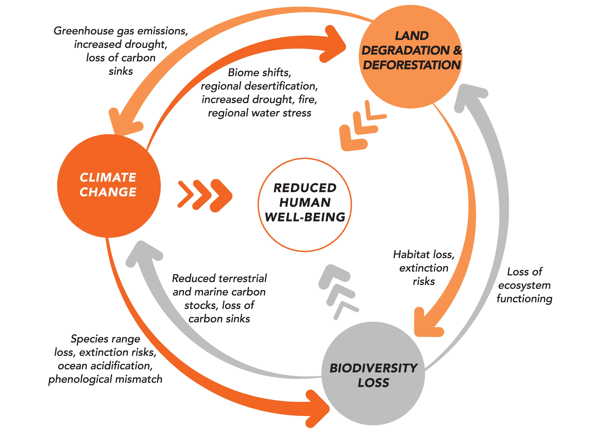
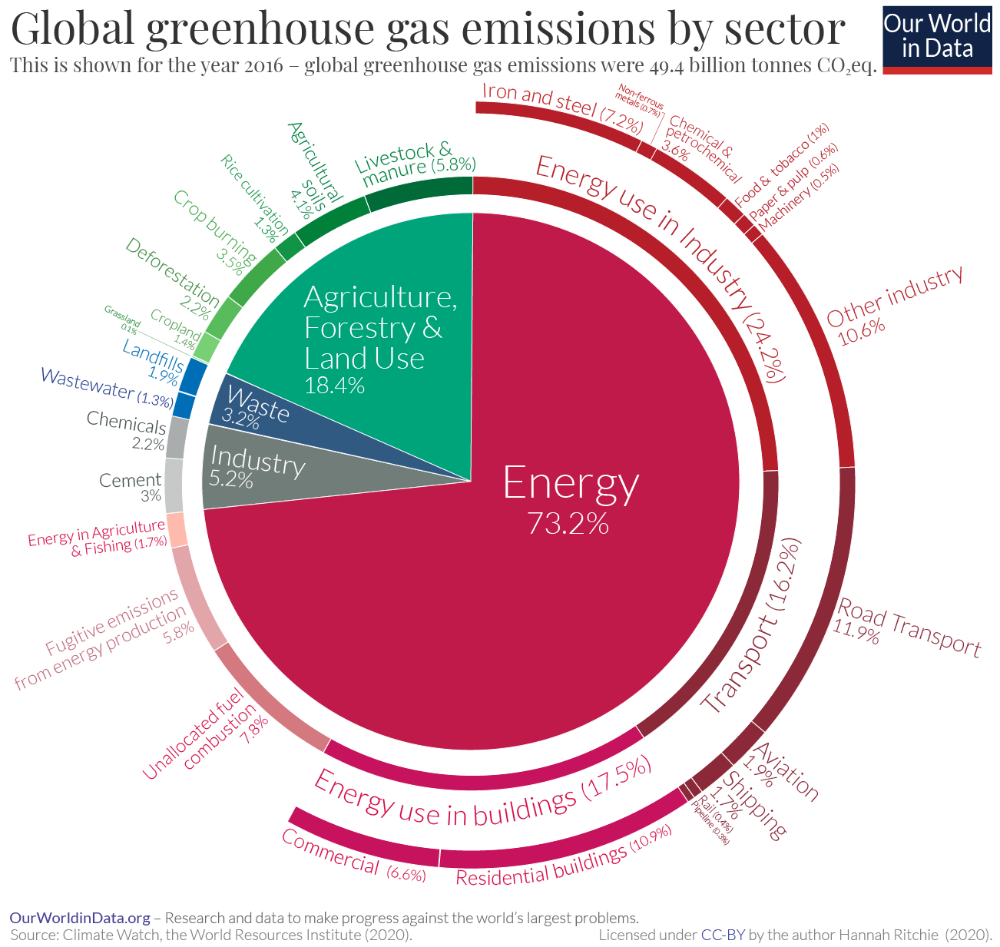
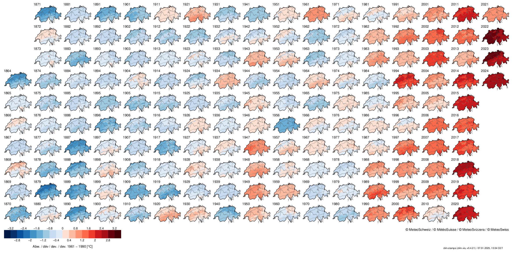
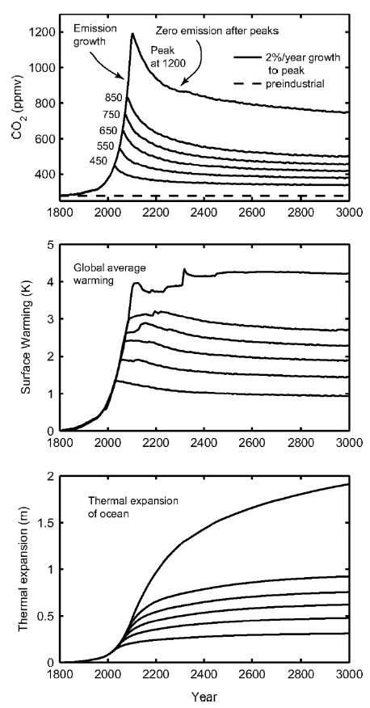
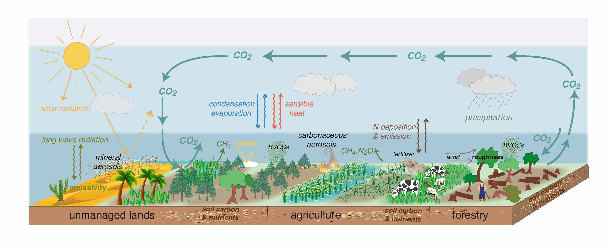
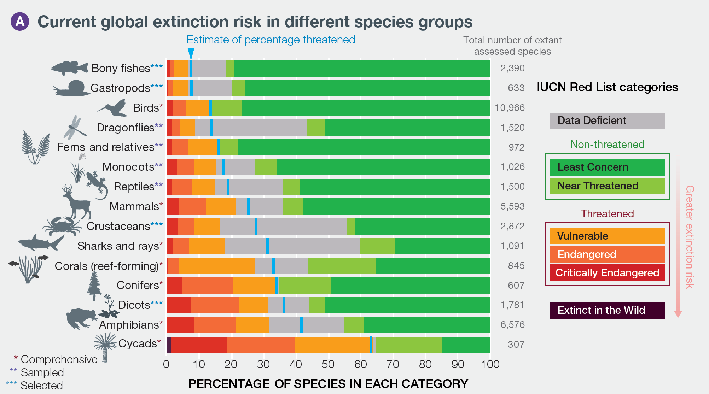
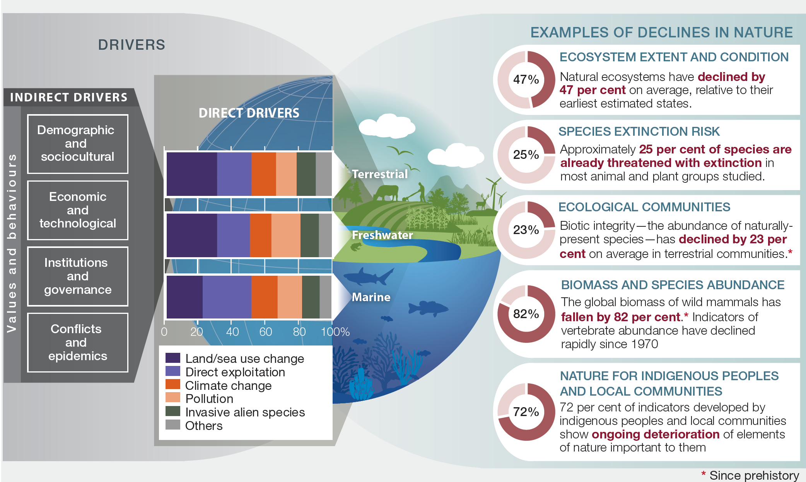
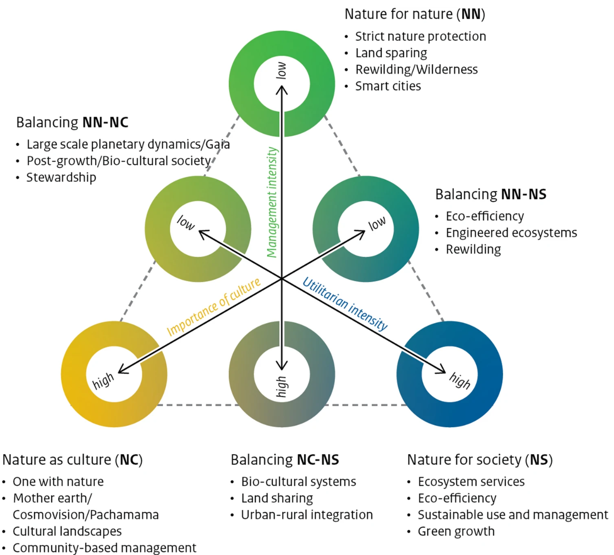
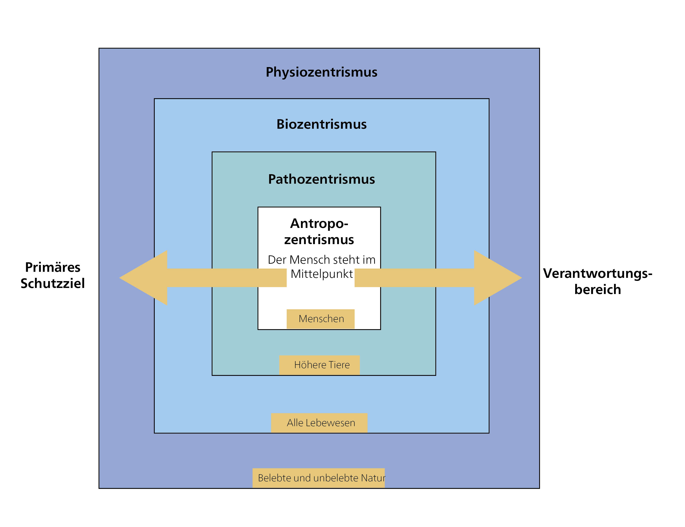

## Planetare Grenzen

Die gegenwärtige Epoche wird als Anthropozän bezeichnet, weil menschliche Aktivitäten einen immer tiefgreifenderen Einfluss auf die Erde und ihre Systeme ausüben. Obwohl dieser Begriff von geologischen Fachgremien (noch) nicht als offizielle geologische oder geochronologische Epoche anerkannt wurde [@zhongAreWeAnthropocene2024], beschreibt er den enormen menschlichen Einfluss auf die Umwelt. Es gibt keine einheitliche Definition über den Ursprung des Anthropozäns; mögliche Marker umfassen den menschlichen Einfluss auf Treibhausgaskonzentrationen durch den Reisanbau, die globale Verbreitung von Radioaktivität durch Atomtests oder das Auftreten von Kunststoffpartikeln in geologischen Sedimenten. Als Beginn des Anthropozäns gilt allgemein die Industrielle Revolution.

Eine quantitative Definition ökologischer Nachhaltigkeit wurde von @rockstromPlanetaryBoundariesExploring2009 und @steffenPlanetaryBoundariesGuiding2015 vorgeschlagen, die neun planetare Grenzen identifizierten: Klimawandel, Integrität der Biosphäre, Landnutzungsveränderungen, Süsswasserveränderungen, biogeochemische Kreisläufe, Ozeanversauerung, atmosphärische Aerosollast, stratosphärischer Ozonabbau sowie neuartige Stoffe. Diese planetaren Grenzen dienen als wissenschaftlicher Referenzpunkt und zeigen die Grenzen auf, innerhalb derer unsere globalen sozioökonomischen Systeme operieren müssen, um das Wohlergehen der Menschheit zu gewährleisten.

Dieses Kapitel konzentriert sich auf drei dieser Grenzen, die hier als **Klimawandel**, **Landnutzungsveränderungen** und **Biodiversitätsverlust** bezeichnet werden. Diese drei Krisen verstärken sich gegenseitig und bilden ein komplexes Geflecht von Wechselwirkungen.

{#fig-interactions}

### Die Klimakrise (Klimawandel)

**Klimawandel** – oder, um einen Begriff zu verwenden, der die Dringlichkeit besser verdeutlicht, die Klimakrise – ist eines der drängendsten Probleme unserer Zeit. Er erfährt grosse mediale Aufmerksamkeit und ist beispielhaft für ein „wicked problem" [@hulmeWhyWeDisagree2009, p.9]. Er steht im Mittelpunkt der Fridays-for-Future-Bewegung, die von Greta Thunberg initiiert wurde, und ist zumindest ein Gesprächsthema auf der (globalen) politischen Bühne. Während lokale Bedingungen und natürliche Schwankungen zu gewissen Unsicherheiten in Klimamodellen und Statistiken beitragen, zeigt die wissenschaftliche Evidenz klar, dass steigende globale Temperaturen einen enormen Einfluss auf die ökologische Nachhaltigkeit und das menschliche Wohlergehen haben. Deshalb ist der Klimawandel eine der neun planetaren Grenzen.

Der Begriff **Klima** beschreibt den durchschnittlichen Zustand der Atmosphäre (Temperatur, Niederschlag, Luftfeuchtigkeit usw.) über einen Zeitraum von mindestens 30 Jahren an einem bestimmten Ort. Im Gegensatz dazu beschreibt **Wetter** den kurzfristigen Zustand (d. h. von Sekunden bis Wochen) und umfasst Wetterphänomene wie Gewitter oder Hitzewellen [@nccsNationalCentreClimate]. Das **Klimasystem** wiederum umfasst nicht nur die Atmosphäre, sondern auch die Hydrosphäre (Ozeane, Seen, Flüsse, Grundwasser), die Kryosphäre (Gletscher, Schneedecke, Meeres- und Seeeis, Permafrost), die Biosphäre (Lebewesen) und die Lithosphäre (Böden bzw. die äusserste Schicht der Erde). Es bezeichnet insbesondere die physikalischen, biologischen und chemischen Wechselwirkungen und Abhängigkeiten zwischen diesen fünf Sphären. Zusätzlich wird das Klimasystem durch Strahlung aus dem Weltraum beeinflusst (vgl. Abbildung unten).

{#fig-climate-system}

Material- und Energieflüsse zwischen den verschiedenen Komponenten des Klimasystems, wie der Kohlenstoffkreislauf, können als **Rückkopplungsmechanismen** wirken. Solche Rückkopplungsmechanismen haben wir bereits im Kapitel über systemische Effekte kennengelernt (vgl. *Kapitel 2*). Sie können entweder positiv sein, wenn die Rückkopplung die ursprüngliche Veränderung verstärkt, oder negativ, wenn die Rückkopplung versucht, die ursprüngliche Veränderung umzukehren. Hier sind Beispiele für einen positiven und einen negativen Rückkopplungseffekt im Klimasystem:

-   **Positive Rückkopplung**: Wenn die Erdoberflächentemperatur steigt, nimmt auch die Wasserverdunstung zu, was eine positive Rückkopplungsschleife erzeugt. Wasserdampf ist das bedeutendste **Treibhausgas** in der Atmosphäre. Mit steigenden Temperaturen gelangt mehr Wasserdampf in die Atmosphäre, was die Wärmereflexion zur Erdoberfläche verstärkt und zu weiterer Verdunstung führt. Dieser Kreislauf beschleunigt die Erwärmung und die Ansammlung von atmosphärischem Wasserdampf. Auf der Venus verstärkte dieser Rückkopplungsmechanismus den Treibhauseffekt so weit, dass alles flüssige Oberflächenwasser verdampfte.

-   **Negative Rückkopplung**: Erhöhtes atmosphärisches CO~2~ kann die Photosynthese fördern, ein Prozess, der als **CO~2~-Düngungseffekt** bekannt ist und ein Beispiel für einen negativen Rückkopplungsmechanismus darstellt. Obwohl ein Anstieg des Kohlendioxids dazu führen kann, dass Pflanzen mehr Kohlenstoff in Biomasse binden als zuvor, reicht dies bei weitem nicht aus, um den steigenden CO~2~-Gehalt in der Atmosphäre zu kompensieren, der hauptsächlich durch die Verbrennung fossiler Brennstoffe und Landnutzungsveränderungen verursacht wird. Die Fähigkeit der Pflanzen, zusätzliches CO~2~ aufzunehmen, wird durch verschiedene Faktoren wie Nährstoffverfügbarkeit, Wasserressourcen und Temperaturbedingungen begrenzt. Daher ist dieser Rückkopplungsmechanismus unzureichend, um den Anstieg der atmosphärischen CO~2~-Konzentration durch menschliche Aktivitäten zu kompensieren.

Positive Rückkopplungsmechanismen oder das Versagen negativer Rückkopplung können dazu führen, dass bedeutende *Schwellenwerte* im Klimasystem überschritten werden. Diese Schwellenwerte werden als **Kipppunkte des Klimasystems** bezeichnet und sind eng mit dem Konzept der planetaren Grenzen verknüpft (vgl. *Kapitel 2.4 zur Grossen Transformation*). Wenn diese Schwellenwerte überschritten werden, können abrupte und oft irreversible Veränderungen im Klimasystem auftreten, die das Klima destabilisieren und zu einem beschleunigten Klimawandel führen. Das Konzept der Kipppunkte unterstreicht die Dringlichkeit, die globale Erwärmung zu begrenzen und Treibhausgasemissionen zu reduzieren. Werden diese Schwellenwerte überschritten, wird es zunehmend schwieriger, den Klimawandel zu kontrollieren oder seine Auswirkungen zu minimieren. Letztlich riskiert die Erde, zu einem grossen Treibhaus zu werden (*Hothouse Earth*-Szenario) (vgl. @fig-hothouse-earth).

{#fig-hothouse-earth}

Es wird angenommen, dass insgesamt 16 Kipppunkte existieren (@fig-16-tipping-points), darunter die sibirischen Permafrostböden oder der Westantarktische Eisschild. Diese Kipppunkte haben unterschiedliche Schwellenwerte, was bedeutet, dass einige früher – bei geringerer globaler Erwärmung – erreicht werden als andere. Wenn diese Kipppunkte erreicht oder überschritten werden, können sie selbstverstärkende Rückkopplungseffekte auslösen, die zu weiterer Erwärmung führen, weitere Kipppunkte initiieren und den Klimawandel intensivieren. Einige dieser Kipppunkte befinden sich bereits in einem kritischen Zustand, wie Johan Rockström, einer der Begründer des Konzepts der Planetaren Grenzen, eindrücklich erklärt [@tedTippingPointsClimate2024]. Im Amazonas beispielsweise emittieren einige Gebiete mittlerweile mehr CO~2~ als sie absorbieren – sie werden zu Kohlenstoff*quellen* statt zu -senken – aufgrund von Waldbränden, klimabedingtem Wasserstress und Entwaldung (vgl. *Kapitel 3.3.2 zu Landnutzungsveränderungen*) [@gattiAmazoniaCarbonSource2021; @harrisGlobalMapsTwentyfirst2021]. Folglich befindet sich der Amazonas bereits im Wandel und verliert an Resilienz [@floresCriticalTransitionsAmazon2024]. Ein weiterer besorgniserregender und sehr realer Kipppunkt ist die *Atlantische Umwälzzirkulation* (Atlantic Meridional Overturning Circulation, AMOC) [@rahmstorfAtlanticOverturningCirculation2024; @rahmstorfTippingRiskAtlantic2024]. Die AMOC nähert sich ihrem Kipppunkt [@vanwestenPhysicsbasedEarlyWarning2024], und Projektionen deuten darauf hin, dass sie schon Mitte dieses Jahrhunderts kollabieren könnte [@ditlevsenWarningForthcomingCollapse2023]. Ein Kollaps würde zu häufigeren europäischen Hitzewellen und einem Meeresspiegelanstieg entlang der nordöstlichen US-Küste führen [@rahmstorfAtlanticOverturningCirculation2024].

{#fig-16-tipping-points}

Doch was verursacht die Erwärmung der Erde und den Klimawandel? Neben natürlichen Ursachen wie geologischen, langfristigen Faktoren (Erdachsenrotation, Milanković-Zyklen, Vulkanausbrüche) ist der primäre Treiber der globalen Erwärmung der **Treibhausgaseffekt**. Der Treibhausgaseffekt ist ein Prozess, bei dem kurzwellige Sonnenstrahlung in die Erdatmosphäre eindringt und von der Erdoberfläche als langwellige Infrarotstrahlung wieder abgestrahlt wird. Treibhausgase – wie Kohlendioxid, Methan und Wasserdampf – absorbieren einen Teil dieser Infrarotstrahlung und emittieren sie in alle Richtungen, wodurch ein Teil der Wärme zur Erdoberfläche zurückgelangt. Ohne diesen Effekt wäre die Erde zu kalt, um Leben zu ermöglichen. Heute befinden sich jedoch aufgrund anthropogener Emissionen zu viele Treibhausgase in der Atmosphäre, was zur Erwärmung der Erde führt.

Der grösste Anteil der menschlichen CO~2~-Emissionen, rund ¾ des globalen Gesamtvolumens, stammt aus der Energieproduktion, d. h. in erster Linie aus der Strom- und Wärmeerzeugung (@fig-global-greenhouse-gas-emissions). Dies ist hauptsächlich auf die Verbrennung von Kohle, Gas und Öl zurückzuführen, mit Emissionen aus Industrie (24,2% des globalen Gesamtvolumens), Transport (16,2%), Gebäuden (17,5%) und Landwirtschaft (18,4%). Die Haupttreiber der landwirtschaftlichen Emissionen sind die Viehzucht, die Entwaldung für landwirtschaftliche Nutzflächen und der Einsatz von Stickstoffdünger auf landwirtschaftlichen Böden.

Im Transportsektor macht der Luftverkehr 1,9% der globalen Emissionen aus (vgl. Abbildung unten). In der Schweiz hingegen entfallen auf Flüge rund 11% der nationalen Emissionen. Diese Flugverkehrsemissionen sind grösstenteils dem internationalen Luftverkehr zuzuschreiben [@bundesamtfuerumweltbafuKenngroessenZurEntwicklung2025], wobei der Flughafen Basel-Mulhouse, der sich auf französischem Boden befindet, nicht in die Berechnungen einfliesst. Trotz dieser Evidenz hat die Schweiz noch keine CO~2~-Steuer auf Kerosin (den Hauptbestandteil des Flugzeugtreibstoffs) eingeführt, obwohl eine solche auf fossile Brennstoffe wie Heizöl und Erdgas besteht. Es ist jedoch anzumerken, dass die Klimawirkung nicht allein durch Treibhausgasemissionen bestimmt wird [@allenSolutionMisrepresentationsCO2equivalent2018; @leeContributionGlobalAviation2021; @neuAuswirkungenFlugverkehrsemissionenAuf2021]. Das Erwärmungspotenzial des Flugverkehrs kann daher deutlich höher sein als durch die Treibhausgasemissionen allein angezeigt wird, da auch Nicht-CO~2~-Effekte von Flügen – wie Wasserdampf, Stickoxide (NOx) und Russ – das Klima beeinflussen [@leeContributionGlobalAviation2021].

Global haben die Flugverkehrsemissionen seit 1990 mehr als verdoppelt, getrieben hauptsächlich durch den internationalen Luftverkehr. Trotz eines starken Einbruchs der Flugzahlen im Jahr 2020 infolge der Pandemie haben sich die Flugverkehrsemissionen erholt und werden voraussichtlich in den kommenden Jahren die Rekordzahlen von 2019 übertreffen.

{#fig-global-greenhouse-gas-emissions}

Jüngste Berechnungen und Klimaberichte zeigen, dass die Erdoberflächentemperatur in den letzten 10 Jahren (2014–2023) im Vergleich zum vorindustriellen Niveau (1850–1900) um rund 1,2°C gestiegen ist [@unClimateFastFacts2024]. Zudem war 2023 das wärmste Jahr seit Beginn der Aufzeichnungen, mit einer globalen Oberflächentemperatur von 1,45°C über dem vorindustriellen Referenzwert. Das mag nicht viel klingen, bedeutet aber angesichts der enormen Grösse und Wärmespeicherkapazität der Ozeane einen erheblichen Wärmeanstieg [@ritchieSectorSectorWhere2020a].

{#fig-worlds}

Das **Pariser Klimaabkommen**, das im Dezember 2015 verabschiedet wurde, war der erste internationale Vertrag, in dem Industrie- und Schwellenländer gemeinsam zusagten, die Treibhausgasemissionen zu reduzieren. Sein Kernziel ist es, den globalen Temperaturanstieg auf maximal 2°C zu begrenzen, mit Bemühungen um eine Beschränkung auf 1,5°C gegenüber dem vorindustriellen Niveau. Im Jahr 2018 veröffentlichte der Zwischenstaatliche Ausschuss für Klimaänderungen (IPCC) einen Sonderbericht mit einigen bemerkenswerten Erkenntnissen: vor allem, dass wir nur noch wenige Jahre – bis 2030 – Zeit haben, um zu verhindern, dass die 2°C-Grenze überschritten wird. Die nächste wichtige Entscheidung im Rahmen der internationalen Klimabemühungen im Anschluss an das Pariser Abkommen war die Klimakonferenz COP 27 im Jahr 2022. Auf der COP 27 einigten sich die Unterzeichnenden auf die Einrichtung des Fonds für Verluste und Schäden (Loss and Damage Fund) – das Ergebnis jahrzehntelanger Diskussionen –, der Entwicklungsländern nach extremen Wetterereignissen finanzielle Unterstützung ermöglichen soll.

::: {.callout-note collapse="true"}
#### Der Zwischenstaatliche Ausschuss für Klimaänderungen (IPCC)

Der **Zwischenstaatliche Ausschuss für Klimaänderungen (IPCC)**, 1988 von den Vereinten Nationen und der Weltorganisation für Meteorologie gegründet, fasst die wissenschaftliche Forschung zum Klimawandel für politische Entscheidungsträger\*innen weltweit zusammen. Seine regelmässig erscheinenden IPCC-Berichte liefern eine umfassende Bewertung des aktuellen Wissensstands zum Klimawandel, einschliesslich der physikalischen Grundlagen, Auswirkungen, Risiken und Anpassungsstrategien. Diese Berichte basieren auf Tausenden von Studien und gelten als die massgeblichste Informationsquelle zum Klimawandel. Die IPCC-Berichte dienen als Grundlage für internationale Verhandlungen und nationale Klimapolitiken, einschliesslich des Pariser Abkommens von 2015.
:::

{#fig-hotter-and-different-world}

Doch was ist nötig, um zu verhindern, dass die Temperatur um mehr als 1,5 Grad ansteigt? Eine ganze Menge. Die anthropogenen CO~2~-Emissionen müssen zwischen 2010 und 2030 um 45% sinken, und die Netto-CO~2~-Emissionen müssen bis 2050 auf null reduziert werden. Während wir für marginale Aktivitäten wie Autokäufe oder Gebäudesanierungen grünere Technologien einsetzen, riskieren wir dennoch, die ernsthafte Bedrohung durch den bereits in der Atmosphäre vorhandenen Kohlenstoff zu vernachlässigen. Es ist wichtig, zwischen laufenden Emissionen (Fluss) und dem angesammelten atmosphärischen Kohlenstoff (Bestand) zu unterscheiden. Der Fluss spielt für den Planeten eine untergeordnete Rolle – es ist der Bestand, der die globale Erwärmung antreibt. Der Klimawandel ist daher in erster Linie ein Bestandsproblem und kein Flussproblem. Dies ist ein anspruchsvolles Konzept, nicht nur für Laien. Tatsächlich stellten @stermanUnderstandingPublicComplacency2007 fest, dass die meisten Erwachsenen Schwierigkeiten hatten, den Bestandsaspekt des Klimawandels zu erfassen.

{#fig-change-to-various-components}

Ein wirksames mentales Modell ist die Badewannen-Analogie: Wenn der Zufluss durch den Hahn (d. h. unsere Emissionen, der Fluss) den Abfluss (Kohlenstoffaufnahme durch Regenwälder, Ozeane usw.) übersteigt, steigt der Wasserspiegel (der atmosphärische Kohlenstoffbestand). Die letzten fünf Jahre und zwanzig der letzten zweiundzwanzig Jahre waren die wärmsten seit Beginn der Aufzeichnungen. Dieser Erwärmungstrend ist eine direkte Folge des steigenden Wasserstands in dieser „Badewanne".

**Auswirkungen**: Es wird erwartet, dass der Klimawandel eine Reihe direkter und indirekter Folgen hat, von denen einige bereits eintreten. Dazu gehören der Meeresspiegelanstieg, schwindende Gletscher, Bedrohungen der Wasser- und Ernährungssicherheit, eine Zunahme extremer Wetterereignisse, negative gesundheitliche Auswirkungen im Zusammenhang mit Temperatur, Hitzewellen, Dürren und Starkniederschlägen, Waldbrände sowie eine Zunahme geomorphologischer Aktivitäten und damit verbundener Naturgefahren infolge des Permafrosttauens.

### Landnutzungsveränderungen

Landnutzungsveränderungen – wie Entwaldung für die Landwirtschaft oder städtische Expansion – haben einen erheblichen Einfluss auf die **ökologische Dimension der Nachhaltigkeit**. Sie bedrohen die Biodiversität und stören die Ökosystemfunktionen. Sie können auch Treibhausgasemissionen erhöhen, Wasserkreisläufe verändern oder wertvolles Agrarland erschöpfen. Dies kann zu einer Verringerung der Ökosystemdienstleistungen führen (vgl. *Kapitel 3.2 zu Ökosystemen, Ökosystemmanagement und Ökosystemdienstleistungen*), was letztlich das menschliche Wohlergehen einschränkt. Landnutzungsveränderungen sind eine der neun **planetaren Grenzen**, die laut @richardsonEarthSixNine2023 bereits überschritten wurde.

Zum Verständnis von Landnutzungsveränderungen sind einige Schlüsseldefinitionen erforderlich:

-   **Landbedeckung** bezeichnet die Eigenschaften der Landoberfläche und ihrer unmittelbaren Unterfläche, einschliesslich Biota, Topographie und menschlicher Bauwerke [@lambinAreAgriculturalLanduse2000, p. 322].

-   **Landnutzung** ist die Art und Weise, wie Menschen die Landbedeckung nutzen [@lambinAreAgriculturalLanduse2000, p. 322].

-   **Landnutzungsveränderung** bezeichnet den Wechsel von einer Landnutzungsart zu einer anderen [@lambinAreAgriculturalLanduse2000, p. 322].

-   **Landdegradation** bedeutet „Verringerung oder Verlust der biologischen oder wirtschaftlichen Produktivität und Komplexität von Regenfeldbau, Bewässerungsfeldbau oder Weide-, Wald- und Waldland in ariden, semi-ariden und trockenen subhumiden Gebieten infolge von Landnutzungen" [@unUnitedNationConvention1994, p. 4].

-   **Landsysteme** „repräsentieren die terrestrische Komponente des Erdsystems und umfassen alle Prozesse und Aktivitäten im Zusammenhang mit der menschlichen Landnutzung, einschliesslich sozioökonomischer, technologischer und organisatorischer Investitionen und Vereinbarungen sowie der Vorteile, die aus dem Land gewonnen werden, und der unbeabsichtigten sozialen und ökologischen Folgen gesellschaftlicher Aktivitäten" [@verburgLandSystemScience2013, p. 433].

-   Land kann auch als ein **sozial-ökologisches System** [@chapinPolicyStrategiesAddress2006] verstanden werden, in dem die sozialen und ökologischen Teilsysteme miteinander interagieren und voneinander abhängen. Dieses System ist durch gegenseitige Rückkopplung gekennzeichnet, wobei der Mensch als integraler Bestandteil der Natur betrachtet wird [@verburgLandSystemScience2015].

Verschiedene **Treiber**, d. h. Gründe oder Ursachen, sind für das Auftreten von Landnutzungsveränderungen verantwortlich. Diese Faktoren variieren je nach Art der Landnutzung. Die Haupttreiber der globalen Entwaldung – eine Form der Landnutzungsveränderung – sind beispielsweise die kommerzielle Landwirtschaft, der Wanderfeldbau, die kommerzielle Forstwirtschaft, die Urbanisierung und Waldbrände [@curtisClassifyingDriversGlobal2018]. Die Entwaldung hat bereits zu einem alarmierenden Rückgang der Biodiversität (vgl. *Kapitel 3.4 zu Biodiversitätsverlust*) und zur Unterbrechung von Kohlenstoffkreisläufen geführt (vgl. *Kapitel 3.2 zu Ökosystemen, Ökosystemmanagement und Ökosystemdienstleistungen*). So ist der Sektor Landwirtschaft, Forstwirtschaft und andere Landnutzung (AFOLU) ein wesentlicher Verursacher **globaler anthropogener Treibhausgasemissionen** und macht etwa 13% der CO~2~-, 44% der CH~4~- und 81% der N~2~O-Emissionen aus [@ipccClimateChangeLand2019]. Diese Wechselwirkungen zwischen Klimawandel und Landnutzung bzw. Landnutzungsveränderungen zeigen, dass Landsysteme und Klimasysteme systemisch und nicht isoliert betrachtet werden sollten [@richardsonEarthSixNine2023]. @fig-land-climate-interaction zeigt eine schematische Darstellung dieser Wechselwirkungen zwischen Land und Treibhausgasen.

{#fig-land-climate-interaction}

Über ihre Auswirkungen auf klimarelevante Treibhausgasflüsse hinaus stören Landnutzung und Landnutzungsveränderungen auch andere **biogeochemische Materialkreisläufe**, wie Nitrat-, Phosphor- oder Schwefelkreisläufe, und verknüpfen sie mit einer weiteren bereits überschrittenen planetaren Grenze – derjenigen der biogeochemischen Kreisläufe [@richardsonEarthSixNine2023]. Ein klassisches Beispiel hierfür ist die **Eutrophierung**, ein Prozess, der auftritt, wenn landwirtschaftliche Düngemittel wie Phosphor in nährstoffarme Gewässer gelangen und zu übermässigem Algenwachstum, sogenannten Algenblüten, führen. Wenn diese Blüten verrotten, verringern sie den Sauerstoffgehalt, was aquatisches Leben letztlich einschränkt oder gar verhindert [@gallowayTransformationNitrogenCycle2008; @smithEutrophicationFreshwaterMarine2006].

::: {.callout-tip collapse="true"}
#### Landnutzungsveränderungen in den Tropen: das Beispiel Madagaskar

In den Tropen sind die am besten an lokale Bedingungen angepassten Anbauformen (d. h. ohne Dünger oder andere Betriebsmittel) Agroforstwirtschaft und Brandrodung. **Agroforstwirtschaft** ist ein dauerhaftes Landnutzungssystem, in dem einjährige Feldfrüchte zusammen mit Bäumen angebaut werden oder mehrjährige Kulturen (z. B. Maniok, Vanille, Bananen und Lychees) gemeinsam gepflanzt werden. **Brandrodung**, auch bekannt als **Wanderfeldbau**, bezeichnet dagegen ein Landnutzungssystem, bei dem jedes Jahr eine andere Fläche gerodet und eine Ernte wie Mais angebaut wird, während die zuvor bebauten Felder brachliegen, um den Aufbau von Nährstoffen zu ermöglichen.

Wie oben erwähnt, ist die Brandrodung, wie sie in Madagaskar praktiziert wird, eine der Hauptursachen der globalen Entwaldung. Daher bekämpfen Regierungen und NGOs die Brandrodung seit der Kolonialzeit. Eine Herausforderung bei der Brandrodung ist, dass Bäuer\*innen, wenn die Brachzeiten aufgrund von Landmangel zu kurz werden, in bisher ungenutzte Waldgebiete ausweichen und diese roden, um den Brandrodungszyklus aufrechtzuerhalten. Diese Entwaldung erzeugt erhebliche Biomasse, die verbrannt werden muss. In Madagaskar beispielsweise wurden innerhalb eines Monats von Mitte September bis Mitte Oktober 2023 mehr als 6.000 Brandstellen registriert.

Deshalb wird der lokalen Bevölkerung die Verantwortung für die Entwaldung in Madagaskar zugeschrieben. Doch Brandrodung ist eine notwendige Überlebensstrategie für die Einheimischen, die kaum Alternativen haben und auf sie angewiesen sind, um Land für künftige Generationen zu sichern. Dieser Zielkonflikt ist spezifisch ein **Landnutzungskonflikt**.
:::

::: {.callout-tip collapse="true"}
#### Landnutzungskonflikte in der Schweiz: der Solar Express

Ein weiteres Beispiel für einen Landnutzungskonflikt zeigt sich in der Schweiz, bei einem Interessenkonflikt zwischen einem dezentralen erneuerbaren Energieprojekt und Landschaftsdienstleistungen [vgl. @kienastConflictsDecentralizedRenewable2017]. Im Jahr 2022 lancierte die Schweizer Regierung eine „Solaroffensive" in Form eines Projekts namens „Solar Express". Ziel war es, alpine Photovoltaikanlagen durch hohe Subventionen zu fördern, die bis zu 60% der Investitionskosten abdecken sollten. Im Sommer 2024 fand in Sedrun, im östlichsten Kanton Graubünden, der Spatenstich für die erste Grossanlage mit einer Fläche von 300.000 m^2^ statt. Solche Grossanlagen kollidieren jedoch mit anderen Landnutzungen und beeinträchtigen insbesondere Agrarflächen, Naturschutzgebiete und Tourismusregionen. Solaranlagen verändern die Landschaft und könnten Flora und Fauna beeinflussen, was bei Bäuer\*innen und Naturschutzorganisationen Befürchtungen über den Verlust von wertvollem Ackerland und Biodiversitätsflächen weckt. Gleichzeitig fordern Befürworter\*innen erneuerbarer Energien die rasche Umsetzung dieser Projekte, um die Abhängigkeit der Schweiz von fossilen Brennstoffen zu reduzieren und das Klima zu schützen. Dies verdeutlicht die Spannung zwischen dem Bedarf an erneuerbaren Energien einerseits und dem Wunsch, Landschaft und Umwelt zu erhalten, andererseits.
:::

Die Entwaldung in tropischen Regionen ist eine Form der Landnutzungsveränderung, die nicht nur von lokalen Bedürfnissen, sondern auch von internationalen Entscheidungen und Nachfragen beeinflusst wird [@curtisClassifyingDriversGlobal2018]. Dies legt nahe, dass die Verhinderung von Entwaldung sowohl auf lokaler als auch auf internationaler Ebene angegangen werden muss [@defriesDeforestationDrivenUrban2010]. Doch nicht nur die Entwaldung, sondern Landnutzungsveränderungen allgemein werden von entfernten Faktoren beeinflusst [@meyfroidtGlobalizationLandUse2013a]. In der Wissenschaft werden solche Phänomene und Prozesse als **Telekopplung** bezeichnet [@liuFramingSustainabilityTelecoupled2013]. Telekopplung beschreibt die sozioökonomischen und ökologischen Wechselwirkungen zwischen weit entfernten menschlichen und natürlichen Systemen und analysiert, wie Handlungen an einem Ort (dem Sendesystem) einen anderen Ort (das Empfangssystem) beeinflussen können. So verlangen neue EU-Verordnungen, dass Produkte, die ab Ende 2024 in den EU-Markt eingeführt werden, entwaldungsfrei sein müssen ([Verordnung über entwaldungsfreie Produkte – Europäische Kommission (europa.eu)](https://environment.ec.europa.eu/topics/forests/deforestation/regulation-deforestation-free-products_en)). Diese Verordnungen werden voraussichtlich erhebliche ökologische (und soziale) Auswirkungen in den Anbauländern haben [@coenenTelecoupledImplicationsNew2023].

::: {.callout-note collapse="true"}
#### Landrechte und Landbesitz

Landnutzung und Landnutzungsveränderungen sind eng mit Fragen der **Landrechte** und des **Landbesitzes** verknüpft, da diese Faktoren massgeblich bestimmen, wer zur Nutzung von Land berechtigt ist und wie es genutzt wird. Sicherer Landbesitz und klar definierte Landrechte sind entscheidend für nachhaltige Landnutzungspraktiken, da sie langfristige Investitionen in das Landmanagement fördern und den Schutz von Ressourcen begünstigen. Unsichere oder unklare Landrechte können hingegen zu Landnutzungsveränderungen führen, die die Umwelt schädigen, wie unkontrollierte Entwaldung. Diese Fragen werden im Zusammenhang mit **Landraub** besonders brisant, bei dem grosse Landflächen von ausländischen (oder auch inländischen) Investor\*innen erworben werden, oft ohne angemessene Konsultation oder Entschädigung der lokalen Bevölkerung. Landraub kann zu Konflikten führen, die bestehende Landrechte untergraben und die Landnutzung auf eine Weise verändern, welche die ökologische und soziale Nachhaltigkeit gefährdet.
:::

Dieses Kapitel hat gezeigt, dass Land, Landnutzung und Landnutzungsveränderungen ein vielschichtiges Thema sind. Um die Bedeutung dieses Themas zu unterstreichen, haben @meyfroidtTenFactsLand2022 zehn Fakten über Landsysteme für die Nachhaltigkeit zusammengefasst (@fig-ten-facts, links), die auf empirischer Forschung basieren. Diese Fakten führen wiederum zu zehn damit verbundenen Herausforderungen [@meyfroidtTenFactsLand2022]. Fakt 2 etwa („*Land als komplexe Systeme*") führt zu der Herausforderung, dass die Folgen von Eingriffen in Landsysteme schwer vorherzusagen und zu verstehen sind, was die Entwicklung wirksamer Massnahmen oder Politiken zur Landnutzung erschwert. Einige der in diesem Kapitel diskutierten Themen stimmen mit diesen Fakten überein, beispielsweise Telekopplung und Fakt 5, „*Entfernte Verbindungen*".

![Zehn empirische Realitäten (Fakten) über Landsysteme mit starker allgemeiner Unterstützung. Herausforderungen fassen die Probleme zusammen, die sich aus jedem Fakt ergeben, wenn man versucht, Landsysteme für die Nachhaltigkeit zu managen und zu regieren. Implikationen fassen zusammen, wie die Governance von Landsystemen für die Nachhaltigkeit verbessert werden könnte, indem diese Fakten und Herausforderungen anerkannt werden. Die 10 Fakten sind durch vier übergeordnete Fakten (1, 2, 6 und 10) und mehrere untergeordnete Fakten strukturiert, die von diesen abgeleitet werden (3, 4 und 5 von 2; 7, 8 und 9 von 6), aber alle spezifische Realitäten ausdrücken, die spezifische Herausforderungen implizieren. Quelle: @meyfroidtTenFactsLand2022, lizenziert unter CC BY 4.0](images/Fig3_12_FactsChallenges.jpg){#fig-ten-facts}

::: {.callout-tip collapse="true"}
#### Beispiel: Landinvestitionen in Laos

Ein weiteres Beispiel für Landnutzungsveränderungen und ihre weitreichenden Auswirkungen sind kommerzielle Landinvestitionen in Laos. Die Demokratische Volksrepublik Laos ist ein bergiges Binnenland mit einer hohen Armutsquote und einigen wenigen kleinen städtischen Zentren. Laos liegt zwischen China, Vietnam, Thailand, Kambodscha und Myanmar und öffnete sich in den 1990er Jahren aus seiner kommunistischen Isolation. Das Land ist reich an natürlichen Ressourcen wie Land, Wäldern und Mineralien. Um das nationale Wirtschaftswachstum zu fördern, verfolgt die Regierung von Laos eine Strategie der „**Umwandlung von Land in Kapital**", d. h. der Umwandlung von „ungenutztem" Land in produktives Land, in der Hoffnung, durch Spillover-Effekte eine ländliche Entwicklung zu erzielen. Diese Strategie wird hauptsächlich durch kommerzielle Landinvestitionen umgesetzt, bei denen die Regierung inländischen und ausländischen Investor\*innen Landkonzessionen erteilt.

Doch inwiefern trägt diese Politik tatsächlich zur nachhaltigen Entwicklung bei? Um dies herauszufinden, arbeiteten Wissenschaftler\*innen des Centre for Development and Environment (CDE) mit der Regierung von Laos zusammen, um Landkonzessionen zu erfassen und die Qualität der Investitionen zu untersuchen. Es wurde ein nationales digitales Informationssystem entwickelt, das Laos ermöglicht, seine Landkonzessionen effektiv zu verwalten. Das System zeigte auch, dass nicht alle Investor\*innen ihre Versprechen einhalten, was die Nachhaltigkeit dieser Landnutzungsstrategie in Frage stellt.

Die Landnutzungsveränderungen hin zu Bananenplantagen, anderen Baumplantagen wie Kautschukplantagen, Minen und Wasserkraftprojekten führten unter anderem zu einem Verlust an Waldflächen – etwa ein Drittel aller Konzessionen wurde in nationalen Waldgebieten erteilt. Dies führte auch zu einem Verlust wichtiger Ökosystemdienstleistungen und einem Rückgang der Biodiversität. Über die ökologischen Auswirkungen auf die lokale Umwelt hinaus hatten die Landinvestitionen auch sozioökonomische Konsequenzen. Obwohl für einige das finanzielle Einkommen gestiegen ist, wirkten sich die Landinvestitionen in vielen Gebieten negativ auf das Wohlbefinden der lokalen Bevölkerung aus und beeinträchtigten die Ernährungssicherheit sowie den Zugang zu Land und natürlichen Ressourcen, die für subsistenzorientierte Lebensweisen unerlässlich sind [@nanhthavongCommercialInvestmentsLand2021; @hettLandLeasesConcessions2020].


:::

## Biodiversitätsverlust

Biodiversität ist definiert als die Vielfalt des Lebens in all seinen Formen, von Genen über Arten bis hin zu Ökosystemen [@unConventionBiologicalDiversity1992]. Sie ist eine wesentliche Grundlage für das Wohlergehen der Menschheit und damit ein wesentlicher Bestandteil der **ökologischen Nachhaltigkeit**, die die Basis für zahlreiche Ökosystemdienstleistungen [@haines-youngLinksBiodiversityEcosystem2010] oder Naturbeiträge für Menschen [@antunesLinkingBiodiversityEcosystem2024] bildet. Biodiversität ist auch eng mit mehreren **planetaren Grenzen** verknüpft, insbesondere mit Landnutzungsveränderungen und der Integrität der Biosphäre [@steffenPlanetaryBoundariesGuiding2015]. Es ist klar, dass ein unkontrollierter Biodiversitätsverlust Kipppunkte in Ökosystemen auslösen, das Gleichgewicht der Erde stören und die Fähigkeit unseres Planeten, menschliches Leben zu erhalten, schwer beeinträchtigen könnte. Der Schutz und die Wiederherstellung der Biodiversität gelten daher als Schlüssel zu einer nachhaltigen Zukunft.

Dennoch befindet sich die **Biodiversität** derzeit in einem alarmierenden Zustand (vgl. Infokasten unten). Weltweit nimmt die Artenvielfalt seit mehreren Jahrzehnten ab [@butchartGlobalBiodiversityIndicators2010; @diazBiodiversityConceptsPatterns2022], ein Abwärtstrend, der laut Prognosen anhalten wird [@diazBiodiversityConceptsPatterns2022]. Infolgedessen wird bereits ein sechstes Massenaussterben diskutiert [@ceballosVertebratesBrinkIndicators2020]. Um dieser Entwicklung entgegenzuwirken, wurde das **Übereinkommen über die biologische Vielfalt (CBD)** auf dem Rio-Erdgipfel 1992 ratifiziert [@unConventionBiologicalDiversity1992], unter Schweizer Beteiligung. Dieses rechtlich bindende Abkommen bedeutet, dass neue Bestimmungen, die an nachfolgenden Konferenzen beschlossen werden, rechtlich umgesetzt werden müssen, wenn die Schweiz Delegierte schickt.

::: {.callout-note collapse="true"}
#### Monitoring

Das Biodiversitätsmonitoring ist ein wichtiges Instrument zur Verfolgung von Veränderungen in der Biodiversität. Die Rote Liste gefährdeter Tier- und Pflanzenarten der Internationalen Union zur Bewahrung der Natur (IUCN), die seit 1964 geführt wird, spielt dabei eine besonders wichtige Rolle. Sie kategorisiert den Status einer Art in eine von neun Kategorien, von „nicht gefährdet" bis „ausgestorben". Abbildung @fig-IUCN-red-list zeigt beispielsweise den Prozentsatz der Arten in jeder Kategorie auf globaler Ebene. Dieselben Kategorien werden auch in der Schweiz verwendet. Solche Datenbanken helfen unter anderem, die Politikgestaltung und Naturschutzplanung zu verbessern und eine angemessenere Zuweisung von (finanziellen) Ressourcen in Forschung und Gesellschaft zu ermöglichen. Trotz des umfangreichen und etablierten Artenmonitorings gehen vorsichtige Studien davon aus, dass nur zwischen 1,5% und 18% der terrestrischen Wirbeltierspezies unseres Planeten identifiziert und beschrieben wurden [vgl. @mouraShortfallsOpportunitiesTerrestrial2021].

{#fig-IUCN-red-list}
:::

Trotz solcher internationaler Bemühungen steht die globale Biodiversität unter einem beispiellosen Druck. Dies ist auf direkte und indirekte **Treiber** (@fig-drivers-biodiversity-loss) zurückzuführen, die sich in den letzten 50 Jahren erheblich beschleunigt haben [@ipbesGlobalAssessmentReport2019, p.25]. So haben menschliche Aktivitäten wie **Landnutzungsveränderungen** natürliche Lebensräume drastisch verändert und verkleinert, was zu einem erheblichen Verlust an Arten und genetischer Vielfalt geführt hat [@pereiraScenariosGlobalBiodiversity2010]. Darüber hinaus ist der Artenverlust auch eng mit dem anthropogenen **Klimawandel** verknüpft (vgl. Kapitel), da steigende Temperaturen viele Gebiete und Regionen für bestimmte Arten unbewohnbar machen bzw. machen werden [@wwfWWFLivingPlanet2022, p.16]. Dieser Rückgang gefährdet nicht nur die Stabilität der Ökosysteme, sondern letztlich auch die langfristige Nachhaltigkeit menschlicher Gesellschaften [@cardinaleBiodiversityLossIts2012].

{#fig-drivers-biodiversity-loss}

Das jüngste wichtige internationale Abkommen, der Globale Biodiversitätsrahmen Kunming-Montreal [@unep-cbdKunmingMontrealGlobalBiodiversity2022], setzt neue Ziele und Vorgaben (@fig-global-biodiversity-frame), die den globalen Biodiversitätsschutz fokussierter gestalten sollen. Ein zentrales Ziel ist Ziel 3, das festlegt, dass bis 2030 mindestens 30% aller Land- und Meeresgebiete, insbesondere solche mit hoher ökologischer Bedeutung, durch ein System von *Schutzgebieten* bewahrt werden müssen. Studien haben gezeigt, dass gut verwaltete Schutzgebiete die Biodiversität wirksam erhalten können. Allerdings waren bis 2024 nur 16,32% der terrestrischen Flächen und 8,35% der Meeresgebiete geschützt [@protectedplanetDiscoverWorldsProtected2025]. Radikalere Ansätze fordern sogar 50% Schutzgebiete (das *Half Earth Project*).

{#fig-global-biodiversity-frame}

Studien und Wissenschaftler\*innen haben jedoch Bedenken hinsichtlich der Wirksamkeit und der (Umwelt-)Gerechtigkeit von **Schutzgebiets- und Half-Earth-Ansätzen** geäussert [vgl. @buscherHalfEarthWholeEarth2017a; @schleicherProtectingHalfPlanet2019]. Trotz einer Zunahme der von Schutzgebieten bedeckten Fläche in den letzten Jahrzehnten nimmt die Biodiversität weiterhin ab. Einerseits können prozentbasierte Ziele falsche Anreize setzen, indem Regierungen dazu verleitet werden, Naturschutzgebiete in Gebieten auszuweisen, in denen sie wenig Nutzen bringen oder nur als Papiertiger dienen [@viscontiProtectedAreaTargets2019a]. Andererseits entzieht die Ausweisung strenger Schutzgebiete lokalen Bevölkerungsgruppen, insbesondere indigenen Gruppen, oft den Zugang zu den Gebieten, auf die sie für ihren Lebensunterhalt angewiesen sind – oder sie zwingt sie zur Umsiedlung. Studien haben gezeigt, dass die Beteiligung lokaler Bevölkerungsgruppen ein entscheidender Faktor für den langfristigen Erhalt und die Integrität von Schutzgebieten und damit der Biodiversität ist [@andradeProtectedAreasLocal2012a]. IPBES [-@ipbesGlobalAssessmentReport2019, p.32] erkennt ebenfalls die Bedeutung indigener und lokaler Gemeinschaften für den Schutz von Biodiversität und Ökosystemdienstleistungen an. Eine Studie von @faImportanceIndigenousPeoples2020 beispielsweise zeigt, wie die Einbeziehung indigener Gemeinschaften dem Naturschutz zugutekommen kann. Die Studie zeigt, dass indigene Territorien weltweit – und insbesondere in den Tropen – eine entscheidende Rolle beim Schutz der Biodiversität und der Eindämmung der Entwaldung spielen. Die Studie vergleicht die Entwaldungsraten in verschiedenen Schutzgebieten und zeigt, dass die Entwaldung in Gebieten unter indigener Verwaltung deutlich geringer ist als in staatlich geschützten Regionen.

::: {.callout-note collapse="true"}
#### Was ist IPBES?

Die Zwischenstaatliche Plattform für Biodiversität und Ökosystemdienstleistungen (IPBES) ist ein unabhängiges zwischenstaatliches Gremium, das von verschiedenen Ländern gegründet wurde, um die Wissenschaft-Politik-Schnittstelle für Biodiversität und Ökosystemdienstleistungen zugunsten der Erhaltung und nachhaltigen Nutzung der Biodiversität, des langfristigen menschlichen Wohlergehens und der nachhaltigen Entwicklung zu stärken. Sie wurde am 21. April 2012 in Panama-Stadt von 94 Regierungen gegründet. Die Sekretariatsleistungen für IPBES werden vom Umweltprogramm der Vereinten Nationen (UNEP) erbracht, obwohl IPBES kein UN-Organ ist. Heute gilt IPBES, das das NCP-Konzept entwickelt hat, als Gegenstück zum IPCC [@ipbessecretariatIPBES2017].
:::

Wie Landnutzungsveränderungen (Verweis) und Ökosystemdienstleistungen (Verweis) sind auch Biodiversitätsschutz und Naturschutz in verschiedene **Werte und Visionen** eingebettet, die zu Interessenkonflikten zwischen verschiedenen Stakeholdern führen können. Diese Werte und die daraus resultierenden Ansätze werden in der Regel in drei Typen unterteilt: intrinsische, instrumentelle und relationale Werte [@duranBringingNatureFutures2023]: mit anderen Worten, „Natur um ihrer selbst willen", „Natur als Kultur" und „Natur für die Gesellschaft" (@fig-NFF). Das Konzept der Ökosystemdienstleistungen beispielsweise fällt unter „**Natur für die Gesellschaft**", da es einer utilitaristischen Sichtweise der Natur entspricht, bei der die Gesellschaft den grösstmöglichen Nutzen aus der Natur zieht (ohne ihr zu schaden). Im Gegensatz dazu kann ein Naturpark, der strengen Naturschutz oder die Rewilding von Gebieten priorisiert, als Verkörperung intrinsischer Werte eingestuft werden, weil menschliche Eingriffe und damit die Auswirkungen auf die Natur minimiert werden. Diese „**Natur um ihrer selbst willen**"-Erzählung erstreckt sich auch auf Konzepte wie Smart Cities, da diese darauf abzielen, menschliche Aktivitäten so effizient wie möglich auf städtische Gebiete zu beschränken. Die Vision „**Natur als Kultur**" stellt eine Welt dar, in der Werte wie Gegenseitigkeit und Harmonie die menschlichen Beziehungen zur Natur auf allen Ebenen definieren. Hier werden biologische Vielfalt und kulturelle Vielfalt gemeinsam in eng verknüpften biokulturellen Systemen bewahrt und gepflegt. Diese Systeme werden von lokalen, selbstbestimmten Governance-Strukturen getragen, die die indigene Souveränität und lokale Identitäten respektieren. Der wirtschaftliche Austausch priorisiert den sozialen Wert von Gütern gegenüber ihrem monetären Wert. Diese Vision umfasst beispielsweise lokale und dezentralisierte Nahrungsmittelproduktion sowie Gemeinschaften, die in einem resilienten, biokulturellen Netzwerk mit tiefen spirituellen Verbindungen zur Natur operieren.

{#fig-NFF}

Die unterschiedlichen Werte, die mit Biodiversität und Natur verknüpft sind – und in welchem Umfang sie geschützt werden sollten –, erfordern daher eine normative Beurteilung. Sie basieren nicht nur auf empirischem Systemwissen, sondern auch auf ethischen Grundsätzen, wie zu Beginn von Kapitel 3 erläutert.

Wie wir gesehen haben, und wie bei anderen Nachhaltigkeitsherausforderungen und -dimensionen, gibt es keinen etablierten Konsens darüber, wie Nachhaltigkeit in der ökologischen Dimension am besten umgesetzt und erreicht werden kann. Auch in dieser Dimension bleibt nachhaltige Entwicklung ein gesellschaftlicher Aushandlungs- und Entscheidungsprozess. Angesichts der Vielfalt unterschiedlicher Perspektiven und Interessen verschiedener Stakeholder variieren auch die Präferenzen hinsichtlich Ansätzen und Massnahmen. Um geeignete Massnahmen auszuwählen und die verschiedenen Verantwortungsebenen zu harmonisieren (@fig-SD-ethics), können wir uns beispielsweise auf Hans Jonas' (1979) Verantwortungsethik beziehen, die wir zu Beginn des Buches kennengelernt haben. Die Integration dieser verschiedenen Verantwortungsbereiche kann eine ganzheitliche und nachhaltige Ethik fördern, die die Bedürfnisse und Interessen aller Aspekte des Lebens und der Natur angemessen berücksichtigt.

{#fig-SD-ethics}
