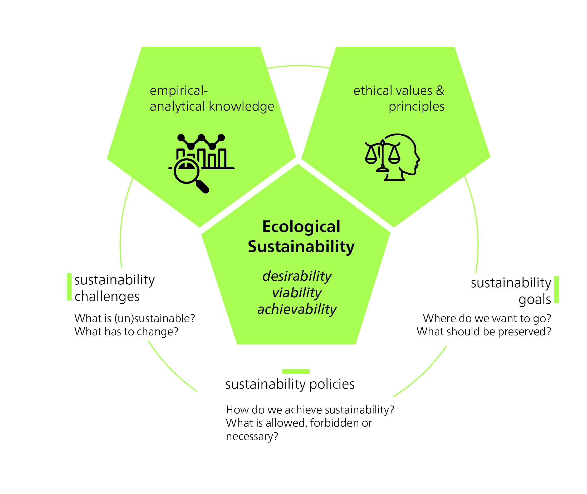

Die Wirtschaft ist nicht nur in die Gesellschaft, sondern auch in die Natur eingebettet. Menschen sind Lebewesen und daher auf materielle Ressourcen angewiesen, um ihre Bedürfnisse zu erfüllen. Sie benötigen ausserdem intakte Ökosysteme und ein für menschliche Besiedlung geeignetes Klima. Wenn wir von „ökologischer Nachhaltigkeit" sprechen, meinen wir im Allgemeinen den Schutz der Vielfalt und Funktionsfähigkeit natürlicher Ökosysteme und der von ihnen bereitgestellten Dienstleistungen für künftige Generationen. Dies ist eine anthropozentrische Definition, da sie sich auf menschliche Aktivitäten konzentriert und darauf, wie diese die langfristige Nachhaltigkeit der Natur zum Nutzen des Menschen sicherstellen sollen. Diese Perspektive spiegelt sich auch in unserem Alltag und unserer dualistischen Trennung von „Mensch" und „Umwelt" wider, eine Trennung, die auf das 19. Jahrhundert zurückgeht und bis heute anhält. So unterteilen wir die Wissenschaft beispielsweise in „Naturwissenschaften" und „Sozialwissenschaften", und unsere Analysen konzeptualisieren Umweltschäden oft als „Externalitäten". Ein anderes Verständnis von ökologischer Nachhaltigkeit betont die Bedeutung der Aufrechterhaltung der Selbstregulierung des Erdklimasystems. Diese Sichtweise hebt die Wechselwirkungen und Rückkopplungen zwischen verschiedenen Komponenten des Erdklimasystems hervor.

## Die normative Dimension ökologischer Nachhaltigkeit

Obwohl unser Verständnis der Funktionsweise von Ökosystemen auf gründlich erforschten empirischen Informationen basiert (und damit „Systemwissen" darstellt), bleibt ökologische Nachhaltigkeit ein normatives Konzept. Das bedeutet, dass sie nicht nur auf wissenschaftlichen Erkenntnissen, sondern auch auf einer ethischen Beurteilung beruht (@fig-normative-dimension). Die verschiedenen Interpretationen ökologischer Nachhaltigkeit bieten unterschiedliche Antworten auf die Frage, was erhalten werden sollte und warum. Jeder Ansatz zur ökologischen Nachhaltigkeit drückt daher den angestrebten Zustand der ökologischen Umwelt aus, sowohl heute als auch in der Zukunft – welche Aspekte der Natur von der Gegenwart in die Zukunft erhalten oder bewahrt werden sollen. Wenn wir beispielsweise über Ökosystemdienstleistungen sprechen, ist die Absicht oft, Ökosysteme so zu erhalten, dass sie unser eigenes Wohlergehen weiterhin unterstützen und aufrechterhalten (in diesem Sinne ist es eine anthropozentrische Perspektive).

{#fig-normative-dimension}

Ethische Urteile und Begründungen prägen, welche ökologischen Eigenschaften und Funktionen wir für künftige Generationen erhalten und welche wir als intrinsisch wertvoll in der Natur erachten. Was ist ein wünschenswerter Zustand für Ökosysteme, und warum? Welche Aspekte der ökologischen Umwelt verdienen Schutz, und welches Ziel verfolgt dieser Schutz? Ist es notwendig, Ökosysteme so unberührt wie möglich zu halten, und wie definieren wir „Natürlichkeit"? In welchem Umfang sollten wir Ökosysteme uneingeschränkt für menschliche Zwecke nutzen, und gibt es Bereiche, die wir Organismen überlassen sollten, mit minimalen menschlichen Eingriffen? Interpretationen ökologischer Nachhaltigkeit hängen von den verfolgten Zielen ab: für wen, warum und wie (@fig-normative-dimension).

::: {.callout-tip collapse="true"}
#### Konkrete Beispiele ethischer Beurteilungen im Kontext ökologischer Nachhaltigkeit

Wildtierschutz: Sollten wir in natürliche Wildtierpopulationen eingreifen, um gefährdete Arten zu schützen und das Gleichgewicht der Ökosysteme zu erhalten? Oder sollten wir die Natur so unberührt wie möglich lassen, auch wenn dies den Verlust einiger Arten bedeutet?

Biotechnologische Eingriffe: Ist es moralisch vertretbar, biotechnologische Methoden wie Gentechnik einzusetzen, um die ökologischen Eigenschaften von Organismen zu verändern und möglicherweise Ökosysteme zu beeinflussen?

Schutz gefährdeter Arten: Sollten wir uns auf den Schutz und die Erhaltung gefährdeter Arten konzentrieren, um die Biodiversität zu erhalten, oder sollten wir uns auf die Erhaltung weit verbreiteter Arten konzentrieren, die für die menschliche Ernährung oder die Wirtschaft wichtiger sind?

Schutz von Ökosystemen: Sollten wir Schutzgebiete einrichten, um bedrohte Ökosysteme und Arten zu erhalten, auch wenn dies lokale Gemeinschaften in ihren wirtschaftlichen Aktivitäten einschränkt? Wie können wir eine Balance zwischen Schutz und nachhaltiger Nutzung herstellen?
:::








