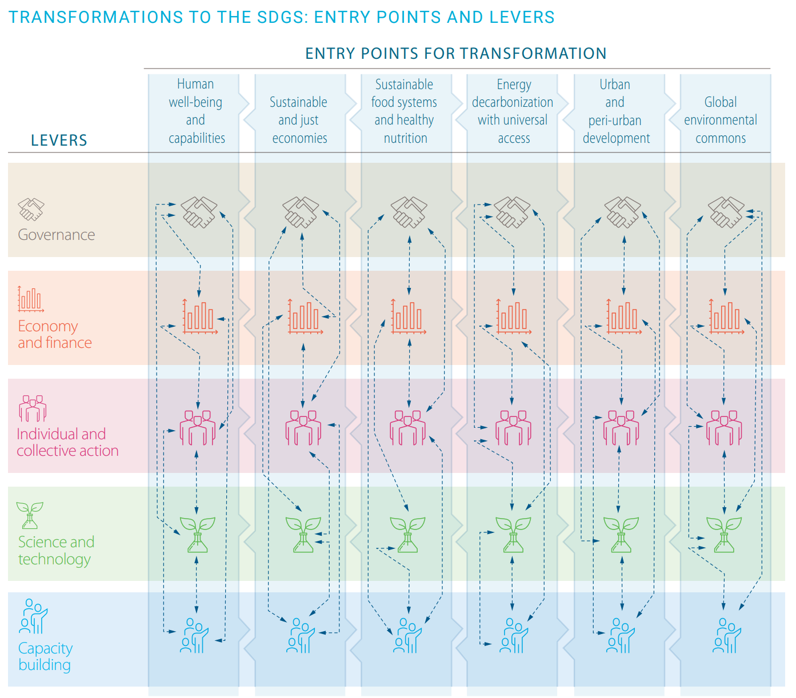

## Strategische Ansätze

Heutzutage werden verschiedene Strategien verfolgt oder zumindest in Betracht gezogen, um eine Transformation in der ökologischen Dimension der nachhaltigen Entwicklung zu erreichen (vgl. @fig-GDSR für eine nicht abschliessende Aufzählung). Einige dieser Strategien wurden bereits in diesem Lehrbuch besprochen. Obwohl die genannten Ansätze nicht zwingend per se transformativ sein müssen, können sie bei geeigneter Anwendung durchaus Auswirkungen auf die ökologische Dimension der Nachhaltigkeit haben. Die in diesem Abschnitt vorgestellten Ansätze werden gemäss den „Hebeln für die Transformation" des Global Sustainable Development Report (GSDR) kategorisiert. Der GSDR 2019 definiert vier Hebel: Governance, Wirtschaft und Finanzen, individuelle und kollektive Handlungen sowie Wissenschaft und Technologie. Der GSDR 2023 fügte einen fünften Hebel hinzu – Kapazitätsaufbau –, da dieser sowohl als Hebel selbst als auch als unterstützender Faktor für die anderen Hebel für einen transformativen Prozess unerlässlich ist (Independent Group of Scientists appointed by the Secretary-General, 2023).

{#fig-GDSR}

Für jeden Hebel stellen wir ausgewählte Strategien vor, die mit unseren drei Schwerpunktthemen in diesem Kapitel – Klima, Landnutzung oder Biodiversität – zusammenhängen:

Der **Governance**-Hebel umfasst Institutionen und Räume, die die Entwicklungsrichtung bestimmen, indem sie Ziele setzen, Massnahmen koordinieren, Regulierungen schaffen und die Finanzierung auf nationaler und regionaler Ebene erleichtern. Gute Governance sollte auch Synergien fördern, Interessenkonflikte berücksichtigen und die Zusammenarbeit zwischen einem breiten Spektrum von Stakeholdern stärken. Governance spielt damit eine Schlüsselrolle bei der Entwicklung und Umsetzung von Strategien zur ökologischen Nachhaltigkeit, da sie den politischen Rahmen für nachhaltige Praktiken durch regulatorische Mechanismen, Anreizstrukturen und Gesetze schaffen kann. Zu den Governance-Hebeln gehören:

-   Schaffung von Schutzgebieten zur Erhaltung der Biodiversität

-   Subventionen für nachhaltige Praktiken, wie Direktzahlungen für biodiversitätsfreundliche Bewirtschaftungsmethoden

Der Hebel **Wirtschaft und Finanzen** bezieht sich in erster Linie auf die erheblichen öffentlichen und privaten Investitionen, die zur Erreichung der SDGs und der Transformation erforderlich sind (global zwischen 1,4 und 2,5 Billionen US-Dollar pro Jahr). Dieser Hebel ist damit ein wichtiger Ermöglicher von Strategien und Politiken zur ökologischen Nachhaltigkeit, beispielsweise durch die Finanzierung nachhaltiger Technologien. Beispiele umfassen:

-   Zahlungen für Ökosystemdienstleistungen (PES)

-   REDD+-Programme zur Reduzierung von Entwaldung und zur Förderung nachhaltiger Landnutzung

Der Hebel **Wissenschaft und Technologie** bezieht sich auf soziale und technologische Innovationen sowie auf kosteneffektive und skalierbare Technologien. Dazu gehören Investitionen in Forschung und Entwicklung, die Förderung einer stärkeren internationalen Zusammenarbeit und die Ermöglichung des Zugangs zu bewährten Technologien (insbesondere für Länder mit niedrigem Einkommen). Wissenschaft kann dabei helfen, komplexe Zusammenhänge zu erklären und evidenzbasierte Lösungen zu entwickeln. Wesentliche Hebel für Nachhaltigkeitstransformationen umfassen:

-   Technologien zur Kohlenstoffbindung

-   Naturbasierte Lösungen, die natürliche Prozesse nutzen, um dem Klimawandel und Umweltproblemen zu begegnen

-   Innovative Landnutzungssysteme, wie Agroforstwirtschaft

**Individuelle und kollektive Handlungen**\
Sozialer Wandel beginnt oft in den Herzen und Köpfen der Menschen durch lokale Organisation und Mobilisierung, bevor er sich in Gesetze und Wirtschaftspolitik übersetzt. Wenn eine kritische Masse neue Praktiken oder Normen annimmt, kann dies durch Bildung, Informationskampagnen, finanzielle Anreize und Gesetzgebung unterstützt und auf die gesamte Gesellschaft ausgedehnt werden. Beispiele für Nachhaltigkeitsstrategien und -politiken im Bereich der individuellen und kollektiven Handlungen umfassen:

-   Kampagnen für nachhaltigen Konsum, die Konsument*innen motivieren, umweltfreundliche Produkte zu wählen

-   Förderung solidarischer Landwirtschaftsmodelle (SoLaWi), die die regionale und ökologische Nahrungsmittelproduktion stärken

**Kapazitätsaufbau**\
Der Kapazitätsaufbau zur Unterstützung der Transformation zur Erreichung der SDGs ist vielschichtig und hängt von den Zielen, den erforderlichen Transformationen sowie dem spezifischen Landes- oder Regionalkontext ab. Unter anderem sind Kompetenzen in den Bereichen strategische Ausrichtung, Innovation, Koordination, Lernen und Resilienz erforderlich. Zu den Strategien und Politiken zur ökologischen Nachhaltigkeit im Zusammenhang mit dem Kapazitätsaufbau-Hebel gehören:

-   Einrichtung von Beratungszentren oder digitalen Plattformen zur Ermöglichung kontinuierlichen Lernens und des Austauschs bewährter Praktiken, z. B. im Bereich der Agroforstwirtschaft

-   Unterstützung lokaler Initiativen zur Verbesserung des Wissenstransfers

Hinweis: Es ist wichtig zu beachten, dass Ansätze nicht immer synergetisch sind; oft gehen Ansätze, die eine ökologische Dimension der Nachhaltigkeit adressieren, mit Zielkonflikten mit anderen Ansätzen oder mit der sozialen oder wirtschaftlichen Dimension der Nachhaltigkeit einher.

::: {.callout-note collapse="true"}
#### Weiterführende Literatur

Guyer, Madeleine, Myriam Steinemann, and Nina Saalismaa. 2022. *Biodiversity and Sustainable Development*. Climate Change & Environment Nexus Brief. Swiss Agency for Development and Cooperation.
:::
