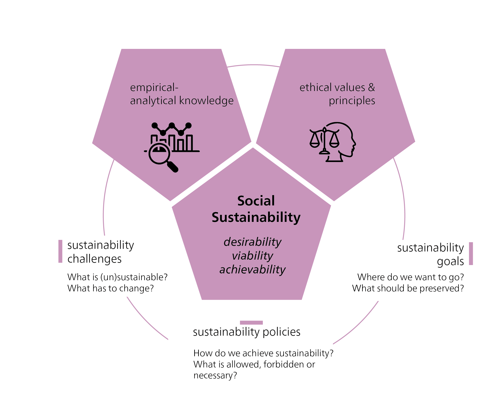
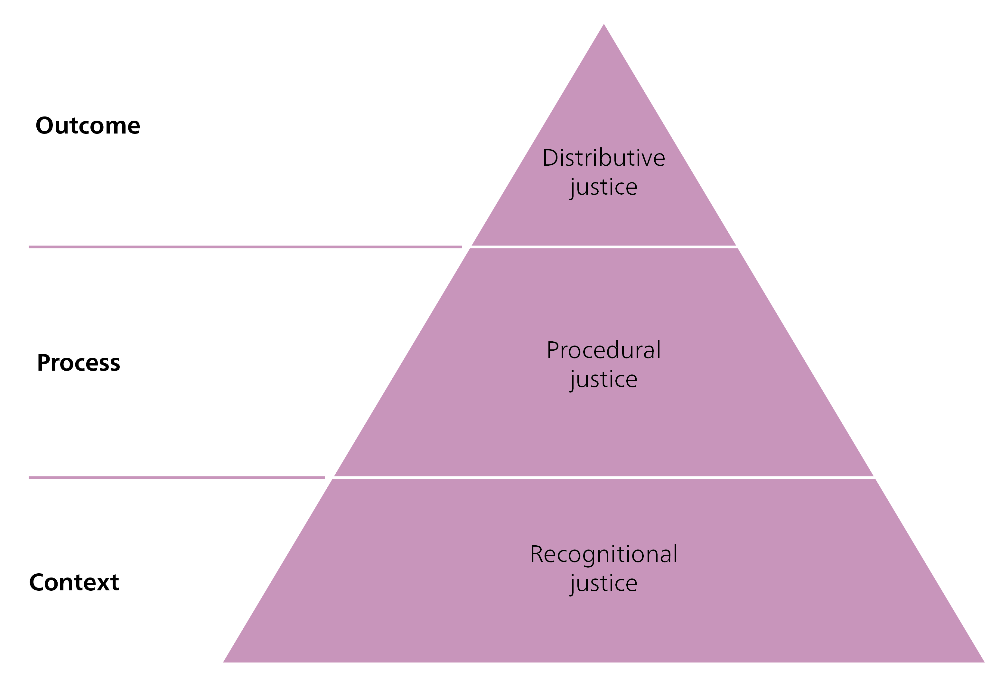
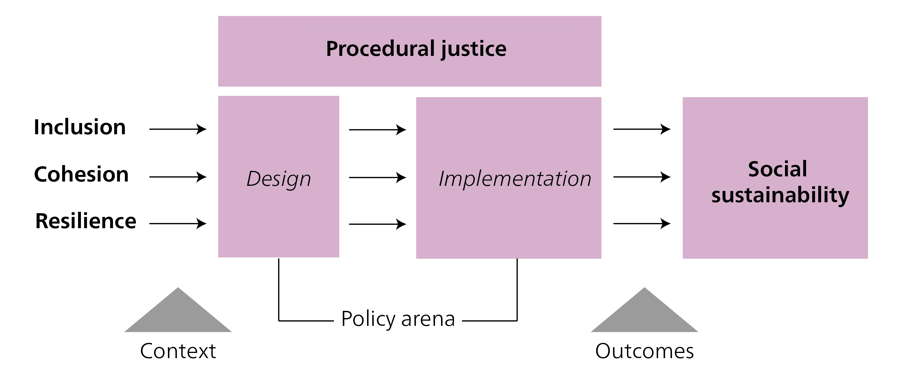
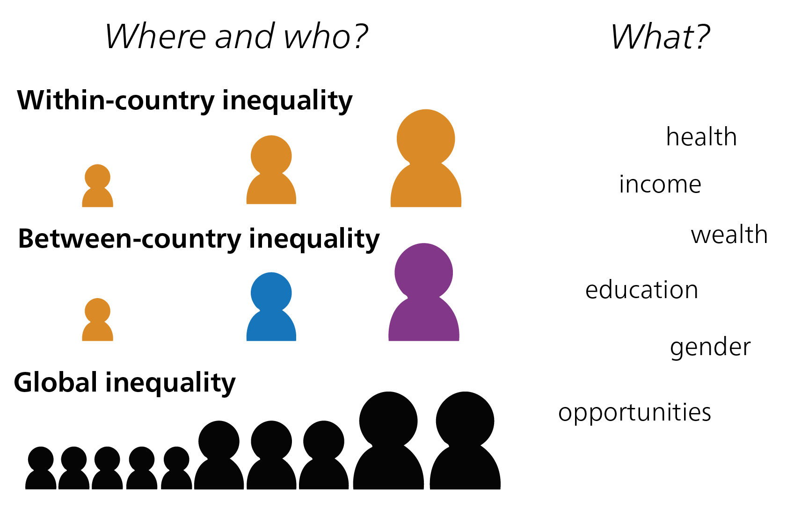
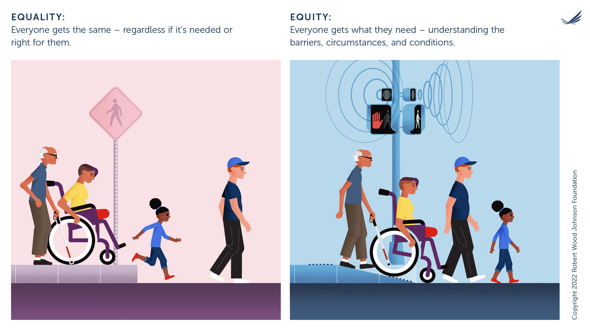
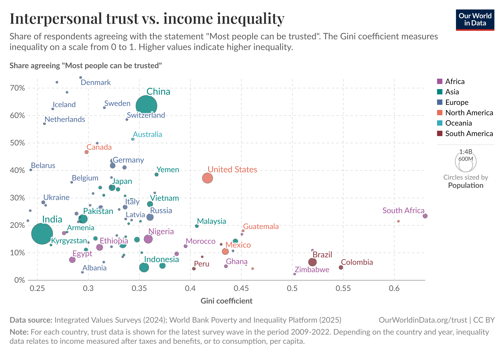
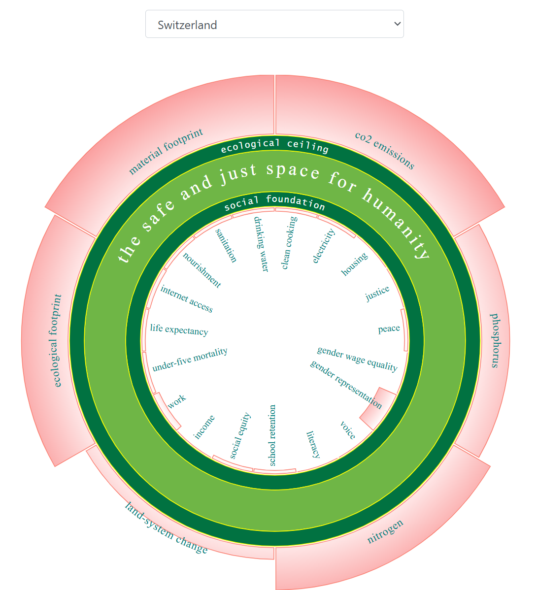
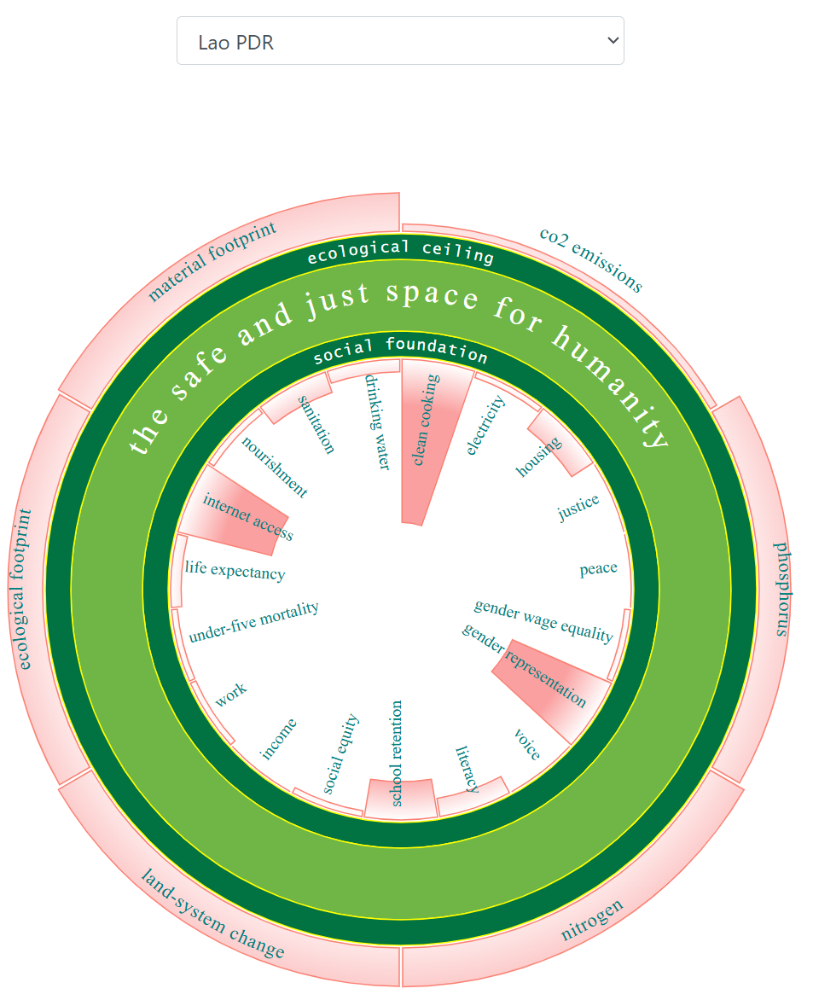
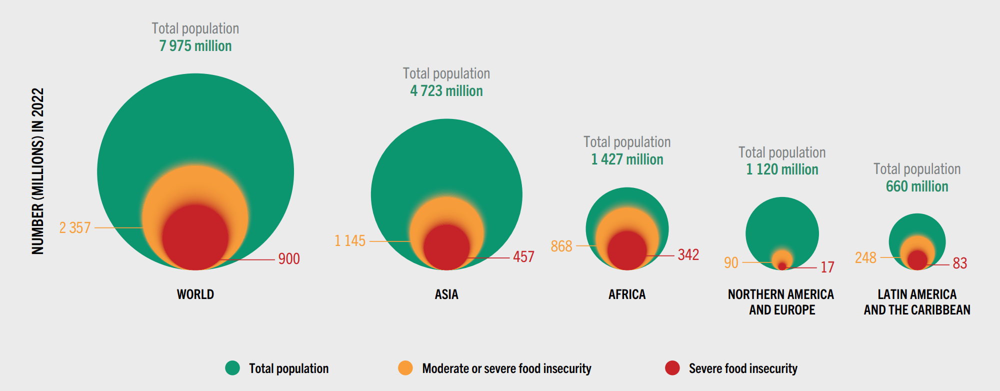
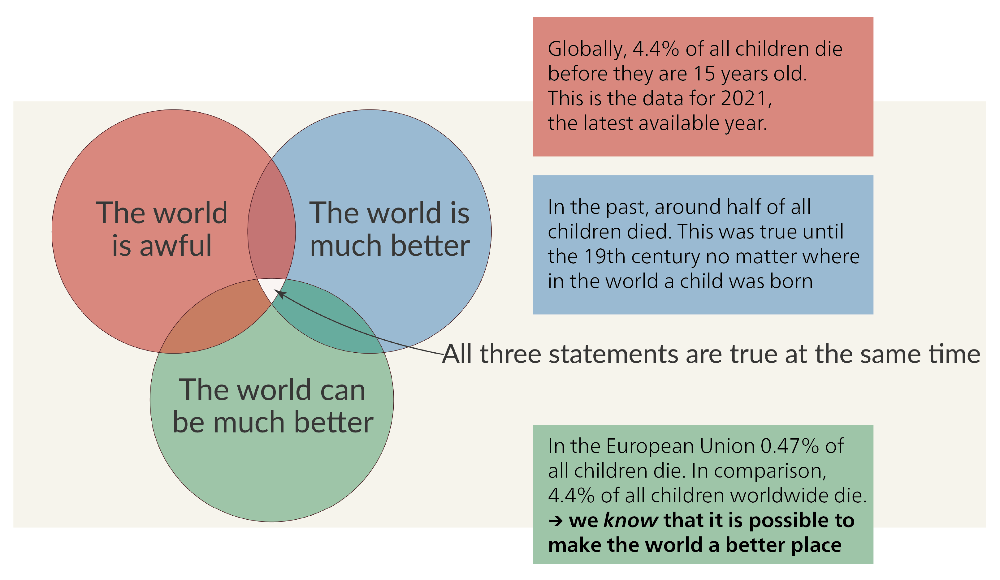

**Soziale Nachhaltigkeit** betrifft das Wohlergehen einer Gemeinschaft und umfasst Elemente wie Inklusion, Gerechtigkeit und sozialen Zusammenhalt. Oft wird argumentiert, dass diese Dimension der nachhaltigen Entwicklung schwerer zu erfassen ist als ökologische oder wirtschaftliche Nachhaltigkeit [@foladoriAdvancesLimitsSocial2005]. Das liegt daran, dass soziale Probleme möglicherweise nicht so unmittelbar sichtbar sind wie etwa die Zerstörung von Regenwäldern oder Hyperinflation. Was bedeutet Nachhaltigkeit, wenn Gemeinschaften durch Ereignisse wie Überschwemmungen ungleich betroffen sind oder wenn indigene Völker durch Infrastrukturprojekte vertrieben werden? Diese Auswirkungen offenbaren tief verwurzelte Ungleichheiten, die weitgehend auf den sozialen Strukturen von Gesellschaften beruhen.

Deshalb ist die soziale Dimension so wichtig. Eine sozial nachhaltige Gesellschaft ist besser darauf vorbereitet, Herausforderungen fair und gerecht zu bewältigen [@balletPolicyFrameworkSocial2020]. Darüber hinaus ist soziale Akzeptanz entscheidend für die erfolgreiche Umsetzung von Nachhaltigkeitsmassnahmen und -initiativen [@assefaSocialSustainabilitySocial2007; @wustenhagenSocialAcceptanceRenewable2007].

Kurz gesagt: Soziale Nachhaltigkeit adressiert die folgende Herausforderung: Wie können wir eine ressourcenschonende Gesellschaft schaffen, ohne Armut und Ungleichheit zu verstärken? Dies erfordert eine Abwägung grundlegender Fragen der Verteilungsgerechtigkeit mit der Spannung zwischen menschlichen Bedürfnissen und Wünschen.

Dieses Kapitel beginnt mit der Einführung sozialer Nachhaltigkeit als normative Dimension nachhaltiger Entwicklung. Wir definieren das Konzept, indem wir uns auf folgende Schlüsselelemente konzentrieren: Inklusion, sozialer Zusammenhalt, Resilienz und Gerechtigkeit. Abschliessend befassen wir uns mit dem kulturellen Aspekt. Während einige Wissenschaftler*innen Kultur als Bestandteil sozialer Nachhaltigkeit betrachten, argumentieren andere, dass sie als vierte Dimension in ihrer eigenen Berechtigung betrachtet werden sollte – neben der ökologischen, sozialen und wirtschaftlichen Dimension [@sabatiniCultureFourthPillar2019].

## Soziale Nachhaltigkeit als normatives Konzept

Interpretationen sozialer Nachhaltigkeit basieren einerseits auf empirischem Wissen darüber, wie Gesellschaften funktionieren, und andererseits auf ethischen Urteilen darüber, was wertvoll ist und angestrebt werden sollte. Um angemessene Nachhaltigkeitsziele zu definieren, müssen wir wissen, auf welchen ethischen Grundsätzen und Werten ein bestimmtes soziales System basiert. Mit anderen Worten: Was betrachtet eine Gesellschaft oder Gemeinschaft als „gut", wünschenswert und gerecht?

Als normatives Konzept zielt soziale Nachhaltigkeit auf eine gerechte Verteilung von Vorteilen und Kosten innerhalb der Gesellschaft ab. Sie umfasst verschiedene Dimensionen der Gleichheit [vgl. @sec-Dimjustice] und Gerechtigkeit [vgl. @sec-justice] und untersucht, wie die innerhalb einer bestimmten Gesellschaft getroffenen Entscheidungen die Verteilung von Ressourcen beeinflussen.

{#fig-NESocial}

Diese Aspekte werden durch Kate Raworths Donut-Ökonomik [-@raworthDoughnutAnthropoceneHumanitys2017] veranschaulicht, einem Rahmen, der die SDGs und Menschenrechte als Grundlage für sozial nachhaltige und gerechte menschliche Aktivitäten betrachtet. In der Donut-Ökonomik ist die Befriedigung der Grundbedürfnisse aller Menschen zentral. Diese Grundbedürfnisse, die das soziale Fundament des Rahmens bilden, umfassen Zugang zu sauberem Wasser, Sanitärversorgung, Gesundheitsversorgung, Bildung, Nahrung, sauberen Kochgelegenheiten, Strom, Wohnraum sowie Informations- und Unterstützungsnetzwerken, sowie die Möglichkeit zu arbeiten und ein Einkommen zu erzielen. Weitere Faktoren, die das soziale Fundament bilden, sind Geschlechtergleichstellung, soziale Gleichheit, Frieden und Gerechtigkeit sowie politische Teilhabe – d. h. die Möglichkeit, gesellschaftlichen Einfluss auszuüben.

In der Donut-Ökonomik könnten Wirtschaftspolitiken dazu beitragen, soziale Gerechtigkeit zu erreichen, indem Vorteile und Kosten verteilt werden, ohne planetare Grenzen zu überschreiten. Und darin liegt die Herausforderung: Länder, die hinsichtlich sozialer Nachhaltigkeitsindikatoren – z. B. Zugang zu Nahrung, Bildung oder Wohnraum – gut abschneiden, überschreiten häufig ökologische Grenzen. Umgekehrt schneiden Länder, die innerhalb dieser ökologischen Grenzen bleiben, oft in sozialen Bereichen schlecht ab [vgl. @fig-SocEcoBoundaries; @oneillGoodLifeAll2018]. Ein Gleichgewicht zwischen sozialen und ökologischen Anforderungen herzustellen ist daher entscheidend.

{#fig-SocEcoBoundaries}

Um eine nachhaltige Zukunft zu erreichen, argumentiert @raworthDoughnutAnthropoceneHumanitys2017, dass die Ressourcen der Erde gerechter verteilt werden müssen. Dies würde es allen ermöglichen, ihre Grundbedürfnisse zu erfüllen und gleichzeitig die Grenzen des Planeten zu respektieren. Es würde Veränderungen im Lebensstil erfordern – insbesondere bei den Wohlhabenden, die für den Grossteil der Emissionen verantwortlich sind. Derzeit tendieren diejenigen, die mehr Emissionen verursachen, zu einem besseren Zugang zu wesentlichen Gütern wie Nahrung, Wasser, Energie und Bildung – genau jenen Dingen, an denen es Menschen in einkommensschwächeren Ländern oft mangelt. In wohlhabenderen Ländern werden die Grundbedürfnisse der Menschen in der Regel umfassender erfüllt, was zu mehr Wohlstand, Gleichheit und Gerechtigkeit führt. Gleichzeitig sind höhere Lebensstandards oft mit erhöhten Treibhausgasemissionen und erhöhtem Konsum verbunden – wie in westlichen Industrieländern (z. B. USA, Europa) und China zu beobachten.

Ein weiterer Ansatz zur sozialen Nachhaltigkeit findet sich in den Human Development Reports der Vereinten Nationen, die ein auf dem Fähigkeitenansatz basierendes Modell menschlicher Entwicklung verwenden [vgl. @sec-CA]. Der Fähigkeitenansatz fragt, was eine Person braucht, um ein gutes und erfülltes Leben zu führen. Da verschiedene Menschen unterschiedliche Ressourcen benötigen, um dies zu erreichen, fördert das Geben desselben für alle keine echte Gleichheit. Stattdessen sollten wir jeder Person das geben, was sie braucht, um ein Leben zu führen, das sie wertschätzen kann. Dieses Modell menschlicher Entwicklung fördert die Achtung der Menschenwürde als unveräusserliches Recht und befürwortet die Bereitstellung realistischer Möglichkeiten für alle, aufzublühen.

### Dimensionen der Gerechtigkeit {#sec-Dimjustice}

Donut-Ökonomik und Fähigkeitenansatz sind zwei Beispiele für prägnante und einflussreiche normative Rahmenwerke. In diesem Kapitel behandeln wir eine Reihe von Konzepten und Ansätzen, die – durch ihre sozialen Dimensionen – inhärent normative und ethische Überlegungen beinhalten.

Die vielen Theorien und Konzepte sozialer Nachhaltigkeit sind auch mit unterschiedlichen Vorstellungen von „Gerechtigkeit" verknüpft. Einige davon werden in @sec-justice näher beschrieben. Drei häufig genannte Dimensionen sind: Verteilungsgerechtigkeit, Verfahrensgerechtigkeit und Anerkennungsgerechtigkeit [@debruinEasierSaidDefined2024; @tribaldosJustTransitionPrinciples2022; @wijsmanWhatWeMean2022].

{#fig-justice}

**Verteilungsgerechtigkeit** ist ein ergebnisorientiertes Konzept, das auf eine faire Verteilung von Gütern und Lasten abzielt, unabhängig von sozialen Unterschieden. Dieses Prinzip gilt für Fragen wie den Zugang zu sauberem Wasser, die ungleiche Belastung durch Umweltverschmutzung oder gleiche Bezahlung.

**Verfahrensgerechtigkeit** konzentriert sich auf die Inklusivität von Entscheidungsprozessen. Sie fordert, dass unterrepräsentierte Gruppen in Institutionen fair vertreten sind, sodass ihre Perspektiven in Entscheidungsprozesse eingehört und einbezogen werden können.

**Anerkennungsgerechtigkeit** betont die Bedeutung des Kontexts und des Respekts vor sozialen und kulturellen Unterschieden. Sie beinhaltet die Anerkennung struktureller Ungerechtigkeiten, den Respekt vor den Würden und Werten verschiedener Menschen und sozialer Gruppen sowie das Verständnis, dass unterschiedliche Bedürfnisse und Präferenzen in verschiedenen historischen Erfahrungen, Identitäten und kulturellen Hintergründen verwurzelt sind.

@tbl-justice zeigt, wie sich diese drei Dimensionen gegenseitig beeinflussen [@wijsmanWhatWeMean2022]. Eine ausführlichere Diskussion von Verteilungs- und Verfahrensgerechtigkeit folgt in @sec-justice, da dies die Dimensionen sind, die Debatten über soziale Nachhaltigkeit am stärksten beeinflussen.

```{r}
#| label: tbl-justice
#| tbl-cap: "Zusammenhänge zwischen Verteilungsgerechtigkeit, Verfahrensgerechtigkeit und Anerkennungsgerechtigkeit. Quelle: Basierend auf @wijsmanWhatWeMean2022."

library(kableExtra)
is_pdf <- knitr::is_latex_output()

df <- data.frame(
  Dimension = c("Verteilungsgerechtigkeit", "Verfahrensgerechtigkeit", "Anerkennungsgerechtigkeit"),
  `Verteilungsgerechtigkeit` = c(
    "—",
    "Die Teilnahme an Entscheidungsprozessen kann deren Ergebnisse beeinflussen – und damit, wie Vor- und Nachteile zwischen Einzelpersonen und Gruppen verteilt werden.",
    "Die Anerkennung von Einzelpersonen oder Gruppen als wertvoll kann beeinflussen, wie Ressourcen verteilt werden."),
  `Verfahrensgerechtigkeit` = c(
    "Die Verteilung von Ressourcen kann beeinflussen, wie leicht oder schwer es für Einzelpersonen oder Gemeinschaften ist, an Entscheidungsprozessen teilzunehmen. Dies liegt daran, dass Teilhabe Zeit, Energie und finanzielle Ressourcen erfordert.",
    "—",
    "Die Anerkennung von Einzelpersonen oder Gruppen als wertvoll kann auch bestimmen, wer zur Teilnahme an Entscheidungsprozessen eingeladen wird."),
  `Anerkennungsgerechtigkeit` = c(
    "Die Verteilung von Ressourcen kann beeinflussen, wessen Interessen in Entscheidungsprozessen berücksichtigt werden – und wessen Identität anerkannt und als wichtig erachtet wird.",
    "Die Teilnahme an Entscheidungsprozessen kann beeinflussen, wessen Interessen gehört werden und welche Einzelpersonen oder Gemeinschaften als wichtig anerkannt werden.",
    "—"),
  check.names = FALSE
)

df |>
  kbl(booktabs = TRUE, align = "l", longtable = is_pdf) |>
  kable_styling(
    bootstrap_options = c("striped", "hover", "condensed"),
    latex_options = if (is_pdf) c("hold_position", "repeat_header") else NULL,
    full_width = !is_pdf,
    font_size = if (is_pdf) 8 else NULL
  ) |>
  row_spec(0, bold = TRUE) |>
  column_spec(1, width = if (is_pdf) "1.6cm" else NA, bold = TRUE) |>
  column_spec(2:4, width = if (is_pdf) "3.25cm" else NA)


```

## Soziale Nachhaltigkeit definieren

Im Laufe der Zeit haben sich Diskussionen über soziale Nachhaltigkeit auf verschiedene Themen konzentriert. Dazu gehören Armutsbekämpfung, Entwicklung, Grundbedürfnisse, Lebensgrundlagen und Gleichheit – ebenso wie Identität, Zugehörigkeit sowie Stabilität und Sicherheit von Gemeinschaften [@glassonUrbanRegenerationImpact2009]. Diese thematische Vielfalt spiegelt sich in den zahlreichen verfügbaren Definitionen sozialer Nachhaltigkeit wider. Die Literatur wird in der Tat oft als fragmentiert, vage oder bisweilen chaotisch beschrieben [@mehanSocialSustainabilityUrban2017]. Einige Forscher*innen haben sogar argumentiert, dass sich das Konzept der sozialen Nachhaltigkeit in den letzten 30 Jahren stärker verändert hat als die ökologischen und wirtschaftlichen Dimensionen [@foladoriAdvancesLimitsSocial2005].

Soziale Nachhaltigkeit lässt sich daher am besten als ein dynamisches Konzept verstehen, das je nach Zeit und Ort unterschiedliche Formen annimmt [@boyerFiveApproachesSocial2016; @dempseySocialDimensionSustainable2011]. Soziale Prioritäten sind vielfältig und kontextspezifisch und verändern sich im Laufe der Zeit. Zudem gibt es erhebliche kulturelle und lokale Unterschiede hinsichtlich dessen, was als sozial vertretbar und wünschenswert gilt.

Trotz dieser Vielfalt beschreiben Definitionen sozialer Nachhaltigkeit im Allgemeinen einen positiven Zustand, der bereits besteht oder als erreichbar gilt. Er wird häufig mit dem Ziel verbunden, den sozialen Zusammenhalt zu stärken und grundlegende Dienstleistungen bereitzustellen, die zum Wohlergehen beitragen, wie Gesundheitsversorgung, Bildung, Mobilität, Wohnraum oder Freizeitangebote. Soziale Nachhaltigkeit ist dann erreicht, wenn soziale Prozesse, Systeme, Strukturen und Beziehungen aktiv dazu beitragen, dass aktuelle und künftige Generationen gesunde und lebensfähige Gemeinschaften aufbauen können.

Für die Brundtland-Kommission (1987) besteht das Hauptziel der sozialen Dimension nachhaltiger Entwicklung darin, grundlegende menschliche Bedürfnisse zu erfüllen. Diese umfassen nicht nur sauberes Wasser, Nahrung und Sicherheit – sie erstrecken sich auch auf Aspekte wie Wohlergehen, Gerechtigkeit, ein demokratisches Regierungssystem und eine lebendige Zivilgesellschaft. Diese umfassende Definition kann in verschiedenen Kontexten flexibel angewendet werden.

Um einen konkreteren Rahmen bereitzustellen, schlagen @barronSocialSustainabilityDevelopment2023 und @cuestaSocialSustainabilityPoverty2024 folgenden strukturierten Ansatz vor (vgl. @fig-framework).

{#fig-framework}

Die linke Seite von Abbildung @fig-framework zeigt drei Dimensionen eines bestimmten Kontexts, nämlich: Inklusion, sozialer Zusammenhalt und Resilienz. Jede dieser Dimensionen – im Folgenden definiert – kann in einer Gemeinschaft oder Gesellschaft in unterschiedlichem Ausmass vorhanden sein:

1.  **Inklusion** bezeichnet den Zugang aller Einzelpersonen und Gruppen zu den wirtschaftlichen, politischen, sozialen und kulturellen Sphären.

2.  **Sozialer Zusammenhalt** ist ein gemeinsames Zugehörigkeits- und Vertrauensgefühl, das Gemeinschaften und Gruppen ermöglicht, ohne Konflikte zusammenzuarbeiten.

3.  **Resilienz** bezeichnet die Fähigkeit, interne oder externe Schocks – wie Umweltveränderungen oder politische Krisen – zu vermeiden oder deren Auswirkungen abzufedern.

Der mittlere Teil betont die Bedeutung von **Verfahrensgerechtigkeit** – der Fairness von Entscheidungsprozessen bei der **Gestaltung** und **Umsetzung** von Politiken und Programmen. Wenn diese Prozesse als fair, transparent und vertrauenswürdig wahrgenommen werden, erzeugen sie **Prozesslegitimität**, d. h. die Menschen akzeptieren die Autorität von Entscheidungen und sind eher bereit, diese zu unterstützen und zu befolgen. Der Prozess der Gestaltung und Umsetzung von Politiken und Programmen findet in einer sogenannten „policy arena" (Politikarena) statt. Der Begriff „Politikarena" ist weit gefasst und umfasst politische Foren auf lokaler, nationaler, regionaler oder globaler Ebene, in denen Ressourcen zugeteilt, Ziele gesetzt und Entscheidungen getroffen werden.

Schliesslich zeigt die rechte Seite der Abbildung die Ergebnisse des Gestaltungs- und Umsetzungsprozesses. Dieser Prozess kann Inklusion, sozialen Zusammenhalt und Resilienz fördern – aber auch hemmen. Diese Ergebnisse beeinflussen wiederum das künftige Niveau sozialer Nachhaltigkeit. Mit anderen Worten: Soziale Nachhaltigkeit ist dann gegeben, wenn Inklusion, sozialer Zusammenhalt und Resilienz im Laufe der Zeit schrittweise gestärkt werden – idealerweise in einem legitimen und transparenten Prozess.

Die folgenden Abschnitte erläutern die Kernelemente Inklusion, sozialer Zusammenhalt, Resilienz und Gerechtigkeit (sowohl Verfahrens- als auch Verteilungsgerechtigkeit) näher.

## Inklusion

Inklusion befasst sich mit Fragen sozialer Ungleichheit. Soziale Inklusion zielt darauf ab, allen Menschen die Teilhabe an der Gesellschaft zu ermöglichen – insbesondere durch den Abbau tief verwurzelter systemischer Benachteiligungen. Viele Einzelpersonen und Gruppen stehen vor Barrieren, die ihre sozioökonomische Teilhabe einschränken. Solche Barrieren können Armut oder ein geringes Einkommen umfassen; andere Formen von Diskriminierung und Ausgrenzung können auf Geschlecht, Alter, Herkunft, Beruf, Ethnizität, Religion, Nationalität, Behinderung, sexueller Orientierung oder Geschlechtsidentität basieren. Solche Ungleichheiten werden durch formelle und informelle Normen, Verhaltensweisen, Gesetze und Institutionen verstärkt.

Dies wirft normative Fragen auf: Ab wann gilt Ungleichheit als problematisch? Und welches Mass an Ungleichheit ist sozial inakzeptabel? Inklusion sollte nicht als eine Form der Wohltätigkeit verstanden werden, d. h. als etwas, das nur aus ethischen Gründen „richtig" ist. Die Verringerung von Ungleichheiten hat erhebliche Vorteile für die gesamte Gesellschaft. Grössere Inklusion und Chancengleichheit führen zu besseren Ergebnissen in Bezug auf Einkommen, Armutsbekämpfung und Humankapital [@oecdItTogetherWhy2015].

Eine US-amerikanische Studie von @hsiehAllocationTalentUS2013 fand beispielsweise heraus, dass eine Verringerung der Diskriminierung gegenüber weiblichen und schwarzen Arbeitnehmer*innen zwischen 1960 und 2010 für 15 bis 20% des Wirtschaftswachstums pro Arbeitnehmer*in verantwortlich war. Dieses Wachstum wurde auf eine Zunahme talentierter Menschen zurückgeführt, die Zugang zu besseren Möglichkeiten erhielten. Andere Studien zeigen, dass Geschlechterungleichheit negative Auswirkungen auf das Wirtschaftswachstum haben kann (@fabrizioPursuingWomensEconomic2018; @klasenImpactGenderInequality2009). Es gibt auch einen Zusammenhang zwischen Inklusion und sozialer Stabilität: Länder, die aktiv die politische Teilhabe und Inklusion benachteiligter Gruppen fördern, erfahren tendenziell weniger soziale Konflikte [@unitednationsPathwaysPeaceInclusive2018].

Kurz gesagt: Die Kosten sozialer Ungleichheit – wie weniger Bildungsmöglichkeiten, niedrigere Lebenseinkommen oder schlechtere Gesundheit [@buehrenWhatAreEconomic2019; @wodonUnrealizedPotentialHigh2018] – sind nicht nur ethische Fragen. Sie beeinflussen auch die Gesamtwirtschaft, da sie Potenziale reduzieren, die Produktivität schwächen und das Konfliktrisiko erhöhen. Im Gegensatz dazu sind inklusivere Gesellschaften gerechter, stabiler und wirtschaftlich effizienter.

### (Un-)Gleichheit {#sec-CA}

Da Ungleichheit komplex und vielschichtig ist, gibt es verschiedene Möglichkeiten, sie zu analysieren, zu messen und zu bewerten. Dabei geht es darum, Fragen zu stellen, *wer* betroffen ist und *wo* – und in *welchen* Bereichen Ungleichheiten auftreten [vgl. @fig-EqualityWhat; @senEqualityWhat1979].

{#fig-EqualityWhat}

Ungleichheit kann aus verschiedenen Perspektiven betrachtet werden. Im Folgenden gehen wir näher auf den bereits erwähnten Fähigkeitenansatz ein.

**Ungleichheit betrachten: Geleitet von Sens Frage „Gleichheit wofür?" – der Fähigkeitenansatz**

Der **Fähigkeitenansatz** bietet einen normativen Rahmen zur Bewertung von Ungleichheit und menschlichem Wohlergehen, der über herkömmliche Verteilungsprinzipien hinausgeht. Traditionelle Ansätze der Verteilungsgerechtigkeit zielen entweder auf eine gleiche Verteilung nach Leistung oder auf die Garantie eines Mindestmasses an Ressourcen für alle ab. Eine vollständige Gleichheit zwischen Individuen – d. h. *Ergebnisgleichheit* – ist jedoch nahezu unmöglich zu erreichen, da viele Einflussfaktoren zufällig oder ungerecht verteilt sind. Es gilt daher als fairer, sich auf *Chancengleichheit* zu konzentrieren. Dieses Prinzip zielt darauf ab, jeder Person die Möglichkeit zu geben, ein bedeutsames und würdiges Leben mit Zugang zu zumindest einem Mindestmass an Wohlstand zu führen. Dieses Minimum sollte ausreichen, um Grundbedürfnisse zu decken und gleiche Bürgerrechte zu garantieren, sodass alle das haben, was sie zur Befriedigung ihrer Bedürfnisse und zur gleichberechtigten Teilhabe an der Gesellschaft brauchen.

Der in den 1980er Jahren vom indischen Ökonomen, Philosophen und Nobelpreisträger **Amartya Sen** entwickelte und später von der Philosophin **Martha Nussbaum** erweiterte Fähigkeitenansatz dient als Alternative zur traditionellen Wohlfahrtsökonomie, die Wohlstand primär anhand wirtschaftlicher Indikatoren misst [@roderCapabilityApproachArmartya2020]. Der Fähigkeitenansatz lenkt die Aufmerksamkeit weg von formellen Ansprüchen oder wirtschaftlichen Aggregaten hin zu den **realen Freiheiten der Menschen, das Leben zu führen, das sie schätzen**. Er betont, dass echte Entwicklung nicht nur vom Vorhandensein von Möglichkeiten und Ressourcen abhängt, sondern auch davon, ob Einzelpersonen diese in der Praxis tatsächlich nutzen können. Dies wiederum wird durch persönliche Faktoren wie Gesundheit oder Behinderung sowie durch soziale, politische und umweltbezogene Bedingungen geprägt. Für Menschen mit Behinderungen beispielsweise erfordert Wohlergehen mehr als die formelle Anerkennung von Rechten; es hängt von einer inklusiven Gesellschaft ab, die Barrieren abbaut, Diskriminierung bekämpft, Zugang zu Bildung sicherstellt und die Teilhabe an politischen und gesellschaftlichen Entscheidungsprozessen ermöglicht.

Der Fähigkeitenansatz definiert Wohlergehen in Bezug auf **Befähigungen** und **Funktionsweisen**. Befähigungen sind reale Handlungsmöglichkeiten – d. h. was Menschen tun oder sein könnten, wenn sie frei wählen könnten. Zum Beispiel gut ernährt zu sein, zu heiraten, gebildet zu sein oder ohne Einschränkungen zu reisen. Funktionsweisen sind die Befähigungen, die tatsächlich verwirklicht werden. Ob Menschen verfügbare Ressourcen wie Einkommen, Bildung oder öffentliche Dienstleistungen in Funktionsweisen umwandeln können, hängt von **Umwandlungsfaktoren** ab. Dazu gehören persönliche Merkmale, soziale Strukturen und Umweltbedingungen. Sie bestimmen letztlich, ob Befähigungen und Funktionsweisen tatsächlich genutzt werden können.

Der Fähigkeitenansatz verlagert den Fokus daher von **Gleichheit** zu **Gerechtigkeit/Fairness**. Während *Gleichheit* darauf abzielt, dass alle die gleichen Ressourcen erhalten (d. h. Input), konzentriert sich *Gerechtigkeit/Fairness* auf das Ergebnis: Was braucht eine Person, um ein vergleichbares Wohlergehen zu erreichen (d. h. Output)? (vgl. @fig-EqualityEquity).

{#fig-EqualityEquity}

**Ungleichheit betrachten: Wo und wen?**

Aufbauend auf dem Fähigkeitenansatz, der die realen Möglichkeiten der Menschen betont, das Leben zu führen, das sie schätzen, ist es entscheidend anzuerkennen, dass Ungleichheit auf unterschiedliche Weise manifest werden und über verschiedene Dimensionen hinweg bewertet werden kann. Ungleichheit kann in verschiedenen Räumen analysiert werden, beispielsweise durch die Unterscheidung zwischen **absoluter** und **relativer Ungleichheit** [@nino-zarazuaGlobalInequalityRelatively2017] oder zwischen **vertikaler** und **horizontaler Ungleichheit** [@stewartHorizontalInequalitiesNeglected2005].

**Absolute Ungleichheit** beschreibt eine Situation, in der Menschen nicht in der Lage sind, ihre grundlegendsten Überlebensbedürfnisse zu erfüllen. Dies ist beispielsweise dann der Fall, wenn eine Person keinen Zugang zu sauberem Trinkwasser, ausreichend Nahrung oder sicherem Wohnraum hat und unter der Armutsgrenze lebt. Diese Form der Ungleichheit wird oft durch feste Einkommensschwellen definiert, wie z. B. die internationale Armutsgrenze der Weltbank.

**Relative Ungleichheit** misst den Nachteil einer Person im Verhältnis zum durchschnittlichen Lebensstandard innerhalb einer bestimmten Gesellschaft oder Gemeinschaft. Eine Familie in einem reichen Land mag beispielsweise über ausreichendes Einkommen für Nahrung und Wohnraum verfügen, aber möglicherweise nicht über die Ressourcen, um vollständig an der Gesellschaft teilzunehmen – wenn sie sich beispielsweise keinen Internetzugang oder Schulausflüge für ihre Kinder leisten können. Relative Ungleichheit wird deutlich, wenn die Lebensbedingungen erheblich unter dem sozialen Durchschnitt liegen. Sie führt häufig zu sozialer Ausgrenzung und schränkt den Zugang zu Ressourcen und den Möglichkeiten ein, die notwendig sind, um in einem bestimmten sozialen Kontext ein würdiges und selbstbestimmtes Leben zu führen. Der wesentliche Unterschied zwischen den beiden Konzepten besteht darin, dass **absolute Armut** einen objektiven Mangel an wesentlichen Gütern bezeichnet, während **relative Armut** den sozialen und wirtschaftlichen Status einer Person im Verhältnis zu anderen in einer Gesellschaft beschreibt (@nino-zarazuaGlobalInequalityRelatively2017).

Ein weiteres Konzept unterscheidet zwischen **vertikaler** und **horizontaler Ungleichheit**. Vertikale Ungleichheit konzentriert sich auf sozioökonomische Unterschiede zwischen Individuen – etwa bei Einkommen, Berufsstatus oder Bildung. Im Gegensatz dazu bezieht sich horizontale Ungleichheit auf Unterschiede zwischen kulturell definierten Gruppen, basierend beispielsweise auf Geschlecht, Alter, Familienstand, Nationalität, Region oder Wohnort [@stewartHorizontalInequalitiesNeglected2005].

**Wie analysiert man Ungleichheit? Individuelle vs. strukturelle Ansätze**

Analysen von Ungleichheit unterscheiden oft zwischen **individueller Ungleichheit** und **struktureller Ungleichheit**. Eine Analyse individueller Ungleichheit stützt sich auf die Prinzipien der Wohlfahrtsökonomie und das Konzept der absoluten Ungleichheit. Sie konzentriert sich auf sozioökonomische Merkmale wie Unterschiede in Einkommen, Bildungsstand und Berufsstatus. Dieser Ansatz geht davon aus, dass wirtschaftliche Ungleichheiten in erster Linie das Ergebnis persönlicher Eigenschaften und individueller Anstrengungen sind.

Im Gegensatz dazu orientieren sich Analysen struktureller Ungleichheit stärker an den Konzepten der Fairness/Gerechtigkeit, des Fähigkeitenansatzes und der relativen Ungleichheit. Strukturelle Ungleichheit wird nicht als Produkt der Eigenschaften einer Einzelperson betrachtet, sondern als Ergebnis des sozialen Rahmens – wie z. B. der Position einer Person innerhalb der Produktionsweise oder der sozialen Hierarchie; ihres Zugangs zu Löhnen, Gewinnen oder einer Rente; oder ihrer Nationalität, die allesamt Schlüsselfaktoren globaler Ungleichheit sind [vgl. @milanovicCapitalismAloneFuture2019].

Dieses Kapitel hat verschiedene Perspektiven auf Ungleichheit vorgestellt, darunter den weit verbreiteten Fähigkeitenansatz, der eine übergreifende und normative Perspektive bietet. Die anderen Perspektiven mögen ähnlich klingen, unterscheiden sich aber tatsächlich in ihrem Schwerpunkt (vgl. @tbl-inequality-categories).

```{r}
#| label: tbl-inequality-categories
#| tbl-cap: "Kategorien und Analysedimensionen von Ungleichheit."

library(kableExtra)
is_pdf <- knitr::is_latex_output()

esc_pct <- function(x) if (is_pdf) gsub("%", "\\\\%", x) else x

df <- data.frame(
  Kategorie = c("relativ vs. absolut", "vertikal vs. horizontal", "individuell vs. strukturell"),
  `Was wird verglichen?` = c(
    "Im Verhältnis zu Unterschieden gemessene Ungleichheit vs. absolute Unterschiede",
    "Unterschiede zwischen Einkommensniveaus vs. Unterschiede zwischen sozialen Gruppen",
    "Unterschiede aufgrund persönlicher Merkmale vs. Unterschiede aufgrund sozialer Strukturen"),
  `Schwerpunkt` = c(
    "Kategorisierung von Ungleichheit: Wer hat mehr/weniger?",
    "Kategorisierung von Ungleichheit: Wie wird Ungleichheit quantifiziert und dargestellt?",
    "Analysedimension von Ungleichheit: Was sind die Ursachen von Ungleichheit?"),
  `Typisches Beispiel` = c(
    esc_pct("Die Wohlhabenden erhalten 40% des Einkommens, während die Armen 10% erhalten (relativ) vs. die zur Deckung von Grundbedürfnissen erforderliche Einkommenslücke (absolut)"),
    "Ein CEO verdient 100-mal mehr als eine Reinigungskraft (vertikal) vs. Frauen verdienen weniger als Männer für die gleiche Arbeit (horizontal)",
    "Individuell: jemand wird durch Talent und Einsatz erfolgreich vs. strukturell: jemand ist aufgrund seiner Herkunft benachteiligt"),
  `Politische Relevanz` = c(
    "Verteilungsgerechtigkeit vs. Armutsbekämpfung",
    "Umverteilung vs. Antidiskriminierung",
    "Förderung der Chancengleichheit vs. Reform sozialer Strukturen"),
  check.names = FALSE
)

df |>
  kbl(booktabs = TRUE, align = "l", longtable = is_pdf) |>
  kable_styling(
    bootstrap_options = c("striped", "hover", "condensed"),
    latex_options = if (is_pdf) c("hold_position", "repeat_header") else NULL,
    full_width = !is_pdf,
    font_size = if (is_pdf) 8 else NULL
  ) |>
  row_spec(0, bold = TRUE) |>
  column_spec(1, width = if (is_pdf) "1.6cm" else NA, bold = TRUE) |>
  column_spec(2:4, width = if (is_pdf) "3.0cm" else NA)


```

## Sozialer Zusammenhalt

**Sozialer Zusammenhalt** beschreibt das Gefühl der Zusammengehörigkeit, des Vertrauens und der Kooperationsbereitschaft – innerhalb von Gruppen, zwischen verschiedenen Gruppen und gegenüber staatlichen Institutionen. Das Konzept beschreibt, inwieweit Menschen und Gemeinschaften auf der Grundlage interpersonellen und institutionellen Vertrauens handeln, welche Einstellungen sie gegenüber Minderheiten haben und wie sicher sie sich fühlen. Gesellschaften mit starkem sozialen Zusammenhalt finden sich sowohl in wohlhabenden Ländern als auch in von Konflikten betroffenen Ländern [@cuestaSocialSustainabilityPoverty2024].

Ein funktionierender sozialer Zusammenhalt und das Wohlergehen einer Bevölkerung erfordern, dass alle sozialen Gruppen wirtschaftlich, politisch, sozial und kulturell teilhaben können. Dies ist eng mit Inklusion und Ungleichheit verknüpft. Anstatt sich jedoch auf Unterschiede zwischen Individuen oder bestimmten Gruppen zu konzentrieren, fragt das Konzept des sozialen Zusammenhalts, wie stark die Gesellschaft als Ganzes verbunden ist.

Sozialer Zusammenhalt ist die Grundlage für gegenseitiges Vertrauen und kollektives Handeln. Er gilt als zentrale Voraussetzung für Frieden und Wohlstand [@chatterjeeLeveragingSocialCohesion2023]. Studien zeigen beispielsweise, dass Gesellschaften mit einem hohen Vertrauensniveau weniger Konflikte erleben [@putnamBowlingAloneCollapse2000; @rothsteinAllAllEquality2005]. Im Gegensatz dazu ist geringeres soziales Vertrauen oft mit grösserer wirtschaftlicher Ungleichheit verbunden [@jordahlInequalityTrust2007] (vgl. @fig-TrustInequality).

{#fig-TrustInequality}

Das obige Streudiagramm veranschaulicht den Zusammenhang zwischen interpersonellem Vertrauen und Einkommensungleichheit. Jeder Punkt repräsentiert ein Land. Die Punktfarbe kategorisiert Länder nach ihrer jeweiligen Region; die Punktgrösse spiegelt die Bevölkerungsgrösse des Landes wider. Die Y-Achse zeigt den Prozentsatz der Bevölkerung eines Landes, der der Aussage „Den meisten Menschen kann man vertrauen" zustimmt. Die X-Achse zeigt den Gini-Koeffizienten, ein weit verbreitetes Mass für Einkommensungleichheit: Ein Wert von 0 entspricht vollständiger Einkommensgleichheit, während ein Wert von 1 (oder 100%) maximale Einkommensungleichheit darstellt – d. h. eine einzelne Person hält das gesamte Einkommen, während alle anderen nichts erhalten.

Das Diagramm zeigt, dass das Niveau des sozialen Vertrauens in Ländern mit einem höheren Gini-Index tendenziell geringer ist. Eine Erklärung für die negative Korrelation zwischen Ungleichheit und Vertrauen ist, dass Menschen tendenziell mehr Vertrauen in diejenigen setzen, die ihnen ähnlich sind, und dass grössere Ungleichheit zu Spannungen und Verteilungskonflikten führt [@alesinaWhoTrustsOthers2002]. Gleichzeitig zeigen einige Länder trotz eines niedrigen Gini-Werts ein geringes Vertrauensniveau (z. B. Slowakei, Kirgisistan und Albanien). Dies deutet darauf hin, dass zwar ein allgemeiner Trend erkennbar ist, aber keine Kausalbeziehung besteht und andere Faktoren eine Rolle spielen.

**Schlüsselelemente des sozialen Zusammenhalts**

@fig-TrustInequality ist nur ein Beispiel für sozialen Zusammenhalt. Das Konzept ist schwer präzise zu definieren, da die wissenschaftliche Literatur hinsichtlich seiner genauen Bedeutung und Messung variiert. Dennoch können drei Schlüsselelemente identifiziert werden [@schieferEssentialsSocialCohesion2017]:

1\. **Soziale Beziehungen**: Netzwerke, Vertrauen, Akzeptanz von Vielfalt und Teilhabe

2\. **Identifikation mit der Gesellschaft**: emotionale Bindung an die soziale Gemeinschaft

3\. **Orientierung am Gemeinwohl**: Verantwortungsbewusstsein, Solidarität und Einhaltung sozialer Regeln.

Sozialer Zusammenhalt spiegelt sich in den Einstellungen und im Verhalten aller sozialen Gruppen wider und umfasst sowohl normative als auch relationale Dimensionen. Er sollte als Kontinuum verstanden werden, entlang dessen Gesellschaften unterschiedliche Grade des Zusammenhalts aufweisen können.

Um zu veranschaulichen, wie diese Elemente operationalisiert werden, lohnt ein Blick darauf, wie sozialer Zusammenhalt in der Schweiz gemessen wird, wo er eine besondere Bedeutung hat: Die Förderung des „inneren Zusammenhalts" ist in der Bundesverfassung als Ziel der Schweizerischen Eidgenossenschaft verankert (Art. 2). Eine entscheidende Rolle bei der Verbindung der Menschen in der mehrsprachigen Schweiz spielt die Kultur, die als „gesellschaftlicher Kitt" wirkt. Obwohl sozialer Zusammenhalt in der Agenda 2030 kein explizites Ziel ist, wird er implizit in mehreren ihrer Zielvorgaben angesprochen. In der Schweiz wird sozialer Zusammenhalt vom Bundesamt für Statistik anhand einer Reihe von Indikatoren definiert und gemessen [vgl. @tbl-social-cohesion-switzerland; @fsoSocialCohesion2025].

Das erste Element, **soziale Beziehungen**, zeigt sich in der politischen Teilhabe, etwa beim Wählen und Abstimmen. Dieses Element umfasst auch die kulturelle Teilhabe, die als Anteil der Bevölkerung gemessen wird, der an kulturellen Aktivitäten teilnimmt. Soziale Beziehungen werden durch Faktoren wie Diskriminierung negativ beeinflusst, die das Vertrauen der Menschen in Mitmenschen und Institutionen sowie das Zugehörigkeitsgefühl zu einem sozialen Netzwerk untergräbt.

Das zweite Element, **Identifikation mit der Gesellschaft**, kann sich darin zeigen, wie Menschen die regionale Gleichheit wahrnehmen. In der Schweiz misst das Bundesamt für Statistik beispielsweise finanzielle Unterschiede zwischen den Kantonen. Mehrsprachigkeit ist ebenfalls relevant: Die Fähigkeit, mit verschiedenen Sprachgemeinschaften zu kommunizieren, kann das Zugehörigkeitsgefühl stärken und das interkulturelle Verständnis fördern.

Das dritte Element, **Orientierung am Gemeinwohl**, umfasst Aspekte der sozialen Teilhabe, insbesondere auf dem Arbeitsmarkt. Dazu gehören beispielsweise die Erwerbsquote von Menschen mit Behinderungen oder die Arbeitslosenquote nach Migrationsstatus – Indikatoren für strukturelle Inklusion und Solidarität. Soziale Ungleichheiten sind hier ebenfalls zentral, gemessen etwa durch die Armuts- oder Armutsrisikoquote in der Erwerbsbevölkerung. Ein weiterer wichtiger Indikator ist das zivilgesellschaftliche Engagement, insbesondere durch ehrenamtliche Arbeit, das ein direktes Mass für soziale Verantwortung und Gemeinschaftssinn darstellt.

**Bildung** ist ein Querschnittsthema, das alle drei Elemente betrifft: Bildung fördert soziale Beziehungen, stärkt die Identifikation mit der Gesellschaft und unterstützt die Orientierung am Gemeinwohl, indem soziale Normen und Werte vermittelt werden. Relevante Indikatoren umfassen die Abschlussquote der Sekundarstufe II und den Anteil junger Menschen, die weder in Ausbildung noch in Beschäftigung sind.

```{r}
#| label: tbl-social-cohesion-switzerland
#| tbl-cap: "Messung des sozialen Zusammenhalts in der Schweiz."

library(kableExtra)
is_pdf <- knitr::is_latex_output()

# Hilfsfunktion: Aufzählungstext je nach Ausgabeformat
make_bullets <- function(items, pdf = is_pdf) {
  if (pdf) {
    text <- paste0("• ", items, collapse = "\n")
    linebreak(text, align = "l")
  } else {
    paste0("• ", items, collapse = "<br>")
  }
}

df <- data.frame(
  `Schlüsselelement [@schieferEssentialsSocialCohesion2017]` = c(
    "Soziale Beziehungen",
    "Identifikation mit der Gesellschaft",
    "Orientierung am Gemeinwohl",
    "Querschnittsthema"),
  `Indikatoren [@fsoSocialCohesion2025]`= c(
    make_bullets(c("Politische Teilhabe (z. B. Wahlen und Abstimmungen)",
                   "Kulturelle Teilhabe",
                   "Erfahrung von Diskriminierung")),
    make_bullets(c("Regionale Unterschiede (z. B. Finanzkraft der Kantone)",
                   "Mehrsprachigkeit/kulturelle Integration")),
    make_bullets(c("Arbeitsmarktbeteiligung (z. B. Erwerbsquote von Menschen mit Behinderungen)",
                   "Soziale Ungleichheit (z. B. Armutsniveau)",
                   "Ehrenamtliche Arbeit")),
    make_bullets(c("Bildung"))
  ),
  check.names = FALSE
)

df |>
  kbl(booktabs = TRUE, align = "l", longtable = is_pdf) |>
  kable_styling(
    bootstrap_options = c("striped", "hover", "condensed"),
    latex_options = if (is_pdf) c("hold_position", "repeat_header") else NULL,
    full_width = !is_pdf,
    font_size = if (is_pdf) 8 else NULL
  ) |>
  row_spec(0, bold = TRUE) |>
  column_spec(1, width = if (is_pdf) "5.5cm" else NA, bold = TRUE) |>
  column_spec(2, width = if (is_pdf) "5.5cm" else NA)


```

## Resilienz

**Resilienz** ist die Fähigkeit von Einzelpersonen, Haushalten, Gemeinschaften oder ganzen Gesellschaften, sich auf Schocks vorzubereiten, damit umzugehen und sich davon zu erholen [@folkeResilienceRepublished2016]. Schocks können auf individueller Ebene auftreten (z. B. Jobverlust, Krankheit) oder auf gesellschaftlicher Ebene (z. B. Naturkatastrophen, Konflikte, Nahrungsmittelknappheit). Sie können plötzlich eintreten (z. B. Naturkatastrophen), sich schrittweise intensivieren (z. B. Bodendegradation) oder ein dauerhaftes Phänomen sein (z. B. Armut, Kinderarbeit, geschlechtsbezogene Gewalt).

Gesellschaften mit einem hohen Mass an Resilienz können ihre Lebensqualität und wirtschaftliche Stabilität nach einem Schock schneller wiedererlangen. Resilienz ist besonders wichtig für arme und marginalisierte Gruppen, da sie mehr Schocks ausgesetzt sind, grössere relative Verluste erleiden und weniger Unterstützung erhalten [@bangaloreUnbreakableBuildingResilience2017]. Ungleichheiten bedeuten auch, dass verschiedene Gruppen von Schocks ungleich oder unverhältnismässig stark betroffen sind [@hallegattePovertyDisasterBack2020]. Je nach sozialen Normen sind Gruppen wie Frauen, junge Menschen oder ältere Menschen oft gefährdeter oder weniger anpassungsfähig [@ajibadeUrbanFloodingLagos2013; @barrettScopingReviewDevelopment2021].

Es lassen sich drei unterschiedliche Strategien zur Bewältigung von Risiken und zum Aufbau von Resilienz identifizieren:

1.  **Risikoreduzierung und -minderung**: Massnahmen, die die Wahrscheinlichkeit von Schocks oder deren negative Folgen verringern [@obristMultilayeredSocialResilience2010]. Beispiele umfassen Impfungen, Einkommensdiversifizierung, lokale Schutzinfrastruktur oder staatliche Sozialsysteme.

2.  **Bewältigungsstrategien**: Reaktionen auf Schocks [@imperialeConceptualizingCommunityResilience2021; @severiResilienceApproachContribution2012]. Bewältigungsstrategien umfassen Versicherungsmodelle, den Rückgriff auf Ersparnisse oder Kredite sowie die Unterstützung durch soziale Netzwerke. Auch Regierungen können helfen, beispielsweise durch Geldtransfers oder Sozialprogramme. Ohne ausreichende Ressourcen können von Schocks betroffene Menschen jedoch zu schädlichen, kurzfristigen Massnahmen greifen, wie z. B. die Einschränkung des wesentlichen Konsums, Übernutzung von Ressourcen oder Einsatz von Kinderarbeit.

3.  **Transformative Strategien**: Weitreichende Reformen oder neue Institutionen, die die langfristige Resilienz von Gesellschaften stärken [@mozumderEnhancingSocialResilience2018; @pfefferbaumConceptualFrameworkEnhance2017], typischerweise durch die Kombination von Risikoreduzierungs- und Bewältigungsstrategien. Beispiele sind die Einrichtung einer staatlichen Behörde für die Hochwasservorsorge, die Frühwarnsysteme verbessert, die Risikoreduzierungsforschung fördert und Hochwasserbewältigungspläne entwickelt. Oder die Einführung von Massnahmen zur Verringerung des Risikos geschlechtsbezogener Gewalt durch Investitionen in rechtliche, institutionelle und Sensibilisierungsprogramme, die Anreize und soziale Normen hinsichtlich Gewalt verändern.

### Grundbedürfnisse als Voraussetzung für Resilienz

Im oben erwähnten Rahmen der Donut-Ökonomik ist Resilienz nur möglich, wenn alle Menschen ihre Grundbedürfnisse erfüllen können. Die Erfüllung dieser sozialen Grundlagen stellt sicher, dass Einzelpersonen und Gesellschaften besser in der Lage sind, mit Schocks umzugehen. In Ländern des Globalen Südens sind diese Grundbedürfnisse jedoch häufig nicht erfüllt. Umgekehrt sind wohlhabendere Länder zwar in der Lage, diese Bedürfnisse zu erfüllen, überschreiten dabei aber in der Regel planetare Grenzen. Vgl. @fig-Switzerland, das die Schweiz und Laos vergleicht.

::: {#fig-elephants layout-ncol="2"}
{#fig-Switzerland}

{#fig-laos}

Donut-Visualisierung für die Schweiz (links) und die Demokratische Volksrepublik Laos (rechts), die die Leistung jedes Landes in Bezug auf sein soziales Fundament und seine ökologische Decke vergleicht. Der grüne Donut stellt den sicheren und gerechten Raum dar, in dem sowohl ökologische als auch soziale Grenzen respektiert werden. Rote Bereiche zeigen das Ausmass der ökologischen Überschreitung oder der Defizite bei der Erfüllung sozialer Bedürfnisse an und zeigen, wo jedes Land ökologische Grenzen überschreitet oder unter die minimalen sozialen Schwellenwerte fällt. Quelle: Kate Raworth and Christian Guthier. CC-BY-SA 4.0, https://doughnut-economy-fxs7576.netlify.app/
:::

Diese Mindestsozialstandards – der „soziale Boden" – umfassen Zugang zu Nahrung, Gesundheit, Bildung, Einkommen und Arbeit. Dazu gehören auch Frieden, Gerechtigkeit, politische Teilhabe, soziale und Geschlechtergleichstellung, Wohnraum, soziale Netzwerke, Energie und Wasser. In diesem Lehrbuch verwenden wir das Beispiel **Nahrung**, um zu zeigen, wie der Zugang zu einem dieser Standards die Resilienz beeinflusst. Schwierigkeiten mit einem einzelnen Standard treten selten isoliert auf und betreffen häufig auch andere Bereiche. Die Sicherstellung dieser sozialen Grundlagen ist daher entscheidend für eine nachhaltige Entwicklung.

**Globale Ernährungssicherheit**

Ernährungssicherheit bedeutet, ausreichend Nahrung und zuverlässigen Zugang dazu zu haben, insbesondere zu Grundnahrungsmitteln. Ein Haushalt gilt als ernährungssicher, wenn seine Mitglieder nicht von Hunger oder Unterernährung bedroht sind. Unterernährung hat schwerwiegende gesundheitliche Folgen wie Auszehrung und Wachstumsverzögerung. Sie erhöht auch die Gesundheitskosten, verringert die Produktivität und hemmt das Wirtschaftswachstum und verstärkt damit einen Kreislauf aus Armut und Krankheit.

Ernährungssicherheit ist eng mit der Resilienz eines Ernährungssystems verknüpft – seiner Fähigkeit, Veränderungen zu tolerieren und sich anzupassen. Unser globales Ernährungssystem ist aufgrund seiner Komplexität und der vielen Interdependenzen zwischen seinen Elementen besonders anfällig. Es ist sowohl äusseren Bedrohungen – wie den Folgen des Klimawandels – als auch internen Risiken ausgesetzt, wie politischen Fehlern, nicht nachhaltigen Konsummustern oder Marktversagen.

@fig-FoodInsecurity zeigt, dass im Jahr 2022 weltweit fast 2,4 Milliarden Menschen von Ernährungsunsicherheit betroffen waren. Knapp die Hälfte davon (1,1 Milliarden) lebte in Asien, 37 Prozent (868 Millionen) in Afrika, 10,5 Prozent (248 Millionen) in Lateinamerika und der Karibik und rund 4 Prozent (90 Millionen) in Nordamerika und Europa. Die Abbildung zeigt auch die Anteile schwerer und moderater Ernährungsunsicherheit: Schwere Ernährungsunsicherheit bedeutet, dass Menschen Schwierigkeiten haben, ihren kurzfristigen Grundnahrungsbedarf zu decken. Moderate Ernährungsunsicherheit hingegen bezeichnet eine unzureichende Versorgung mit wesentlichen Nährstoffen, die zu gesundheitlichen Problemen führen kann.

{#fig-FoodInsecurity}

Dies verdeutlicht den Bedarf an fairen und resilienten Ernährungssystemen. Wie @fig-FoodInsecurity zeigt, umfasst ein Ernährungssystem alle Aktivitäten, Akteure und Infrastrukturen, die an der Produktion, Verarbeitung, dem Transport, der Verteilung, dem Handel, dem Konsum und der Entsorgung von Lebensmitteln beteiligt sind. Ernährungssysteme sind tief in Gesellschaft und Umwelt eingebettet. Veränderungen innerhalb dieser Systeme betreffen daher zahlreiche Bereiche: die Umwelt (Wasser, Luft, Boden, Biodiversität), soziale und kulturelle Aspekte (z. B. Auswirkungen auf lokale Gemeinschaften), die Wirtschaft (Wertschöpfungsketten, Handel, Finanzierung) und die Gesundheit [@tribaldosJustTransitionPrinciples2022a].

Diskussionen zur Bekämpfung von Ernährungsunsicherheit konzentrieren sich häufig auf die Steigerung der Erträge und die Reduzierung von Lebensmittelabfällen, doch diese Ansätze erweisen sich nicht als die wirksamsten. Die aktuellen Nahrungsmittelproduktions- und -konsumgewohnheiten basieren zunehmend auf hochverarbeiteten Fleisch- und Milchprodukten sowie auf intensiven Produktionsmethoden. Der globale Konsum führt zu ausgelagerten Umweltauswirkungen wie Bodendegradation, Biodiversitätsverlust, Wasserübernutzung und dem Verschwinden lokaler Pflanzensorten – Auswirkungen, die in erster Linie die Produzent*innen und nicht die Konsument*innen betreffen.

Sich allein auf die Steigerung der Produktion zu konzentrieren, übersieht auch die Tatsache, dass die Welt bereits genug Nahrung produziert. Was stattdessen benötigt wird, ist eine weitreichende Transformation darin, wie diese Ressourcen genutzt und verteilt werden. @sheponOpportunityCostAnimal2018 fand beispielsweise heraus, dass pflanzliche Ersatzprodukte, die ernährungsphysiologisch vergleichbar sind (z. B. hinsichtlich des Proteingehalts), deutlich effizienter sind als tierische Produkte: Auf einem Hektar Ackerland kann bis zu 20 Mal mehr Nahrung produziert werden als mit Rindfleisch und doppelt so viel wie mit Eiern, die das ressourcenintensivste bzw. am wenigsten ressourcenintensive tierische Lebensmittel darstellen.

Das aktuelle Ernährungssystem verfüttert jedoch grosse Mengen an essbaren Nutzpflanzen an Nutztiere. Laut @berners-leeCurrentGlobalFood2018 werden rund 41% der für Menschen essbaren Nutzpflanzen (gemessen in Kilokalorien pro Person und Tag) an Nutztiere verfüttert. Dieser Prozess ist hochgradig ineffizient: Die Tiere geben nur rund 12% dieser Energie in Form von Fleisch, Fisch und Milchprodukten zurück. Mit anderen Worten: Ein erheblicher Anteil potenzieller Nahrung für den menschlichen Konsum geht dabei verloren (vgl. @fig-GlobalFood).

![Die Flüsse globaler Nahrungsenergie (kcal/Person/Tag) zeigen den Weg von der produzierten Nahrung bis zur tatsächlich konsumierten Nahrung im Jahr 2013. Für an Tiere verfütterte Nutzpflanzen basieren die Einheiten auf der Weltbevölkerung, nicht auf der Tierpopulation. Der linke Balken unterscheidet zwischen Nutzpflanzen, die direkt für Menschen essbar sind, und Futterpflanzen wie Gras, Weide oder Ernterückständen, die nur von Tieren genutzt werden können. Tierverluste (grauer Balken) umfassen alle Energieverluste in der Tierhaltung, beispielsweise durch Atmung, Wachstum, Bewegung und Fortpflanzung sowie durch Tierbestandteile, die nicht als Nahrung genutzt werden. Der äusserste rechte Balken unterteilt die konsumierten Nährstoffe in den für ein gesundes menschliches Leben erforderlichen Anteil und zeigt einen kleinen Nettoanstieg des Nahrungsmittelkonsums im Jahr 2014. Quelle: @berners-leeCurrentGlobalFood2018, lizenziert unter Creative Commons CC BY.](images/Fig4_10_GlobalFoodSupply.png){#fig-GlobalFood}

## Gerechtigkeit {#sec-justice}

### Verfahrensgerechtigkeit

**Inklusion, sozialer Zusammenhalt und Resilienz** gelten als die drei Schlüsseldimensionen sozialer Nachhaltigkeit. Ob diese Faktoren tatsächlich soziale Nachhaltigkeit ermöglichen, hängt jedoch von einem vierten Element ab: der **Verfahrensgerechtigkeit**. Verfahrensgerechtigkeit ist entscheidend dafür, ob und in welchem Masse sozialer Wandel in den drei Dimensionen gelingt.

Verfahrensgerechtigkeit konzentriert sich auf den Prozess. Sie beschreibt, *wie* Politiken entwickelt, Programme gestaltet und Massnahmen umgesetzt werden. Ein hohes Mass an Verfahrensgerechtigkeit wird erreicht, wenn Entscheidungsprozesse als fair, vertrauenswürdig und mit sozialen Normen übereinstimmend wahrgenommen werden [@hinschVerfahrensgerechtigkeit2016; @wijsmanWhatWeMean2022], auch wenn dabei Konflikte und Spannungen angesprochen werden. Es handelt sich nicht um eine Entweder-oder-Situation, sondern um ein Kontinuum: Prozesse können als mehr oder weniger legitim wahrgenommen werden, und verschiedene Gruppen nehmen dies oft unterschiedlich wahr.

Legitimität zu gewährleisten erfordert die öffentliche Wahrnehmung, dass Entscheidungen von vertrauenswürdigen und anerkannten Akteur*innen getroffen werden, die in Übereinstimmung mit gemeinsamen Werten und vereinbarten Regeln handeln. Legitimität wird durch Transparenz, Teilhabe und greifbare Vorteile für die Betroffenen weiter gestärkt. Dies ist besonders relevant, wenn Entscheidungen Kosten oder Belastungen für bestimmte Gruppen mit sich bringen, wie Landumverteilung, CO~2~-Steuern oder Veränderungen der Arbeitsbedingungen. Wie Verfahrensgerechtigkeit erreicht wird, hängt weitgehend vom jeweiligen gesellschaftlichen Kontext, der Kultur und den Strukturen ab. Im Allgemeinen lassen sich jedoch fünf Schlüsseltreiber identifizieren:

1.  **Sicherung der Glaubwürdigkeit von Entscheidungsträger*innen:** Legitimität steigt, wenn Autorität aus anerkannten Quellen stammt wie Wahlen, Fachkenntnissen oder institutioneller Bestätigung.

2.  **Einhaltung vereinbarter Regeln:** Prozesse gelten als legitim, wenn sie auf akzeptierten Standards, Verfahren oder Traditionen basieren.

3.  **Übereinstimmung mit gesellschaftlichen Werten:** Der Prozess berücksichtigt moralische, religiöse oder philosophische Überzeugungen.

4.  **Demonstration wahrgenommener Vorteile:** Legitimität steigt, wenn die Betroffenen glauben, dass sie von den Entscheidungen profitieren werden.

5.  **Förderung von Teilhabe und Transparenz:** Offener Dialog und Ko-Kreation fördern die Akzeptanz, insbesondere bei Konflikten.

Diese Treiber interagieren häufig miteinander und verstärken sich gegenseitig, wobei die relative Bedeutung jedes Treibers vom sozialen Kontext abhängt. Wie in @fig-framework gezeigt, umfasst Verfahrensgerechtigkeit sowohl die Gestaltung als auch die Umsetzung von Politiken, Programmen und Initiativen. Diese Prozesse finden in einer **Politikarena** statt, dem Begriff, der alle Konstellationen beschreibt, in denen Politiken und Programme formuliert und umgesetzt werden, wie Parlamente, Ministerien, Unternehmen, Verbände oder lokale Initiativen. Die Politikarena wird jedoch angesichts von Herausforderungen wie sozialen Medien und Desinformation zunehmend fragmentiert und polarisiert. Dies schwächt die Glaubwürdigkeit von Informationen und erschwert die Fähigkeit, breiten Konsens und Legitimität in Entscheidungsprozessen aufzubauen.

In der Schweiz zeigt sich dies beispielsweise an der politischen Repräsentation, die die Zusammensetzung der Bevölkerung nicht angemessen widerspiegelt: Eine Analyse der Wahlen 2023 zeigt, dass Frauen nur 37,8% der Sitze im Nationalrat innehaben. Nicht-binäre Personen sind in Statistiken zur politischen Repräsentation noch nicht erfasst. Zudem gilt das Schweizer Parlament als „Klub der Hochgebildeten", da der Anteil der Ratsmitglieder mit Hochschulabschluss doppelt so hoch ist wie in der Gesamtbevölkerung. Nur rund einer von sechs (oder 16%) der Kandidierenden hatte einen „Migrationshintergrund" – verglichen mit rund 40% der Bevölkerung. Ein Viertel der in der Schweiz lebenden Erwachsenen hat kein Stimmrecht.

Der Politikwissenschaftler Joachim Blatter bezeichnet diesen Ausschluss von politischer Teilhabe als „**demokratisches Defizit**" und stellt fest, dass die Schweiz mehr Menschen vom politischen System ausschliesst als die meisten anderen europäischen Länder [@blatterDemocraticDeficitsEurope2017]. In einigen Gemeinden, in denen nur ein Bruchteil der Bevölkerung wahlberechtigt ist, kann dies bedeuten, dass letztlich nur 10–20% der Einwohner*innen bei politischen Entscheidungen mitreden können [@debelleTiefeStimmbeteiligungAuslaenderstimmrecht2020].

### Verteilungsgerechtigkeit

Wie in @sec-Dimjustice beschrieben, beeinflussen die verschiedenen Dimensionen der Gerechtigkeit einander. Während sich **Verfahrensgerechtigkeit** auf den Prozess konzentriert, konzentriert sich **Verteilungsgerechtigkeit** auf das Ergebnis des Prozesses. Verteilungsgerechtigkeit könnte die faire Verteilung von Umweltressourcen und Umweltauswirkungen sicherstellen. Massnahmen, die auf Verteilungsgerechtigkeit abzielen, umfassen progressive Besteuerung, soziale Sicherheitsnetze (z. B. Alters- und Arbeitslosenversicherung) sowie die Durchsetzung gleicher Entlohnung unabhängig von Geschlecht, Ethnizität oder anderen diskriminierenden Faktoren.

Historisch gesehen waren Diskussionen über Verteilungsgerechtigkeit in erster Linie auf politische Gemeinschaften wie nationale Regierungen beschränkt und konzentrierten sich ausschliesslich auf die gegenwärtige Generation. Nachhaltigkeitsfragen erfordern jedoch eine breitere Perspektive. Verteilungsgerechtigkeit muss global und intergenerational betrachtet werden sowie im Hinblick auf unsere Verantwortung gegenüber der Umwelt und anderen betroffenen Spezies. Klimaziele sind ein Paradebeispiel: Wie sollten Emissionsreduktionsziele zwischen Ländern, zwischen Generationen oder zwischen verschiedenen sozialen Gruppen verteilt werden? Wer sollte die Kosten der Anpassung an den Klimawandel tragen?

Verteilungsgerechtigkeit umfasst daher ein breites Themenspektrum. Nehmen wir die Frage des Einkommens. In der Schweiz verdienen Frauen trotz des seit 1981 in der Bundesverfassung verankerten Grundsatzes „gleicher Lohn für gleichwertige Arbeit" im Durchschnitt 1.364 CHF weniger pro Monat als Männer. Rund die Hälfte dieses Unterschieds lässt sich durch objektive Faktoren wie Bildung oder Branche erklären, aber die andere Hälfte – die bisher unerklärlich ist – könnte auf Lohndiskriminierung hinweisen [@ebgLohngleichheit2023]. Das Prinzip ist weitgehend akzeptiert und wird selten bestritten. Folglich neigen Gegner*innen von Massnahmen zur Umsetzung der Lohngleichheit dazu, nicht das Prinzip selbst in Frage zu stellen, sondern stattdessen zu versuchen, die Lücke durch angeblich objektive Faktoren zu rechtfertigen.

In anderen Fragen der Verteilungsgerechtigkeit ist ein gesellschaftlicher Konsens jedoch weit schwieriger zu erzielen. Verschiedene Theorien (vgl. @tip-justice) und Konzepte (vgl. @tip-concepts) versuchen, die Frage „Was ist fair?" zu beantworten. Sie bieten unterschiedliche Perspektiven darauf, was Einzelpersonen oder Gruppen als fair empfinden, und geben Orientierung darüber, wie soziale Vorteile und Nachteile verteilt werden sollten. Ein kontroverses Beispiel ist das **bedingungslose Grundeinkommen**. Aus einer Perspektive der Verteilungsgerechtigkeit könnte dieses Konzept als fair gelten, da es Ressourcen gleich verteilt und soziale Chancen angleicht. Einige argumentieren jedoch, dass ein solches Modell Arbeitsanreize schwächen und damit Produktivität und Innovation beeinträchtigen könnte. Je nach angewendeter Theorie (vgl. @tip-justice) lassen sich zu solchen Themen sehr unterschiedliche Schlüsse ziehen – wie die Überlegungen nach @tip-concepts zeigen.

::: {#tip-justice .callout-note collapse="true"}
### Gerechtigkeitstheorien

**Gerechtigkeitstheorien** beschreiben grundlegende, übergreifende Ideen darüber, wie soziale Strukturen und Prozesse gestaltet werden sollten. Sie werden daher als eine Ebene über den Gerechtigkeitskonzepten (@tip-concepts) betrachtet und stellen philosophisch entwickelte Modelle dar, die das Wesen der Gerechtigkeit definieren, rechtfertigen und erklären.

**Libertäre Theorien** setzen sich für individuelle Freiheit und das Eigentumsrecht ein. Anhänger*innen glauben, dass die Rolle des Staates minimal sein sollte, oft als *Nachtwächterstaat* beschrieben.

-   In *Anarchie, Staat und Utopia* (1974) entwickelt **Robert Nozick** die Idee des minimalen Staates, der nur grundlegende Schutzfunktionen wie Sicherheit und Vertragsschutz übernimmt. Nozick lehnt jede weitere Umverteilung (z. B. durch Steuern zur Finanzierung des Wohlfahrtsstaates) als *Eingriff in die individuelle Freiheit und Eigentumsrechte* ab.

-   In *Die Illusion der sozialen Gerechtigkeit* (1981) argumentiert **Friedrich August von Hayek**, dass „soziale Gerechtigkeit" ein leerer Begriff sei und dass in komplexen Marktgesellschaften keine objektive Verteilungsgerechtigkeit möglich sei. Stattdessen sollte der Markt die Ressourcenallokation durch freie Preisbildung bestimmen, da staatliche Eingriffe unweigerlich zu einem Freiheitsverlust führen würden.

**Liberale Theorien** analysieren Gesellschaften ebenfalls auf der Grundlage individueller Rechte und Eigentum, erkennen jedoch kein „natürliches" Eigentumsrecht an. Im Gegensatz zum Libertarismus betrachten sie den freien Markt nicht notwendigerweise als das optimale Mittel zur fairen Verteilung und weisen dem Staat eine aktive Rolle bei der Umverteilung zu.

-   **Utilitarismus**: Als gerecht gilt, was Glück (Nutzen) maximiert und Leid minimiert und damit den grösstmöglichen langfristigen Nutzen für alle Beteiligten schafft.

-   **Kontraktarismus**: In *Eine Theorie der Gerechtigkeit* (1971) nutzt John Rawls ein Gesellschaftsvertrags-Gedankenexperiment, um faire Grundsätze für die Gesellschaft zu bestimmen. Seine zwei Kernprinzipien sind:

    1.  Gleiches Recht auf Grundfreiheiten: Jede Person hat Anspruch auf das umfassendste System gleicher Grundfreiheiten, das mit einem ähnlichen System für alle anderen vereinbar ist.

    2.  Gerechte soziale und wirtschaftliche Ungleichheiten: Ungleichheiten gelten nur dann als gerecht, wenn sie zwei Bedingungen erfüllen: Sie kommen den am wenigsten Begünstigten in der Gesellschaft zugute („Differenzprinzip"), und Ämter und Positionen sind unter Bedingungen fairer Chancengleichheit für alle zugänglich.

-   **Egalitarismus**: Ziel ist die Gleichbehandlung aller, da alle in Bezug auf Würde und moralischen Status gleich sind. Ein prominenter Ansatz ist der Fähigkeitenansatz. **Ronald Dworkin** bot einen weiteren Schlüsselansatz und formulierte die Theorie der Ressourcengleichheit in *Was ist Gleichheit?* (1981). Dworkin postulierte, dass eine Gesellschaft gerecht ist, wenn Ressourcen so verteilt sind, dass keine Umverteilung eine gleichmässigere Verteilung ermöglichen würde. Das Ziel ist nicht, gleiche Lebenszufriedenheit oder gleichen Wohlstand zu erreichen, sondern faire Ausgangsbedingungen zu gewährleisten, die es Einzelpersonen ermöglichen, ihre eigenen Lebenspläne zu verfolgen.

**Kollektive Theorien** betrachten Gesellschaften als Verbände sozialer Gruppen oder Klassen, die sich in ihren Beziehungen zu Produktionsmitteln und Ressourcen unterscheiden. Sie lehnen universalistische, abstrakte Prinzipien ab und argumentieren stattdessen, dass jede Gemeinschaft das Produkt spezifischer historischer und kultureller Bedingungen ist. Daher gibt es keine universellen Gerechtigkeitsnormen; stattdessen entstehen kontextabhängige Regeln, die aus sozialen Praktiken und Traditionen abgeleitet werden. Gerechtigkeit wird hier im Sinne des Gemeinwohls verstanden: Was sozial gerecht ist, stärkt den Zusammenhalt und den Fortbestand einer Gemeinschaft.

-   Laut **Michael Walzer** führt der jeweilige Kontext zu verschiedenen „Sphären der Gerechtigkeit". Was als gerecht gilt, variiert daher je nach Zeit und Ort. Zudem erfordern verschiedene soziale Güter unterschiedliche Kriterien. Mit anderen Worten: Politische Macht sollte nicht nach denselben Massstäben verteilt werden wie wirtschaftliche Ressourcen.

-   **Michael Sandel** betont die Bedeutung von Gemeinschaft und moralischer Verantwortung. Für Sandel sind Gerechtigkeit und Gemeinwohl untrennbar mit der Zugehörigkeit zu einer identitätsstiftenden Gemeinschaft verbunden.
:::

Bei der Überlegung zur Einführung eines bedingungslosen Grundeinkommens würden Vertreter*innen der verschiedenen Theorien zu sehr unterschiedlichen Schlüssen kommen – wie @tbl-basic-income-justice zeigt.

```{r}
#| label: tbl-basic-income-justice
#| tbl-cap: "Bewertung der Einführung eines bedingungslosen Grundeinkommens, basierend auf verschiedenen Gerechtigkeitstheorien."

library(kableExtra)
is_pdf <- knitr::is_latex_output()

df <- data.frame(
  `Gerechtigkeitstheorien` = c(
    "Libertäre Theorien (Nozick, Hayek)",
    "Liberale Theorien (Utilitarismus, Kontraktarismus, Egalitarismus)",
    "Kollektive Gerechtigkeitstheorien (Walzer, Sandel)"),
  `Ist die Idee eines Grundeinkommens gut?` = c(
    "Nein", "Ja/Vielleicht", "Kontextabhängig"),
  Begründung = c(
    "Soziale Gerechtigkeit kann nicht zentral gesteuert werden. Der Staat sollte nur minimale Schutzfunktionen übernehmen, und Ressourcen sollten über den Markt zugeteilt werden. Umverteilung durch Steuern zur Finanzierung eines Grundeinkommens ist ein Eingriff in die individuelle Freiheit und Eigentumsrechte.",
    "Aus utilitaristischer Perspektive könnte ein Grundeinkommen den Gesamtnutzen (oder Nutzen) steigern. Der Kontraktarismus (Rawls) unterstützt es ebenfalls mit dem Argument, dass es gleiche Grundfreiheiten stärkt. Aus egalitaristischer Perspektive kann ein Grundeinkommen Chancen fördern, wird aber kritisch betrachtet, weil es Gleichheit betont (d. h. dass alle dasselbe erhalten) statt Gerechtigkeit im Sinne von Fairness (d. h. dass jede Person das bekommt, was sie braucht). Zusätzliche Massnahmen wären notwendig, um Fairness zu gewährleisten.",
    "Wie diese Frage bewertet wird, hängt von spezifischen historischen, kulturellen und sozialen Bedingungen ab. Ein Grundeinkommen könnte als sozial gerecht angesehen werden, wenn es den sozialen Zusammenhalt und das Gemeinwohl stärkt."),
  check.names = FALSE
)

df |>
  kbl(booktabs = TRUE, align = "l", longtable = is_pdf) |>
  kable_styling(
    bootstrap_options = c("striped", "hover", "condensed"),
    latex_options = if (is_pdf) c("hold_position", "repeat_header") else NULL,
    full_width = !is_pdf,
    font_size = if (is_pdf) 9 else NULL
  ) |>
  row_spec(0, bold = TRUE) |>
  column_spec(1, width = if (is_pdf) "3.2cm" else NA, bold = TRUE) |>
  column_spec(2, width = if (is_pdf) "2.5cm" else NA) |>
  column_spec(3, width = if (is_pdf) "9.3cm" else NA)

```

Während **Gerechtigkeitstheorien** allgemeine Rahmenwerke oder Modelle sind, die definieren, was Gerechtigkeit ist und wie sie in einer Gesellschaft erreicht werden kann, konzentrieren sich **Gerechtigkeitskonzepte** stärker auf spezifische Aspekte. Wie der Überblick in @tip-concepts zeigt, können Fragen der Verteilungsgerechtigkeit aus einer Vielzahl unterschiedlicher Perspektiven betrachtet werden.

::: {#tip-concepts .callout-note collapse="true"}
### Normative Gerechtigkeitskonzepte nach [@novyZukunftsfaehigesWirtschaften2023]

**Marktgerechtigkeit** basiert auf dem Prinzip von Angebot und Nachfrage, was bedeutet, dass Einkommen, Güter und Möglichkeiten nach Marktmechanismen verteilt werden. Gemäss diesem Rahmen bestimmt der Preis, was als fair gilt. Innerhalb der neoklassischen Wirtschaftstheorie wird Marktgerechtigkeit an der Grenzproduktivität der Arbeit gemessen, d. h. daran, wie Arbeit zur Gewinnmaximierung beiträgt.

**Leistungsgerechtigkeit** verlangt, dass die Vergütung proportional zum Beitrag einer Einzelperson ist. Da Menschen unterschiedlich leisten, gilt ungleiche Entlohnung als gerechtfertigt. Das Problem ist, dass dieses Prinzip wesentliche Leistungen – wie Pflegearbeit in der Familie – nicht anerkennt, die auf dem Markt nicht bewertet werden. Da Leistung schwer zu messen ist, wird dieses Prinzip oft mit Marktgerechtigkeit gleichgesetzt.

**Chancengerechtigkeit** zielt darauf ab, gleiche Ausgangsbedingungen zu schaffen – d. h. ohne rechtliche und kulturelle Diskriminierung oder Marktzugangsbarrieren – beispielsweise durch Antidiskriminierungsgesetze, die Diskriminierung aufgrund von Geschlecht, Ethnizität oder Religion verbieten.

**Bedarfsgerechtigkeit** stellt sicher, dass Grundbedürfnisse erfüllt werden – wie Nahrung, Wohnraum oder Schutz vor Armut. Sie richtet sich besonders an Menschen, deren Bedürfnisse nicht durch Marktmechanismen befriedigt werden können. Während Leistungsgerechtigkeit sich auf individuelle Beiträge konzentriert, geht es bei Bedarfsgerechtigkeit um die kollektive Bereitstellung von Grundbedürfnissen.

**Partizipationsgerechtigkeit** erweitert das Konzept der Bedarfs- und Chancengerechtigkeit. Sie strebt nach gleichen Möglichkeiten zur Teilhabe und Mitgestaltung des gesellschaftlichen Lebens – unabhängig vom Einkommen. Dazu gehört der Zugang zu Bildung, Gesundheit, Arbeit, Kultur und politischer Teilhabe. Partizipation wird als Voraussetzung für die Erfüllung anderer Grundbedürfnisse wie Gesundheit und Autonomie gesehen.

**Geschlechtergerechtigkeit** befasst sich mit den ungleichen Ausgangs- und Teilhabebedingungen, die zwischen den Geschlechtern bestehen. Um Chancengleichheit zu fördern, sind Quoten beispielsweise eine Möglichkeit, strukturelle Benachteiligungen für Frauen auszugleichen. Und zur Förderung von Partizipationsgerechtigkeit können Politiken, die erschwingliche Kinderbetreuung oder Pflegeleistungen schaffen, dazu beitragen, die ungleiche Pflegearbeitslast zu lindern, die Frauen unverhältnismässig stark betrifft.

**Umweltgerechtigkeit** betont die faire Verteilung von Umweltlasten und -ressourcen sowie die gleichberechtigte Teilhabe an umweltpolitischen Entscheidungen. Der Begriff entstand in den USA als Reaktion auf die unverhältnismässige Platzierung von Deponien und Autobahnen in der Nähe armer afroamerikanischer Stadtteile. Die US-Umweltschutzbehörde [@usepaEnvironmentalJusticeRelated2015] definiert Umweltgerechtigkeit als die faire Behandlung und wirksame Beteiligung aller Menschen – unabhängig von Rasse, Hautfarbe, Geschlecht oder Einkommen – an der Gestaltung, Umsetzung und Durchsetzung von Umweltgesetzen und -politiken.

**Inter- und intragenerationale Gerechtigkeit** werden im Brundtland-Bericht (1987) definiert. Intergenerationale Gerechtigkeit bezieht sich auf das Gleichgewicht zwischen gegenwärtigen und zukünftigen Generationen, während intragenerationale Gerechtigkeit sich auf das Gleichgewicht zwischen dem Globalen Norden und dem Globalen Süden bezieht. Beide Konzepte betonen, dass Teilhabemöglichkeiten über Zeit und Raum hinweg ausgewogen sein müssen.

**Klimagerechtigkeit** ist eine spezifische Form der Umweltgerechtigkeit. Sie befasst sich mit den ungleichen Folgen des Klimawandels für marginalisierte und gefährdete Gruppen und strebt eine faire Verteilung der Lasten und Massnahmen zur Emissionsreduzierung an. Das Pariser Klimaabkommen schreibt vor, dass sowohl der Globale Norden als auch der Süden Verantwortung für die Reduzierung von CO~2~-Emissionen übernehmen müssen. Der Norden trägt jedoch aufgrund historisch höherer Emissionen eine grössere Verpflichtung – und muss daher seine Emissionen schneller reduzieren als Länder in Afrika, Lateinamerika oder Asien.
:::

## Kulturelle Nachhaltigkeit

Nachhaltigkeitsmodelle beschreiben typischerweise drei Dimensionen nachhaltiger Entwicklung: die ökologische, die wirtschaftliche und die soziale. Soziale Nachhaltigkeit – die im Mittelpunkt dieses Kapitels stand – umfasst häufig kulturelle Aspekte. Es gibt jedoch eine wachsende Debatte darüber, ob Kultur als vierte Dimension der Nachhaltigkeit verstanden werden sollte [@sabatiniCultureFourthPillar2019].

Obwohl der Begriff noch nicht fest im politischen Diskurs verankert oder klar definiert ist, gewinnt er in akademischen Debatten und in politischen Programmen an Bedeutung [@zhengConsiderationCultureVital2021]. **Kulturelle Nachhaltigkeit** bezieht sich sowohl auf materielle als auch auf immaterielle Kulturgüter. Ihre Umsetzung bleibt jedoch eine Herausforderung. Auf globaler Ebene spielt die UNESCO eine Schlüsselrolle beim Schutz des kulturellen Erbes und arbeitet durch verschiedene Konventionen und Programme zur Bewahrung kultureller Vielfalt. Heute gibt es zahlreiche UNESCO-Welterbestätten, die kulturell bedeutsame Orte erhalten. Die UNESCO schützt auch immaterielle Kulturgüter, beispielsweise durch Programme zur Bewahrung gefährdeter Sprachen oder traditioneller Praktiken.

Die kulturelle Dimension der Nachhaltigkeit betont die Rolle von Werten, Traditionen, Überzeugungen und kulturellen Praktiken bei der Gestaltung nachhaltiger Entwicklung. Kultur beeinflusst, wie Gesellschaften auf ökologische, wirtschaftliche und soziale Herausforderungen reagieren – und sie liefert den Rahmen, innerhalb dessen nachhaltige Lösungen verstanden, akzeptiert und umgesetzt werden können. Nachhaltige Entwicklung muss daher nicht nur technologische und wirtschaftliche Faktoren berücksichtigen, sondern auch den kulturellen Kontext, in dem Massnahmen umgesetzt werden. Befürworter*innen einer eigenständigen Betrachtung kultureller Nachhaltigkeit argumentieren, dass Kultur mehr ist als nur ein Teil der sozialen Sphäre: Sie prägt, wie Menschen die Welt interpretieren, Identitäten formen und ihre Beziehung zu Gesellschaft und Natur verstehen. Kultur formt Werte, Traditionen, Sprache und Wissenssysteme, die über soziale Strukturen hinausgehen. Zudem wird die Bewahrung kultureller Vielfalt als Ziel an sich betrachtet, weil Kultur alle anderen Dimensionen der Nachhaltigkeit massgeblich beeinflusst.

**Verbindungen zu den anderen drei Dimensionen der Nachhaltigkeit:**

-   **Kultur und soziale Nachhaltigkeit**: Kultur ist ein zentrales Mittel zur Gestaltung von Werten, Verhaltensweisen und sozialen Grundannahmen. Sie beeinflusst die Offenheit, Inklusivität und den Zusammenhalt von Gesellschaften sowie den Respekt vor Menschenrechten, Gesundheit und Lebensqualität. Kultur gibt Orientierung und vermittelt gemeinsame Werte wie Vertrauen, Solidarität, Rechtsstaatlichkeit und Demokratie – und schafft damit die Grundlage für individuelle und soziale Entwicklung.

-   **Kultur und wirtschaftliche Nachhaltigkeit**: Kultur und Wirtschaft sind eng miteinander verbunden. Wie die UNESCO betont, tragen kulturelles Erbe, Kreativwirtschaft, nachhaltiger Kulturtourismus und kulturelle Infrastruktur nicht nur zur wirtschaftlichen Entwicklung und Armutsbekämpfung bei – sie schaffen auch soziale und identitätsstiftende Werte, insbesondere in Ländern mit reichem Kulturerbe und grosser kultureller Vielfalt.

-   **Kultur und ökologische Nachhaltigkeit**: Kulturelle Faktoren prägen Lebensstile, Konsummuster und unsere Beziehung zur Umwelt. Lokale und indigene Wissenssysteme und traditionelle Umweltpraktiken bieten wertvolle Ansätze im Umgang mit Umweltherausforderungen. Sie helfen, den Biodiversitätsverlust zu verhindern, Landdegradation zu reduzieren und den Klimawandel zu mildern.

## Fazit

{#fig-WordlAwfulBetter}

Wie @fig-WordlAwfulBetter zeigt, können drei scheinbar widersprüchliche Aussagen gleichzeitig wahr sein: In vielerlei Hinsicht ist die Welt schrecklich. Dennoch ist sie viel besser geworden. Und schliesslich – sie kann noch viel besser sein. Diese Perspektive bietet auch eine gute Grundlage für das Verständnis von Strategien zur sozialen Nachhaltigkeit.

1.  **„Die Welt ist schrecklich": Soziale Missstände bestehen.**\
    Millionen von Menschen weltweit sind von Armut, Hunger, Diskriminierung und mangelnder Teilhabe betroffen. Ungleichheiten zwischen und innerhalb von Gesellschaften gefährden Zusammenhalt, Resilienz und Gerechtigkeit. Strategien für soziale Nachhaltigkeit müssen diese Probleme klar benennen und angehen.

2.  **„Die Welt ist viel besser": Fortschritte wurden erzielt.**\
    Historische Vergleiche zeigen, dass zentrale soziale Indikatoren verbessert wurden: geringere Kindersterblichkeit, höhere Alphabetisierungsraten, wachsende soziale Rechte. Diese Entwicklungen belegen, dass politisches Handeln, soziale Bewegungen und institutionelle Reformen wirken. Strategien für soziale Nachhaltigkeit können auf diesen Erfolgen aufbauen.

3.  **„Die Welt kann viel besser sein": Das Potenzial ist enorm.**\
    Inklusion, sozialer Zusammenhalt, Resilienz und Verfahrensgerechtigkeit sind die zentralen Hebel zur Überwindung bestehender Missstände. Strategien reichen von der Bekämpfung von Diskriminierung, dem Ausbau sozialer Sicherungssysteme und der Einführung partizipativer Governance bis hin zur Förderung von Bildung, Gesundheit und kultureller Vielfalt.

Diese Perspektive zeigt, dass Strategien für soziale Nachhaltigkeit Missstände klar benennen, auf erzielten Fortschritten aufbauen und neue Möglichkeiten für mehr Gerechtigkeit schaffen müssen.

Die Herausforderungen sind tatsächlich enorm. Aber wir sind nicht zum Scheitern verurteilt. Der bereits erzielte Fortschritt zeigt, dass Wandel möglich ist. Der Schlüssel liegt nun darin, schnell und in grossem Massstab zu handeln. Wie Hannah Ritchie [-@ritchieNotEndWorld2024] feststellt, verschwenden wir oft Energie bei internen Konflikten unter Nachhaltigkeitsbefürworter*innen und nutzen damit Gegner*innen der Sache. Wir brauchen systemischen Wandel und eine melioristische Ethik – eine Überzeugung, dass die Welt durch bewusstes Handeln Schritt für Schritt verbessert werden kann. Statt uns in internen Meinungsverschiedenheiten zu verlieren, brauchen wir gemeinsame Anstrengungen in dieselbe Richtung – auch wenn unsere Wege und Prioritäten variieren.

Am Ende ist es jedoch wichtig zu bedenken, dass Strategien für soziale Nachhaltigkeit immer einer Diskussion bedürfen. Wer definiert die Grenzen von Bedürfnissen und Wünschen, wessen Zukunftsvision nachhaltiger Entwicklung soll verfolgt werden, welche Nachhaltigkeitspfade bevorzugt werden und wer trifft diese Entscheidungen? Auch: Wer profitiert vom gewählten Kurs, wer trägt die Kosten, und welche Verteilungsmuster entstehen daraus? Gerade der Unterschied zwischen Bedürfnissen und Wünschen zeigt, wie komplex solche Diskussionen sind: Bedürfnisse sind endlich, universell und unentbehrlich für das menschliche Wohlergehen, wie Wohnraum oder Nahrung. Wünsche hingegen sind potenziell unbegrenzt, subjektiv und entbehrlich, wie die Wahl einer bestimmten Schuhmarke. Wie die Schweizer Politikerin Jaqueline Badran in einem Interview sagte: „Man kann nicht kein Zuhause haben. Das ist anders als bei Turnschuhen, wo man sagen kann: Adidas ist zu teuer für mich, also kaufe ich eine andere Marke. Das kann man bei Wohnraum nicht tun." [@albrechtLeuteMuessenWissen2023]. Dieses Beispiel zeigt, dass die Debatte über soziale Nachhaltigkeit nicht nur um abstrakte Prinzipien geht; es geht um die konkreten, existenziellen Fragen des Lebens.

Solche Fragen können nicht technokratisch beantwortet werden. Stattdessen erfordern sie offene, faire und inklusive Aushandlungsprozesse. Strategien für soziale Nachhaltigkeit müssen daher nicht nur konkrete Lösungen für Ungerechtigkeiten entwickeln – sie müssen auch Räume schaffen, in denen diese Diskussionen geführt werden können.


