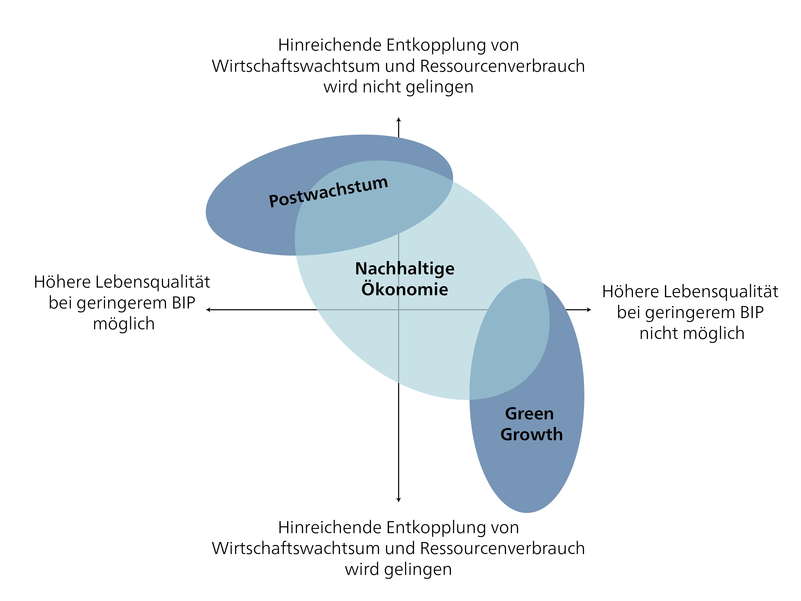

## Nachhaltigkeitsstrategien und -politiken für eine nachhaltige Wirtschaft

Eine wirtschaftliche Transformation hin zu nachhaltiger Entwicklung erfordert gezielte Strategien, die bestehende Wachstumslogiken, Machtverhältnisse und Marktmechanismen hinterfragen und neu gestalten. Nachhaltigkeitsstrategien in der wirtschaftlichen Dimension fokussieren typischerweise auf drei grundlegende Prinzipien: Effizienz, Konsistenz und Suffizienz. Effizienz zielt auf einen ressourcenschonenderen Einsatz bestehender Technologien ab, während Konsistenz darauf ausgerichtet ist, wirtschaftliche Prozesse stärker an natürlichen biogeochemischen Kreisläufen auszurichten – etwa durch Kreislaufwirtschaft oder erneuerbare Energien. Suffizienz geht darüber hinaus und fordert eine Begrenzung von Konsum und Produktion sowie ein neues Wohlstandsverständnis, das auf „genug" statt „mehr" beruht. Während Effizienz und Konsistenz grösstenteils innerhalb bestehender Marktlogiken realisierbar sind, erfordert Suffizienz ein tiefergehendes Umdenken hinsichtlich sozialer Werte und Gerechtigkeit.

In jüngerer Zeit wurden viele spezifische Reformvorschläge formuliert, die verschiedene Hebelpunkte in der Wirtschaft adressieren, etwa Produktion, Konsum, Arbeit oder Finanzierung. @holzingerWirtschaftswendeTransformationsansatzeUnd2024 diskutiert die Notwendigkeit eines wirtschaftlichen Paradigmenwechsels, skizziert durch verschiedene thematische „Transformationen":

-   *Transformation der Arbeit*, z. B. durch Arbeitszeitverkürzung, Ausbau der Sorgewirtschaft und Anerkennung unbezahlter Arbeit

-   *Transformation der Besteuerung*, ausgerichtet auf ökologische Lenkungswirkungen und eine sozial gerechte Umverteilung

-   *Finanzielle Transformation*, mit Fokus auf Gemeinwohl, demokratische Kontrolle und öffentliche Investitionen

-   *Unternehmenstransformation*, mit Fokus auf transformative Unternehmen, die soziale Ziele vor Gewinn stellen

-   *Konsumtransformation*, mit Fokus auf die Reduktion des Ressourcenverbrauchs durch kulturellen Wandel und Infrastruktur für weniger (z. B. Sharing, Reparatur)

-   Und Reformen in spezifischen Sektoren: z. B. Mobilitätswende, Energiewende, Ernährungswende.

Diese Reformvorschläge verdeutlichen, dass Nachhaltigkeit eine Kombination verschiedener sektoraler Hebel erfordert: Statt rein technischer Lösungen braucht es neue institutionelle, soziale und kulturelle Leitplanken. Im Diskurs über wirtschaftliche Nachhaltigkeit lassen sich diese vielfältigen Vorschläge in drei übergeordnete Makrostrategien mit unterschiedlichen Grundannahmen und Zielen einordnen:

{#fig-naök}

-   **Green Growth** fokussiert auf eine relative oder absolute Entkopplung von Wirtschaftswachstum und Umweltnutzung. Grüne Technologien, Effizienzsteigerungen und Umweltinnovationsmanagement dienen dazu, Umweltgrenzen einzuhalten – ohne das Wachstumsparadigma grundsätzlich in Frage zu stellen.

-   **Degrowth (auch Postwachstum**[^5_strategic-approaches-1]** genannt)** hingegen zielt spezifisch darauf ab, wirtschaftliche Aktivitäten in Sektoren zu reduzieren, die besonders grosse Umweltschäden verursachen. Es geht nicht nur darum, ressourcenintensive Produktions- und Konsummuster rückgängig zu machen, sondern auch eine weitreichende soziale Transformation hin zu neuen Wohlstandsmodellen, Zeitwohlstand, Gerechtigkeit und Suffizienz zu erreichen. Im Mittelpunkt steht die demokratische Aushandlung kollektiver Bedürfnisse und die gerechte Verteilung von Arbeit, Einkommen und Ressourcen.

-   **Eine nachhaltige Wirtschaft** schlägt eine Brücke zwischen den beiden vorherrschenden Ansätzen Green Growth und Degrowth. Sie strebt nach sozialem Wohlergehen innerhalb planetarer Grenzen, ohne sich dogmatisch auf Wirtschaftswachstum oder -schrumpfung festzulegen. Petschow et al. [-@petschowSocialWellBeingPlanetary2020] beschreiben diese Position beispielsweise als *vorsorgenden Postwachstumsansatz*.

[^5_strategic-approaches-1]: **Der Begriff Postwachstum wird ebenfalls häufig verwendet. Obwohl „Degrowth" und „Postwachstum" in vielen Forderungen und Analysen übereinstimmen, betont der Begriff Postwachstum stärker die Notwendigkeit wachstumsunabhängiger Institutionen, anstatt primär auf wirtschaftliche Schrumpfung zu fokussieren.**

### Nachhaltige Wirtschaft – wachstumsunabhängige Wirtschaftssektoren

Viele Kerninstitutionen moderner Gesellschaften – darunter Renten- und Sozialsysteme, Arbeitsmärkte und öffentliche Finanzen – sind derzeit eng mit Wirtschaftswachstum verknüpft. Wie Seidl und Zahrnt [-@seidlPostwachstumsgesellschaftKonzepteFur2010] betonen, basieren diese Strukturen typischerweise auf impliziten Wachstumsannahmen, die langfristig weder nachhaltig noch sozial gerecht sind. Die Gestaltung wachstumsunabhängiger Institutionen ist daher entscheidend. Dies würde nicht nur eine finanzielle Entkopplung von Sozialsystemen und öffentlichen Finanzen vom BIP-Wachstum erfordern, sondern auch die Überwindung der politischen Wachstumsfixierung, die gegenwärtig viele wirtschaftspolitische Diskurse prägt. Reformen lassen sich beispielsweise durch die Gestaltung neuer steuer- oder finanzpolitischer Rahmenbedingungen umsetzen, die Stabilität auch ohne Wachstum ermöglichen. Parallel dazu braucht es neue Produktions- und Konsumformen:

-   *Ein suffizienter Lebensstil.* Eine kulturelle und infrastrukturelle Transformation hin zu suffizienten Lebensstilen bedeutet nicht nur den Verzicht auf Konsum auf individueller Ebene, sondern auch die Unterstützung neuer Produktions- und Konsummuster – z. B. durch Sharing-Modelle, eine Reparaturkultur, regionale Lieferketten oder die kollektive Nutzung von Ressourcen [vgl. u. a. @paechBefreiungVomUberfluss2012]

-   *Kollektives Handeln.* Die Entwicklung alternativer Infrastrukturen, solidarischer Kooperationsformen und nicht-kapitalistischer Produktionsweisen – z. B. Commons, Genossenschaften oder kooperative Netzwerke – wird von Autor\*innen wie Muraca, Rifkin und Ostrom als tragfähige Zukunftsperspektive beschrieben. Solche Formen wirtschaftlicher Selbstorganisation stärken Resilienz, sozialen Zusammenhalt und ökologische Verantwortung.

-   *Eine sorgende Wirtschaft.* Arbeit in Haushalten, in der Pflege und in der Gemeinschaft – also reproduktive und sorgende Tätigkeiten – muss systematisch aufgewertet werden. Statt Produktion und Reproduktion getrennt zu betrachten, betonen Ansätze wie jene von Biesecker und Hofmeister die Notwendigkeit, Sorgearbeit als Grundlage wirtschaftlicher Tätigkeit zu verstehen.

-   *Überwindung der „imperialen Lebensweise".* Aus globaler Perspektive wird die Nachhaltigkeitsdiskussion durch die Kritik an der „imperialen Lebensweise" ergänzt. Autor\*innen wie Brand oder Hickel zeigen, dass die wachstumsbasierte Lebensweise in einkommenstarken Gesellschaften auf der Externalisierung von Umwelt- und Sozialkosten in den Globalen Süden beruht. Eine nachhaltige Transformation muss daher auch internationale Machtverhältnisse und den Zugang zu Ressourcen kritisch hinterfragen.

Die Entwicklung wachstumsunabhängiger Wirtschaftssektoren erfordert nicht nur neue Praktiken und kulturelle Modelle, sondern auch einen gezielten politischen Rahmen, der diese Transformation unterstützt und festigt. Ohne geeignete steuerliche, regulatorische und investitionsbezogene Rahmenbedingungen bleiben suffiziente Lebensstile, sorgende Wirtschaften oder commons-basierte Produktion oft auf Nischen beschränkt. Die Aufgabe nachhaltiger Wirtschaftspolitiken besteht daher darin, günstige Strukturen zu schaffen, destruktive Pfadabhängigkeiten zu überwinden und neue Wirtschaftslogiken systematisch zu ermöglichen. Die folgenden zentralen Politikinstrumente und makroökonomischen Hebel könnten diese Transformation auf nationaler und internationaler Ebene begleiten:

-   **Verlagerung der Besteuerung von Arbeit hin zu Ressourcen und Kapital.** Während die Steuerlast in vielen Ländern derzeit stark auf die Besteuerung von Einkommen aus Erwerbsarbeit fokussiert ist, sind Naturressourcennutzung oder massive Vermögensakkumulation weitgehend unterbesteuert. Ökologische Lenkungssteuern (z. B. CO₂-Abgaben oder Ressourcensteuern) können eingesetzt werden, um Umweltkosten zu internalisieren und umweltschädliches Verhalten zu entmutigen. Gleichzeitig kann eine progressive Besteuerung von Einkommen, Erbschaften und Vermögen finanziellen Spielraum für soziale und ökologische Investitionen schaffen. Dies würde auch die Verteilungsgerechtigkeit, Anreizstrukturen und die staatliche Handlungsfähigkeit stärken.

-   **Reform des Geldschöpfungssystems.** Dies könnte die Form eines staatlichen Geldschöpfungsmonopols („Vollgeld" oder „100%-Geld") oder einer missionsorientierten Kreditvergabe annehmen („Missionswirtschaft", vgl. Mazzucato 2018). Ziel solcher Massnahmen wäre es, die Geldschöpfung an soziale Prioritäten zu knüpfen – etwa Klimaschutz oder Pflegeinvestitionen – und spekulative Fehlallokationen zu vermeiden.

-   **Gezielte Unterstützung sozialer Innovationen.** Ziel dieser Massnahme ist es, Suffizienz und resiliente Strukturen in Wirtschaft und Gesellschaft zu verankern. So könnten neue Institutionen, Organisationsformen und Geschäftsmodelle entstehen, die nicht auf konstantem Wachstum beruhen, sondern auf Mässigung, Gerechtigkeit und ökologischen Grenzen ausgerichtet sind.

### Unternehmenstransformation – transformative Unternehmen und eine nachhaltige Wirtschaft

Da die Nachhaltigkeitsherausforderungen, vor denen wir stehen, systemischer Natur sind, brauchen wir Unternehmen, die weit über Effizienzsteigerungen hinausgehen: also transformative Unternehmen. Hug et al. [-@hugTransformativeEnterprisesCharacteristics2022] beschreiben transformative Unternehmen anhand einer Synthese von neun Schlüsseldimensionen, die aus ihrer Literaturrecherche hervorgingen:

> „Transformative enterprises are pioneering SMEs who strive for fundamental changes towards sustainability. They have a social and/or ecological (1) driving mission and are oriented along the values of (2) stability and autonomy. Inside the enterprise, they implement these values through minimizing their (3) ecological footprint, assuming (4) social obligations, introducing (5) participatory governance structures, and offering (6) alternative products and services. The enterprise's core values define how it interacts with stakeholders: transformative enterprises put (7) people before profit, emphasize (8) regional embeddedness and act as (9) change agents. By spreading their vision and taking initiative for industry changes, they trigger or facilitate transformation processes and thereby contribute to sustainable, future-proof economic practices." [@hugTransformativeEnterprisesCharacteristics2022, p.11]

Der Weg zum transformativen Unternehmen ist jedoch mit vielen Hindernissen verbunden. Dazu gehören der systemische Wachstumszwang des aktuellen Wirtschaftssystems, gesellschaftliche Diskurse, die Verantwortung individualisieren und strukturelle Ursachen verschleiern, sowie individuelle kognitive Verzerrungen wie Verlustaversion oder habituelle Trägheit. Unsicherheiten in Lieferketten und bei Konsument\*innen erschweren es Unternehmen zusätzlich, nachhaltig zu handeln.

Gleichzeitig gibt es Faktoren, die transformatives Unternehmertum begünstigen können. Dazu gehören eine starke innere Überzeugung, engagierte Führungspersönlichkeiten, Netzwerke gleichgesinnter Akteur\*innen, die Schaffung geeigneter politischer Rahmenbedingungen und eine wachsende gesellschaftliche Nachfrage nach nachhaltigen Produkten und Dienstleistungen (@niessenHowCanBusinesses2021).

Kate Raworths [-@raworthDoughnutEconomicsSeven2017] Konzept der Donut-Ökonomik bietet einen innovativen Rahmen für die Gestaltung nachhaltiger Unternehmen. Es postuliert, dass Unternehmen innerhalb der planetaren Grenzen operieren und gleichzeitig eine soziale Grundlage sichern sollten. Um dies zu erreichen, müssen sie ihr Design in fünf spezifischen Bereichen kritisch prüfen und transformieren: ihren Zweck, ihre Netzwerke, ihre Governance-Strukturen, ihr Eigentumsmodell und ihre Finanzierungslogik [@dealDoughnutEconomicsAction]. Nur wenn in diesen Bereichen grundlegender Wandel erreicht wird, können Unternehmen wirklich regenerativ und distributiv werden.

Transformative Unternehmen sind kein Randphänomen mehr. Stattdessen sind sie notwendige Akteur\*innen für eine nachhaltige Wirtschaft. Ihr Erfolg hängt jedoch nicht nur von internen Reformen ab, sondern auch von gesellschaftlicher Unterstützung und einem geeigneten politischen Rahmen.
