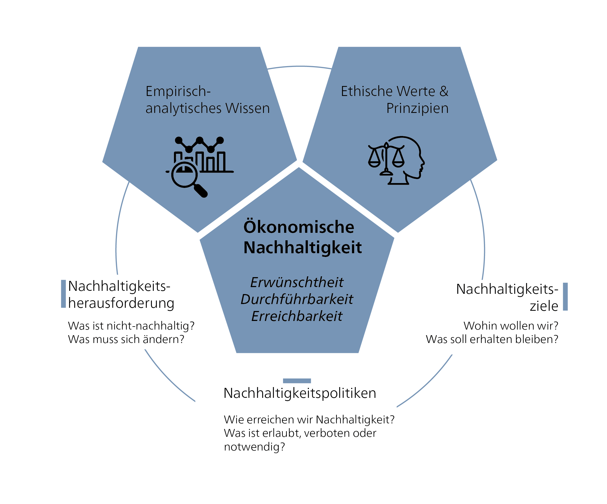

{#fig-ne-econ}

Wirtschaftliche Nachhaltigkeit ist ein zutiefst normatives Konzept: Es fragt, welches Wirtschaftsverständnis gesellschaftlich wünschenswert ist, welche Ziele wirtschaftliche Aktivitäten verfolgen sollten und welche Rolle Menschen, Gesellschaft und natürliche Ressourcen dabei spielen sollten. Entgegen weitverbreiteter Überzeugung sind Wirtschaftstheorien nicht wertneutral. Stattdessen sind sie normativ und performativ und formen Ideen, Handlungen, Politiken und – letztlich – die Wirklichkeit. Deshalb unterscheiden sich die Antworten auf die zentralen Fragen der Wirtschaft – d. h. wer produziert und konsumiert was und warum, wie werden Gewinne verteilt und wofür werden sie verwendet – je nach Wirtschaftstheorie.

::: {.callout-note collapse="true"}
#### Definition von Rente, Gewinn und Lohn

> „Der Ertrag der Erde – alles, was durch die vereinte Anwendung von Arbeit, Maschinen und Kapital aus ihrer Oberfläche gewonnen wird, wird unter drei Klassen der Gesellschaft aufgeteilt, nämlich den Eigentümer des Landes **\[Rente\]**, den Eigentümer des Vorrats oder Kapitals **\[Gewinn\]**, das für seine Bewirtschaftung notwendig ist, und die Arbeiter, durch deren Fleiss es bewirtschaftet wird **\[Lohn\]**. …Die Gesetze zu bestimmen, die diese Verteilung regeln, ist das Hauptproblem der Politischen Ökonomie."\
> Vorwort, S. 1 – David Ricardo: The Principles of Political Economy and Taxation [-@ricardoPriniciplesPoliticalEconomy1821]
:::

## Wirtschaft als performative Wissenschaft

Von Anfang an hat die moderne Wirtschaftswissenschaft die soziale Wirklichkeit nicht nur beobachtet und beschrieben – sie hat sie auch mitgestaltet. Diese Disziplin hat unser Denken darüber geprägt, was als „wirtschaftlich" gilt – z. B. durch das Ideal des rational entscheidenden Homo oeconomicus, die Norm der Gewinnmaximierung, den Fokus auf Effizienz oder die Idee, dass Wachstum mit sozialem Fortschritt gleichzusetzen ist [vgl. @bontrupVolkswirtschaftslehreAusOrthodoxer2021, S. 1–40].

Diese Interpretationen blieben nie rein theoretisch. Sie beeinflussen Politik und Praxis bis heute: vom Strukturwandel bis zur Marktliberalisierung, die sich in den 1980er Jahren durchsetzte – bis hin zur Gestaltung der Klimapolitik durch Emissionshandelssysteme und der Konstruktion hochkomplexer Finanzprodukte. Die Geschichte der Wirtschaftswissenschaft ist daher auch eine Geschichte ihrer Wirkung (Schneidewind et al. 2016). Die am weitesten verbreitete Definition der Wirtschaftswissenschaft, ursprünglich von Lionel Robbins geprägt, konzentriert sich auf das Verhältnis zwischen Ressourcenknappheit und der Befriedigung menschlicher Bedürfnisse:

> „Wirtschaft ist die Wissenschaft, die menschliches Verhalten als Beziehung zwischen Zwecken und knappen Mitteln, die alternative Verwendungsmöglichkeiten haben, untersucht." [@robbinsEssayNatureSignificance1932, p. 15].

Robbins' Definition ist von seiner theoretischen Ausrichtung auf die neoklassische Wirtschaft beeinflusst, die Denkschule, die als Mainstream-Ökonomie gilt. Die meisten Lehrbücher definieren Wirtschaftswissenschaft in Erweiterung dieses Konzepts als Wissenschaft der (rationalen) Entscheidungsfindung, die untersucht, wie Menschen entscheiden, knappe Ressourcen zur Erreichung ihrer Ziele einzusetzen.

::: {.callout-note collapse="true"}
#### Homo oeconomicus als grundlegendes Modell menschlichen Verhaltens

*Homo oeconomicus*, oder „Wirtschaftsmensch", ist ein grundlegendes Modell in der neoklassischen Wirtschaft. Es beschreibt Menschen als rationale, nutzenmaximierende Akteure, die Zugang zu umfassenden Informationen haben und konsequent Entscheidungen treffen, um ihr materielles Wohlergehen zu steigern. Diese Sichtweise des Menschen war entscheidend für die Entwicklung mathematischer Modelle in der Wirtschaft und die Idee, dass Märkte effizient zu optimalen Ergebnissen führen können.

Historisch entwickelte sich dieses Konzept über mehrere Stufen. Während frühe Wirtschaftswissenschaftler wie Adam Smith noch ein komplexeres Menschenbild annahmen – eines, das auch moralische und soziale Dimensionen einschloss –, wurde dieses in der Marginalrevolution des 19. Jahrhunderts zunehmend auf rein rationales, kalkulierendes Verhalten reduziert. Diese Reduktion ermöglichte es, wirtschaftliche Prozesse mathematisch zu modellieren, führte jedoch auch zu einer problematischen Abstraktion von tatsächlichen sozialen, ökologischen und psychologischen Bedingungen.

Kritiker*innen betonen, dass *Homo oeconomicus* ein normatives und kein rein analytisches Konstrukt ist. Es vermittelt eine spezifische Vorstellung vom Menschen, wie er in sozialen Modellen und Institutionen dargestellt wird, die Wettbewerb, Eigenverantwortung und gesteigerte Effizienz als natürliche Prinzipien betrachtet. In der realen Welt verhalten sich Menschen jedoch oft nicht rein rational. Stattdessen prägen Faktoren wie Kooperation, Fairness, Vertrauen und sogar kognitive Verzerrungen ihre Entscheidungen.

Das *Homo oeconomicus*-Modell ist besonders relevant für die Diskussion über nachhaltige Entwicklung. Es trägt dazu bei, die systemischen Ursachen von Umweltzerstörung und sozialer Ungleichheit zu verschleiern, da es strukturelle Machtverhältnisse, externe Effekte und langfristige planetare Grenzen systematisch ignoriert.
:::

Der heterodoxe Wirtschaftswissenschaftler Ha-Joon Chang kritisiert Robbins' Definition als zu spezifisch und als aus einem theoretischen Ansatz hervorgehend, was dazu führt, dass sie in der Folge eine bestimmte Richtung vorschreibt (Chang 2014). Chang definiert Wirtschaft nicht durch einen theoretischen Ansatz, sondern durch seinen Untersuchungsgegenstand: die Wirtschaft. Wirtschaftswissenschaft ist daher die Lehre von allem, was mit der (Re-)Produktion, dem Austausch und der Verteilung von Gütern und Dienstleistungen zur Befriedigung menschlicher Bedürfnisse zusammenhängt. Es gibt natürlich viele andere Definitionen der Wirtschaftswissenschaft. Aufbauend auf diesen vielfältigen Verständnissen unterscheiden sich verschiedene Denkschulen folglich in ihrem Studienschwerpunkt, der Machtstrukturen, Institutionen oder makroökonomische und soziale Zusammenhänge und Strukturen umfassen kann [vgl. @miyamuraAreWeAll2020; @newmanEffectsModernMonetary2025].

Wirtschaftliche Nachhaltigkeit erfordert, dass wir die Folgen wirtschaftlicher Aktivitäten für Mensch und Natur systematisch berücksichtigen. Dazu gehört auch das Stellen von Fragen zur Verteilung. Wer trägt die Kosten des Wachstums, und wer profitiert davon? Wie viel materielle Anhäufung ist genug? Und wer entscheidet?

Ein Nachhaltigkeitsverständnis, das diese Fragen ernst nimmt, konzentriert sich auf Konzepte wie Suffizienz, soziale Mindeststandards und planetare Grenzen. Es erfordert eine Abkehr vom Dogma einer wachstumsorientierten Ausrichtung (die Wachstum hauptsächlich am Bruttoinlandsprodukt misst, vgl. *Kapitel 5.2.3 zu Wirtschaftswachstum*) hin zu einer normativ begründeten, reflexiven und pluralistischen Wirtschaft. Eine solche Ausrichtung kann nicht allein durch die Wirtschaftswissenschaft erreicht werden – sie muss als demokratische Praxis im Dialog mit Ethik, anderen Sozialwissenschaften und Umweltwissenschaften entstehen.

::: {.callout-note collapse="true"}
#### Plurale Ökonomik

Die zeitgenössische Wirtschaftswissenschaft wird weitgehend von einer Denkschule dominiert: der neoklassischen Wirtschaft. An den meisten Universitäten und in den meisten Kontexten bezeichnet der Begriff „Wirtschaftswissenschaft" implizit diese Denkschule. Neoklassische Wirtschaft bildet den Kern der Mainstream-Ökonomie, basierend auf dem von Lionel Robbins formulierten Wirtschaftsverständnis. Dementsprechend untersucht diese Denkschule die Allokation knapper Ressourcen und Güter auf der Grundlage von Entscheidungen rational handelnder, nutzenmaximierender Individuen. Der Preismechanismus dient als zentrales Allokationsinstrument. Angebot und Nachfrage bestimmen den optimalen Marktpreis, der dann eine optimale Allokation von Ressourcen und Gütern gewährleistet.

Plurale Ökonomik betont, dass es nicht „die eine" Wirtschaftswissenschaft gibt, sondern eine Vielzahl von Denkschulen. Dazu gehören feministische, postkeynesianische, ökologische oder marxistische Wirtschaft, die sich alle in ihren theoretischen Annahmen, Methoden und Zielen unterscheiden. Folglich kommen sie oft zu unterschiedlichen, manchmal komplementären und manchmal widersprüchlichen Schlussfolgerungen.

Dabei geht es jedoch nicht um eine pauschale Ablehnung der neoklassischen Wirtschaft. Stattdessen liegt der Schlüssel darin, zu erkennen, welche Perspektive für eine gegebene Frage am besten geeignet ist. Neoklassische Analyse bietet nützliche Einblicke in Märkte, Preisbildung und Anreizstrukturen. Ihr Nutzen ist jedoch begrenzt, wenn es um nicht-monetäre Prozesse, Machtverhältnisse oder soziale Reproduktionsarbeit geht. Ihr Fokus auf marktbasierte Austauschbeziehungen und Preismechanismen macht es beispielsweise schwierig, unbezahlte Arbeit zu berücksichtigen. Hier setzen alternative Ansätze wie die feministische Wirtschaft an, die Pflegearbeit, soziale Beziehungen und Machtstrukturen systematisch in die Wirtschaftsanalyse einbeziehen. Folglich befürwortet plurale Ökonomik einen methodisch offenen, problemorientierten Ansatz und betrachtet die Vielfalt theoretischer Ansätze als Bereicherung – insbesondere angesichts der komplexen Herausforderungen nachhaltiger Entwicklung.

Eine detaillierte Auseinandersetzung mit neoklassischer Wirtschaft und anderen Denkschulen würde den Rahmen dieser Diskussion sprengen. Tiefer in dieses Thema einsteigen können Sie in unserem Kurs *Einführung in die nachhaltige Wirtschaft*. Weitere Informationen zur pluralen Ökonomik finden Sie auch auf der E-Learning-Plattform *Exploring Economics*.

In diesem Video – *Economics is for Everyone* – gibt Ha-Joon Chang eine klare und prägnante Einführung in die Idee der pluralen Ökonomik. Er erklärt, warum wirtschaftliches Denken nie neutral ist – und warum wir dringend mehr wirtschaftlichen Pluralismus brauchen.
:::






