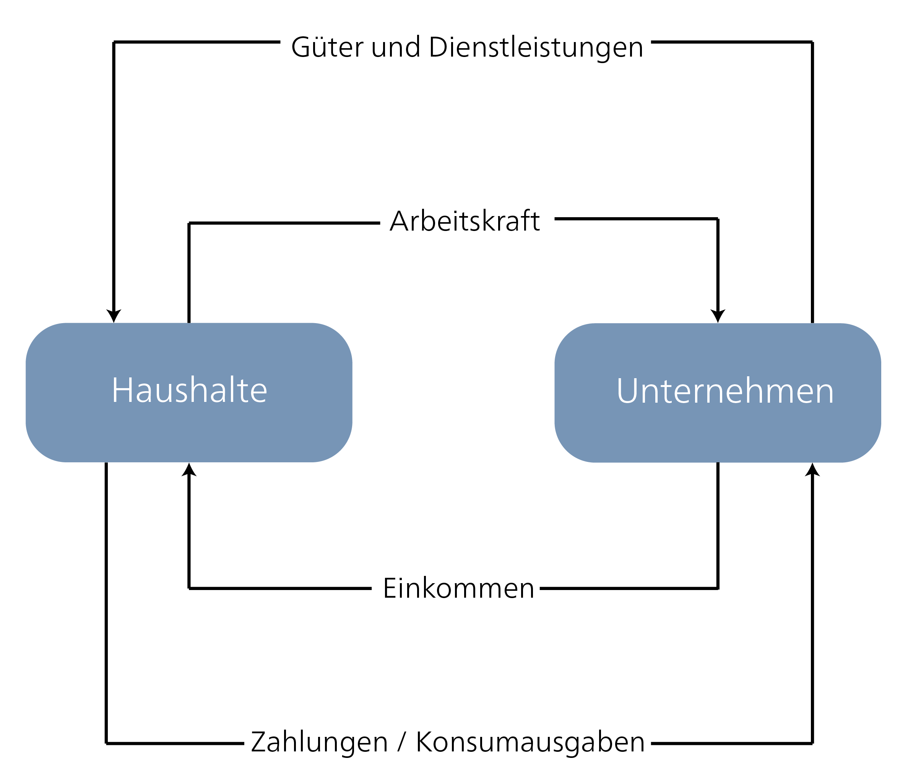
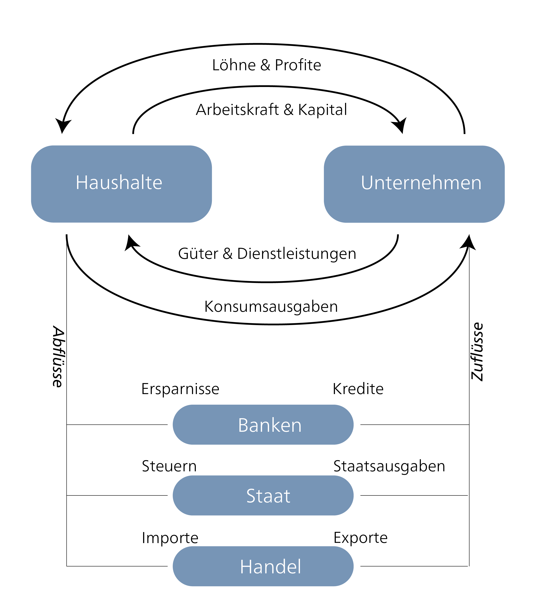

## Schlüsselelemente wirtschaftlicher Nachhaltigkeit

Nachhaltigkeit in der wirtschaftlichen Dimension bedeutet, wirtschaftliche Aktivitäten so zu gestalten, dass menschliche Bedürfnisse langfristig – für gegenwärtige und künftige Generationen – erfüllt werden, während planetare Grenzen respektiert und faire soziale Strukturen aufrechterhalten werden. Wirtschaftliche Aktivitäten sind Prozesse, die natürliche Ressourcen mithilfe zusätzlicher Produktionsfaktoren wie Arbeit und Kapital in Güter und Dienstleistungen zum Konsum umwandeln.

In der Wirtschaftstheorie stellt das Ergebnis der Produktion einen *Wert* dar. Aber welches Wertverständnis liegt dieser Annahme zugrunde? Historisch gesehen hat das Konzept des Werts in der Wirtschaftswissenschaft mehrere grundlegende Wandlungen durchlaufen [vgl. @mazzucatoValueEverythingMaking2018]. Bereits im 17. Jahrhundert wurde wirtschaftliche Aktivität oft als dem Gemeinwohl dienend verstanden, insbesondere wenn sie zur Versorgungssicherheit oder sozialen Stabilität beitrug. Dieses Verständnis war eng mit der Idee einer „moralischen Ökonomie" verknüpft [vgl. @thompsonMoralEconomyEnglish1971], die wirtschaftliche Aktivität als eingebettet in traditionelle Normen, Gerechtigkeitserwartungen und soziale Verpflichtungen betrachtete.

Der Aufstieg des Kaufmannskapitalismus und die koloniale Expansion verschoben den Fokus der wirtschaftlichen Wertattribution. In dieser Zeit wurde Reichtum zunehmend durch Gold, Silber und andere Edelmetalle verkörpert. Befürworter*innen „merkantilistischer" Politiken – ein Begriff, der nachträglich geprägt wurde, um die vorherrschenden wirtschaftlichen Praktiken des 16. bis 18. Jahrhunderts zu beschreiben – betrachteten Handel als die Hauptquelle nationalen Wohlstands. Händler und Kaufleute galten daher als „produktiv", während Arbeiter*innen und Soldaten als „unproduktiv" eingestuft wurden.

Die Industrielle Revolution im 18. und 19. Jahrhundert in Grossbritannien veränderte das wirtschaftliche Wertverständnis erneut grundlegend: Nun galt *Arbeit* als die Hauptquelle der Wertschöpfung. Klassische Wirtschaftswissenschaftler wie Adam Smith, David Ricardo und Karl Marx vertraten eine objektive Werttheorie und behaupteten, dass der Wert eines Gutes grundlegend durch die in seiner Produktion investierte Arbeit bestimmt wird. Diese Denker unterschieden zwischen zwei Schlüsselkonzepten: Gebrauchswert (der praktische Nutzen eines Gutes) und Tauschwert (der Wert, den ein Gut beim Austausch auf dem Markt erzielt). Während der Gebrauchswert mit der Befriedigung von Bedürfnissen zusammenhängt, galt nur Arbeit als Quelle wirtschaftlichen Wertes. Adam Smith hob insbesondere die Arbeitsteilung als Schlüsselfaktor des wirtschaftlichen Fortschritts hervor: Er argumentierte, dass Spezialisierung und die funktionale Aufgliederung von Produktionsprozessen es ermöglichten, mit der gleichen Menge Arbeit deutlich mehr Output zu erzielen. Dies wiederum förderte Produktivität, Innovation und letztlich Wirtschaftswachstum – Dynamiken, die durch Mechanisierung und technologische Innovationen weiter verstärkt wurden.

Im späten 19. Jahrhundert entstand dann ein weiteres Verständnis: die subjektive Werttheorie, die besagt, dass der Wert eines Gutes aus dem individuellen Nutzen abgeleitet wird, den Konsument*innen ihm zuschreiben – unabhängig von Produktionskosten oder Arbeitsstunden. Diese Sichtweise prägt die neoklassische Wirtschaft bis heute, die wirtschaftliche Prozesse als rationale Austausche zwischen Produzent*innen und Konsument*innen modelliert.

Dies ist auch die Grundlage für den einfachen Wirtschaftskreislauf, der die komplexen Prozesse einer Wirtschaft auf zwei Hauptakteure – Haushalte und Unternehmen – und zwei Hauptflüsse – Güter/Dienstleistungen und Geld – reduziert. Haushalte stellen Unternehmen ihre Arbeit im Austausch gegen Einkommen zur Verfügung; Unternehmen nutzen wiederum diese Arbeit und andere Produktionsfaktoren, um Güter und Dienstleistungen zu produzieren, die dann von Haushalten konsumiert werden. Erweiterte Wirtschaftskreisläufe umfassen weitere Akteure wie Staat, Banken und Aussenhandel.

::: {#economic-cycles layout-ncol="2"}
{#fig-econ-cycle}

{#fig-ext-cycle}

Quelle: Eigene Darstellungen
:::

#### Kritik an der konventionellen Wirtschaftskreislaufanalyse

Konventionelle Analysen des Wirtschaftskreislaufs stellen die Marktwirtschaft typischerweise als wertschöpfende Einheit dar, wobei Haushalte primär als Konsument*innen porträtiert werden. Grosse Teile der Gesellschaft – insbesondere unbezahlte Arbeit und (Re-)Produktionsprozesse ausserhalb der Marktlogik – werden weitgehend ignoriert und damit implizit abgewertet. Feministische Wirtschaft ergänzt daher ihre Darstellung der bezahlten Wirtschaft um unbezahlte Bereiche [vgl. z. B. @elsonProgressWorldsWomen2000]. Dennoch erinnert uns Mariana Mazzucato [-@mazzucatoValueEverythingMaking2018] daran, immer den sozialen Kontext zu berücksichtigen, in dem solche Modelle entstehen:

> „Es ist entscheidend, sich daran zu erinnern, dass alle Arten von Buchführungsmethoden sich entwickelnde soziale Konventionen sind, die nicht durch physikalische Gesetze und definitive ‚Realitäten' definiert werden, sondern die Ideen, Theorien und Ideologien des Zeitalters widerspiegeln, in dem sie entwickelt werden." [@mazzucatoValueEverythingMaking2018, p. 76]

Dies ermöglicht uns zu verstehen, warum Paul Samuelsons berühmtes Kreislaufdiagramm der späten 1940er Jahre – beeinflusst durch die Erfahrungen der Grossen Depression und des Zweiten Weltkriegs – sich hauptsächlich auf den ununterbrochenen Einkommensfluss zur Förderung des Wirtschaftswachstums konzentrierte. Nachfolgende Modelle des Wirtschaftskreislaufs konzentrierten sich daher fast ausschliesslich auf den Geldfluss zwischen Haushalten und Unternehmen.

Im Gegensatz dazu stellt Kate Raworth [-@raworthDoughnutEconomicsSeven2017] die Wirtschaft als in Gesellschaft und Umwelt eingebettet dar. Sie zeigt Haushalte, den Markt (Unternehmen), Staaten und die Gemeinschaftsgüter (Commons) als miteinander interagierend und berücksichtigt explizit ökologische Grenzen. Dieses ganzheitlichere Verständnis ist entscheidend für ein Umdenken wirtschaftlicher Aktivitäten im Sinne nachhaltiger Entwicklung.

::: {.callout-note collapse="true"}
#### Arbeit ist mehr als bezahlte Arbeit

Arbeit ist ein zentraler Produktionsfaktor jeder Wirtschaft und notwendig für die Umwandlung natürlicher Ressourcen in Güter und Dienstleistungen. Wie diese Arbeit organisiert wird, hat sich im Laufe der Geschichte verändert, abhängig von den verfügbaren Werkzeugen und Technologien sowie den bestehenden Organisations- und Regierungsformen. Arbeit ist daher kontextabhängig.

Neoklassische Wirtschaft konzentriert sich typischerweise auf bezahlte Arbeit, die erst im Industriekapitalismus des 19. Jahrhunderts ihre Schlüsselposition erlangte und sie im 20. Jahrhundert festigte. Unbezahlte Arbeit (z. B. Haus-, Pflege-, Fürsorge- und Ehrenamtsarbeit), die typischerweise von Frauen geleistet wird, wird weitgehend ignoriert oder als selbstverständlich angesehen. Die Zahl der unbezahlten Arbeitsstunden wird in der Schweiz seit 2000 erfasst, was zeigt, dass der für unbezahlte Arbeit aufgewendete Zeitaufwand denjenigen für bezahlte Arbeit übersteigt (BFS, Satellitenkonto Haushaltsproduktion 2020).

Aus der Perspektive wirtschaftlicher Nachhaltigkeit ist dieser enge Ansatz problematisch. Schliesslich ist Arbeit nicht nur ein Inputfaktor, sondern konstituiert wirtschaftliche Aktivität selbst – sie ermöglicht Produktion, Reproduktion und soziale Teilhabe. Eine nachhaltige Wirtschaft erfordert daher ein weiteres Verständnis von Arbeit, das sowohl bezahlter Arbeit als auch unbezahlter Reproduktionsarbeit gleichermassen Rechnung trägt.
:::

### Staaten, Märkte und Netzwerke

Wirtschaftssysteme unterscheiden sich darin, wie sie grundlegende Fragen beantworten wie diese: „Wer produziert was, warum und für wen?". Die zwei Schlüsseldimensionen sind dabei Eigentum (privat oder öffentlich?) und Koordination (zentral oder dezentral?). Aus „idealtypischer" Perspektive ergeben sich folgende Grundformen [@basselerGrundlagenUndProbleme2002]:

-   **Kapitalistische Marktwirtschaft**: Hier erfolgt die Koordination dezentral über Märkte, angetrieben durch das Wechselspiel von Angebot und Nachfrage („Bottom-up"). Die Produktionsmittel befinden sich überwiegend in Privatbesitz.

-   **Sozialistische, zentralisierte Wirtschaft**: In diesem Modell werden Produktions- und Verteilungsentscheidungen zentral durch staatliche Planung gesteuert („Top-down"). Die Produktionsmittel befinden sich generell in öffentlichem Besitz.

-   **Gemischte Wirtschaft (z. B. Wohlfahrtsstaat)**: Diese Systeme kombinieren Privateigentum an den Produktionsmitteln mit staatlicher Koordination in Schlüsselbereichen. Während die Ressourcenallokation weitgehend dezentral über Märkte erfolgt, greift der Staat ein, um sie zu regulieren und zu verteilen – beispielsweise durch Sozialversicherungen, öffentliche Dienstleistungen oder progressive Steuerpolitik. Dieses Modell zielt darauf ab, Marktversagen zu korrigieren und soziale Gerechtigkeit zu fördern. Die Koordination erfolgt daher teilweise dezentral über Märkte und teilweise zentral über politische Institutionen.

-   **Gemeinschaftsbasierte Netzwerke und Commons-Wirtschaften**: Diese konzentrieren sich auf Selbstorganisation, dezentrale Kooperation und Gemeinschaftseigentum. Beispiele umfassen Solidarwirtschaft, Genossenschaften und gemeinschaftlich verwaltete Ressourcen (Commons).

Historisch war der industrielle Kapitalismus – zumindest anfänglich – das vorherrschende Modell nach der Industriellen Revolution. Im 20. Jahrhundert nahm er verschiedene Formen an, vom starken nationalen Wohlfahrtsstaat der Nachkriegszeit bis zu den marktorientierten Globalisierungsmodellen, die seit den 1980er Jahren vorherrschen. Hall und Soskice [-@hallVarietiesCapitalismInstitutional2001] beschreiben diese als „Spielarten des Kapitalismus".

Heute ist es leichter, sich das Ende der Welt vorzustellen als das Ende des Kapitalismus, wie Slavoj Žižek [-@zizekMappingIdeology1994, S. 1] formuliert. Und dennoch entstehen zunehmend Alternativen, die zeigen, dass eine solidarische Wirtschaft nicht auf lokale Nischen beschränkt sein muss. Stattdessen kann eine solche Wirtschaft global vorgestellt und gestaltet werden und über markt- oder staatszentrierte Paradigmen hinausgehen. Netzwerke, Commons und alternative Wirtschaftsformen gewinnen an Aufmerksamkeit, da sie neue Wege eröffnen, wirtschaftliche Prozesse demokratischer, resilienter und ökologisch nachhaltiger zu organisieren. In *The Zero Marginal Cost Society* entwirft Jeremy Rifkin [-@rifkinNullGrenzkostenGesellschaftInternetDinge2014] beispielsweise kollaborative Commons – gemeinsam verwaltete Ressourcen, die durch digitale Plattformen und dezentrale Kooperation ermöglicht werden.

### Kapitalismus als Ausgangspunkt für Fragen wirtschaftlicher Nachhaltigkeit

Viele Nachhaltigkeitsherausforderungen – z. B. die Klimakrise, soziale Ungleichheit, Ressourcenübernutzung, Finanzmarktturbulenz – sind keine isolierten Phänomene. Sie sind Ausdruck eines übergreifenden Kontexts, d. h. der strukturellen Dynamiken des modernen globalen Kapitalismus. Dieses Lehrbuch nimmt daher eine systemische Perspektive ein, wie sie von Wissenschaftler*innen wie Polanyi [-@polanyiGreatTransformationPolitical1944], Brand und Wissen (2017), Hickel [-@hickelLessMoreHow2020], Seidl und Zahrnt [-@seidlPostwachstumsgesellschaftKonzepteFur2010], Schneidewind [-@schneidewindetalTransformativeWirtschaftswissenschaftIm2016] und Binswanger [-@binswangerWachstumsspirale2006] vertreten wird. Aus dieser Perspektive erfordert eine Hinwendung zur Nachhaltigkeit eine Auseinandersetzung mit unseren zugrundeliegenden wirtschaftlichen Strukturen und ihren politischen und kulturellen Voraussetzungen – und damit mit dem kapitalistischen System der Gegenwart.

In diesem Lehrbuch betrachten wir Kapitalismus nicht nur als Wirtschaftssystem, sondern als das gegenwärtige Wirtschafts- und Gesellschaftssystem in seiner Gesamtheit. Dies umfasst wirtschaftliche, soziale, rechtliche, kulturelle und ökologische Strukturen und Dynamiken, die alle miteinander interagieren (vgl. Kasten). Kapitalismus ist kein natürlicher Zustand wirtschaftlicher Aktivität, sondern das Ergebnis einer spezifischen historischen Entwicklung. Seine Wurzeln reichen in das spätmittelalterliche Europa, insbesondere England, zurück, wo durch die Aneignung von Land (eine Praxis, die als „Einhegung" bekannt ist), die Entstehung eines freien Arbeitsmarktes und frühe Formen kapitalistischer Landwirtschaft entscheidende institutionelle Grundlagen gelegt wurden [vgl. @woodOriginCapitalismLonger2017].

Die Industrielle Revolution im späten 18. und frühen 19. Jahrhundert ermöglichte letztlich den historischen Durchbruch des Kapitalismus: Technologische Innovationen, fossile Brennstoffe und umfangreiche Kapitalinvestitionen schufen ein neues Produktionssystem, das auf Massenproduktion und Massenkonsum basierte. Dieser Prozess verfestigte frühere Entwicklungen zu einem dominanten Wirtschafts- und Gesellschaftssystem, das noch heute zentrale globale Strukturen prägt.

Dieses System ist als kapitalistische Produktionsweise bekannt, und seine zugrundeliegende Logik ist durch drei Grundmerkmale gekennzeichnet:

-   die Trennung von Kapital und Arbeit, sodass Arbeiter*innen im Allgemeinen nicht die Produktionsmittel besitzen und daher gezwungen sind, ihre Arbeitskraft gegen Lohn zu verkaufen

-   Privateigentum an den Produktionsmitteln

-   die Ausrichtung auf Gewinnmaximierung und Gewinnverwendung

Kapitalist*innen – als Eigentümer*innen der Produktionsmittel – bringen Kapital, Land und Arbeit zusammen, um Güter und Dienstleistungen in einem Produktionsprozess herzustellen. Das Ziel ist nicht primär die Befriedigung von Bedürfnissen, sondern die Erzielung eines Tauschwerts, der auf dem Markt erzielt werden kann – mit dem Hauptzweck der Kapitalvermehrung. Die Akkumulation von Kapital ist der wichtigste Treiber und die strukturelle Logik der kapitalistischen Produktionsweise. Ein wesentliches Merkmal dieses Prozesses ist die Erzeugung von Mehrwert, d. h. des wirtschaftlichen Werts, den Arbeiter*innen in der Produktion schaffen und der ihre Löhne übersteigt. Dieser Mehrwert bildet die Grundlage für Gewinne und wird auf verschiedene Weisen verteilt:

-   Ein Teil fliesst als Lohn an die Arbeiter*innen

-   Ein Teil geht an Eigentümer*innen von Land oder natürlichen Ressourcen als Boden- oder Grundrente

-   Ein Teil geht als Zinsen und Finanzrenten an den Finanzsektor, insbesondere wenn das Kapital durch Fremdkapital finanziert wird

-   Der verbleibende Mehrwert umfasst die Gewinne, die auch durch Monopolrenten (z. B. durch Marktmacht) oder Markenrenten (z. B. durch immaterielle Vermögenswerte wie Reputation) ergänzt werden können

Die Senkung der Stückkosten spielt eine Schlüsselrolle dabei, die Produktion rentabel zu machen und die Wettbewerbsfähigkeit zu sichern. Technologische Innovationen und Investitionen in Maschinen, Fabriken und Infrastruktur steigern die Produktivität erheblich. Energie ersetzt zunehmend menschliche Arbeit; standardisierte Produktionsprozesse wie das Fliessband steigern die Effizienz und ermöglichen die Massenproduktion günstiger Konsumgüter. Wie Henry Ford treffend gesagt haben soll: „Jeder Kunde kann sein Auto in einer beliebigen Farbe lackiert bekommen, solange sie schwarz ist."

Um jedoch einen Gewinn zu erzielen, bedarf es mehr als bloss technologischer Effizienz. Andere kritische Faktoren umfassen die Kontrolle über Märkte und Wertschöpfungsketten, den Zugang zu günstigen Ressourcen, die Fähigkeit, Arbeit zu disziplinieren und zu kontrollieren, sowie die Gestaltung institutioneller und politischer Rahmenbedingungen. Das bedeutet, dass Gewinne auf der Grundlage ungleicher Machtverhältnisse zwischen Unternehmen und Arbeiter*innen, zwischen globalen Zentren und Peripherien, entlang von Lieferketten und innerhalb von Eigentumsstrukturen geschaffen werden.

Damit die riesigen produzierten Gütermengen auch verkauft werden können, ist eine homogene Massennachfrage erforderlich. Diese wird durch steigende Löhne, eine Konsumkultur und ein soziales Modell gefördert, das den Besitz standardisierter Konsumgüter mit Wohlstand und sozialem Aufstieg gleichsetzt.

::: {.callout-note collapse="true"}
#### Was ist Kapitalismus?

Kapitalismus ist eine historisch entwickelte Gesellschaftsform, in der die Produktion primär für den Markt erfolgt, Privateigentum an den Produktionsmitteln vorherrscht und die Akkumulation von Kapital wesentlich ist. Seine grundlegende Dynamik ist der Einsatz von Kapital: Geld (G) wird in Waren (W) investiert, die dann mit Gewinn verkauft werden, woraus mehr Geld (G') entsteht, wie von Karl Marx beschrieben.

Die kapitalistische Produktionsweise basiert auf der Trennung von Arbeit und den Produktionsmitteln. Das bedeutet, dass Menschen ihre Arbeitskraft verkaufen müssen, um Zugang zu Ressourcen zu erhalten. Diese Logik schafft strukturelle Abhängigkeiten, die über das Wirtschaftssystem hinaus in alle Bereiche der Gesellschaft reichen.

Historisch gesehen hat sich der Kapitalismus nicht „natürlich" etabliert, sondern wurde durch Prozesse politischer Enteignung, kolonialer Expansion und rechtlicher Transformationen durchgesetzt (z. B. Abschaffung der Commons, Monetarisierung von Arbeit, Schulpflicht zur Disziplinierung).
:::

{#fig-mode-production}

@fig-mode-production veranschaulicht, wie das kapitalistische Produktionssystem nicht nur Güter, sondern auch soziale Verhältnisse produziert. Mit anderen Worten: Diejenigen, die Zugang zu Kapital oder Land haben, können Mehrwert abschöpfen, während diejenigen, die nur ihre Arbeitskraft besitzen, in der Regel nur Löhne erhalten. Der Finanzsektor spielt dabei eine zunehmend bedeutende Rolle, indem er Kapitalflüsse organisiert und durch Schulden zusätzlichen Zugang zum Produktionsprozess gewinnt (vgl. Finanzialisierung und Finanzkrisen). Diese Produktionsweise hat daher Auswirkungen weit über die wirtschaftliche Sphäre hinaus. Der ungarische Wirtschaftssoziologe Karl Polanyi beschrieb diesen Prozess als den Übergang zu einer Marktgesellschaft: einer Gesellschaft, in der die Märkte nicht mehr in sozialen und politischen Beziehungen eingebettet sind, sondern diese zunehmend selbst bestimmen. Arbeit, Land und Geld wurden zu „fiktiven Waren" [@polanyiGreatTransformationPolitical1944] – d. h. zu Gütern, die ursprünglich nicht für den Markt bestimmt waren, nun aber seiner Logik unterworfen sind. In einer Marktgesellschaft sind Märkte nicht Teil der Gesellschaft – die Gesellschaft ist Teil des Marktes. Laut Polanyi führt dies zu tiefgreifenden sozialen Erschütterungen – z. B. in Form von sozialer Unsicherheit, ökologischer Degradation oder wachsender Ungleichheit – und erzeugt immer wieder Gegenbewegungen. Diese Dynamik ist eng mit zwei zentralen Mechanismen kapitalistischer Expansion verknüpft: Internalisierung und Externalisierung. Einerseits werden Ressourcen wie Natur, Arbeit oder Wissen ohne marktmittelten Austausch angeeignet (Internalisierung). Andererseits werden soziale Kosten auf Dritte ausgelagert, wie künftige Generationen oder Länder des Globalen Südens (Externalisierung). Eine ausführlichere Erläuterung dieser beiden Begriffe findet sich im Kasten „Internalisieren und Externalisieren".

In den folgenden Abschnitten analysieren wir, wie die kapitalistische Produktionsweise, eingebettet in eine Marktgesellschaft, strukturelles Wachstum erfordert und damit zu erheblichen Konflikten mit Nachhaltigkeit führt.

::: {.callout-note collapse="true"}
#### Internalisieren und Externalisieren

Der Preis eines Gutes spiegelt nicht immer seine tatsächlichen sozialen Kosten wider. Wenn ein Gut zu einem Marktpreis produziert oder verkauft wird, der diese Kosten ignoriert, werden sie häufig auf Dritte übertragen – wie Steuerzahlende, künftige Generationen oder die Umwelt. Diese werden als externe Effekte oder Externalitäten bezeichnet, und sie können positiv oder negativ sein. Externalitäten beeinflussen die Produktions- und Konsumoptionen unbeteiligter Parteien.

Neoklassische Wirtschaft betrachtet externe Kosten generell als Anomalie innerhalb eines ansonsten effizienten Marktes. Das übliche Gegenmittel ist die „Internalisierung" dieser Kosten – z. B. durch Mechanismen wie CO₂-Steuern. Im Gegensatz dazu argumentierte William Kapp bereits 1950, dass je mehr ein System die private Gewinnmaximierung priorisiert, desto grösser die Anreize sind, Kosten auf Menschen, Gesellschaft und Natur abzuwälzen [@kappSocialCostsPrivate1950]. Daher hat das derzeitige kapitalistische System eine inhärente Tendenz, Kosten zu externalisieren. Stephan Lessenich beschreibt die Wohlstandsgesellschaften im Globalen Norden als Externalisierungsgesellschaften, die Kosten in den Globalen Süden auslagern [@lessenichNebenUnsSintflut2020]. Gleichzeitig stützt sich die kapitalistische Produktionsweise auf Internalisierungsprozesse: Natur, Arbeit oder Wissen werden oft ohne Entschädigung angeeignet, basierend auf strukturellen Machtverhältnissen. Beispiele umfassen Landraub, unbezahlte Pflegearbeit und die Kommerzialisierung traditionellen Wissens [vgl. z. B. @saaveEinverleibenUndExternalisieren2022].

Während liberale Markttheorien die Bedeutung von Preissignalen betonen, stellen andere Denkschulen in Frage, ob wir wirklich allem einen Preis zuweisen müssen, sogar der Natur. Diese grundlegenden Debatten sind entscheidend für die Erreichung einer nachhaltigen Wirtschaft und werden im Kurs *Einführung in die nachhaltige Wirtschaft* vertieft behandelt.
:::

::: {.callout-note collapse="true"}
#### Weiterführende Literatur

-   Karl Polanyi (1944): The Great Transformation

-   Ellen Meiksins Wood (2017): The Origin of Capitalism: A Longer View

-   Maja Göpel (2016): The Great Mindshift, Kapitel 3
:::

### Wirtschaftswachstum: Entstehung, Normalisierung und Kritik

Heute nehmen wir Wirtschaftswachstum als selbstverständlich hin, doch aus historischer Sicht ist es ein jüngeres Phänomen. Jahrhundertelang blieb das Niveau der wirtschaftlichen Produktion weitgehend stabil. Erst mit der Industriellen Revolution in Grossbritannien am Ende des 18. Jahrhunderts begann ein langsamer Anstieg, der ab den 1950er Jahren deutlich an Fahrt aufnahm. @fig-history-hockey-stick veranschaulicht eindrücklich, wie plötzlich und historisch einzigartig diese Beschleunigung war. Über viele Jahrhunderte stagnierte das Pro-Kopf-Einkommen, bevor es mit dem Aufstieg industrieller und fossilbasierter Produktionsmethoden buchstäblich explodierte. Dieses Wachstum konzentrierte sich jedoch hauptsächlich auf einige Länder des Globalen Nordens. Drei Faktoren waren für diese Dynamik entscheidend:

1.  Der Wiederaufbau nach dem Zweiten Weltkrieg ermöglichte massive öffentliche und private Investitionen.
2.  Der Zugang zu billigen fossilen Brennstoffen – insbesondere Öl – aus dem Nahen Osten senkte die Produktionskosten drastisch.
3.  Das fordistische Konsummodell kombinierte hohe Löhne mit billiger Massenproduktion: Henry Fords Vision von „Autos für alle" wurde zum Leitprinzip einer neuen Produktions- und Konsumlogik.

{#fig-history-hockey-stick}

Ein entscheidender Wendepunkt war, dass Kapital Land als zentralen Produktionsfaktor ersetzte. Während Land naturgemäss begrenzt ist, hatte Kapital – verstanden als Maschinen, Technologie und Infrastruktur – zunächst keine offensichtlichen Grenzen. Für Wirtschaftswissenschaftler wie Malthus, der noch davon ausging, dass natürliche Ressourcen knapp sind, war langfristiges Wachstum kaum vorstellbar. Die industrielle Produktion unter kapitalistischen Bedingungen veränderte dieses Paradigma grundlegend.

Wirtschaftswachstum führte dazu, dass das **Bruttoinlandsprodukt (BIP)** als vorherrschendes Mass für Wohlstand in den Vordergrund rückte. Das BIP misst den monetären Wert der in einem Land in einem bestimmten Zeitraum (z. B. einem Jahr) produzierten Endgüter und Dienstleistungen, misst aber keine unbezahlte Arbeit, ökologische Schäden oder soziale Gerechtigkeit. Seit den 1980er Jahren gibt es auch eine Divergenz zwischen steigendem BIP und stagnierender subjektiver Lebenszufriedenheit. Das BIP eignet sich gut zur Beschreibung von Marktaktivitäten – aber nicht als umfassender Indikator für Wohlstand oder Wohlbefinden.

Nach dem Zweiten Weltkrieg – während der *trente glorieuses* oder „glorreichen Dreissig" (1945–1975) – wurde stetiges Wirtschaftswachstum zur neuen Normalität. In dieser Zeit wurde häufig diskutiert, ob zunehmender Wohlstand auf lange Sicht zu Umweltverbesserungen führen könnte. Die Umwelt-Kuznets-Kurve [@sternRiseFallEnvironmental2004] legt nahe, dass die Umweltdegradation in den frühen Phasen des Wirtschaftswachstums zunächst zunimmt, aber zurückgeht, sobald ein bestimmtes Einkommensniveau erreicht ist, da Gesellschaften mehr in Umweltschutz investieren. Die empirische Evidenz für diese Theorie ist jedoch gemischt. Während einige lokale Umweltprobleme bewältigt wurden, nehmen globale Umweltauswirkungen wie CO₂-Emissionen weiterhin zu. Ein einfaches Fortsetzen des Wirtschaftswachstums garantiert daher keineswegs einen reduzierten Druck auf die Umwelt und kann bestehende planetare Grenzen weiter verschärfen [@wiedmannScientistsWarningAffluence2020]. Viele soziale Teilsysteme, wie Sozialsicherungssysteme oder die Arbeitsmarktpolitik, wurden darauf ausgelegt und strukturiert, kontinuierlich steigende staatliche Einnahmen, Investitionen und Beschäftigung zu erwarten. Diese strukturelle Wachstumsorientierung wirkt sich bis heute aus und macht wirtschaftliche Nachhaltigkeit zu einem systemischen Thema.

### Wachstumsabhängigkeit und strukturelle Wachstumszwänge

Da das derzeitige kapitalistische Wirtschaftssystem strukturell auf Wachstum angewiesen ist, würde ein Rückgang der wirtschaftlichen Aktivität (z. B. Stagnation, Rezession oder sogar Depression) zu einer Wirtschaftskrise mit weitreichenden Konsequenzen für die Bevölkerung führen (z. B. Arbeitslosigkeit, Armut, Kürzungen bei Sozialleistungen) [@schmelzerDegrowthPostwachstum2019, S. 26]. Ohne Wachstum würde das System in einen Krisenzustand geraten. Derzeit gibt es entweder Wachstum oder Schrumpfung, aber nichts dazwischen. Matthias Binswanger [-@binswangerWachstumszwangWarumVolkswirtschaft2019] zeigt, dass der Wachstumsbedarf aus der Dynamik des Marktwettbewerbs resultiert: Um wettbewerbsfähig zu bleiben, müssen Unternehmen kontinuierlich expandieren und die Produktivität steigern – sonst riskieren sie den Verlust von Marktanteilen und Gewinnen oder sogar die Insolvenz. Dieser Wachstumszwang zeigt sich auf makroökonomischer, unternehmerischer und kultureller Ebene:

**Der makroökonomische Wachstumszwang** beschreibt die strukturelle Abhängigkeit moderner Gesellschaften und Wirtschaftssysteme vom Wirtschaftswachstum. Dieses Wachstum ist derzeit notwendig, weil viele Kerninstitutionen und -systeme – wie Arbeitsmärkte, Sozialsysteme und öffentliche Finanzen – nur dann stabil funktionieren können, wenn es kontinuierliches Wachstum gibt. Es wird beispielsweise argumentiert, dass ohne kontinuierliches Wachstum die Arbeitslosigkeit steigen würde, da Unternehmen ihre Produktion und folglich ihre Belegschaft reduzieren. Auch die öffentlichen Finanzen wären betroffen: Staatshaushalte, Renten und Sozialsicherungssysteme basieren oft auf kontinuierlich steigenden Einnahmen aus Steuern, die wiederum auf Wirtschaftswachstum angewiesen sind. Nicht zuletzt verhindert Wachstum wirtschaftliche und politische Krisen, da stagnierende oder schrumpfende Märkte von Unsicherheit, Kapitalflucht und sozialer Unzufriedenheit begleitet werden können, was politische Instabilität begünstigt [@seidlPostwachstumsgesellschaftKonzepteFur2010].

**Die unternehmerische Logik von Investition, Gewinn und Expansion**. Unternehmen agieren innerhalb einer kapitalistischen Produktionsweise, deren Logik auf kontinuierlichem Wachstum basiert. Dieses Wachstum ist nicht nur wünschenswert – es ist auch strukturell erzwungen. Unternehmen investieren typischerweise nur dort, wo sie einen Gewinn erwarten – ein Prinzip, das in der Formel G–W–G' (Geld–Ware–mehr Geld) zum Ausdruck kommt. Diese Dynamik wird durch den Marktdruck intensiviert: Um wettbewerbsfähig zu bleiben, müssen Unternehmen expandieren – oder riskieren den Kollaps. Diese „Wachsen oder Sterben"-Logik wird durch das Finanzsystem weiter verschärft. Von investiertem Kapital werden kontinuierliche Renditen erwartet, es wird verzinst. Um diesen Erwartungen gerecht zu werden, müssen Unternehmen kontinuierlich Nachfrage generieren und in neue Produktionszyklen investieren [vgl. @binswangerWachstumszwangWarumVolkswirtschaft2019]. Unternehmen, die langfristig keine Gewinne erzielen, verschwinden vom Markt. Wenn die Durchschnittsgewinne in der gesamten Wirtschaft sinken, kann dies eine Kettenreaktion von Unternehmensinsolvenzen auslösen – mit potenziell schwerwiegenden Auswirkungen auf Beschäftigung und soziale Stabilität.

Eine prägnante Einführung in die Logik des Kapitalismus gibt David Graeber in diesem Kurzvideo:



Massenkonsum und soziale Normen: Die Wachstumsspirale des kapitalistischen Produktionssystems wird nicht nur durch technologische und wirtschaftliche Faktoren angetrieben, sondern in erheblichem Masse auch durch kulturelle Dynamiken. Heute dient Konsum nicht mehr nur der Befriedigung unmittelbarer Bedürfnisse – er erfüllt auch eine Vielzahl sozialer Funktionen und ist zum Ausdruck von Status, Selbstverwirklichung und Zugehörigkeit geworden. Wie im vorherigen Abschnitt beschrieben – und gemäss einer Schlüsselerkenntnis keynesianischer Wirtschaftswissenschaftler*innen – stimuliert Massennachfrage Investitionen, die wiederum die Grundlage für kapitalistische Gewinne auf makroökonomischer Ebene schaffen. Diese Zusammenhänge verdeutlichen die Schlüsselrolle des Konsums im kapitalistischen Produktionssystem: Mit anderen Worten, eine starke Verbrauchernachfrage ist für ein dauerhaftes Wirtschaftswachstum unerlässlich. Ein Nachfrageausfall – z. B. wenn die Reallöhne stagnieren oder sinken – würde das kapitalistische System destabilisieren. In den letzten Jahrzehnten wurden verschiedene Strategien umgesetzt, um solche Nachfrageausfälle zu kompensieren:

-   **Integration von Frauen in den Arbeitsmarkt**: In vielen Ländern, insbesondere in den USA, nahm der Zugang von Frauen zum Arbeitsmarkt in den 1970er und 80er Jahren erheblich zu. Dies diente nicht nur der Förderung der Gleichstellung – es half auch, die Kaufkraft der Haushalte aufrechtzuerhalten – wie populäre kulturelle Darstellungen der Situation zeigen, etwa Dolly Partons Hit „9 to 5".

-   **Zunahme des Konsums auf Kredit**: Da es natürliche Grenzen sowohl für Arbeitskräfte als auch für tägliche Arbeitsstunden gibt, nahm der Konsum auf Kredit zu. So wie private Haushalte Geld borgten, um mangelnde Kaufkraft zu kompensieren, tat dies auch der Staat: Öffentliche Ausgaben z. B. für Infrastruktur, Sozialleistungen oder Steuererleichterungen in den 1980er Jahren wurden oft durch Staatsschulden finanziert, um die gesamtwirtschaftliche Nachfrage zu stabilisieren. Die Deregulierung der Finanzmärkte befeuerte diese Entwicklungen weiter. Seit der Finanzkrise 2008 spielen Zentralbanken durch geldpolitische Massnahmen wie niedrige Zinssätze und Anleihenankäufe eine zunehmende Rolle bei der Stabilisierung der Nachfrage.

-   **Bekämpfung der Konsumersättigung**: In wohlhabenden Gesellschaften, in denen viele Grundbedürfnisse bereits erfüllt sind, steht die Werbeindustrie vor der Herausforderung, neue Konsumbereiche zu erschliessen. Es geht zunehmend darum, Bedürfnisse zu schaffen statt zu erfüllen. Wie der Wirtschaftswissenschaftler Mathias Binswanger [-@binswangerWachstumszwangWarumVolkswirtschaft2019] zusammenfasst: „Wir haben uns von einer Bedürfniserfüllungsgesellschaft zu einer Bedürfnisschaffungsgesellschaft entwickelt" und fügt hinzu: *„Noch vor einigen Jahren wussten die Menschen nicht, dass sie täglich ihre Herzfrequenz, Aktivitäten, verbrannten Kalorien und Schlaf aufzeichnen müssen. Aber dank der Bemühungen der Gesundheitsuhren-Hersteller wurde dieses Bedürfnis in ihnen ‚geweckt' und Gesundheitsuhren und Fitness-Tracker werden nun in grossen Mengen verkauft."*

### Finanzialisierung und Finanzkrisen

Ursprünglich waren die Finanz- – sowohl Geld- als auch Kapital- – märkte eng mit der Realwirtschaft verknüpft und stellten Liquidität für die Produktion von Gütern und Dienstleistungen bereit. Es wurde daher angenommen, dass diese beiden – Finanzmärkte und Realwirtschaft – in etwa im Gleichschritt wachsen würden. Dies ist jedoch seit mehreren Jahrzehnten nicht mehr der Fall. Ab den 1980er Jahren sind Geld- und Kapitalmärkte viel schneller gewachsen und haben den Bezug zur Realwirtschaft verloren.

Ein Grund für diese Entwicklung war die Deregulierung der internationalen Finanzmärkte. Diese Deregulierungsmassnahmen wurden in den 1980er und 1990er Jahren eingeführt, um die stockende wirtschaftliche Entwicklung in Ländern wie dem Vereinigten Königreich (unter der konservativen Premierministerin Margaret Thatcher) und den USA (unter Präsident Ronald Reagan, dem ursprünglichen Befürworter des Slogans „Make America Great Again") anzukurbeln. Die Massnahmen wurden mit dem Argument legitimiert, dass frühere Krisen aus ineffizienter staatlicher Regulierung und Intervention resultierten, die angeblich die Rationalität einzelner Marktteilnehmer*innen daran gehindert habe, ein Marktgleichgewicht zu erreichen. Die weitreichende Deregulierung der Finanzmärkte sollte selbstregulierende Mechanismen zur wirtschaftlichen Stabilisierung ermöglichen. Die Deregulierung umfasste die Aufhebung des Glass-Steagall-Gesetzes von 1933, das eine strikte Trennung von Kredit- und Wertpapiergeschäften vorgeschrieben hatte. Dies ermöglichte es Banken, beide Geschäfte gleichzeitig zu betreiben, was spekulative Aktivitäten stark begünstigte. Die spekulativen Handelsvolumina schossen anschliessend nach der Jahrtausendwende mit dem Aufkommen des computergestützten Hochfrequenzhandels in die Höhe.

::: {.callout-note collapse="true"}
#### Was wir über Geld und Schulden verstehen müssen

Geld ist weit mehr als nur ein neutrales Tauschmittel. Es erfüllt vier zentrale Funktionen in modernen Wirtschaftssystemen:

**Tauschmittel**: Geld vereinfacht wirtschaftliche Transaktionen, indem es die Notwendigkeit eines gleichzeitigen Austauschs von Gütern und Dienstleistungen beseitigt.

**Wertaufbewahrungsmittel**: Geld kann gespart und später verwendet werden, was langfristige Planung und Investitionen ermöglicht.

**Recheneinheit (Wertmesser)**: Geld bestimmt den „Wert" von Arbeit. Diese Bewertung ist jedoch kein objektives Mass, sondern ein Ausdruck sozialer Machtverhältnisse und Ideologien.

**Ermöglicher der Kapitalakkumulation**: Im Kapitalismus wird Geld investiert, um mehr Geld zu generieren. Diese Dynamik kann, wenn sie unkontrolliert bleibt, zu einer zunehmenden Vermögenskonzentration führen.

Durch diese letzte Funktion ist Geld eng mit Schulden verknüpft: Im heutigen Finanzsystem wird der Grossteil des Geldes nicht durch staatliche Münzprägung oder Zentralbankaktivitäten geschaffen, sondern durch die Kreditvergabe privater Geschäftsbanken. Das bedeutet, dass jedes Mal, wenn ein Kredit vergeben wird, neues Geld entsteht – zusammen mit einer entsprechenden Schuld. Daher hat jedes Guthaben auf der Habenseite eine Schuld auf der Sollseite (vgl. Graeber 2012). Ohne laufende Schulden gäbe es kein Geldwachstum – und damit kein Vermögenswachstum. Dies gilt sowohl für private Haushalte als auch für Regierungen. In einem System wachsender Ungleichheit sind Schuldner*innen oft strukturell benachteiligt – sie sind abhängig von Kreditgeber*innen und Sparmassnahmen sowie politischen Zwängen ausgesetzt.

Das heutige Finanzsystem schafft daher nicht nur wirtschaftliche, sondern auch politische Abhängigkeiten. Wer Geld hat, kann nicht nur konsumieren, sondern verfügt auch über Macht – und kann sie z. B. durch politischen Einfluss, Medieneigentum oder strategische Investitionen ausüben. Finanzialisierung, Spekulation und globale Kapitalflüsse verschärfen diese Entwicklung weiter.

> „Die Kehrseite privater Vermögensakkumulation ist öffentliche und private Verschuldung. Schulden können nur abgebaut werden, wenn gleichzeitig Vermögen abgebaut werden." [@holzingerWirtschaftswendeTransformationsansatzeUnd2024, S. 89]
:::

Deregulierung und ihre Folgen ermöglichten es Banken, ihre Kreditvergabe erheblich auszuweiten – zunehmend auch an Haushalte mit niedrigen Kreditratings (d. h. begrenzter Rückzahlungsfähigkeit oder geringer Kreditwürdigkeit). Um die damit verbundenen Risiken zu mindern, wurden die Kredite gebündelt und als scheinbar sichere „Subprime"-Anleihen weiterverkauft. Solche Mechanismen legten letztlich den Grundstein für die Finanzkrise von 2008, als sich herausstellte, dass ein grosser Teil dieser Finanzprodukte auf hochriskanten Kreditvergaben basierte.

Diese Verschiebung der wirtschaftlichen Dynamik und Macht hin zum Finanzsektor wird als Finanzialisierung bezeichnet. Sie schuf einen Machtkomplex aus Zentralbanken, Geschäftsbanken, anderen Finanzinstitutionen, privaten Pensionsfonds und Eigentümer*innen verschiedener Vermögenswerte. In diesem Prozess wachsen die Finanzmärkte im Verhältnis zur Realwirtschaft unverhältnismässig stark, ein Trend, der durch nationale Deregulierungsmassnahmen begünstigt wird. Finanzialisierung intensiviert den Wachstumszwang und erhöht nicht nur die Ungleichheit, sondern auch die ökologische Fragilität, beispielsweise durch spekulative Investitionen in Ressourcen, Rohstoffe oder Land. Beispiele wie der Derivatehandel mit Nahrungsmitteln oder Ressourcen (Link zur CDE-Forschung) zeigen, wie finanzierte Märkte soziale Vulnerabilitäten und ökologische Risiken verschärfen können.

::: {.callout-note collapse="true"}
#### Was sind Derivate und wie tragen sie zur Finanzialisierung bei?

Derivate sind Finanzinstrumente, deren Wert aus den zukünftigen Kursen oder Preisen anderer Güter, Vermögenswerte oder Referenzwerte wie Zinssätze, Rohstoffpreise oder Aktienindizes abgeleitet wird. Verbreitete Derivate umfassen Optionen, Futures und Swaps. Beim Derivatehandel findet keine reale wirtschaftliche Produktion statt – es werden keine Güter oder Dienstleistungen geschaffen. Derivate sollten ursprünglich gegen Preisschwankungen „absichern", z. B. im Rohstoffhandel. Die zunehmende Deregulierung und Technologisierung der Finanzmärkte führte jedoch zur weit verbreiteten Nutzung von Derivaten als spekulative Anlageinstrumente. Dies trug erheblich zur Entkopplung der Finanzmärkte von der Realwirtschaft bei und förderte einen massiven Markt für Finanzwetten, der die realen Wirtschaftswerte, auf denen die Derivate basieren, oft bei weitem übersteigt. Diese Dynamik ist eine Schlüsselkomponente der „Finanzialisierung" und erhöht die wirtschaftliche Instabilität sowie soziale und ökologische Risiken.
:::

::: {.callout-note collapse="true"}
#### Weiterführende Literatur

Blakeley, Grace. 2019. *Stolen: How to Save the World from Financialisation*. Repeater.
:::

### Unternehmen als Schlüsselakteure wirtschaftlicher Nachhaltigkeit

Unternehmen spielen eine Schlüsselrolle in wirtschaftlichen Prozessen: Sie produzieren Güter und Dienstleistungen, schaffen Arbeitsplätze und treiben Innovation voran – und sind gleichzeitig bedeutende Verursacher von Umweltschäden. Im Kontext wirtschaftlicher Nachhaltigkeit sollten wir Unternehmen daher nicht nur als Teil des Problems, sondern auch als Teil einer möglichen Lösung betrachten [@hoffmanNextPhaseBusiness2018].

Unternehmen sind Organisationen, die Produktionsfaktoren (Arbeit, Kapital, Land) kombinieren, um Güter und Dienstleistungen herzustellen, typischerweise für den Verkauf auf dem Markt. Traditionell war ihr oberstes Ziel, mehr Einnahmen als Ausgaben zu erzielen und damit einen Gewinn zu erwirtschaften. Dieses klassische Verständnis wurde stark von der „Shareholder-Doktrin" beeinflusst, die Milton Friedman in seinem vielzitierten Aufsatz von 1970 in der New York Times, „The Social Responsibility of Business is to Increase its Profits", prägnant formulierte. Friedman argumentierte, dass die einzige soziale Verantwortung eines Unternehmens darin besteht, den Gewinn für seine Eigentümer*innen – die Aktionär*innen – innerhalb der geltenden Gesetze und Marktregeln zu maximieren. Manager*innen schulden daher primär den Aktionär*innen Loyalität, nicht sozialen oder ökologischen Zielen. Diese Sichtweise bildete die Grundlage für viele wirtschaftspolitische Modelle und Managementpraktiken in der zweiten Hälfte des 20. Jahrhunderts. Sie trug massgeblich dazu bei, dass Unternehmen stark auf kurzfristige Renditen, gesteigerte Effizienz und Kostensenkung ausgerichtet wurden – oft auf Kosten sozialer Gerechtigkeit oder ökologischer Nachhaltigkeit. Kritiker*innen vertreten die Ansicht, dass diese Logik entscheidende soziale und planetare Grenzen systematisch ignoriert und die Verantwortung primär auf Einzelpersonen oder Staaten verlagert.

Im Kontext der Nachhaltigkeit steht dieser enge Fokus unter verstärkter Beobachtung. Alternativen wie der „Stakeholder-Ansatz" gewinnen an Bedeutung, der Unternehmen nicht nur als Gewinnmaximierer für Eigentümer*innen, sondern als gesellschaftlich eingebettete Akteure betrachtet, die gegenüber diversen Stakeholdern verantwortlich sind, einschliesslich Mitarbeitenden, Kund*innen, Lieferant*innen, lokalen Gemeinschaften und der Umwelt. Unternehmen variieren auch erheblich in Grösse und Organisationsform und umfassen kleine und mittlere Unternehmen (KMU), grosse Konzerne, Sozialunternehmen, Genossenschaften und andere alternative Geschäftsmodelle. Diese Vielfalt beeinflusst massgeblich, wie Nachhaltigkeit strategisch verankert und praktisch umgesetzt wird.

Dyllick und Muff [-@dyllickClarifyingMeaningSustainable2016] kategorisieren Unternehmen in drei Entwicklungsstufen, basierend auf ihrer Position zur Nachhaltigkeit. Die erste Stufe, „Business-as-usual", beschreibt Unternehmen, die Nachhaltigkeit weitgehend ignorieren und ihre wirtschaftlichen Aktivitäten ausschliesslich auf finanzielle Ziele ausrichten. In der zweiten Stufe, „Corporate Sustainability 1.0 und 2.0", beginnen Unternehmen, Nachhaltigkeit durch Effizienzverbesserungen, Compliance (d. h. Einhaltung gesetzlicher und regulatorischer Anforderungen) und die Integration von Corporate Social Responsibility (CSR) in ihre Geschäftsstrategien anzugehen. Dies geschieht jedoch typischerweise ohne grundlegende Änderung der Kerngeschäftslogik. Erst in der dritten Stufe, „Sustainability 3.0", rückt die systemische Transformation des Unternehmens in den Vordergrund. Hier verfolgen Unternehmen einen umfassenderen Zweck: Sie verpflichten sich explizit zum gesellschaftlichen Wohlergehen und zur Einhaltung planetarer Grenzen und integrieren diese Ziele umfassend in ihr Kerngeschäftsmodell.

Die dritte Stufe erfordert einen grundlegenden Perspektivwechsel: Während Unternehmen in den früheren Stufen primär von innen nach aussen agiert haben, indem sie ihre bestehenden Strukturen leicht angepasst haben, erfordert Sustainability 3.0 einen „Aussen-nach-innen"-Ansatz: Unternehmen müssen ihre Identität und strategischen Kernprozesse an drängenden sozialen und ökologischen Herausforderungen ausrichten.
