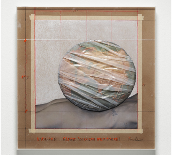
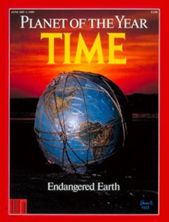

# Einleitung {.unnumbered}

::: {#wrapped-world layout-ncol="2"}
{#fig-christo}

{#fig-times}
:::

Angesichts der wachsenden Herausforderungen der Nachhaltigen Entwicklung ist Christos und Jeanne-Claudes „Wrapped Globe" ein kraftvolles Symbol für die Verantwortung der Menschheit gegenüber unserem Planeten und seinen Ressourcen. Das Kunstwerk zeigt einen in Klarsichtfolie und ein filigranes Netz gehüllten Globus. In der Realität sieht sich die Welt einer „Polykrise" gegenüber – ein Begriff, der die vielen ernsten Krisen beschreibt, mit denen unsere Erde konfrontiert ist, darunter ökologische Krisen, wachsende Ungleichheit, exzessive Staatsverschuldung und die Folgen der Covid-19-Pandemie, um nur einige zu nennen. In einer Polykrise sind Krisen zunehmend miteinander verwoben und verstärken sich gegenseitig [@toozeWelcomeWorldPolycrisis2022]. Sie entstehen hauptsächlich durch eine strukturelle Wachstumsabhängigkeit (gemessen am Bruttoinlandsprodukt, BIP) [@hickelDegrowthCanWork2022], durch einen Teufelskreis zunehmender Konzentration wirtschaftlicher und politischer Macht in den Händen weniger [@pikettyCapitalTwentyFirstCentury2014] sowie durch anhaltende Ungleichheiten zwischen und innerhalb von Ländern [@chancelWorldInequalityReport2021; @milanovicGlobalInequalityNew2016]. Dennoch streben wir in Gesellschaft und Wirtschaft weiterhin nach BIP-Wachstum, um Arbeitsplätze zu erhalten und zu schaffen, Sozialsysteme zu finanzieren, Steuereinnahmen zu sichern und die Bedürfnisse von Unternehmen und Industrien zu erfüllen, die auf Wachstum angewiesen sind. Da diese Erwartungen zunehmend unrealistisch werden, hat die Idee der Entkopplung von Wirtschaftswachstum und Ressourcenverbrauch an Zugkraft gewonnen. Es gibt jedoch keine empirischen Belege dafür, dass dies in dem Ausmass gelingen kann, das erforderlich wäre, um einen multidimensionalen ökologischen Kollaps aufzuhalten [@hickelGreenGrowthPossible2020; @parriqueDecouplingDebunkedEvidence2019; @wiedmannScientistsWarningAffluence2020].

## Volle und leere Welt

Die Klarsichtfolie und das Netz um Christos Globus stehen damit für die Vernetzung und gegenseitige Abhängigkeit der verschiedenen Elemente der Erde und betonen die Notwendigkeit, diese Beziehungen zu erhalten und zu schützen. Eine ähnliche Idee beschrieb der Ökonom Herman @dalyEconomicsFullWorld2015 mit seinem Konzept der „leeren" und der „vollen" Welt. Die leere Welt beschreibt eine Situation, in der menschliche Aktivitäten und Ressourcennutzung nur geringfügige Auswirkungen auf die Umwelt haben. In dieser Welt sind natürliche Systeme noch intakt und unberührt, und die Ressourcen reichen aus, um menschliche Bedürfnisse zu befriedigen. Im Gegensatz dazu überlasten in der vollen Welt menschliche Aktivitäten und Ressourcennutzung die Ökosysteme und belasten die Umwelt. Spätestens seit dem Zweiten Weltkrieg haben wir eine industrialisierte Gesellschaft und eine Wachstumswirtschaft verfolgt. Infolgedessen leben wir heute in einer „vollen" Welt, in der natürliche Ressourcen knapp sind und das Gleichgewicht der Ökosysteme bedroht wird.

Dalys Schlüsselerlebnis war die Lektüre von Rachel Carsons Buch *Silent Spring* im Jahr 1962, das zu einem Leben in Einklang mit der Natur aufrief. Daly stand dem Hyper-Individualismus wirtschaftlicher Modelle bereits skeptisch gegenüber, und Carsons Werk verdeutlichte den Konflikt zwischen einer wachsenden Wirtschaft und einer fragilen Umwelt. Nach einem Vortrag des Ökonomen Nicholas Georgescu-Roegen über sein Hauptwerk *The Entropy Law and the Economic Process* (1971) übernahm Daly die Idee, dass die Wirtschaft eher einer Sanduhr als einem Pendel ähnelt: Wertvolle Ressourcen werden zu Abfall und gehen damit weitgehend unwiederbringlich verloren.

Es gibt kein Patentrezept, um der Polykrise entgegenzuwirken und unser Wirtschafts- und Gesellschaftssystem nachhaltiger zu gestalten. Um zur Nachhaltigen Entwicklung beizutragen, müssen wir die Ursachen von Symptomen wie Biodiversitätsverlust oder Klimaerwärmung analysieren und lernen zu verstehen, wie sie zusammenhängen und interagieren. In unseren Studiengängen werden wir daher aktuelle Probleme und Herausforderungen wie Klimaerwärmung, Umweltverschmutzung, Biodiversitätsverlust, soziale Ungleichheit und wirtschaftliche Ungleichheiten untersuchen, um zu verstehen, wie diesen sowohl auf lokaler als auch auf globaler Ebene begegnet werden kann.

Dieses Lehrbuch soll Leser*innen dazu anregen, die Rolle von Einzelpersonen, Gemeinschaften, Unternehmen und Regierungen im Kontext der Nachhaltigen Entwicklung kritisch zu hinterfragen – und so Ansätze zu identifizieren und zu verfolgen, die eine Nachhaltige Entwicklung fördern. Darüber hinaus möchten wir Zukunftsvisionen entwickeln, insbesondere in den Masterstudiengängen, die es ermöglichen, sich eine hohe Lebensqualität in einer nachhaltigen Moderne vorzustellen, und die einen Wandel der Gegenwart attraktiv statt bedrohlich erscheinen lassen. Wir möchten eine andere Esskultur, ein anderes Wirtschaftssystem, eine andere Landnutzung und eine andere Art des Bauens und Wohnens entwerfen. Um Fortschritte in Richtung Nachhaltigkeit zu erzielen, wird es entscheidend sein, Akteur*innen einzubinden und die Zusammenarbeit über Sektoren und Disziplinen hinweg zu fördern. Wie dieses Lehrbuch betonen wird, werden auch Bildung, Kommunikation und Partizipation unverzichtbar sein, um eine nachhaltigere Zukunft zu gestalten.

Mit Christos „Wrapped Globe" vor Augen und Dalys Verständnis der leeren und der vollen Welt als Grundlage werden wir uns auf eine Reise durch die vielen Aspekte der Nachhaltigen Entwicklung begeben. Wir hoffen, dass Sie diese Reise sowohl informativ als auch inspirierend finden und dass sie Ihnen ein Verständnis für die Dringlichkeit wie auch für die Chancen der Nachhaltigen Entwicklung vermittelt.

Schliesslich hoffen wir, dass dieses Lehrbuch Leser*innen dazu inspiriert, über ihre eigene Rolle und Verantwortung in Bezug auf Nachhaltigkeit nachzudenken, und dass es Sie befähigt, einen Beitrag dazu zu leisten, dass die Erde auch für künftige Generationen ein lebenswerter Ort bleibt. Nur gemeinsam können wir die Veränderungen herbeiführen, die notwendig sind, um eine nachhaltige, gerechte und umweltfreundliche Welt zu gestalten.
